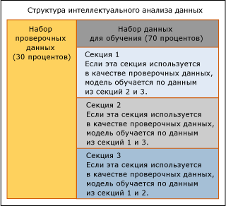

# Перекрестная проверка (службы Analysis Services — интеллектуальный анализ данных)
  *Перекрестная проверка* — стандартное средство в аналитике, она очень важна при разработке и настройке моделей интеллектуального анализа данных. После создания структуры интеллектуального анализа данных и связанных моделей интеллектуального анализа данных можно использовать перекрестную проверку, чтобы оценить допустимость модели.  У перекрестной проверки есть следующие применения.  
  
-   Проверка надежности определенной модели интеллектуального анализа данных.  
  
-   Проверка нескольких моделей в одной инструкции.  
  
-   Построение нескольких моделей и определение лучшей из них на основе статистики.  
  
 В этом разделе описывается использование функций перекрестной проверки, предоставляемых для интеллектуального анализа данных, и интерпретация результатов перекрестной проверки для отдельной модели или для нескольких моделей на основе одного набора данных.  
  
## Общие сведения о процессе перекрестной проверки  
 Перекрестная проверка состоит из двух фаз: обучение и формирование результатов. Эти фазы включают следующие шаги.  
  
-   Выбор структуры интеллектуального анализа данных.  
  
-   Указание моделей, которые необходимо проверить. Этот шаг необязателен; можно проверить только структуру интеллектуального анализа данных.  
  
-   Указание параметров для проверки обученных моделей.  
  
    -   Прогнозируемый атрибут, прогнозируемое значение и пороговое значение точности.  
  
    -   Число сверток, в которые будут секционироваться данные структуры или модели.  
  
-   [!INCLUDE[ssASnoversion](../../includes/ssasnoversion-md.md)] создают и обучают столько моделей, сколько существует сверток.  
  
-   [!INCLUDE[ssASnoversion](../../includes/ssasnoversion-md.md)] возвращают набор показателей точности для каждой свертки в каждой модели или для набора данных в целом.  
  
## Настройка перекрестной проверки  
 Можно настроить порядок работы перекрестной проверки, чтобы управлять числом разрезов, проверяемыми моделями и порогом точности для прогнозов. При использовании хранимых процедур перекрестной проверки можно также указать набор данных, который будет использован для проверки моделей. Такой широкий выбор возможностей означает, что можно легко создать множество наборов разных результатов, которые затем будет необходимо проверить и проанализировать.  
  
 В этом разделе приводятся сведения, помогающие правильно настроить перекрестную проверку.  
  
### Установка числа секций  
 Число секций определяет, сколько будет создано временных моделей. Для каждой секции разрез данных помечается для использования в качестве проверочного набора. Новая модель создается путем обучения на оставшихся данных, не вошедших в секцию. Этот процесс повторяется, пока службы [!INCLUDE[ssASnoversion](../../includes/ssasnoversion-md.md)] не создадут и не проверят указанное число моделей. Данные, указанные как доступные для перекрестной проверки, распределяются равномерно между всеми секциями.  
  
 Пример на этой диаграмме показывает использование данных в том случае, если были заданы три свертки.  
  
   
  
 В сценарии на этой диаграмме структура интеллектуального анализа данных содержит набор контрольных данных, который используется для проверки, но проверочный набор данных не был включен в перекрестную проверку. В результате для перекрестной проверки используются все данные в наборе данных для обучения — 70 процентов данных структуры интеллектуального анализа данных. В отчете перекрестной проверки показывается общее число вариантов в каждой секции.  
  
 Также можно указать количество данных, которые будут использованы при перекрестной проверке, указав общее число вариантов, которые необходимо использовать. Варианты распределяются равномерно между всеми свертками.  
  
 Для структур интеллектуального анализа, хранящихся в экземпляре служб SQL Server [!INCLUDE[ssASnoversion](../../includes/ssasnoversion-md.md)], максимальное значение, которое можно задать для числа сверток, равно либо 256, либо числу вариантов (берется наименьшее из этих двух значений). Если используется структура интеллектуального анализа данных сеанса, максимальное число сверток равно 10.  
  
> [!NOTE]  
>  При увеличении количества сверток также увеличивается и время, которое необходимо для выполнения перекрестной проверки, поскольку для каждой свертки необходимо создать и проверить модель. Если число сверток слишком высоко, то могут возникнуть проблемы с производительностью.  
  
### Задание порога точности  
 Порог состояния позволяет устанавливать порог точности для прогнозов. Для каждого варианта модель вычисляет *вероятность прогнозирования*, то есть вероятность того, что предсказанное состояние будет верным. Если вероятность прогнозирования превышает порог точности, то прогноз считается верным; в противном случае прогноз считается неверным. Это значение управляется путем установки для параметра **Порог состояния** значения, находящегося в диапазоне между 0,0 и 1,0. Числа близкие к 1 означают высокий уровень доверия прогнозу, числа близкие к 0 имеют меньшую вероятность оказаться верными. Значением по умолчанию для порога состояния является NULL. Это означает, что предсказанное состояние, обладающее наибольшей вероятностью, считается целевым значением.  
  
 Следует помнить, что настройка порога состояния влияет на меры точности модели. Например, допустим, что имеются три модели, которые необходимо проверить. Все они основаны на одной и той же структуре интеллектуального анализа данных и все прогнозируют столбец [Покупатель велосипеда]. Более того, необходимо предсказать отдельное значение 1, что означает «да, купит». Эти три модели возвращают прогнозы с вероятностями 0,05, 0,15 и 0,8. Если для порога состояния установить значение 0,10, то два из этих прогнозов будут считаться верными. Если для порога состояния установить значение 0.5, будет считаться, что только одна модель вернула правильный прогноз. Если было использовано значение по умолчанию — NULL, то самый вероятный прогноз будет считаться верным. В этом случае все три прогноза считаются верными.  
  
> [!NOTE]  
>  Установить значение 0,0 для порога можно, но бессмысленно, поскольку каждый прогноз будет считаться верным (даже прогнозы с вероятностью 0). Будьте осторожны, не установите случайно для параметра **Порог состояния** значение 0,0.  
  
### Выбор моделей и столбцов для проверки  
 При использовании вкладки **Перекрестная проверка** конструктора интеллектуального анализа данных сначала нужно выбрать прогнозируемый столбец из списка. Как правило, в структурах интеллектуального анализа данных поддерживается нескольких моделей интеллектуального анализа, при этом не во всех используется один и тот же прогнозируемый столбец. При выполнении перекрестной проверки в отчет могут быть включены только те модели, в которых используется один и тот же прогнозируемый столбец.  
  
 Чтобы выбрать прогнозируемый атрибут, щелкните поле **Целевой атрибут** и выберите в списке нужный столбец. Если целевой атрибут является вложенным столбцом или столбцом вложенной таблицы, необходимо ввести имя вложенного столбца с использованием формата \<имя вложенной таблицы > (ключ).\< Вложенные столбца >. Если единственным столбцом, используемым во вложенной таблице ключевой столбец, можно использовать \<имя вложенной таблицы > (ключ).  
  
 После выбора прогнозируемого атрибута службы [!INCLUDE[ssASnoversion](../../includes/ssasnoversion-md.md)] автоматически выполняют проверку всех моделей, в которых используется этот прогнозируемый атрибут. При наличии в целевом атрибуте дискретных значений после выбора прогнозируемого столбца при необходимости можно указать целевое состояние, если имеется определенное значение, которое нужно спрогнозировать.  
  
 Выбор целевого состояния влияет на возвращаемые меры. Если указать целевой атрибут — то есть имя столбца — и при этом не указать определенное значение, которое необходимо спрогнозировать, то оценка модели будет выполнена на основе прогноза наиболее вероятного состояния.  
  
 При использовании перекрестной проверки с моделями кластеризации прогнозируемые столбцы не указываются; вместо этого в списке **Целевой атрибут** нужно выбрать **#Кластер** . После выбора этого параметра другие параметры, не относящиеся к моделям кластеризации, например **Целевое состояние**, отключаются. [!INCLUDE[ssASnoversion](../../includes/ssasnoversion-md.md)] проверят все модели кластеризации, связанные со структурой интеллектуального анализа данных.  
  
## Средства перекрестной проверки  
 Перекрестную проверку можно выполнить из конструктора интеллектуального анализа данных или путем запуска хранимых процедур.  
  
 При выполнении перекрестной проверки средствами конструктора интеллектуального анализа данных можно настроить параметры результатов обучения и точности в одном диалоговом окне. Это облегчает настройку и просмотр результатов. Можно измерить точность всех моделей интеллектуального анализа данных, связанных с одной структурой интеллектуального анализа данных, а затем немедленно увидеть результаты в виде HTML-отчета. Однако хранимые процедуры предоставляют некоторые преимущества, например дополнительные пользовательские настройки и возможность написания скрипта для процесса.  
  
### Перекрестная проверка в конструкторе интеллектуального анализа данных  
 Перекрестную проверку можно выполнить на вкладке **Перекрестная проверка** представления "Диаграмма точности интеллектуального анализа" либо в среде [!INCLUDE[ssManStudioFull](../../includes/ssmanstudiofull-md.md)] , либо в SQL Server Development Studio.  
  
 Пример создания отчета о перекрестной проверке с помощью пользовательского интерфейса см. в разделе [Создание отчета перекрестной проверки](../../analysis-services/data-mining/create-a-cross-validation-report.md).  
  
### Хранимые процедуры перекрестной проверки  
 Для опытных пользователей перекрестная проверка также доступна в форме полностью параметризованных системных хранимых процедур. Можно запустить эти хранимые процедуры, подключившись к экземпляру из [!INCLUDE[ssManStudioFull](../../includes/ssmanstudiofull-md.md)], или из любого приложения с управляемым кодом.  
  
 Хранимые процедуры сгруппированы по типу модели интеллектуального анализа данных. Один набор хранимых процедур работает только с моделями кластеризации. Другой набор хранимых процедур работает с другими моделями интеллектуального анализа данных.  
  
 Для каждого типа модели интеллектуального анализа данных, кластеризованной или некластеризованной, хранимые процедуры выполняют перекрестную проверку в два отдельных этапа.  
  
 **Секционировать данные и сформировать показатели для секций**  
  
 На первом этапе следует вызвать системную хранимую процедуру, которая создает столько секций, сколько было указано в наборе данных, и возвращает результаты определения точности для каждой секции. Затем службы Analysis Services вычисляют среднее и стандартное отклонение секций для каждой метрики.  
  
-   [SystemGetCrossValidationResults (службы Analysis Services — интеллектуальный анализ данных)](../../analysis-services/data-mining/systemgetcrossvalidationresults-analysis-services-data-mining.md)  
  
-   [SystemGetClusterCrossValidationResults (службы Analysis Services — интеллектуальный анализ данных)](../../analysis-services/data-mining/systemgetclustercrossvalidationresults-analysis-services-data-mining.md)  
  
 **Сформировать показатели для всего набора данных**  
  
 На втором этапе следует вызвать другой набор хранимых процедур. Эти хранимые процедуры не выполняют секционирование набора данных, но формируют результаты определения точности для указанного набора данных в целом. Если структура интеллектуального анализа данных уже секционирована и обработана, второй набор хранимых процедур можно вызвать просто для получения результатов.  
  
-   [SystemGetAccuracyResults (службы Analysis Services — интеллектуальный анализ данных)](../../analysis-services/data-mining/systemgetaccuracyresults-analysis-services-data-mining.md)  
  
-   [SystemGetClusterAccuracyResults (службы Analysis Services — интеллектуальный анализ данных)](../../analysis-services/data-mining/systemgetclusteraccuracyresults-analysis-services-data-mining.md)  
  
#### Определение проверочных данных  
 При запуске хранимых процедур перекрестной проверки, которые вычисляют точность (SystemGetAccuracyResults или SystemGetClusterAccuracyResults), можно указать источник данных, используемый для тестирования в ходе перекрестной проверки. Этот параметр недоступен в пользовательском интерфейсе.  
  
 В качестве источника проверочных данных можно указать любой из следующих параметров:  
  
-   Использовать только обучающие данные.  
  
-   Включить существующий набор проверочных данных.  
  
-   Использовать только набор проверочных данных.  
  
-   Применить существующие фильтры к каждой модели.  
  
-   Любое сочетание обучающего набора, проверочного набора и фильтров моделей.  
  
 Чтобы задать источник проверочных данных, следует указать целочисленное значение параметра **DataSet** хранимой процедуры. Список значений аргументов см. в подразделе «Примечания» раздела справки о соответствующей хранимой процедуре.  
  
 Если перекрестная проверка выполняется с помощью отчета **Перекрестная проверка** в конструкторе интеллектуального анализа данных, то используемый набор данных изменять нельзя. По умолчанию используются обучающие варианты для каждой модели. Если с моделью связан фильтр, он применяется.  
  
## Результаты перекрестной проверки  
 При использовании конструктора интеллектуального анализа данных эти результаты отображаются в средстве просмотра веб-страниц, имеющем вид сетки. В случае использования хранимых процедур перекрестной проверки эти же результаты возвращаются в виде таблицы.  
  
 Отчет содержит два типа мер: агрегаты, указывающие на изменчивость набора данных при разделении на свертки, и касающиеся конкретной модели меры точности для каждой свертки. В следующих подразделах представлены дополнительные сведения об этих метриках.  
  
 [Формулы перекрестной проверки](../../analysis-services/data-mining/cross-validation-formulas.md)  
  
 Список всех мер по типу проверки. Содержит общее описание возможностей интерпретации мер.  
  
 [Меры в отчете перекрестной проверки](../../analysis-services/data-mining/measures-in-the-cross-validation-report.md)  
  
 Содержит описание формул для расчета каждой меры, а также список типов атрибутов, к которым может быть применена каждая мера.  
  
## Ограничения на перекрестную проверку  
 Если перекрестная проверка выполняется посредством составления отчета о перекрестной проверке в среде SQL Server Development Studio, то для проверяемых моделей и устанавливаемых параметров задаются некоторые ограничения.  
  
-   По умолчанию перекрестной проверке подвергаются все модели, связанные с выбранной структурой интеллектуального анализа данных. Отдельную модель или список моделей указать нельзя.  
  
-   Перекрестная проверка не поддерживается для моделей, основанных на алгоритмах временных рядов (Майкрософт) или последовательной кластеризации (Майкрософт).  
  
-   Создание отчета невозможно, если структура интеллектуального анализа данных не содержит ни одной модели, для которой допускается перекрестная проверка.  
  
-   Если в структуре интеллектуального анализа данных содержатся как модели кластеризации, так и другие модели, и не был выбран параметр **#Кластер** , то результаты обоих типов моделей отображаются в одном и том же отчете, несмотря на то что настройки атрибута, состояния и порога могут не соответствовать моделям кластеризации.  
  
-   Значения некоторых параметров ограничены. Так, например, если количество сверток превышает 10, то отображается предупреждение, поскольку создание такого большого количества моделей приведет к замедленному отображению отчета.  
  
 Если выполняется проверка нескольких моделей интеллектуального анализа данных, имеющих фильтры, то для каждой модели фильтры применяются отдельно. Во время перекрестной проверки нельзя добавлять или изменять фильтры модели.  
  
 Поскольку по умолчанию перекрестная проверка проверяет все модели интеллектуального анализа данных, связанные со структурой, возможно получение противоречивых результатов в том случае, если у некоторых моделей применяются фильтры, а у некоторых — нет. Чтобы гарантировать, что сравниваться будут только те модели, которые имеют один и тот же фильтр, необходимо использовать хранимые процедуры и указать список моделей интеллектуального анализа данных. Также, чтобы гарантировать то, что во всех моделях будет использован согласованный набор данных, можно использовать только проверочный набор структуры интеллектуального анализа данных без фильтров.  
  
 В случае выполнения перекрестной проверки с помощью хранимых процедур имеется дополнительная возможность выбора источника проверочных данных. При выполнении перекрестной проверки с помощью конструктора интеллектуального анализа данных необходимо использовать набор проверочных данных, связанных с моделью или структурой, при его наличии. Обычно при необходимости установить дополнительные настройки следует использовать хранимые процедуры перекрестной проверки.  
  
 Перекрестная проверка не может использоваться с моделями временных рядов или кластеризации последовательностей. В частности, в перекрестную проверку не может быть включена ни одна модель, которая содержит столбец KEY TIME или KEY SEQUENCE.  
  
## См. также  
 См. следующие разделы для получения сведений о перекрестной проверке или о связанных методах проверки моделей интеллектуального анализа, таких как диаграммы точности.  
  
|Разделы|Ссылки|  
|------------|-----------|  
|Описывает, как задать параметры перекрестной проверки в среде SQL Server Development Studio.|[Вкладка "Перекрестная проверка" (представление диаграммы точности интеллектуального анализа данных)](http://msdn.microsoft.com/library/bd215a68-1ad7-4046-9c44-ec8e2be13a64)|  
|Содержит описание метрик, предоставляемых при перекрестной проверке|[Формулы перекрестной проверки](../../analysis-services/data-mining/cross-validation-formulas.md)|  
|Описывает формат отчета о перекрестной проверке и определяет статистические меры, предоставляемые для каждого типа модели.|[Меры в отчете перекрестной проверки](../../analysis-services/data-mining/measures-in-the-cross-validation-report.md)|  
|Содержит список хранимых процедур для вычисления статистики перекрестной проверки.|[Хранимые процедуры интеллектуального анализа данных (службы Analysis Services — интеллектуальный анализ данных)](../../analysis-services/data-mining/data-mining-stored-procedures-analysis-services-data-mining.md)|  
|||  
|Описывает, как создать набор проверочных данных для структур интеллектуального анализа данных и связанных моделей.|[Обучающие и проверочные наборы данных](../../analysis-services/data-mining/training-and-testing-data-sets.md)|  
|См. примеры других типов диаграмм точности.|[Матрица классификации (службы Analysis Services — интеллектуальный анализ данных)](../../analysis-services/data-mining/classification-matrix-analysis-services-data-mining.md)   [Диаграмма точности прогнозов (службы Analysis Services — интеллектуальный анализ данных)](../../analysis-services/data-mining/lift-chart-analysis-services-data-mining.md)   [Диаграмма роста прибыли (службы Analysis Services — интеллектуальный анализ данных)](../../analysis-services/data-mining/profit-chart-analysis-services-data-mining.md)   [Точечная диаграмма (службы Analysis Services — интеллектуальный анализ данных)](../../analysis-services/data-mining/scatter-plot-analysis-services-data-mining.md)|  
|Описывает действия по созданию различных диаграмм точности.|[Задачи и решения по тестированию и проверке (интеллектуальный анализ данных)](../../analysis-services/data-mining/testing-and-validation-tasks-and-how-tos-data-mining.md)|  
  
## См. также  
 [Тестирование и проверка (интеллектуальный анализ данных)](../../analysis-services/data-mining/testing-and-validation-data-mining.md)  
  
  
