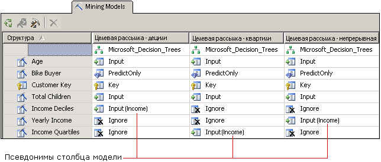

# Настройка структуры и моделей интеллектуального анализа данных
[!INCLUDE[ssas-appliesto-sqlas](../../includes/ssas-appliesto-sqlas.md)]
  После выбора алгоритма в соответствии с задачами организации, можно выполнить индивидуальную настройку модели, что может повысить эффективность результатов. Настройка выполняется следующими способами.  
  
-   Использование в модели других столбцов данных либо изменение режима использования, типа содержимого или метода дискретизации для столбцов.  
  
-   Создание в модели интеллектуального анализа данных фильтров, ограничивающих данные, используемые в обучении модели.  
  
-   Изменение алгоритма, используемого для анализа данных.  
  
-   Задание параметров алгоритма, управляющих пороговыми значениями, разбиением деревьев и другими важными условиями.  
  
 Эти способы описаны в данном разделе.  
  
## Изменение данных, используемых моделью  
 На результаты анализа сильно влияют принимаемые решения о выборе столбцов данных для использования в модели, а также о способах их использования и обработки. В следующих разделах приводятся сведения, которые помогут принять такие решения.  
  
### Выбор компонентов  
 В большинстве алгоритмов интеллектуального анализа данных в службах [!INCLUDE[ssASnoversion](../../includes/ssasnoversion-md.md)] используется процесс *выбора компонентов* , чтобы выбрать для добавления к модели только наиболее полезные атрибуты. Сокращение числа столбцов и атрибутов может повысить производительность и точность работы модели. Доступные методы выбора компонентов зависят от выбранного алгоритма.  
  
 [Выбор компонентов (интеллектуальный анализ данных)](../../analysis-services/data-mining/feature-selection-data-mining.md).  
  
### Изменение порядка использования  
 Можно изменить список столбцов, включаемых в модель интеллектуального анализа данных, и порядок использования каждого столбца. Если результаты не соответствуют ожиданиям, следует изучить столбцы, использованные в качестве входных данных, и оценить удачность выбора этих столбцов. Затем выясните, что можно сделать для улучшения обработки данных (любые из следующих операций).  
  
-   Определение категориальных переменных, которые были ошибочно помечены как числа.  
  
-   Добавление категорий для сокращения числа атрибутов и упрощения поиска корреляций.  
  
-   Изменение порядка сегментирования или дискретизации чисел.  
  
-   Удаление столбцов с большим числом уникальных значений или столбцов, содержащих эталонные данные (адреса, отчества и т. п.), бесполезные для анализа.  
  
 Не нужно физически удалять столбцы из структуры интеллектуального анализа данных. можно просто установить для столбца значение **пропустить**. Столбец будет удален из модели интеллектуального анализа данных, но при этом сохранится возможность использовать его в других моделях интеллектуального анализа данных из структуры и ссылаться на него в запросах детализации.  
  
### Создание псевдонимов для столбцов модели  
 Когда службы [!INCLUDE[ssASnoversion](../../includes/ssasnoversion-md.md)] создают модель интеллектуального анализа данных, они используют те же имена столбцов, что существуют в структуре интеллектуального анализа данных. Любому столбцу в модели интеллектуального анализа данных можно добавить псевдоним. Это может облегчить понимание содержимого столбца или его использования. Также можно сократить имя, чтобы было удобнее создавать запросы. Псевдонимы также удобны при создании копии столбца с заданием для нее описательного имени.  
  
 Псевдоним создается путем изменения свойства **Name** для столбца модели интеллектуального анализа данных. [!INCLUDE[ssASnoversion](../../includes/ssasnoversion-md.md)] продолжается использование исходного имени в качестве идентификатора столбца, а новое значение, введенное для свойства **Имя** , становится псевдонимом столбца. В сетке псевдоним отображается в круглых скобках рядом со столбцом.  
  
   
  
 На диаграмме показаны связанные модели, в которых присутствуют несколько копий столбца структуры интеллектуального анализа данных, относящегося к прибыли. Каждая копия столбца структуры была дискретизирована различными способами. В моделях на диаграмме используются разные столбцы из структуры интеллектуального анализа данных, однако для удобства сравнения столбцов между моделями имя столбца в каждой модели было изменено на [**Прибыль**].  
  
### Добавление фильтров  
 К модели интеллектуального анализа данных можно также добавить фильтр. Фильтр — это набор условий WHERE, который ограничивает данные в вариантах моделей определенным подмножеством. Фильтр используется при обучении модели. Дополнительно он может использоваться при проверке модели или при создании диаграмм точности.  
  
 Добавляя фильтры, можно многократно использовать структуры интеллектуального анализа данных, создавая модели на основе совершенно различных подмножеств данных. Кроме того, с помощью фильтров можно просто исключать определенные строки, повышая качество анализа.  
  
 Дополнительные сведения см. в разделе [Фильтры для моделей интеллектуального анализа данных (службы Analysis Services — интеллектуальный анализ данных)](../../analysis-services/data-mining/filters-for-mining-models-analysis-services-data-mining.md).  
  
## Изменение алгоритма  
 Хотя новые модели, добавляемые в структуру интеллектуального анализа данных, используют один и тот же набор данных, можно получить другие результаты, используя другой алгоритм (если он поддерживается данными) или изменяя параметры алгоритма. Также можно задавать флаги модели.  
  
 Выбор алгоритма определяет тип получаемых результатов. Общие сведения о работе определенных алгоритмов и о бизнес-сценариях, в которых наиболее эффективно будет использоваться какой-либо алгоритм, см. в разделе [Алгоритмы интеллектуального анализа данных (службы Analysis Services — интеллектуальный анализ данных)](../../analysis-services/data-mining/data-mining-algorithms-analysis-services-data-mining.md).  
  
 Описание требований и ограничений, а также подробные сведения о возможностях настройки, поддерживаемых каждым алгоритмом, см. в разделах технического справочника, посвященных каждому алгоритму.  
  
|||  
|-|-|  
|[Алгоритм дерева принятия решений (Майкрософт)](../../analysis-services/data-mining/microsoft-decision-trees-algorithm.md)|[Алгоритм временных рядов (Майкрософт)](../../analysis-services/data-mining/microsoft-time-series-algorithm.md)|  
|[Алгоритм кластеризации (Майкрософт)](../../analysis-services/data-mining/microsoft-clustering-algorithm.md)|[Алгоритм нейронной сети (Майкрософт)](../../analysis-services/data-mining/microsoft-neural-network-algorithm.md)|  
|[Упрощенный алгоритм Байеса (Майкрософт)](../../analysis-services/data-mining/microsoft-naive-bayes-algorithm.md)|[Алгоритм логистической регрессии (Майкрософт)](../../analysis-services/data-mining/microsoft-logistic-regression-algorithm.md)|  
|[Алгоритм взаимосвязей (Майкрософт)](../../analysis-services/data-mining/microsoft-association-algorithm.md)|[Алгоритм линейной регрессии (Майкрософт)](../../analysis-services/data-mining/microsoft-linear-regression-algorithm.md)|  
|[Алгоритм кластеризации последовательностей (Майкрософт)](../../analysis-services/data-mining/microsoft-sequence-clustering-algorithm.md)||  
  
## Настройка параметров алгоритмов  
 Каждый алгоритм поддерживает параметры, которые используются для настройки его режима работы и точной фильтрации результатов модели. Описание использования каждого параметра см. в следующих разделах.  
  
 В разделе для каждого типа алгоритма также приведены прогнозирующие функции, которые можно использовать с моделями, основанными на данном алгоритме.  
  
|Имя свойства|Применение|  
|-------------------|----------------|  
|AUTO_DETECT_PERIODICITY|[Технический справочник по алгоритму временных рядов (Майкрософт)](../../analysis-services/data-mining/microsoft-time-series-algorithm-technical-reference.md)|  
|CLUSTER_COUNT|[Технический справочник по алгоритму кластеризации (Майкрософт)](../../analysis-services/data-mining/microsoft-clustering-algorithm-technical-reference.md)   [Технический справочник по алгоритму кластеризации последовательностей (Майкрософт)](../../analysis-services/data-mining/microsoft-sequence-clustering-algorithm-technical-reference.md)|  
|CLUSTER_SEED|[Технический справочник по алгоритму кластеризации (Майкрософт)](../../analysis-services/data-mining/microsoft-clustering-algorithm-technical-reference.md)|  
|CLUSTERING_METHOD|[Технический справочник по алгоритму кластеризации (Майкрософт)](../../analysis-services/data-mining/microsoft-clustering-algorithm-technical-reference.md)|  
|COMPLEXITY_PENALTY|[Технический справочник по алгоритму дерева принятия решений (Майкрософт)](../../analysis-services/data-mining/microsoft-decision-trees-algorithm-technical-reference.md)   [Технический справочник по алгоритму временных рядов (Майкрософт)](../../analysis-services/data-mining/microsoft-time-series-algorithm-technical-reference.md)|  
|FORCE_REGRESSOR|[Технический справочник по алгоритму дерева принятия решений (Майкрософт)](../../analysis-services/data-mining/microsoft-decision-trees-algorithm-technical-reference.md)   [Технический справочник по алгоритму линейной регрессии (Майкрософт)](../../analysis-services/data-mining/microsoft-linear-regression-algorithm-technical-reference.md)   [Флаги моделирования (интеллектуальный анализ данных)](../../analysis-services/data-mining/modeling-flags-data-mining.md)|  
|FORECAST_METHOD|[Технический справочник по алгоритму временных рядов (Майкрософт)](../../analysis-services/data-mining/microsoft-time-series-algorithm-technical-reference.md)|  
|HIDDEN_NODE_RATIO|[Технический справочник по алгоритму нейронной сети (Майкрософт)](../../analysis-services/data-mining/microsoft-neural-network-algorithm-technical-reference.md)|  
|HISTORIC_MODEL_COUNT|[Технический справочник по алгоритму временных рядов (Майкрософт)](../../analysis-services/data-mining/microsoft-time-series-algorithm-technical-reference.md)|  
|HISTORICAL_MODEL_GAP|[Технический справочник по алгоритму временных рядов (Майкрософт)](../../analysis-services/data-mining/microsoft-time-series-algorithm-technical-reference.md)|  
|HOLDOUT_PERCENTAGE|[Технический справочник по алгоритму логистической регрессии (Майкрософт)](../../analysis-services/data-mining/microsoft-logistic-regression-algorithm-technical-reference.md)   [Технический справочник по алгоритму нейронной сети (Майкрософт)](../../analysis-services/data-mining/microsoft-neural-network-algorithm-technical-reference.md)   Примечание. Этот параметр отличается от значения контрольных данных в процентах, применяемого к структуре интеллектуального анализа данных.|  
|HOLDOUT_SEED|[Технический справочник по алгоритму логистической регрессии (Майкрософт)](../../analysis-services/data-mining/microsoft-logistic-regression-algorithm-technical-reference.md)   [Технический справочник по алгоритму нейронной сети (Майкрософт)](../../analysis-services/data-mining/microsoft-neural-network-algorithm-technical-reference.md)   Примечание. Этот параметр отличается от начального контрольного значения, применяемого к структуре интеллектуального анализа данных.|  
|INSTABILITY_SENSITIVITY|[Технический справочник по алгоритму временных рядов (Майкрософт)](../../analysis-services/data-mining/microsoft-time-series-algorithm-technical-reference.md)|  
|MAXIMUM_INPUT_ATTRIBUTES|[Технический справочник по алгоритму кластеризации (Майкрософт)](../../analysis-services/data-mining/microsoft-clustering-algorithm-technical-reference.md)   [Технический справочник по алгоритму дерева принятия решений (Майкрософт)](../../analysis-services/data-mining/microsoft-decision-trees-algorithm-technical-reference.md)   [Технический справочник по алгоритму линейной регрессии (Майкрософт)](../../analysis-services/data-mining/microsoft-linear-regression-algorithm-technical-reference.md)   [Технический справочник по упрощенному алгоритму Байеса (Майкрософт)](../../analysis-services/data-mining/microsoft-naive-bayes-algorithm-technical-reference.md)   [Технический справочник по алгоритму нейронной сети (Майкрософт)](../../analysis-services/data-mining/microsoft-neural-network-algorithm-technical-reference.md)   [Технический справочник по алгоритму логистической регрессии (Майкрософт)](../../analysis-services/data-mining/microsoft-logistic-regression-algorithm-technical-reference.md)|  
|MAXIMUM_ITEMSET_COUNT|[Технический справочник по алгоритму взаимосвязей (Майкрософт)](../../analysis-services/data-mining/microsoft-association-algorithm-technical-reference.md)|  
|MAXIMUM_ITEMSET_SIZE|[Технический справочник по алгоритму взаимосвязей (Майкрософт)](../../analysis-services/data-mining/microsoft-association-algorithm-technical-reference.md)|  
|MAXIMUM_OUTPUT_ATTRIBUTES|[Технический справочник по алгоритму дерева принятия решений (Майкрософт)](../../analysis-services/data-mining/microsoft-decision-trees-algorithm-technical-reference.md)   [Технический справочник по алгоритму линейной регрессии (Майкрософт)](../../analysis-services/data-mining/microsoft-linear-regression-algorithm-technical-reference.md)   [Технический справочник по алгоритму логистической регрессии (Майкрософт)](../../analysis-services/data-mining/microsoft-logistic-regression-algorithm-technical-reference.md)   [Технический справочник по упрощенному алгоритму Байеса (Майкрософт)](../../analysis-services/data-mining/microsoft-naive-bayes-algorithm-technical-reference.md)   [Технический справочник по алгоритму нейронной сети (Майкрософт)](../../analysis-services/data-mining/microsoft-neural-network-algorithm-technical-reference.md)|  
|MAXIMUM_SEQUENCE_STATES|[Технический справочник по алгоритму кластеризации последовательностей (Майкрософт)](../../analysis-services/data-mining/microsoft-sequence-clustering-algorithm-technical-reference.md)|  
|MAXIMUM_SERIES_VALUE|[Технический справочник по алгоритму временных рядов (Майкрософт)](../../analysis-services/data-mining/microsoft-time-series-algorithm-technical-reference.md)|  
|MAXIMUM_STATES|[Технический справочник по алгоритму кластеризации (Майкрософт)](../../analysis-services/data-mining/microsoft-clustering-algorithm-technical-reference.md)   [Технический справочник по алгоритму нейронной сети (Майкрософт)](../../analysis-services/data-mining/microsoft-neural-network-algorithm-technical-reference.md)   [Технический справочник по алгоритму кластеризации последовательностей (Майкрософт)](../../analysis-services/data-mining/microsoft-sequence-clustering-algorithm-technical-reference.md)|  
|MAXIMUM_SUPPORT|[Технический справочник по алгоритму взаимосвязей (Майкрософт)](../../analysis-services/data-mining/microsoft-association-algorithm-technical-reference.md)|  
|MINIMUM_IMPORTANCE|[Технический справочник по алгоритму взаимосвязей (Майкрософт)](../../analysis-services/data-mining/microsoft-association-algorithm-technical-reference.md)|  
|MINIMUM_ITEMSET_SIZE|[Технический справочник по алгоритму взаимосвязей (Майкрософт)](../../analysis-services/data-mining/microsoft-association-algorithm-technical-reference.md)|  
|MINIMUM_DEPENDENCY_PROBABILITY|[Технический справочник по упрощенному алгоритму Байеса (Майкрософт)](../../analysis-services/data-mining/microsoft-naive-bayes-algorithm-technical-reference.md)|  
|MINIMUM_PROBABILITY|[Технический справочник по алгоритму взаимосвязей (Майкрософт)](../../analysis-services/data-mining/microsoft-association-algorithm-technical-reference.md)|  
|MINIMUM_SERIES_VALUE|[Технический справочник по алгоритму временных рядов (Майкрософт)](../../analysis-services/data-mining/microsoft-time-series-algorithm-technical-reference.md)|  
|MINIMUM_SUPPORT|[Технический справочник по алгоритму взаимосвязей (Майкрософт)](../../analysis-services/data-mining/microsoft-association-algorithm-technical-reference.md)   [Технический справочник по алгоритму кластеризации (Майкрософт)](../../analysis-services/data-mining/microsoft-clustering-algorithm-technical-reference.md)   [Технический справочник по алгоритму дерева принятия решений (Майкрософт)](../../analysis-services/data-mining/microsoft-decision-trees-algorithm-technical-reference.md)   [Технический справочник по алгоритму кластеризации последовательностей (Майкрософт)](../../analysis-services/data-mining/microsoft-sequence-clustering-algorithm-technical-reference.md)   [Технический справочник по алгоритму временных рядов (Майкрософт)](../../analysis-services/data-mining/microsoft-time-series-algorithm-technical-reference.md)|  
|MISSING_VALUE_SUBSTITUTION|[Технический справочник по алгоритму временных рядов (Майкрософт)](../../analysis-services/data-mining/microsoft-time-series-algorithm-technical-reference.md)|  
|MODELLING_CARDINALITY|[Технический справочник по алгоритму кластеризации (Майкрософт)](../../analysis-services/data-mining/microsoft-clustering-algorithm-technical-reference.md)|  
|PERIODICITY_HINT|[Технический справочник по алгоритму временных рядов (Майкрософт)](../../analysis-services/data-mining/microsoft-time-series-algorithm-technical-reference.md)|  
|PREDICTION_SMOOTHING|[Технический справочник по алгоритму временных рядов (Майкрософт)](../../analysis-services/data-mining/microsoft-time-series-algorithm-technical-reference.md)|  
|SAMPLE_SIZE|[Технический справочник по алгоритму кластеризации (Майкрософт)](../../analysis-services/data-mining/microsoft-clustering-algorithm-technical-reference.md)   [Технический справочник по алгоритму логистической регрессии (Майкрософт)](../../analysis-services/data-mining/microsoft-logistic-regression-algorithm-technical-reference.md)   [Технический справочник по алгоритму нейронной сети (Майкрософт)](../../analysis-services/data-mining/microsoft-neural-network-algorithm-technical-reference.md)|  
|SCORE_METHOD|[Технический справочник по алгоритму дерева принятия решений (Майкрософт)](../../analysis-services/data-mining/microsoft-decision-trees-algorithm-technical-reference.md)|  
|SPLIT_METHOD|[Технический справочник по алгоритму дерева принятия решений (Майкрософт)](../../analysis-services/data-mining/microsoft-decision-trees-algorithm-technical-reference.md)|  
|STOPPING_TOLERANCE|[Технический справочник по алгоритму кластеризации (Майкрософт)](../../analysis-services/data-mining/microsoft-clustering-algorithm-technical-reference.md)|  
  
## См. также  
 [Алгоритмы интеллектуального анализа данных (службы Analysis Services — интеллектуальный анализ данных)](../../analysis-services/data-mining/data-mining-algorithms-analysis-services-data-mining.md)   
 [Физическая архитектура (службы Analysis Services — интеллектуальный анализ данных)](../../analysis-services/data-mining/physical-architecture-analysis-services-data-mining.md)  
  
  
