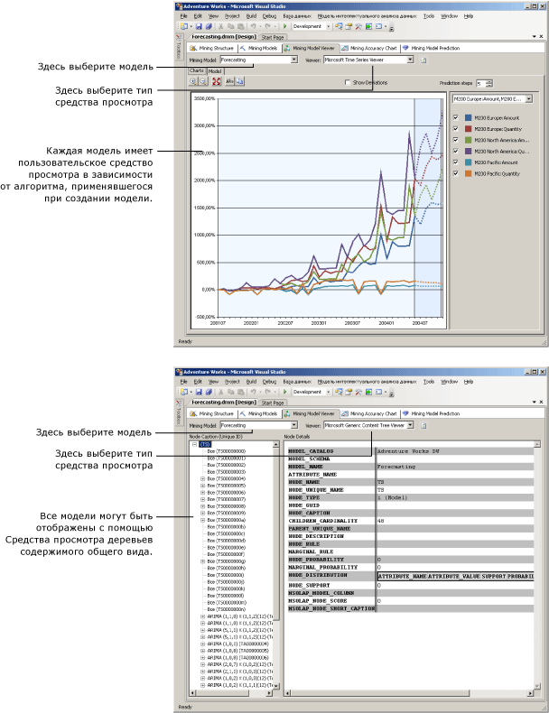

# Средства просмотра моделей интеллектуального анализа данных
[!INCLUDE[ssas-appliesto-sqlas](../../includes/ssas-appliesto-sqlas.md)]
После обучения модели интеллектуального анализа данных в службах [!INCLUDE[msCoName](../../includes/msconame-md.md)] [!INCLUDE[ssNoVersion](../../includes/ssnoversion-md.md)] [!INCLUDE[ssASnoversion](../../includes/ssasnoversion-md.md)]можно просматривать модель для поиска интересующих трендов. Ввиду того что результаты моделей интеллектуального анализа данных сложны для понимания в необработанном формате, визуальное исследование данных часто представляет собой самый простой путь к пониманию правил и связей, которые алгоритмы обнаруживают в данных.  
  
 Различные алгоритмы, используемые для создания модели, возвращают отличные друг от друга типы результатов. Таким образом, службы [!INCLUDE[ssASnoversion](../../includes/ssasnoversion-md.md)] обеспечивают для каждого алгоритма отдельное средство просмотра. При просмотре модели интеллектуального анализа данных в среде [!INCLUDE[ssBIDevStudioFull](../../includes/ssbidevstudiofull-md.md)]модель отображается на вкладке **Средство просмотра моделей интеллектуального анализа данных** конструктора интеллектуального анализа данных с использованием соответствующего средства просмотра для данной модели.  
  
## Как использовать средства просмотра моделей интеллектуального анализа данных  
 Сначала необходимо выбрать модель интеллектуального анализа данных, а затем средство для ее просмотра. Каждая модель имеет два доступных средства для просмотра: пользовательское, включающее несколько вкладок, и общее средство просмотра.  
  
 В зависимости от выбранного типа модели будут отображаться различные параметры для ее исследования. Пользовательское средство, связанное с каждым типом модели, приспособлено для алгоритма, используемого для создания выбранной модели интеллектуального анализа данных. Каждое пользовательское средство имеет различные инструменты и диалоговые окна, помогающие просматривать статистику и шаблоны в моделях, просматривать диаграммы и организовать интерактивную работу с порогами вероятности или отфильтровать элементы по имени.  
  
 Следующая диаграмма иллюстрирует различия между выбором пользовательского и общего средств просмотра для одной модели.  
  
1.  Первым при выборе модели интеллектуального анализа данных на основе алгоритма временных рядов (Майкрософт) отображается пользовательское средство просмотра.  
  
     Оно автоматически создает граф временного ряда и предоставляет пять прогнозов.  
  
2.  Затем та же модель отображается с помощью **средства просмотра деревьев содержимого общего вида (Майкрософт)**.  
  
     С левой стороны в стандартном средстве просмотра отображается список всех узлов в выбранной модели интеллектуального анализа данных. Щелкнув узел, можно просмотреть его содержимое на правой панели.  
  
   
  
## Дополнительно о средстве просмотра деревьев содержимого общего вида (Майкрософт)  
 Для просмотра каждой модели также можно использовать [средство просмотра деревьев содержимого общего вида (Майкрософт)](http://msdn.microsoft.com/library/751b4393-f6fd-48c1-bcef-bdca589ce34c). Это средство просмотра представляет содержимое модели интеллектуального анализа данных в соответствии со стандартизованной схемой таблицы HTML. Однако расположение узлов и содержание каждого узла будет отличаться. Это зависит от алгоритма, используемого для формирования результатов.  
  
 Пользовательские средства просмотра разработаны для просмотра и исследования модели, тогда как общее средство просмотра больше подходит для уже исследованной модели, если необходимо извлечь статистику или правила из отдельных узлов. Например, стандартное средство просмотра служит для просмотра подробной информации о шаблонах и статистических данных, которые формируются службами [!INCLUDE[ssASnoversion](../../includes/ssasnoversion-md.md)] при выполнении таких типов анализа, как вероятностный для узла, либо для регрессивных формул.  
  
 Можно также вручную ввести *запрос содержимого* на языке расширений интеллектуального анализа данных, чтобы получить всю информацию, представленную в средстве просмотра. Дополнительные сведения см. в разделе [Запросы содержимого (интеллектуальный анализ данных)](../../analysis-services/data-mining/content-queries-data-mining.md).  
  
## В этом разделе  
 В следующих разделах более подробно описано каждое из средств просмотра, а также даны рекомендации по интерпретации данных в них.  
  
 [Просмотр модели в средстве просмотра деревьев (Microsoft)](../../analysis-services/data-mining/browse-a-model-using-the-microsoft-tree-viewer.md)  
 Описывает средство просмотра деревьев [!INCLUDE[msCoName](../../includes/msconame-md.md)] . В этом средстве просмотра отображаются модели интеллектуального анализа данных, которые формируются с помощью алгоритма дерева принятия решений [!INCLUDE[msCoName](../../includes/msconame-md.md)] и алгоритма линейной регрессии [!INCLUDE[msCoName](../../includes/msconame-md.md)] .  
  
 [Просмотр модели в средстве просмотра кластеров (Microsoft)](../../analysis-services/data-mining/browse-a-model-using-the-microsoft-cluster-viewer.md)  
 Описывает средство просмотра кластеров [!INCLUDE[msCoName](../../includes/msconame-md.md)] . Это средство просмотра отображает модели интеллектуального анализа данных, которые построены по алгоритму кластеризации [!INCLUDE[msCoName](../../includes/msconame-md.md)] .  
  
 [Просмотр модели в средство просмотра временных рядов](../../analysis-services/data-mining/browse-a-model-using-the-microsoft-time-series-viewer.md)  
 Описывает средство просмотра временных рядов [!INCLUDE[msCoName](../../includes/msconame-md.md)] . Это средство просмотра отображает модели, которые построены по алгоритму временных рядов [!INCLUDE[msCoName](../../includes/msconame-md.md)] .  
  
 [Просмотр модели с помощью средства просмотра упрощенного алгоритма Байеса упрощенного Microsoft](../../analysis-services/data-mining/browse-a-model-using-the-microsoft-naive-bayes-viewer.md)  
 Описывает средство просмотра упрощенных алгоритмов Байеса [!INCLUDE[msCoName](../../includes/msconame-md.md)] . Это средство просмотра отображает модели интеллектуального анализа данных, которые построены по упрощенному алгоритму Байеса [!INCLUDE[msCoName](../../includes/msconame-md.md)] .  
  
 [Просмотр модели в средство просмотра кластеризации последовательностей (Майкрософт)](../../analysis-services/data-mining/browse-a-model-using-the-microsoft-sequence-cluster-viewer.md)  
 Описывает средство просмотра кластеризации последовательностей [!INCLUDE[msCoName](../../includes/msconame-md.md)] . Это средство просмотра отображает модели интеллектуального анализа данных, которые построены по алгоритму кластеризации последовательностей [!INCLUDE[msCoName](../../includes/msconame-md.md)] .  
  
 [Просмотр модели с помощью средства просмотра правил взаимосвязи (Microsoft)](../../analysis-services/data-mining/browse-a-model-using-the-microsoft-association-rules-viewer.md)  
 Описывает средство просмотра правил взаимосвязи [!INCLUDE[msCoName](../../includes/msconame-md.md)] . Это средство просмотра отображает модели интеллектуального анализа данных, которые построены по алгоритму взаимосвязи [!INCLUDE[msCoName](../../includes/msconame-md.md)] .  
  
 [Просмотр модели с помощью средства просмотра нейронных сетей Майкрософт](../../analysis-services/data-mining/browse-a-model-using-the-microsoft-neural-network-viewer.md)  
 Описывает средство просмотра нейронных сетей [!INCLUDE[msCoName](../../includes/msconame-md.md)] . В этом средстве просмотра отображаются модели интеллектуального анализа данных, построенные с помощью алгоритма нейронной сети [!INCLUDE[msCoName](../../includes/msconame-md.md)] , включая модели, в которых используется алгоритм логистической регрессии [!INCLUDE[msCoName](../../includes/msconame-md.md)] .  
  
 [Просмотр модели с помощью средства просмотра деревьев содержимого Microsoft Generic](../../analysis-services/data-mining/browse-a-model-using-the-microsoft-generic-content-tree-viewer.md)  
 Описывает подробные сведения, доступные в общем средстве просмотра для всех моделей интеллектуального анализа данных, и содержит примеры интерпретации информации для каждого алгоритма.  
  
## См. также  
 [Алгоритмы интеллектуального анализа данных &#40; Службы Analysis Services — Интеллектуальный анализ данных &#41;](../../analysis-services/data-mining/data-mining-algorithms-analysis-services-data-mining.md)   
 [Конструктор интеллектуального анализа данных](../../analysis-services/data-mining/data-mining-designer.md)  
  
  
