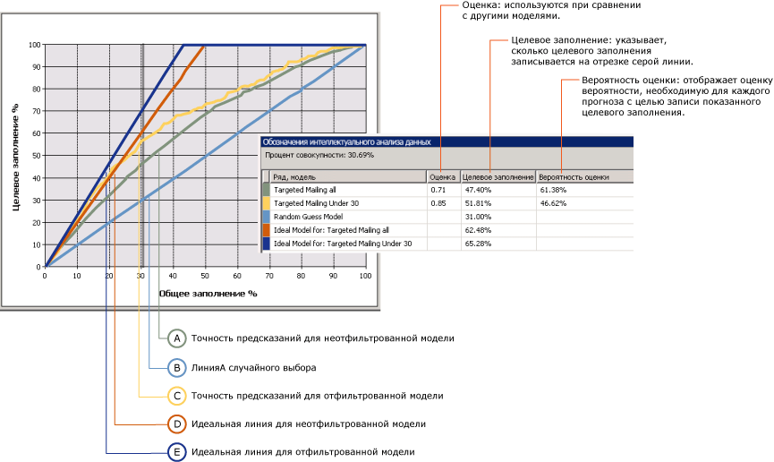
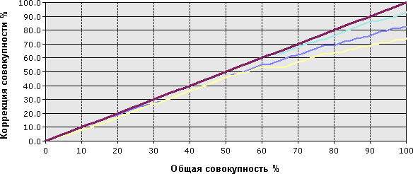

# Диаграмма точности прогнозов (службы Analysis Services — интеллектуальный анализ данных)
[!INCLUDE[ssas-appliesto-sqlas](../../includes/ssas-appliesto-sqlas.md)]Объект *диаграмма точности прогнозов* графически представляет, какое улучшение даст модель интеллектуального анализа данных по сравнению со случайным предположением, а также измеряет изменение в терминах *точности прогнозов* оценка. Сравнив показатели точности прогнозов для различных моделей, можно выбрать самый оптимальный вариант. Кроме того, такой анализ позволяет определить, в какой момент прогнозы модели становятся менее полезными. Например, просмотрев диаграмму точности прогнозов, можно понять, что соответствующая рекламная кампания окажет воздействие только на 30 % ваших клиентов, и сократить охват этой кампании, исходя из полученных данных.  
  
 В интеллектуальном анализе данных [!INCLUDE[ssNoVersion](../../includes/ssnoversion-md.md)] диаграмма точности прогнозов позволяет сравнивать точность прогнозов для нескольких моделей, имеющих одинаковый прогнозируемый атрибут. Кроме того, можно получать точность прогнозирования как для единичного случая (единичное значение прогнозируемого атрибута), так и для всех случаев (все значения указанного атрибута).  
  
 Диаграмма роста прибыли является связанным типом диаграмм, содержащей те же данные, что и диаграмма точности прогнозов, но на ней также отображается прогнозируемый рост прибыли, относящийся к каждой модели.  
  
##   Основные сведения о диаграмме точности прогнозов  
 Абстрактные оценки точности могут быть трудными для понимания. Таким образом, чтобы проиллюстрировать использование инструментов проверки точности и сведений в оценках, в этом разделе приведен сценарий, в котором с помощью оценки точности оценивается кампания целевой рассылки.  
  
 Отдел маркетинга в данном сценарии знает, что процент ответов в 10 % более или менее типичен для кампаний рассылки. В таблице базы данных хранится список, содержащий 10 000 потенциальных заказчиков. На основании типового процента ответивших в принципе можно ожидать, что ответит лишь около 1000 потенциальных клиентов. Однако денег, выделенных на проект, недостаточно, чтобы охватить все 10 000 клиентов, имеющихся в базе данных, а они хотят увеличить процент ответивших. В данном сценарии предположим, что бюджет позволяет разослать рекламу только 5000 клиентам. У отдела маркетинга есть следующие две возможности.  
  
-   Случайным образом выбрать 5000 целевых клиентов.  
  
-   С помощью модели интеллектуального анализа данных выбрать 5000 целевых клиентов, вероятность ответа которых наиболее велика.  
  
 С помощью диаграммы точности прогнозов можно сравнивать ожидаемые результаты обоих вариантов. Например, если компания случайным образом выберет 5000 клиентов, то на основании типового процента ответивших она может ожидать лишь 500 ответов. Этот сценарий представлен *случайной* линией на диаграмме точности прогнозов. Но если отдел маркетинга воспользуется для целевой рассылки моделью интеллектуального анализа данных, то можно рассчитывать на более высокий процент ответивших, поскольку модель поможет идентифицировать тех клиентов, вероятность ответа которых наиболее высока. Если бы модель была совершенной, то есть могла бы выдавать безошибочные прогнозы, то в ответ на рассылку сообщений тысяче рекомендованных моделью клиентов компания могла бы ожидать получения всех 1000 ответов. Этот сценарий представлен *идеальной* линией на диаграмме точности прогнозов.  
  
 В реальности модель интеллектуального анализа данных находится, скорее всего, между этими крайними случаями: случайным предположением и идеальным прогнозом. Любое повышение по сравнению со случайным предположением считается повышением точности прогнозирования.  
  
 При создании оценки точности можно взять конкретное значение и измерить точность только по нему или же можно провести общую оценку модели, при которой измеряется точность для всех возможных вариантов. Этот выбор влияет на конечный результат, как описано в следующих разделах.  
  
 [В начало](#bkmk_Top)  
  
### Диаграмма точности прогнозов с целевым значением  
 На следующем рисунке показана диаграмма точности прогнозов для модели **целевой рассылки** , созданной в [Basic Data Mining Tutorial](http://msdn.microsoft.com/library/6602edb6-d160-43fb-83c8-9df5dddfeb9c). На этой диаграмме целевым атрибутом является [Bike Buyer], а целевым значением — 1. Это означает, что клиент согласно прогнозу приобретет велосипед. Таким образом, диаграмма точности прогнозов показывает улучшение, которое обеспечивает модель, при определении этих потенциальных клиентов.  
  
 Эта диаграмма содержит несколько моделей, основанных на одних и тех же данных. Одна из этих моделей была настроена для конкретных клиентов. Можно настроить модель путем добавления фильтров к данным, используемым в обучении модели. Если включен данный фильтр, при обучении и оценке учитываются только клиенты, не достигшие тридцатилетнего возраста. Обратите внимание, что один из эффектов применения фильтра заключается в том, что базовая модель и отфильтрованная модель используют разные наборы данных. Поэтому и число вариантов, используемых для оценки точности, также будет различным. Это важно помнить при интерпретации результатов прогноза и других статистических данных.  
  
   
  
 Ось X диаграммы представляет процент проверочного набора данных, используемого для сравнения прогнозов. Ось Y диаграммы представляет процент предсказанных значений.  
  
 Диагональная прямая линия голубого цвета появляется на каждой диаграмме. Она представляет результат случайного выбора и является базовой линией, по которой оценивается точность предсказаний. Для каждой модели, добавляемой к диаграмме точности прогнозов, отображаются две дополнительные линии: одна показывает идеальный результат для тренировочного набора данных, если удалось создать модель, гарантирующую высокую точность прогноза, а вторая показывает фактическую точность предсказаний (или улучшение результата) для данной модели.  
  
 В этом примере идеальная линия для отфильтрованной модели отображается темно-синим цветом, а линия фактической точности предсказаний – желтым. На диаграмме можно видеть, что высшей точкой линии идеального прогноза является примерно 40 процентов. Это означает, что в случае идеальной модели можно охватить 100 процентов целевых клиентов, отправив рассылку лишь 40 процентам всей совокупности клиентов. Фактическая точность предсказаний для отфильтрованной модели, если отправить рассылку 40 процентам всей совокупности клиентов, составляет 60-70 процентов, а это означает, что можно охватить 60-70 процентов целевых клиентов, отправив рассылку 40 процентам всей совокупности клиентов.  
  
 **Обозначения интеллектуального анализа данных** содержат фактические значения для каждой точки кривых. Можно изменить измеряемое место, щелкнув вертикальную серую линию и переместив ее. На диаграмме серая линия смещена на 30 процентов, поскольку в этой точке наиболее эффективны как отфильтрованная, так и неотфильтрованная модели, а после нее точность предсказаний падает.  
  
 **Условные обозначения интеллектуального анализа данных** также содержат оценки и статистические данные, помогающие интерпретировать диаграмму. Эти результаты представляют точность модели на серой линии, которая в этом сценарии расположена так, чтобы включить 30 процентов всех проверочных вариантов.  
  
|Ряды и модель|Оценка|Целевое заполнение|Вероятность прогноза|  
|-----------------------|-----------|-----------------------|-------------------------|  
|Targeted mailing all|0,71|47,40 %|61,38 %|  
|Целевая рассылка для клиентов в возрасте менее 30 лет|0,85|51,81 %|46,62 %|  
|Модель случайного выбора||31,00 %||  
|Идеальная модель для: целевая рассылка для всех||62,48 %||  
|Идеальная модель для: целевая рассылка для клиентов в возрасте менее 30 лет||65,28 %||  
  
 [В начало](#bkmk_Top)  
  
#### Интерпретация результатов  
 Эти результаты показывают, что если оценивать 30 % от всех вариантов выбора, то общая модель [Targeted mailing all] может предсказать поведение покупателей велосипедов для 47,40 % целевого населения. Другими словами, если отправить рассылку только 30 процентам клиентов, имеющихся в базе данных, можно охватить немногим менее половины целевой аудитории. При использовании отфильтрованной модели можно получить несколько лучшие результаты и охватить 51 % целевых клиентов.  
  
 Значение **Вероятность прогноза** представляет пороговое значение, необходимое для включения клиента в вариант выбора «собирается купить». Для каждого варианта модель оценивает точность прогноза и сохраняет это значение, которое можно использовать для фильтрации или для планирования клиентов. Например, чтобы определить потенциальных клиентов из базовой модели, используется запрос для получения вариантов со значением вероятности прогноза не менее 61 процента. Чтобы получить клиентов, на которых ориентирована отфильтрованная модель, нужно создать запрос, извлекающий варианты, которые удовлетворяют следующим условиям: возраст в необходимом диапазоне и значение **PredictProbability** не менее 46 процентов.  
  
 Интересно сравнить модели. Отфильтрованная модель охватывает больше потенциальных клиентов, но если планировать клиентов с оценкой вероятности прогноза, равной 46 процентам, существует 53-процентная вероятность отправить рассылку тем, кто не будет покупать велосипед. Поэтому при определении, какая модель лучше, нужно уравновешивать точность прогноза и меньший размер целевой аудитории в отфильтрованной модели с селективностью базовой модели.  
  
 Значение **Оценка** помогает сравнивать модели, вычисляя эффективность каждой относительно нормализованного заполнения. Более высокая оценка лучше, поэтому в этом случае можно решить, что планирование клиентов в возрасте менее 30 лет является более эффективным методом, несмотря на меньшую вероятность прогноза.  
  
#### Как определяется оценка?  
 Оценка определяется как среднее геометрическое всех точек на точечной диаграмме, где по оси X откладываются фактические значения, а по оси Y — прогнозируемые значения, и каждой точке соответствует определенная вероятность.  
  
 Статистическое значение оценки каждой отдельной точки представляет собой прогноз для модели, измеренный в этой точке. Среднее значение всех этих точек составляет оценку модели.  
  
 [В начало](#bkmk_Top)  
  
### Диаграмма точности прогнозов для модели без целевого значения  
 Если не указано состояние прогнозируемого столбца, то можно создать диаграмму следующего типа, показанного на следующей диаграмме. На этой диаграмме показана точность модели для всех состояний прогнозируемого атрибута. Например, она покажет насколько точно модель предсказывает как клиентов, собирающихся купить велосипед, так и тех, кто вряд ли его купит.  
  
 Ось X такая же, как и на диаграмме с заданным прогнозируемым столбцом, но ось Y теперь представляет процент прогнозов, являющихся правильными. Поэтому идеальная линия проходит по диагонали и показывает, что при 50 процентах данных модель верно прогнозирует 50 процентов вариантов, то есть ожидаемый максимум.  
  
   
  
 Диаграмму можно щелкнуть, чтобы переместить серую линию, и **Условные обозначения интеллектуального анализа данных** отобразят процент всех вариантов и процент верно предсказанных вариантов. Например, если ползунок серой линии установить на отметке 50 процентов, в **условных обозначениях интеллектуального анализа данных** отобразятся следующие оценки точности. Эти рисунки созданы на основе модели TM_Decision Tree из учебника по основам интеллектуального анализа данных.  
  
|Ряд, модель|Оценка|Целевое заполнение|Вероятность прогноза|  
|-------------------|-----------|-----------------------|-------------------------|  
|TM_DecisionTree|0,77|40,50 %|72,91 %|  
|Идеальная модель||50,00%||  
  
 Эта таблица показывает, что при 50-процентном заполнении созданная модель верно предсказывает 40 процентов вариантов. Ее можно считать достаточно точной моделью. Однако нужно помнить, что эта конкретная модель предсказывает все значения прогнозируемого атрибута. Поэтому эта модель может оказаться точной при прогнозе, что 90 клиентов не купят велосипед.  
  
 [В начало](#bkmk_Top)  
  
### Ограничения на оценки точности  
 Прогнозируемый атрибут для оценки точности должен быть дискретным значением. Иными словами, нельзя использовать оценки точности для измерения точности моделей, прогнозирующих непрерывные числовые значения.  
  
 Точность предсказания для всех дискретных значений прогнозируемого атрибута показана сплошной линией. Если нужно увидеть линии точности прогнозов для всех индивидуальных значений прогнозируемого атрибута, то необходимо создать отдельную диаграмму точности прогнозов для каждого целевого значения.  
  
 К диаграмме точности прогнозов можно добавлять несколько моделей, с условием, что все модели имеют одинаковый прогнозируемый атрибут. Модели, не имеющие общих атрибутов, нельзя будет выбрать на вкладке **Входные данные** .  
  
 Нельзя отображать модели временных рядов в оценке точности или в диаграмме роста прибыли. Общепринятым методом измерения точности прогнозов временных рядов является резервирование части исторических данных и сравнение этих данных с прогнозами. Дополнительные сведения см. в статье [Microsoft Time Series Algorithm](../../analysis-services/data-mining/microsoft-time-series-algorithm.md).  
  
### См. также  
 [В начало](#bkmk_Top)  
  
## См. также:  
 [Тестирование и проверка (интеллектуальный анализ данных)](../../analysis-services/data-mining/testing-and-validation-data-mining.md)  
  
  
