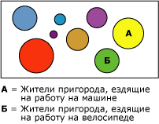

# Алгоритм кластеризации (Майкрософт)
  Алгоритм кластеризации [!INCLUDE[msCoName](../../includes/msconame-md.md)] является алгоритмом *сегментации* или *кластеризации*, который выполняет итерацию вариантов в наборе данных, чтобы сгруппировать их в кластеры, содержащие подобные характеристики. Такие группирования полезно использовать для просмотра данных, выявления в них аномалий и создания прогнозов.  
  
 Модели кластеризации определяют связи в наборе данных, который невозможно логически получить с помощью случайного наблюдения. Например, можно логически догадаться, что люди, добирающиеся на работу на велосипеде, не обязательно живут далеко от работы. Алгоритм может найти другие не очевидные характеристики велосипедистов. На следующей диаграмме кластер А соответствует людям, добирающимся до работы на машине, а кластер Б — людям, добирающимся до работы на велосипеде.  
  
   
  
 Алгоритм кластеризации отличается от других алгоритмов интеллектуального анализа данных, например алгоритма дерева принятия решений [!INCLUDE[msCoName](../../includes/msconame-md.md)] , в котором не требуется назначать прогнозируемый столбец, необходимый для создания модели кластеризации. Алгоритм кластеризации обучает модель строго на основе связей, существующих в данных и на основе кластеров, идентифицированных алгоритмом.  
  
## Пример  
 Рассмотрим группу людей, имеющих сходные демографические данные и покупающих подобные товары в компании [!INCLUDE[ssSampleDBCoShort](../../includes/sssampledbcoshort-md.md)] . Эта группа людей представляет собой кластер данных. В базе данных может существовать несколько таких кластеров. Просматривая столбцы, образующие кластер, можно более точно просмотреть, как записи в наборе данных связаны друг с другом.  
  
## Принцип работы алгоритма  
 Алгоритм кластеризации [!INCLUDE[msCoName](../../includes/msconame-md.md)] сначала определяет связи в наборе данных и формирует ряд кластеров на основе этих связей. Точечная диаграмма является хорошим способом визуально представить, как алгоритм группирует данные (см. следующую диаграмму). Точечная диаграмма представляет все варианты в наборе данных, и каждый вариант является точкой на диаграмме. Группа кластеров указана на диаграмме точками и показывает связи, идентифицированные алгоритмом.  
  
   
  
 После первого определения кластеров алгоритм вычисляет, как кластеры представляют группирование точек, а затем пытается повторно определить группирования, чтобы создать кластеры, которые лучше представляют данные. Алгоритм последовательно выполняет этот процесс до тех пор, пока улучшить результаты, определяя кластеры, будет невозможно.  
  
 Можно настраивать работу данного алгоритма, выбирая конкретный метод объединения в кластеры, ограничивая максимальное количество кластеров или изменяя размер несущего множества, необходимый для создания кластера. Дополнительные сведения см. в разделе [Технический справочник по алгоритму кластеризации (Майкрософт)](../../analysis-services/data-mining/microsoft-clustering-algorithm-technical-reference.md). Этот алгоритм включает два популярных метода кластеризации: кластеризация методом К-средних и метод максимизации ожиданий.  
  
## Данные, необходимые для моделей кластеризации  
 При подготовке данных, предназначенных для использования в обучении модели кластеризации, следует учитывать требования к конкретному алгоритму, в том числе к объему необходимых данных, и то, как эти данные используются.  
  
 Требования для модели кластеризации являются следующими.  
  
-   **Единичный ключевой столбец** Каждая модель должна содержать один числовой или текстовый столбец, который уникальным образом определяет каждую запись. Применение составных ключей не допускается.  
  
-   **Входные столбцы** Каждая модель должна содержать по меньшей мере один входной столбец, включающий значения, которые используются для формирования кластеров. Ограничения на количество входных столбцов не налагаются, но, в зависимости от количества значений в каждом столбце, введение дополнительных столбцов может привести к увеличению времени на обучение модели.  
  
-   **Необязательный прогнозируемый столбец** Этому алгоритму не требуется прогнозируемый столбец для формирования модели, но предусмотрена возможность добавления прогнозируемого столбца с данными почти любого типа. Значения в прогнозируемом столбце могут рассматриваться как входные по отношению к модели кластеризации, или может быть указано, что эти данные используются только для прогноза. Например, если требуется предсказать доход заказчика путем кластеризации по таким демографическим показателям, как регион или возраст, то можно задать доход как **PredictOnly** и ввести все остальные столбцы, например с данными о регионе или возрасте, в качестве входных данных.  
  
 Дополнительные сведения о типах содержимого и типах данных, поддерживаемых моделями кластеризации, см. в подразделе "Требования" раздела [Технический справочник по алгоритму кластеризации (Майкрософт)](../../analysis-services/data-mining/microsoft-clustering-algorithm-technical-reference.md).  
  
## Просмотр модели кластеризации  
 Чтобы исследовать модель, можно использовать **Средство просмотра кластеров (Майкрософт)**. При просмотре модели кластеризации в службах [!INCLUDE[ssASnoversion](../../includes/ssasnoversion-md.md)] кластеры отображаются на диаграмме, которая показывает связи между кластерами, а также содержит подробный профиль каждого кластера, список атрибутов, по которым различаются кластеры, и характеристики всего набора данных для обучения. Дополнительные сведения см. в разделе [Просмотр модели с помощью средства просмотра кластеров (Майкрософт)](../../analysis-services/data-mining/browse-a-model-using-the-microsoft-cluster-viewer.md).  
  
 Чтобы получить более подробные сведения, можно просмотреть модель с помощью [средства просмотра деревьев содержимого общего вида (Майкрософт)](../../analysis-services/data-mining/browse-a-model-using-the-microsoft-generic-content-tree-viewer.md). Содержимое, сохраняемое для модели, включает распределение всех значений в каждом узле, вероятность каждого кластера и другую информацию. Дополнительные сведения см. в разделе [Содержимое моделей интеллектуального анализа данных для моделей кластеризации (службы Analysis Services — интеллектуальный анализ данных)](../../analysis-services/data-mining/mining-model-content-for-clustering-models-analysis-services-data-mining.md).  
  
## Создание прогнозов  
 После обучения модели результаты хранятся в виде набора закономерностей, которые можно исследовать или делать на их основе прогнозы.  
  
 Предусмотрена возможность создавать запросы, возвращающие прогнозы того, соответствуют ли новые данные обнаруженным кластерам, или предоставляющие описательные статистические данные о кластерах.  
  
 Дополнительные сведения о создании запросов к модели интеллектуального анализа данных см. в разделе [Запросы интеллектуального анализа данных](../../analysis-services/data-mining/data-mining-queries.md). Примеры использования запросов с моделью кластеризации см. в разделе [Примеры запросов к модели кластеризации](../../analysis-services/data-mining/clustering-model-query-examples.md).  
  
## Замечания  
  
-   Поддерживается использование языка разметки прогнозирующих моделей (PMML) для создания моделей интеллектуального анализа данных.  
  
-   Поддерживается детализация.  
  
-   Поддерживается использование моделей интеллектуального анализа OLAP и создание измерений интеллектуального анализа данных.  
  
## См. также  
 [Алгоритмы интеллектуального анализа данных (службы Analysis Services — интеллектуальный анализ данных)](../../analysis-services/data-mining/data-mining-algorithms-analysis-services-data-mining.md)   
 [Технический справочник по алгоритму кластеризации (Майкрософт)](../../analysis-services/data-mining/microsoft-clustering-algorithm-technical-reference.md)   
 [Содержимое моделей интеллектуального анализа данных для моделей кластеризации (службы Analysis Services — интеллектуальный анализ данных)](../../analysis-services/data-mining/mining-model-content-for-clustering-models-analysis-services-data-mining.md)   
 [Примеры запросов к модели кластеризации](../../analysis-services/data-mining/clustering-model-query-examples.md)  
  
  