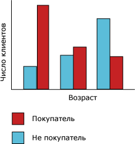
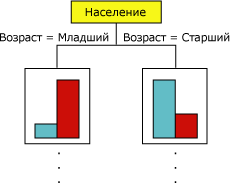
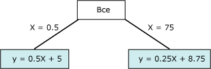

# Алгоритм дерева принятия решений (Майкрософт)
[!INCLUDE[ssas-appliesto-sqlas](../../includes/ssas-appliesto-sqlas.md)][!INCLUDE[msCoName](../../includes/msconame-md.md)] Алгоритм дерева принятия решений — это алгоритм классификации и регрессии, для использования в прогнозирующем моделировании дискретных и непрерывных атрибутов.  
  
 Для дискретных атрибутов алгоритм осуществляет прогнозирования на основе связи между входными столбцами в наборе данных. Он использует значения этих столбцов (известные как состояния) для прогнозирования состояний столбца, который обозначается как прогнозируемый. Алгоритм идентифицирует входные столбцы, которые коррелированы с прогнозируемым столбцом. Например, в сценарии для прогнозирования того, какие заказчики, скорее всего, приобретут велосипед, если девять из десяти молодых заказчиков покупают велосипед, но только двое из более старших заказчиков делают это, то алгоритм заключает, что возраст является хорошим прогнозом приобретения велосипеда. Дерево решений осуществляет прогнозирование на основе этой тенденции в направлении конкретного результата.  
  
 Для непрерывных атрибутов алгоритм использует линейную регрессию для определения места разбиения дерева решений.  
  
 Если несколько столбцов установлены как прогнозируемые или если входные данные содержат вложенную таблицу, которая задана как прогнозируемая, то алгоритм строит отдельное дерево решений для каждого прогнозируемого столбца  
  
## Пример  
 Отделу маркетинга компании [!INCLUDE[ssSampleDBCoFull](../../includes/sssampledbcofull-md.md)] нужно идентифицировать характеристики предыдущих заказчиков, которые могут указывать на высокую вероятность приобретения этими заказчиками продукта в будущем. В базе данных [!INCLUDE[ssSampleDBnormal](../../includes/sssampledbnormal-md.md)] хранятся демографические данные, описывающие предыдущих заказчиков. Используя алгоритм дерева принятия решений ( [!INCLUDE[msCoName](../../includes/msconame-md.md)] ) для анализа этих данных, маркетинговый отдел может построить модель, которая прогнозирует, будет ли конкретный заказчик покупать продукты, на основании состояний известных столбцов, содержащих данные об этом заказчике, например демографические данные и сведения о покупках в прошлом.  
  
## Принцип работы алгоритма  
 Алгоритм дерева принятия решений ( [!INCLUDE[msCoName](../../includes/msconame-md.md)] ) строит модель интеллектуального анализа данных путем создания ряда разбиений в дереве. Эти разбиения представлены как *узлы*. Алгоритм добавляет узел к модели каждый раз, когда выясняется, что входной столбец имеет значительную корреляцию с прогнозируемым столбцом. Способ, которым алгоритм определяет разбиение, отличается в зависимости от того, прогнозирует ли он непрерывный столбец или дискретный столбец.  
  
 Алгоритм дерева принятия решений ( [!INCLUDE[msCoName](../../includes/msconame-md.md)] ) использует функцию *выбора компонентов* для выбора наиболее полезных атрибутов. Выбор компонентов используется всеми алгоритмами интеллектуального анализа данных служб [!INCLUDE[ssNoVersion](../../includes/ssnoversion-md.md)] для увеличения производительности и качества анализа. Выбор компонентов играет важную роль в предотвращении использования процессорного времени малозначительными атрибутами. Если при разработке модели интеллектуального анализа данных в нее было добавлено слишком много входных или прогнозируемых атрибутов, то ее обработка может занять очень много времени или даже привести к нехватке памяти. В методы, определяющие необходимость в разбиении дерева, входят стандартные для отраслей метрики для *энтропии* и Байесовых сетей*.* Дополнительные сведения о методах, используемых для выбора полезных атрибутов, а затем для создания рейтингов и для ранжирования атрибутов, см. в разделе [Выбор компонентов (интеллектуальный анализ данных)](../../analysis-services/data-mining/feature-selection-data-mining.md).  
  
 Одной из часто встречающихся проблем в моделях интеллектуального анализа данных является чрезмерная чувствительность к небольшим различиям в обучающих данных; в таких случаях модель называется *чрезмерно оснащенной* или *чрезмерно обученной*. Чрезмерно оснащенную модель нельзя свести к другим наборам данных. Чтобы избежать появления лжевзаимосвязей в наборах данных, в алгоритме дерева принятия решений ( [!INCLUDE[msCoName](../../includes/msconame-md.md)] ) используются методики контроля роста дерева. Более подробные сведения о том, как работает алгоритм дерева принятия решений ( [!INCLUDE[msCoName](../../includes/msconame-md.md)] ), см. в статье [Технический справочник по алгоритму дерева принятия решений (Майкрософт)](../../analysis-services/data-mining/microsoft-decision-trees-algorithm-technical-reference.md).  
  
### Прогнозирование дискретных столбцов  
 Способ, которым алгоритм дерева принятия решений ( [!INCLUDE[msCoName](../../includes/msconame-md.md)] ) строит дерево для дискретного прогнозируемого столбца, можно продемонстрировать с использованием гистограммы. На следующей диаграмме показана гистограмма, на которой построен прогнозируемый столбец «Покупатели велосипедов» в сравнении с входным столбцом «Возраст». Гистограмма «Б» показывает, что возраст человека помогает определить, купит ли этот человек велосипед.  
  
   
  
 Показанная на диаграмме корреляция приведет к тому, что алгоритм дерева принятия решений ( [!INCLUDE[msCoName](../../includes/msconame-md.md)] ) создаст новый узел в модели.  
  
   
  
 Добавление алгоритмом новых узлов к модели приводит к созданию древовидной структуры. Верхний узел дерева описывает разбиение прогнозируемого столбца для всех заказчиков. При продолжении роста модели алгоритм рассматривает все столбцы.  
  
### Прогнозирование непрерывных столбцов  
 Когда алгоритм дерева принятия решений ( [!INCLUDE[msCoName](../../includes/msconame-md.md)] ) строит дерево по непрерывному прогнозируемому столбцу, каждый узел содержит регрессионную формулу. Разбиение осуществляется в точке нелинейности в этой регрессионной формуле. Например, рассмотрим следующую диаграмму.  
  
   
  
 В стандартной модели регрессии обычно предпринимается попытка получить одну формулу, представляющую тенденции и связи для данных в целом.  Однако отдельная формула может неудовлетворительно отражать неоднородность сложных данных. Вместо этого алгоритм дерева принятия решений ( [!INCLUDE[msCoName](../../includes/msconame-md.md)] ) ищет практически линейные сегменты дерева и создает для них отдельные формулы. Разбиение данных на несколько сегментов обеспечивает гораздо более точное их приближение.  
  
 Следующая диаграмма представляет собой дерево для модели, представленной на точечной диаграмме выше.  Для прогнозирования результата эта модель предоставляет две разных формулы: одну для левой ветви (y = 0,5x x 5) и одну для правой (y = 0,25x + 8,75). Точка соединения этих двух линий на точечной диаграмме является точкой нелинейности и представляет собой точку, в которой разобьется узел в модели дерева решений.  
  
   
  
 Это простая модель всего с двумя линейными уравнениями. Разбиение в дереве находится сразу после узла **All** (Все). Однако разбиение может произойти на любом уровне дерева. Это означает, что в дереве, содержащем несколько уровней и узлов, где каждый узел характеризуется отдельной коллекцией атрибутов, формула может совместно использоваться для нескольких узлов или применяться только к одному узлу. Например, можно получить одну формулу для узла, обозначенного как "возраст и доход клиентов", и другую для узла, представленного как "клиенты, которыми приходится ездить на большие расстояния". Чтобы просмотреть формулу для отдельного узла или сегмента, просто щелкните узел.  
  
## Данные, необходимые для моделей дерева принятия решений  
 При подготовке данных для использования в модели дерева принятия решений необходимо понимать требования определенных алгоритмов (например, необходимое количество данных и метод использования данных).  
  
 Далее приводятся требования для модели дерева принятия решений:  
  
-   **Единичный ключевой столбец** Каждая модель должна содержать один числовой или текстовый столбец, который уникальным образом определяет каждую запись. Составные ключи не допускаются.  
  
-   **Прогнозируемый столбец** Необходимо наличие по крайней мере одного прогнозируемого столбца. В модель можно включить несколько прогнозируемых атрибутов; они могут иметь различные типы (числовые или дискретные). Однако с увеличением количества прогнозируемых атрибутов увеличивается и время обработки.  
  
-   **Входные столбцы** . Необходимо наличие входных столбцов, которые могут быть дискретными или непрерывными. Увеличение числа входных атрибутов влияет на время обработки.  
  
 Дополнительные сведения о типах содержимого и типах данных, поддерживаемых моделями дерева принятия решений, см. в разделе "Требования" статьи [Технический справочник по алгоритму дерева принятия решений (Майкрософт)](../../analysis-services/data-mining/microsoft-decision-trees-algorithm-technical-reference.md).  
  
## Просмотр модели дерева принятия решений  
 Чтобы исследовать модель, можно использовать **средство просмотра деревьев (Майкрософт)**. Если в модели формируется несколько деревьев, то можно выделить одно из них, и средство просмотра отобразит разбиение категоризации вариантов для каждого прогнозируемого атрибута. Также можно осуществить просмотр взаимодействия между деревьями с помощью средства просмотра сети зависимостей. Дополнительные сведения см. в разделе [Просмотр модели с помощью средства просмотра деревьев (Майкрософт)](../../analysis-services/data-mining/browse-a-model-using-the-microsoft-tree-viewer.md).  
  
 Если необходимо получить более подробные сведения о любой ветке или узле в дереве, то модель также можно просматривать с помощью [средства просмотра деревьев содержимого общего вида (Майкрософт)](../../analysis-services/data-mining/browse-a-model-using-the-microsoft-generic-content-tree-viewer.md). В модели хранится следующее содержимое: распространения для всех значений в каждом узле, вероятности на каждом уровне дерева и формулы регрессии для непрерывных атрибутов. Дополнительные сведения см. в разделе [Содержимое моделей интеллектуального анализа данных для моделей дерева принятия решений (службы Analysis Services — интеллектуальный анализ данных)](../../analysis-services/data-mining/mining-model-content-for-decision-tree-models-analysis-services-data-mining.md).  
  
## Создание прогнозов  
 После обработки модели результаты хранятся в виде набора закономерностей и статистики, которые можно использовать для исследования связей или для выполнения прогнозов.  
  
 Примеры запросов, применимых в модели дерева принятия решений, см. в разделе [Примеры запросов к модели дерева принятия решений](../../analysis-services/data-mining/decision-trees-model-query-examples.md).  
  
 Общие сведения о создании запросов к моделям интеллектуального анализа см. в разделе [Запросы интеллектуального анализа данных](../../analysis-services/data-mining/data-mining-queries.md).  
  
## Замечания  
  
-   Поддерживается использование языка разметки прогнозирующих моделей (PMML) для создания моделей интеллектуального анализа данных.  
  
-   Поддерживается детализация.  
  
-   Поддерживается использование моделей интеллектуального анализа OLAP и создание измерений интеллектуального анализа данных.  
  
## См. также  
 [Алгоритмы интеллектуального анализа данных (службы Analysis Services — интеллектуальный анализ данных)](../../analysis-services/data-mining/data-mining-algorithms-analysis-services-data-mining.md)   
 [Технический справочник по алгоритму дерева принятия решений Майкрософт](../../analysis-services/data-mining/microsoft-decision-trees-algorithm-technical-reference.md)   
 [Примеры запросов к модели дерева принятия решений](../../analysis-services/data-mining/decision-trees-model-query-examples.md)   
 [Содержимое моделей интеллектуального анализа данных для моделей дерева принятия решений (службы Analysis Services — интеллектуальный анализ данных)](../../analysis-services/data-mining/mining-model-content-for-decision-tree-models-analysis-services-data-mining.md)  
  
  
