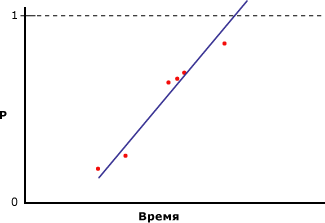
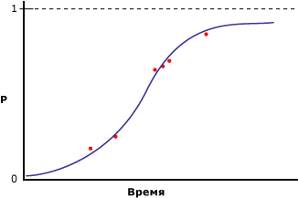

# <a name="microsoft-logistic-regression-algorithm-technical-reference"></a>Технический справочник по алгоритму логистической регрессии (Майкрософт)
[!INCLUDE[ssas-appliesto-sqlas](../../includes/ssas-appliesto-sqlas.md)][!INCLUDE[msCoName](../../includes/msconame-md.md)] Алгоритм логистической регрессии является разновидностью [!INCLUDE[msCoName](../../includes/msconame-md.md)] алгоритма нейронной сети, где *HIDDEN_NODE_RATIO* параметр имеет значение 0. Эта настройка создает модель нейронной сети, которая не содержит скрытого слоя и, таким образом, эквивалентна логистической регрессии.  
  
## <a name="implementation-of-the-microsoft-logistic-regression-algorithm"></a>Реализация алгоритма логистической регрессии (Майкрософт)  
 Предположим, что прогнозируемый столбец содержит только два состояния, но все же необходимо провести регрессионный анализ, сопоставляя входные столбцы с вероятностью того, что прогнозируемый столбец будет содержать конкретное состояние. На следующей диаграмме показаны результаты, которые будут получены, если состояниям прогнозируемого столбца присвоить значения 1 и 0, рассчитать вероятность того, что столбец будет содержать конкретное состояние, и рассчитать линейную регрессию по отношению к входной переменной.  
  
   
  
 Ось X содержит значения входного столбца. Ось Y содержит вероятности того, что прогнозируемый столбец будет в том или ином состоянии. Проблемой в этой ситуации является то, что линейная регрессия не ограничивает значения столбца значениями 0 и 1, несмотря на то что они являются минимальным и максимальным значениями этого столбца. Одним из способов решения этой проблемы является расчет логистической регрессии. Вместо создания прямой линии при логистическом регрессионном анализе создается кривая в форме латинской буквы «S», содержащая максимальное и минимальное ограничения. Например, на следующей диаграмме показаны результаты, которые будут получены при расчете логистической регрессии на основе тех же данных, которые использовались в предыдущем примере.  
  
   
  
 Заметьте, что кривая никогда не выходит за пределы выше 1 или ниже 0. Логистическую регрессию можно использовать для описания того, какие входные столбцы являются важными для определения состояния прогнозируемого столбца.  
  
### <a name="feature-selection"></a>Выбор компонентов  
 Выбор компонентов автоматически применяется всеми алгоритмами интеллектуального анализа данных служб Analysis Services для улучшения качества анализа и снижения вычислительной нагрузки. Метод выбора компонентов в моделях логистической регрессии зависит от типа данных атрибута. Поскольку логистическая регрессия основана на алгоритме нейронной сети Майкрософт, она использует подмножество методов выбора компонентов, применимых к нейронным сетям. Дополнительные сведения см. в разделе [Выбор компонентов (интеллектуальный анализ данных)](../../analysis-services/data-mining/feature-selection-data-mining.md).  
  
### <a name="scoring-inputs"></a>Количественная оценка входных данных  
 *Количественная оценка* в контексте модели нейронной сети или модели логистической регрессии представляет собой процесс преобразования величин данных в наборы значений на одной и той же шкале, чтобы их можно было сравнивать между собой. Допустим, входные значения атрибута «Доход» варьируются от 0 до 100 000, в то время как значения атрибута «Количество детей» — от 0 до 5. Процесс преобразования позволяет сравнить важность каждого входного параметра независимо от разницы между значениями.  
  
 Модель создает вход для каждого состояния, присутствующего в обучающем наборе. Для дискретных и дискретизированных входов создается дополнительный вход, представляющий отсутствие значения, если это значение хотя бы раз отсутствует в обучающем наборе. Для непрерывных входов создаются по крайней мере два входных узла: один для отсутствующих значений, если они отсутствуют в обучающих данных, и один вход для всех существующих, то есть не равных NULL, значений. Каждое входное значение масштабируется для приведения к числовому формату с помощью метода нормализации z-показателя, `(x – μ)\StdDev`.  
  
 При нормализации с помощью z-показателя значение среднего (μ) и стандартного отклонения вычисляются на основании полного обучающего набора.  
  
 **Непрерывные величины**  
  
 Значение присутствует:   `(X – μ)/σ ` (X — реальное кодируемое значение)  
  
 Значение отсутствует:    `-   μ/σ `  (отрицательное мю, разделенное на сигму)  
  
 **Дискретные значения**  
  
 `μ = p`  (первоначальная вероятность состояния)  
  
 StdDev  `= sqrt(p\(1-p))`  
  
 Значение присутствует:     `\(1 – μ)/σ` (единица минус мю, поделить на сигму)  
  
 Значение отсутствует:     `(– μ)/σ` (отрицательное мю, разделенное на сигму)  
  
### <a name="understanding-logistic-regression-coefficients"></a>Основные сведения о коэффициентах логистической регрессии  
 В литературе по статистике описываются различные методы проведения логистической регрессии, но важной частью является оценка соответствия модели. Было предложено множество критериев для определения соответствия, в том числе относительные риски и шаблоны ковариаций. Сравнение методов измерения соответствия модели выходит за рамки данного раздела; однако можно получить значения коэффициентов модели и использовать их для создания собственных критериев соответствия.  
  
> [!NOTE]  
>  Коэффициенты, созданные как часть модели логистической регрессии, не представляют собой относительных рисков и не должны интерпретироваться как таковые.  
  
 Коэффициенты для каждого узла в графе модели представляют собой взвешенную сумму входов этого узла. В модели логистической регрессии скрытый слой пуст; следовательно, существует только один набор коэффициентов, который хранится в выходных узлах. Значения коэффициентов можно определить с помощью следующего запроса:  
  
```  
SELECT FLATTENED [NODE_UNIQUE NAME],  
(SELECT ATTRIBUTE_NAME< ATTRIBUTE_VALUE  
FROM NODE_DISTRIBUTION) AS t  
FROM <model name>.CONTENT  
WHERE NODE_TYPE = 23  
```  
  
 Для каждого выходного значения этот запрос возвращает коэффициенты и идентификатор, указывающий на связанный входной узел. Запрос также возвращает строку, содержащую значение выхода и отсекаемого отрезка. У каждого входа X есть его собственный коэффициент (Ci), но вложенная таблица содержит также «свободный» коэффициент (Co), вычисляемый по следующей формуле:  
  
 `F(X) = X1*C1 + X2*C2 + … +Xn*Cn + X0`  
  
 Активация: `exp(F(X)) / (1 + exp(F(X)) )`  
  
 Дополнительные сведения см. в разделе [Примеры запросов модели логистической регрессии](../../analysis-services/data-mining/logistic-regression-model-query-examples.md).  
  
## <a name="customizing-the-logistic-regression-algorithm"></a>Настройка алгоритма логистической регрессии  
 Алгоритм логистической регрессии [!INCLUDE[msCoName](../../includes/msconame-md.md)] поддерживает несколько параметров, влияющих на поведение, производительность и точность итоговой модели интеллектуального анализа данных. Поведение модели можно также изменять, устанавливая на входных столбцах флаги моделирования  
  
### <a name="setting-algorithm-parameters"></a>Задание параметров алгоритма  
 В следующей таблице описываются параметры, которые можно использовать с алгоритмом логистической регрессии (Майкрософт).  
  
 HOLDOUT_PERCENTAGE  
 Указывает процент вариантов в составе обучающих данных, используемых для вычисления ошибки контрольных данных. Параметр HOLDOUT_PERCENTAGE используется как один из критериев остановки во время обучения модели интеллектуального анализа данных.  
  
 Значение по умолчанию равно 30.  
  
 HOLDOUT_SEED  
 Указывает значение, используемое генератором псевдослучайных чисел в качестве начального при определении контрольных данных случайным образом. Если для параметра HOLDOUT_SEED задано значение 0, то алгоритм формирует начальное значение на основе имени модели интеллектуального анализа данных, что гарантирует неизменность содержимого модели во время повторной обработки.  
  
 Значение по умолчанию равно 0.  
  
 MAXIMUM_INPUT_ATTRIBUTES  
 Определяет количество входных атрибутов, которые алгоритм может обработать перед вызовом выбора компонентов. Установите значение 0, чтобы отключить выбор компонентов.  
  
 Значение по умолчанию — 255.  
  
 MAXIMUM_OUTPUT_ATTRIBUTES  
 Определяет количество выходных атрибутов, которые алгоритм может обработать перед вызовом выбора компонентов. Установите значение 0, чтобы отключить выбор компонентов.  
  
 Значение по умолчанию — 255.  
  
 MAXIMUM_STATES  
 Указывает максимальное количество состояний атрибутов, поддерживаемое алгоритмом. Если количество состояний атрибута превышает максимально возможное количество состояний, то алгоритм использует наиболее частые состояния атрибута и пропускает остальные состояния.  
  
 Значение по умолчанию — 100.  
  
 SAMPLE_SIZE  
 Указывает количество вариантов, которые будут использоваться для обучения модели. Поставщик алгоритма использует либо это число, либо процент от суммарного количества вариантов, не включенных в процент контрольных данных, в соответствии с параметром HOLDOUT_PERCENTAGE, выбирая наименьшее из этих двух значений.  
  
 Другими словами, если значение параметра HOLDOUT_PERCENTAGE установлено равным 30, то алгоритм будет использовать либо значение этого параметра, либо значение, равное 70 процентам от общего количества вариантов — в зависимости от того, которое из двух указанных значений меньше.  
  
 Значение по умолчанию — 10 000.  
  
### <a name="modeling-flags"></a>Флаги моделирования  
 Далее перечислены флаги моделирования, которые поддерживает алгоритм логистической регрессии [!INCLUDE[msCoName](../../includes/msconame-md.md)] .  
  
 NOT NULL  
 Указывает, что столбец не может принимать значение NULL. Если во время обучения модели службы Analysis Services обнаружат значение NULL, возникнет ошибка.  
  
 Применяется к столбцам структуры интеллектуального анализа данных.  
  
 MODEL_EXISTENCE_ONLY  
 Столбец будет обрабатываться так, как будто у него два возможных состояния: **Missing** и **Existing**. NULL означает отсутствие значения.  
  
 Применяется к столбцу модели интеллектуального анализа данных.  
  
## <a name="requirements"></a>Требования  
 Модель логистической регрессии должна содержать ключевой столбец, входные столбцы и хотя бы один прогнозируемый столбец.  
  
### <a name="input-and-predictable-columns"></a>Входные и прогнозируемые столбцы  
 В следующей таблице перечислены конкретные типы содержимого входных столбцов, типы содержимого прогнозируемых столбцов и флаги моделирования, поддерживаемые алгоритмом логистической регрессии [!INCLUDE[msCoName](../../includes/msconame-md.md)] . Дополнительные сведения о значении типов содержимого в применении к модели интеллектуального анализа данных см. в разделе [Типы содержимого (интеллектуальный анализ данных)](../../analysis-services/data-mining/content-types-data-mining.md).  
  
|Столбец|Типы содержимого|  
|------------|-------------------|  
|Входной атрибут|Continuous, Discrete, Discretized, Key, Table|  
|Прогнозируемый атрибут|Continuous, Discrete, Discretized|  
  
## <a name="see-also"></a>См. также  
 [Алгоритм логистической регрессии (Майкрософт)](../../analysis-services/data-mining/microsoft-logistic-regression-algorithm.md)   
 [Примеры запросов модели линейной регрессии](../../analysis-services/data-mining/linear-regression-model-query-examples.md)   
 [Содержимое моделей интеллектуального анализа данных для моделей логистической регрессии (службы Analysis Services — интеллектуальный анализ данных)](../../analysis-services/data-mining/mining-model-content-for-logistic-regression-models.md)   
 [Алгоритм нейронной сети (Майкрософт)](../../analysis-services/data-mining/microsoft-neural-network-algorithm.md)  
  
  
