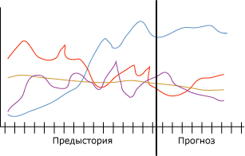

# Алгоритм временных рядов (Майкрософт)
[!INCLUDE[ssas-appliesto-sqlas](../../includes/ssas-appliesto-sqlas.md)]
Алгоритм временных рядов ( [!INCLUDE[msCoName](../../includes/msconame-md.md)] ) предоставляет несколько алгоритмов, оптимизированных для прогноза непрерывных значений, таких как продажи продуктов, во времени. В отличие от других алгоритмов [!INCLUDE[msCoName](../../includes/msconame-md.md)] , таких как деревья принятия решений, модель временных рядов не требует дополнительных столбцов новых сведений, чтобы прогнозировать тренд. С помощью модели временных рядов можно прогнозировать тенденции на основе только исходного набора данных, использованного для создания модели. При прогнозировании можно вводить в модель новые данные и автоматически задействовать их при анализе тенденций.  
  
 На примере следующей диаграммы показана типичная модель прогнозирования продаж продукта в четырех различных регионах в течение определенного времени. Модель на диаграмме отображает продажи в каждом регионе, показанные красной, желтой, сиреневой и синей линиями. Линия для каждого региона состоит из двух частей.  
  
-   Данные предыстории отображаются слева от вертикальной линии и представляют данные, используемые алгоритмом для создания модели.  
  
-   Прогнозируемые данные отображаются справа от вертикальной линии и представляют прогноз, подготовленный моделью.  
  
 Сочетание исходных данных и прогнозируемых данных называется *рядом*.  
  
   
  
 Важной характеристикой алгоритма временных рядов ( [!INCLUDE[msCoName](../../includes/msconame-md.md)] ) является его способность выполнять перекрестный прогноз. При обучении алгоритма двумя отдельными, но связанными друг с другом рядами можно использовать итоговую модель для прогнозирования исхода одного ряда на основе поведения другого ряда. Например, наблюдаемые продажи одного продукта могут оказать влияние на прогнозируемые продажи другого продукта.  Перекрестные прогнозы также полезны при создании общей модели, которую можно применить к нескольким рядам. Например, прогнозы для определенного региона нестабильны, так как в ряду недостаточно данных хорошего качества.  Общую модель можно обучить на среднем значении всех четырех регионов, а затем применить модель к отдельным рядам, чтобы подготовить более стабильные прогнозы для каждого региона.  
  
## Пример  
 Руководству компании [!INCLUDE[ssSampleDBCoFull](../../includes/sssampledbcofull-md.md)] необходим прогноз ежемесячных продаж велосипедов на следующий год. Компанию особенно интересует, можно ли использовать продажи одной модели велосипедов для прогнозирования продаж другой модели. Применив алгоритм временных рядов ( [!INCLUDE[msCoName](../../includes/msconame-md.md)] ) в отношении данных, накопленных за последние три года, компания может получить модель интеллектуального анализа данных, прогнозирующую продажи велосипедов в будущем. Кроме того, чтобы выявить связь между тенденциями продаж отдельных моделей велосипедов, компания может выполнять перекрестные прогнозы.  
  
 Каждый квартал компания планирует дополнять модель свежими данными о продажах и обновлять прогнозы, чтобы моделировать последние тенденции. Чтобы внести поправки для магазинов, которые неаккуратно или нерегулярно обновляют данные о продажах, будет создана общая модель прогнозирования для всех регионов.  
  
## Принцип работы алгоритма  
 В [!INCLUDE[ssVersion2005](../../includes/ssversion2005-md.md)]в алгоритме временных рядов ( [!INCLUDE[msCoName](../../includes/msconame-md.md)] ) использовался единственный метод ARTXP. Алгоритм ARTXP был оптимизирован для краткосрочных прогнозов, поэтому прогнозировал следующее вероятное значение в ряду. Начиная с версии [!INCLUDE[ssKatmai](../../includes/sskatmai-md.md)], к алгоритму временных рядов ( [!INCLUDE[msCoName](../../includes/msconame-md.md)] ) добавлен второй алгоритм ARIMA, который был оптимизирован для долгосрочного прогнозирования. Подробное описание реализации алгоритмов ARTXP и ARIMA см. в разделе [Технический справочник по алгоритму временных рядов (Майкрософт)](../../analysis-services/data-mining/microsoft-time-series-algorithm-technical-reference.md).  
  
 По умолчанию в алгоритме временных рядов ( [!INCLUDE[msCoName](../../includes/msconame-md.md)] ) используется комбинация алгоритмов для анализа закономерностей и подготовки прогнозов. Алгоритм обучает две отдельные модели одних и тех же данных: в одной модели используется алгоритм ARTXP, а в другой — алгоритм ARIMA. Затем алгоритм объединяет результаты обеих моделей, чтобы сформировать наилучший прогноз для переменного числа временных срезов. Алгоритм ARTXP лучше подходит для краткосрочных прогнозов, поэтому, начиная ряд прогнозов, на него следует полагаться в большей степени. Но по мере того как временные срезы, применяемые для прогнозирования, уходят все дальше в будущее, становится все более полезным алгоритм ARIMA.  
  
 Можно управлять сочетанием алгоритмов, перенося акцент во временных рядах на краткосрочный или долгосрочный прогноз. Начиная с версии [!INCLUDE[ssKatmai](../../includes/sskatmai-md.md)] Standard, можно указать, какой алгоритм используется:  
  
-   Использование только алгоритма ARTXP для краткосрочного прогнозирования.  
  
-   Использование только алгоритма ARIMA для долгосрочного прогнозирования.  
  
-   Использование сочетания двух алгоритмов (по умолчанию).  
  
 Начиная с выпуска [!INCLUDE[ssEnterpriseEd10](../../includes/ssenterpriseed10-md.md)], можно настроить способ объединения моделей прогнозирования в алгоритме временных рядов ( [!INCLUDE[msCoName](../../includes/msconame-md.md)] ). При использовании смешанной модели алгоритм временных рядов ( [!INCLUDE[msCoName](../../includes/msconame-md.md)] ) объединяет два алгоритма следующим образом.  
  
-   Для формирования двух первых прогнозов всегда используется только алгоритм ARTXP.  
  
-   После первых двух прогнозов используется сочетание алгоритмов ARIMA и ARTXP.  
  
-   С последующими шагами прогнозирования доля алгоритма ARIMA в прогнозах возрастает до полного отказа от использования ARTXP.  
  
-   Управлять моментом сочетания алгоритмов, скоростью снижения доли алгоритма ARTXP и повышения доли алгоритма ARIMA можно, изменяя параметр PREDICTION_SMOOTHING.  
  
 Оба алгоритма могут обнаруживать влияние сезонных факторов на данные на нескольких уровнях. Например, внутри годовых циклов могут существовать месячные циклы изменения данных. Чтобы определить сезонные циклы, можно ввести сведения о периодичности или указать режим автоматического обнаружения периодичности.  
  
 В дополнение к периодичности существует несколько других параметров, которые управляют поведением алгоритма временных рядов ( [!INCLUDE[msCoName](../../includes/msconame-md.md)] ) в процессе обнаружения периодичности, подготовки прогнозов или анализа вариантов. Дополнительные сведения о параметрах этого алгоритма см. в разделе [Технический справочник по алгоритму временных рядов (Майкрософт)](../../analysis-services/data-mining/microsoft-time-series-algorithm-technical-reference.md).  
  
## Данные, необходимые для моделей временных рядов  
 При подготовке данных для использования в обучении любой модели интеллектуального анализа данных необходимо понимать требования конкретной модели и способы использования данных.  
  
 В каждой модели прогнозирования должен содержаться набор вариантов, то есть столбец, указывающий срезы времени, или другой ряд, по которому происходят изменения. Например, данные в предыдущей диаграмме показывают ряд для накопленных и прогнозируемых продаж велосипедов за несколько месяцев. Для этой модели каждый регион представляет собой ряд, а столбец данных содержит временной ряд, который также является набором вариантов. В других моделях набор вариантов может быть текстовым полем или каким-нибудь идентификатором, таким как код потребителя или код транзакции. Однако модель временных рядов должна всегда использовать дату, время или другое уникальное числовое значение, такое как набор вариантов.  
  
 Требования к модели временных рядов.  
  
-   **Отдельный ключевой столбец времени** . Каждая модель должна содержать один столбец числового типа или типа date, который применяется в качестве набора вариантов, определяющего временные срезы, используемые моделью. Типом данных столбца «key time» может быть datetime или любой числовой. Однако этот столбец должен содержать непрерывные значения, которые должны быть уникальными для каждого ряда. Набор вариантов для модели временных рядов не может храниться в двух столбцах, таких как столбец «Год» или столбец «Месяц».  
  
-   **Прогнозируемый столбец** . Каждая модель должна содержать по крайней мере один прогнозируемый столбец, на основании которого алгоритм будет строить модель временных рядов. Прогнозируемый столбец должен иметь тип данных с непрерывными значениями. Например, можно прогнозировать, как изменяются со временем числовые атрибуты, такие как доход, объем продаж или температура. Однако нельзя использовать в качестве прогнозируемого столбец, содержащий дискретные значения, такие как потребительский статус или уровень образования.  
  
-   **Необязательный ключевой столбец ряда** . Каждая модель имеет дополнительный ключевой столбец, содержащий уникальные значения, идентифицирующие ряд. Этот необязательный ключевой столбец ряда должен содержать уникальные значения. Например, одна модель может содержать данные о продажах многих моделей продуктов, если существует только одна запись для каждого названия продукта в каждом временном срезе.  
  
 Входные данные для модели временных рядов ( [!INCLUDE[msCoName](../../includes/msconame-md.md)] ) можно задавать несколькими различными способами. Однако поскольку формат входных вариантов влияет на определение модели интеллектуального анализа данных, необходимо учитывать производственные требования и соответствующим образом подготовить данные. В следующих двух примерах иллюстрируется влияние входных данных на модель. В обоих примерах завершенная модель интеллектуального анализа данных содержит закономерности для четырех различных рядов.  
  
-   Продажи продукта А.  
  
-   Продажи продукта Б.  
  
-   Количество продукта А.  
  
-   Количество продукта Б.  
  
 В обоих примерах можно прогнозировать новые будущие продажи и поставки каждого продукта. Нельзя прогнозировать новые значения для продукта или времени.  
  
### Пример 1. Набор данных временного ряда со значениями ряда, представленными в виде значений столбцов  
 В этом примере используется следующая таблица входных вариантов.  
  
|TimeID|Продукт|Продажи|Volume|  
|------------|-------------|-----------|------------|  
|1/2001|Объект|1000|600|  
|2/2001|Объект|1100|500|  
|1/2001|B|500|900|  
|2/2001|B|300|890|  
  
 В столбце TimeID таблицы содержится идентификатор времени и по две записи на каждый день. Столбец TimeID становится набором вариантов. Поэтому этот столбец назначается ключевым столбцом времени для модели временных рядов.  
  
 В столбце Product определяется продукт в базе данных. Этот столбец содержит ряд продуктов. Поэтому этот столбец назначается вторым ключевым столбцом для модели временных рядов.  
  
 В столбце Sales описывается валовая прибыль от конкретного продукта за один день, а в столбце Volume описывается количество конкретного продукта, остающегося на складе. Эти два столбца содержат данные, которые будут использованы для обучения модели. Как атрибут Sales, так и атрибут Volume могут быть прогнозируемыми для каждого ряда в столбце Product.  
  
### Пример 2. Набор данных временного ряда со значениями каждого ряда в отдельном столбце  
 Входные данные в этом примере в основном те же, что и в первом примере, но структура входных данных иная, как показано в следующей таблице.  
  
|TimeID|A_Sales|A_Volume|B_Sales|B_Volume|  
|------------|--------------|---------------|--------------|---------------|  
|1/2001|1000|600|500|900|  
|2/2001|1100|500|300|890|  
  
 В этой таблице столбец TimeID по-прежнему содержит набор вариантов для модели временных рядов и назначается ключевым столбцом времени. Однако каждый из предыдущих столбцов Sales и Volume делится на два столбца, и перед каждым из них указывается наименование продукта. В результате в столбце TimeID для каждого дня существует только одна запись. В результате формируется модель временных рядов, которая содержит четыре прогнозируемых столбца: A_Sales, A_Volume, B_Sales и B_Volume.  
  
 Кроме того, поскольку продукты разделены по разным столбцам, нет необходимости указывать дополнительный ключевой столбец ряда. Каждый столбец в этой модели является столбцом набора вариантов или прогнозируемым столбцом.  
  
## Просмотр модели временных рядов  
 После обучения модели результаты хранятся в виде набора закономерностей, которые можно исследовать или делать на их основе прогнозы.  
  
 Чтобы исследовать модель, можно использовать [Средство просмотра временных рядов](../../analysis-services/data-mining/browse-a-model-using-the-microsoft-time-series-viewer.md). Это средство располагает диаграммой, которая отображает будущие прогнозы, и древовидным представлением периодических структур, присутствующих в данных.  
  
 Чтобы получить дополнительные сведения о расчете прогнозов, можно просмотреть модель в [средстве просмотра деревьев содержимого общего вида (Майкрософт)](../../analysis-services/data-mining/browse-a-model-using-the-microsoft-generic-content-tree-viewer.md). В модели хранятся периодические структуры, обнаруженные алгоритмами ARIMA и ARTXP, уравнением для объединения алгоритмов и другими статистические операциями.  
  
## Создание прогнозов временных рядов  
 По умолчанию при просмотре модели временных рядов службы [!INCLUDE[ssASnoversion](../../includes/ssasnoversion-md.md)] отображают пять прогнозов для ряда. Однако можно создать запросы, которые возвращают переменное число прогнозов, и добавить столбцы в прогнозы, чтобы получить описательные статистические данные. Дополнительные сведения о создании запросов к модели временных рядов см. в разделе [Примеры запросов моделей временных рядов](../../analysis-services/data-mining/time-series-model-query-examples.md). Примеры использования расширений интеллектуального анализа данных (DMX) для подготовки прогнозов временных рядов см. в разделе [PredictTimeSeries (расширения интеллектуального анализа данных)](../../dmx/predicttimeseries-dmx.md).  
  
 При использовании [!INCLUDE[msCoName](../../includes/msconame-md.md)]алгоритма временных рядов (Майкрософт) для составления прогнозов следует учитывать следующие дополнительные ограничения и требования.  
  
-   Перекрестное прогнозирование доступно только при использовании модели исключительно на основе алгоритма ARTXP. Перекрестное прогнозирование невозможно при использовании модели, основанной исключительно на алгоритме ARIMA.  
  
-   Прогнозы модели временных рядов могут различаться, иногда существенно, в зависимости от 64-разрядной операционной системы сервера. Эти различия возникают в связи с тем, что в системе на платформе [!INCLUDE[vcpritanium](../../includes/vcpritanium-md.md)]числовые данные, относящиеся к арифметике с плавающей запятой, представляются и обрабатываются иначе, чем в системе на платформе [!INCLUDE[vcprx64](../../includes/vcprx64-md.md)]. Поскольку результаты прогнозирования зависят от операционной системы, рекомендуется оценивать модели под управлением операционной системы, используемой в производственных условиях.  
  
## Замечания  
  
-   Не поддерживается использование языка разметки прогнозирующих моделей (PMML) для создания моделей интеллектуального анализа данных.  
  
-   Поддерживается использование моделей интеллектуального анализа OLAP.  
  
-   Не поддерживается создание измерений интеллектуального анализа данных.  
  
-   Поддерживается детализация.  
  
## См. также  
 [Алгоритмы интеллектуального анализа данных &#40; Службы Analysis Services — Интеллектуальный анализ данных &#41;](../../analysis-services/data-mining/data-mining-algorithms-analysis-services-data-mining.md)   
 [Просмотр модели в средство просмотра временных рядов](../../analysis-services/data-mining/browse-a-model-using-the-microsoft-time-series-viewer.md)   
 [Microsoft Time Series Algorithm Technical Reference](../../analysis-services/data-mining/microsoft-time-series-algorithm-technical-reference.md)   
 [Примеры запросов для модели временных рядов](../../analysis-services/data-mining/time-series-model-query-examples.md)   
 [Содержимое модели интеллектуального анализа данных для модели временных рядов &#40; Службы Analysis Services — Интеллектуальный анализ данных &#41;](../../analysis-services/data-mining/mining-model-content-for-time-series-models-analysis-services-data-mining.md)  
  
  
