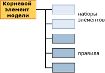

# Содержимое моделей интеллектуального анализа данных для моделей взаимосвязей (службы Analysis Services — интеллектуальный анализ данных)
[!INCLUDE[ssas-appliesto-sqlas](../../includes/ssas-appliesto-sqlas.md)]
  В этой статье описано содержимое модели интеллектуального анализа данных, характерное для моделей, в которых используется алгоритм правил взаимосвязей [!INCLUDE[msCoName](../../includes/msconame-md.md)] . Описание общей и статистической терминологии, связанной с содержимым модели интеллектуального анализа данных, областью применения которого являются модели всех типов, см. в статье [Содержимое модели интеллектуального анализа данных (службы Analysis Services — интеллектуальный анализ данных)](../../analysis-services/data-mining/mining-model-content-analysis-services-data-mining.md).  
  
## Основные сведения о структуре модели взаимосвязей  
 Модель взаимосвязей имеет простую структуру. Каждая модель имеет единственный родительский узел, который представляет модель и ее метаданные, а каждый родительский узел включает плоский список наборов элементов и правил. Наборы элементов и правила не организованы в виде деревьев, а упорядочены так, что вначале представлены наборы элементов, а за ними следуют правила, как показано в следующей диаграмме.  
  
   
  
 Каждый набор элементов содержится в своем собственном узле (NODE_TYPE = 7). Этот *узел* включает определение набора элементов, данные о количестве вариантов, содержащих этот набор элементов, и другую информацию.  
  
 Каждое правило также содержится в своем собственном узле (NODE_TYPE = 8). *Правило* описывает общий шаблон, который показывает, как устанавливаются связи между элементами. Правило внешне выглядит как инструкция IF-THEN. Левая часть правила показывает существующее условие или набор условий. Правая часть правила показывает элемент в конкретном наборе данных, который обычно связан с условиями в левой части.  
  
 **Примечание.** Если есть необходимость извлечь либо правила, либо наборы элементов, можно воспользоваться запросом, который возвращает только узлы требуемого типа. Дополнительные сведения см. в статье [Примеры запросов моделей взаимосвязей](../../analysis-services/data-mining/association-model-query-examples.md).  
  
## Содержимое модели для модели взаимосвязей  
 В этом разделе приведены подробные сведения и примеры, относящиеся только к тем столбцам в содержимом модели интеллектуального анализа данных, которые являются значимыми для моделей взаимосвязей.  
  
 Сведения о столбцах общего назначения MODEL_CATALOG, MODEL_NAME и других в наборе строк схемы см. в разделе [Содержимое модели интеллектуального анализа данных (службы Analysis Services — интеллектуальный анализ данных)](../../analysis-services/data-mining/mining-model-content-analysis-services-data-mining.md).  
  
 MODEL_CATALOG  
 Имя базы данных, в которой хранится модель.  
  
 MODEL_NAME  
 Имя модели.  
  
 ATTRIBUTE_NAME  
 Имена атрибутов, соответствующих этому узлу.  
  
 NODE_NAME  
 Имя узла. Применительно к модели взаимосвязей этот столбец совпадает с NODE_UNIQUE_NAME.  
  
 NODE_UNIQUE_NAME  
 Уникальное имя узла.  
  
 NODE_TYPE  
 Модель взаимосвязей выводит узлы только следующих типов.  
  
|Идентификатор типа узла|Тип|  
|------------------|----------|  
|1 (модель)|Корневой или родительский узел.|  
|7 (набор элементов)|Набор элементов или коллекция пар «атрибут-значение». Примеры:   `Product 1 = Existing, Product 2 = Existing`   либо   `Gender = Male`.|  
|8 (правило)|Правило, определяющее то, как связаны элементы друг с другом.   Пример   `Product 1 = Existing, Product 2 = Existing -> Product 3 = Existing`.|  
  
 NODE_CAPTION  
 Метка или заголовок, связанный с узлом.  
  
 **Узел набора элементов** . Список элементов с разделителями-запятыми.  
  
 **Узел правила** . Содержит левую и правую части правила.  
  
 CHILDREN_CARDINALITY  
 Указывает количество дочерних узлов текущего узла.  
  
 **Родительский узел** Указывает общее количество наборов элементов и правил.  
  
> [!NOTE]  
>  Чтобы узнать, чему равно отдельно взятое количество наборов элементов и правил, можно просмотреть атрибут NODE_DESCRIPTION, относящийся к корневому узлу модели.  
  
 **Узел правила или набора элементов** Всегда 0.  
  
 PARENT_UNIQUE_NAME  
 Уникальное имя родителя узла.  
  
 **Родительский узел** Всегда имеет значение NULL.  
  
 **Узел правила или набора элементов** Всегда 0.  
  
 NODE_DESCRIPTION  
 Понятное описание содержимого узла.  
  
 **Родительский узел** . Включает список с разделителями-запятыми, содержащий следующую информацию о модели:  
  
|Элемент|Описание|  
|----------|-----------------|  
|ITEMSET_COUNT|Количество всех наборов элементов в модели.|  
|RULE_COUNT|Количество всех правил в модели.|  
|MIN_SUPPORT|Минимальное несущее множество, обнаруженное для любого отдельно взятого набора элементов.   **Примечание.** Это значение может отличаться от значения, заданного для параметра *MINIMUM_SUPPORT* .|  
|MAX_SUPPORT|Максимальное несущее множество, обнаруженное для любого отдельно взятого набора элементов.   **Примечание.** Это значение может отличаться от значения, заданного для параметра *MAXIMUM_SUPPORT* .|  
|MIN_ITEMSET_SIZE|Размер наименьшего набора элементов, выраженный количеством элементов.   Значение 0 указывает, что состояние **Missing** рассматривалось как независимый элемент.   **Примечание.** По умолчанию параметр *MINIMUM_ITEMSET_SIZE* имеет значение 1.|  
|MAX_ITEMSET_SIZE|Размер самого крупного найденного набора элементов.   **Примечание.** Это значение ограничивается значением, которое было установлено для параметра *MAX_ITEMSET_SIZE* при создании модели. Оно не может превысить это значение, но может быть меньше. Значение по умолчанию равно 3.|  
|MIN_PROBABILITY|Минимальная вероятность, обнаруженная для любого отдельно взятого набора элементов или правила в модели.   Пример: 0,400390625   **Примечание.** Применительно к наборам элементов это значение всегда больше значения, установленного для параметра *MINIMUM_PROBABILITY* при создании модели.|  
|MAX_PROBABILITY|Максимальная вероятность, обнаруженная для любого отдельно взятого набора элементов или правила в модели.   Пример: 1   **Примечание.** Этот параметр не предназначен для ограничения максимальной вероятности наборов элементов. Если требуется исключить элементы, которые встречаются слишком часто, используйте параметр *MAXIMUM_SUPPORT* .|  
|MIN_LIFT|Минимальная величина точности предсказания, предоставляемая моделью для любого набора элементов.   Пример: 0,14309369632511   Примечание. Знание минимальной точности предсказания позволяет определить, является ли точность предсказания для любого отдельно взятого набора элементов значимой.|  
|MAX_LIFT|Максимальная величина точности предсказания, предоставляемая моделью для любого набора элементов.   Пример: 1,95758227647523 **Примечание.** Знание максимальной точности предсказания позволяет определить, является ли точность прогноза для любого отдельно взятого набора элементов значимой.|  
  
 **Узел набора элементов** . Узлы набора элементов содержат список элементов, отображаемый в виде текстовой строки с разделителями-запятыми.  
  
 Пример  
  
 `Touring Tire = Existing, Water Bottle = Existing`  
  
 Это означает, что шины для туристического велосипеда и фляги для воды были приобретены вместе.  
  
 **Узел правила** . Узлы правила содержат левую и правую части правила, разделенные стрелкой.  
  
 Пример `Touring Tire = Existing, Water Bottle = Existing -> Cycling cap = Existing`  
  
 Это означает, что если некто купил шину для туристического велосипеда и флягу для воды, то, скорее всего, он купит и велосипедную шапочку.  
  
 NODE_RULE  
 Фрагмент XML-кода, который описывает правило или набор элементов, внедренный в узел.  
  
 **Родительский узел** Пусто.  
  
 **Узел набора элементов** Пусто.  
  
 **Узел правила** . Фрагмент XML-кода, который включает дополнительную полезную информацию о правиле, такую как несущее множество, достоверность и количество элементов, а также идентификатор узла, который представляет левую часть правила.  
  
 MARGINAL_RULE  
 Пусто.  
  
 NODE_PROBABILITY  
 Вероятность или оценка достоверности, связанная с набором элементов или правилом.  
  
 **Родительский узел** Всегда 0.  
  
 **Узел набора элементов** Вероятность набора элементов.  
  
 **Узел правила** Показатель достоверности для правила.  
  
 MARGINAL_PROBABILITY  
 То же, что и NODE_PROBABILITY.  
  
 NODE_DISTRIBUTION  
 Таблица содержит данные, различающиеся в зависимости от того, является ли узел набором элементов или правилом.  
  
 **Родительский узел** Пусто.  
  
 **Узел набора элементов** Содержит перечень всех элементов в наборе элементов наряду со значением вероятности и значением несущего множества. Например, если набор элементов включает два продукта, то в перечень входит название каждого продукта и количество вариантов, включающих продукт.  
  
 **Узел правила** Содержит две строки. Первая строка показывает атрибут из правой части правила, представляющий собой прогнозируемый элемент, и оценку достоверности.  
  
 Вторая строка является уникальной для моделей взаимосвязей; она содержит указатель на набор элементов в правой части правила. Этот указатель представлен в столбце ATTRIBUTE_VALUE как идентификатор набора элементов, который содержит только правый элемент.  
  
 Например, если правилом является `If {A,B} Then {C}`, то таблица содержит имя элемента `{C}`и идентификатор узла, содержащего набор элементов для элемента C.  
  
 Этот указатель является полезным, поскольку позволяет определить на основе узла набора элементов, сколько всего вариантов включают продукт из правой части. Варианты, подчиняющиеся правилу `If {A,B} Then {C}` , представляют собой подмножество вариантов, перечисленных в наборе элементов для `{C}`.  
  
 NODE_SUPPORT  
 Число вариантов, поддерживаемое этим узлом.  
  
 **Родительский узел** Количество вариантов в модели.  
  
 **Узел набора элементов** Количество вариантов, которые содержат все элементы из набора элементов.  
  
 **Узел правила** Количество вариантов, которые содержат все элементы, включенные в правило.  
  
 MSOLAP_MODEL_COLUMN  
 Содержит различную информацию, зависящую от того, является ли узел набором элементов или правилом.  
  
 **Родительский узел** Пусто.  
  
 **Узел набора элементов** Пусто.  
  
 **Узел правила** . Идентификатор набора элементов, который содержит элементы из левой части правила. Например, если правилом является `If {A,B} Then {C}`, то данный столбец содержит идентификатор набора элементов, содержащего только `{A,B}`.  
  
 MSOLAP_NODE_SCORE  
 **Родительский узел** Пусто.  
  
 **Узел набора элементов** Оценка важности для набора элементов.  
  
 **Узел правила** Оценка важности для правила.  
  
> [!NOTE]  
>  Важность рассчитывается по-разному для наборов элементов и правил. Дополнительные сведения см. в разделе [Технический справочник по алгоритму взаимосвязей (Майкрософт)](../../analysis-services/data-mining/microsoft-association-algorithm-technical-reference.md).  
  
 MSOLAP_NODE_SHORT_CAPTION  
 Пусто.  
  
## См. также  
 [Содержимое модели интеллектуального анализа данных & #40; Службы Analysis Services — Интеллектуальный анализ данных & #41;](../../analysis-services/data-mining/mining-model-content-analysis-services-data-mining.md)   
 [Алгоритм взаимосвязей (Майкрософт)](../../analysis-services/data-mining/microsoft-association-algorithm.md)   
 [Примеры запросов к модели взаимосвязей](../../analysis-services/data-mining/association-model-query-examples.md)  
  
  
