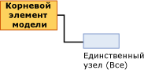

# Содержимое моделей интеллектуального анализа данных для моделей линейной регрессии (службы Analysis Services — интеллектуальный анализ данных)
  В этом разделе описано содержимое модели интеллектуального анализа данных, характерное для моделей, в которых используется алгоритм линейной регрессии [!INCLUDE[msCoName](../../includes/msconame-md.md)] . Общее описание содержимого модели интеллектуального анализа данных для всех типов моделей см. в разделе [Содержимое модели интеллектуального анализа данных (службы Analysis Services — интеллектуальный анализ данных)](../../analysis-services/data-mining/mining-model-content-analysis-services-data-mining.md).  
  
## Основные сведения о структуре модели линейной регрессии  
 Модель линейной регрессии имеет чрезвычайно простую структуру. Каждая модель имеет единственный родительский узел, который представляет модель и ее метаданные, и узел дерева регрессии (NODE_TYPE = 25), который содержит формулу регрессии для каждого прогнозируемого атрибута.  
  
   
  
 Модели линейной регрессии используют тот же алгоритм, что и деревья принятия решений [!INCLUDE[msCoName](../../includes/msconame-md.md)] , но для определения границ дерева используются другие параметры, а в качестве входных данных принимаются только непрерывные атрибуты. Однако модели линейной регрессии основаны на алгоритме дерева принятия решений [!INCLUDE[msCoName](../../includes/msconame-md.md)] , и поэтому модели линейной регрессии отображаются с помощью средства просмотра для деревьев принятия решений [!INCLUDE[msCoName](../../includes/msconame-md.md)] . Дополнительные сведения см. в разделе [Просмотр модели с помощью средства просмотра деревьев (Майкрософт)](../../analysis-services/data-mining/browse-a-model-using-the-microsoft-tree-viewer.md).  
  
 В следующем разделе показано, как интерпретировать сведения в узле формулы регрессии. Эти данные применяются не только к моделям линейной регрессии, но и к моделям дерева принятия решений, содержащих регрессии на участках дерева.  
  
## Содержимое для модели линейной регрессии  
 В этом разделе представлено подробное описание с примерами только для тех столбцов модели интеллектуального анализа данных, которые имеют отношение к линейной регрессии.  
  
 Сведения о столбцах общего назначения в наборе строк схемы см. в разделе [Содержимое модели интеллектуального анализа данных (службы Analysis Services — интеллектуальный анализ данных)](../../analysis-services/data-mining/mining-model-content-analysis-services-data-mining.md).  
  
 MODEL_CATALOG  
 Имя базы данных, в которой хранится модель.  
  
 MODEL_NAME  
 Имя модели.  
  
 ATTRIBUTE_NAME  
 **Корневой узел:** Пусто  
  
 **Узел регрессии:** Имя прогнозируемого атрибута.  
  
 NODE_NAME  
 Всегда совпадает с NODE_UNIQUE_NAME.  
  
 NODE_UNIQUE_NAME  
 Уникальный идентификатор узла в модели. Это значение невозможно изменить.  
  
 NODE_TYPE  
 Выходными данными модели линейной регрессии являются узлы следующих типов.  
  
|Идентификатор типа узла|Тип|Description|  
|------------------|----------|-----------------|  
|25|Корневой элемент дерева регрессии|Содержит формулу, описывающую связь между входной и выходной переменной.|  
  
 NODE_CAPTION  
 Метка или заголовок, связанный с узлом. Этой свойство используется главным образом для отображения.  
  
 **Корневой узел:** Пусто  
  
 **Узел регрессии:** Все.  
  
 CHILDREN_CARDINALITY  
 Оценка количества дочерних узлов, которые имеет данный узел.  
  
 **Корневой узел:** Показывает количество узлов регрессии. Для каждого прогнозируемого атрибута в модели создается один узел регрессии.  
  
 **Узел регрессии:** Значение всегда равно 0.  
  
 PARENT_UNIQUE_NAME  
 Уникальное имя родителя узла. Для любых узлов на корневом уровне возвращается значение NULL.  
  
 NODE_DESCRIPTION  
 Описание узла.  
  
 **Корневой узел:** Пусто  
  
 **Узел регрессии:** Все.  
  
 NODE_RULE  
 Не используется для моделей линейной регрессии.  
  
 MARGINAL_RULE  
 Не используется для моделей линейной регрессии.  
  
 NODE_PROBABILITY  
 Вероятность, связанная с этим узлом.  
  
 **Корневой узел:** 0  
  
 **Узел регрессии:** 1  
  
 MARGINAL_PROBABILITY  
 Вероятность доступа к узлу от родительского узла.  
  
 **Корневой узел:** 0  
  
 **Узел регрессии:** 1  
  
 NODE_DISTRIBUTION  
 Вложенная таблица, содержащая статистику о значениях в узле.  
  
 **Корневой узел:** 0  
  
 **Узел регрессии:** Таблица, содержащая элементы, которые используются для построения формулы регрессии. Узел регрессии содержит следующие типы значения.  
  
|VALUETYPE|  
|---------------|  
|1 (отсутствует)|  
|3 (непрерывный)|  
|7 (коэффициент)|  
|8 (рост оценки)|  
|9 (статистика)|  
|11 (отсекаемый отрезок)|  
  
 NODE_SUPPORT  
 Число вариантов, поддерживаемое этим узлом.  
  
 **Корневой узел:** 0  
  
 **Узел регрессии:** Число обучающих вариантов.  
  
 MSOLAP_MODEL_COLUMN  
 Имя прогнозируемого атрибута.  
  
 MSOLAP_NODE_SCORE  
 Совпадает с NODE_PROBABILITY  
  
 MSOLAP_NODE_SHORT_CAPTION  
 Метка, используемая для отображения.  
  
## Замечания  
 Когда модель создается по алгоритму линейной регрессии [!INCLUDE[msCoName](../../includes/msconame-md.md)] , подсистема интеллектуального анализа данных создает специальный экземпляр модели дерева принятия решений и передает параметры, которые ограничивают дерево так, что все обучающие данные хранятся в одном узле. Все непрерывные входные данные помечаются флагами и рассматриваются как потенциальные регрессоры, но в конечной модели регрессорами остаются только те, которые подходят для обрабатываемых данных. В результате анализа получается либо одна формула регрессии для каждого регрессора, либо ни одной формулы регрессии.  
  
 Полную формулу регрессии можно просмотреть в окне **Условные обозначения интеллектуального анализа данных**, если щелкнуть узел **(Все)** в [средстве просмотра деревьев (Майкрософт)](../../analysis-services/data-mining/browse-a-model-using-the-microsoft-tree-viewer.md).  
  
 Кроме того, если создается модель дерева принятия решений, включающая непрерывный прогнозируемый атрибут, иногда в дереве появляются узлы регрессии, обладающие свойствами узлов дерева регрессии.  
  
##   Распределение узлов для непрерывных атрибутов  
 Большинство важных сведений в узле регрессии содержится в таблице NODE_DISTRIBUTION. В следующем примере показан макет таблицы NODE_DISTRIBUTION. В этом примере структура интеллектуального анализа данных «Прямая почтовая рассылка» используется для создания модели линейной регрессии, которая прогнозирует доход клиента на основе возраста. Модель приводится исключительно в демонстрационных целях, поскольку ее легко можно построить, используя существующие образцы данных и структуры интеллектуального анализа данных [!INCLUDE[ssSampleDBnormal](../../includes/sssampledbnormal-md.md)] .  
  
|ATTRIBUTE_NAME|ATTRIBUTE_VALUE|SUPPORT|PROBABILITY|VARIANCE|VALUETYPE|  
|---------------------|----------------------|-------------|-----------------|--------------|---------------|  
|Годовой доход|Missing|0|0,000457142857142857|0|1|  
|Годовой доход|57220,8876687257|17484|0,999542857142857|1041275619,52776|3|  
|Возраст|471,687717702463|0|0|126.969442359327|7|  
|Возраст|234,680904692439|0|0|0|8|  
|Возраст|45,4269617936399|0|0|126.969442359327|9|  
||35793,5477381267|0|0|1012968919,28372|11|  
  
 Таблица NODE_DISTRIBUTION содержит несколько строк, каждая из которых сгруппирована по переменной. Первые две строки всегда имеют типы значения 1 и 3. Эти строки описывают целевой атрибут. Последующие строки содержат сведения о формуле для какого-либо *регрессора*. Регрессор — это входная переменная, которая линейно связана с выходной переменной. Можно создать несколько регрессоров, и в каждом регрессоре будет отдельная строка для коэффициента (VALUETYPE = 7), роста оценки (VALUETYPE = 8) и статистики (VALUETYPE = 9). Наконец, в таблице присутствует строка, содержащая отсекаемый отрезок формулы (VALUETYPE = 11).  
  
### Элементы формулы регрессии  
 Вложенная таблица NODE_DISTRIBUTION содержит каждый элемент формулы регрессии в отдельной строке. Первые две строки данных в примере результатов содержат сведения о прогнозируемом атрибуте **Yearly Income**, который моделирует зависимую переменную. Столбец SUPPORT показывает число вариантов, входящих в несущее множество двух состояний этого атрибута: либо значение **Годовой доход** было доступно, либо значение **Годовой доход** отсутствовало.  
  
 Столбец VARIANCE показывает вычисленную дисперсию прогнозируемого атрибута. *Дисперсия* является показателем разброса значений в выборке при заданном ожидаемом распределении. Здесь дисперсия вычисляется как средний квадрат отклонения от среднего значения. Квадратный корень из дисперсии также называется стандартным отклонением. [!INCLUDE[ssASnoversion](../../includes/ssasnoversion-md.md)] не вычисляют стандартное отклонение автоматически, но его легко рассчитать вручную.  
  
 Для каждого регрессора выводится три строки. Они содержат коэффициент, рост оценки и статистику регрессора.  
  
 Наконец, таблица содержит строку с отсекаемым отрезком формулы.  
  
#### Coefficient  
 Для каждого регрессора вычисляется коэффициент (VALUETYPE = 7). Сам коэффициент отображается в столбце ATTRIBUTE_VALUE, а столбец VARIANCE показывает дисперсию коэффициента. Коэффициенты вычисляются так, чтобы максимально увеличить линейность.  
  
#### Рост оценки  
 Рост оценки (VALUETYPE = 8) для каждого регрессора представляет оценку интересности атрибута. Это значение можно использовать, чтобы оценить полезность нескольких регрессоров.  
  
#### Statistics  
 Статистика регрессора (VALUETYPE = 9) является средним значением атрибута среди вариантов, имеющих значение. Столбец ATTRIBUTE_VALUE содержит собственно среднее значение, а столбец VARIANCE содержит сумму отклонений от среднего значения.  
  
#### Intercept  
 Обычно *отсекаемый отрезок* (VALUETYPE = 11) или *остаток* в уравнении регрессии показывает значение прогнозируемого атрибута в точке, где входной атрибут имеет значение 0. Во многих случаях такая ситуация не может возникнуть и выполнение условия равенства входного атрибута нулю может привести к нелогичным результатам.  
  
 Например, в модели, которая прогнозирует доход на основе возраста, будет бесполезно задавать доход для клиента с возрастом 0. В реальных условиях более разумным будет выяснить поведение линии в отношении средних значений. Поэтому службы [!INCLUDE[ssNoVersion](../../includes/ssnoversion-md.md)] [!INCLUDE[ssASnoversion](../../includes/ssasnoversion-md.md)] изменяют отсекаемый отрезок так, чтобы каждый регрессор выражался относительно среднего значения.  
  
 Эту поправку трудно заметить в содержимом модели интеллектуального анализа данных, но она становится очевидной, если просмотреть полную формулу в окне **Обозначения интеллектуального анализа данных** **средства просмотра деревьев (Майкрософт)**. Формула регрессии сдвигается от точки 0 к точке, представляющей среднее значение. В результате образуется представление, лучше сочетающееся с текущими данными.  
  
 Тогда, полагая средний возраст около 45, получим, что отсекаемый отрезок (VALUETYPE = 11) формулы регрессии показывает средний доход.  
  
## См. также  
 [Содержимое модели интеллектуального анализа данных (службы Analysis Services — интеллектуальный анализ данных)](../../analysis-services/data-mining/mining-model-content-analysis-services-data-mining.md)   
 [Алгоритм линейной регрессии (Майкрософт)](../../analysis-services/data-mining/microsoft-linear-regression-algorithm.md)   
 [Технический справочник по алгоритму линейной регрессии Майкрософт](../../analysis-services/data-mining/microsoft-linear-regression-algorithm-technical-reference.md)   
 [Примеры запросов модели линейной регрессии](../../analysis-services/data-mining/linear-regression-model-query-examples.md)  
  
  
