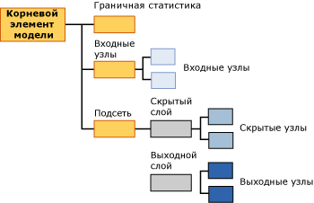

# Содержимое моделей интеллектуального анализа данных для моделей нейронных сетей (службы Analysis Services — интеллектуальный анализ данных)
  В этом разделе приведено описание содержимого модели интеллектуального анализа данных, характерного для моделей, в которых используется алгоритм нейронной сети (Майкрософт). Объяснение способов интерпретации статистики и описание структуры, общей для всех типов моделей, а также общие определения терминов, связанных с содержимым моделей интеллектуального анализа данных, см. в разделе [Содержимое модели интеллектуального анализа данных (службы Analysis Services — интеллектуальный анализ данных)](../../analysis-services/data-mining/mining-model-content-analysis-services-data-mining.md).  
  
## Основные сведения о структуре модели нейронной сети  
 Каждая нейронная сеть имеет один родительский узел, представляющий модель и ее метаданные, а также узел граничной статистики (NODE_TYPE = 24), который содержит описательную статистику о входных атрибутах. Узел граничной статистики полезен, поскольку содержит сводные данные о входных атрибутах, что устраняет необходимость запрашивать данные из отдельных узлов.  
  
 Под этими двумя узлами расположено не менее двух других узлов. Всего узлов может быть значительно больше, в зависимости от количества прогнозируемых атрибутов в модели.  
  
-   Первый узел (NODE_TYPE = 18) всегда представляет верхний узел входного слоя. Под этим верхним узлом находятся входные узлы (NODE_TYPE = 21), которые содержат фактические входные атрибуты и их значения.  
  
-   В каждом из последующих узлов содержится отдельная *подсеть* (NODE_TYPE = 17). Каждая подсеть всегда содержит собственный скрытый слой (NODE_TYPE = 19) и выходной слой (NODE_TYPE = 20).  
  
   
  
 Данные входного слоя имеют простую организацию: верхний узел для каждого входного слоя (NODE_TYPE = 18) служит средством организации коллекции входных узлов (NODE_TYPE = 21). Содержимое входных узлов описано в следующей таблице.  
  
 Каждая подсеть (NODE_TYPE = 17) представляет анализ влияния входного слоя на отдельный прогнозируемый атрибут. Если существует несколько прогнозируемых выходов, будет создано несколько подсетей. Скрытый слой для каждой подсети содержит несколько скрытых узлов (NODE_TYPE = 22), в которых содержатся данные о весовых коэффициентах для каждого перехода, завершающегося в данном скрытом узле.  
  
 Выходной слой (NODE_TYPE = 20) содержит выходные узлы (NODE_TYPE = 23), в каждом из которых находятся уникальные значения прогнозируемого атрибута. Если прогнозируемый атрибут имеет непрерывный числовой тип данных, то для него будет только один выходной узел.  
  
> [!NOTE]  
>  Алгоритм логистической регрессии использует особый вариант нейронной сети, в котором существует только один прогнозируемый выход и потенциально множество входов. В логистической регрессии не используется скрытый слой.  
  
 Просмотреть структуру входов и подсетей проще всего с помощью **средства просмотра деревьев содержимого общего вида (Майкрософт)**. Можно щелкнуть любой узел, чтобы развернуть его и просмотреть дочерние узлы или отобразить весовые коэффициенты и другие статистические данные, содержащиеся в узле.  
  
 Для работы с данными и демонстрации корреляции между входами и выходами модели используется **средство просмотра нейронных сетей (Майкрософт)**. С помощью этого средства просмотра можно применить фильтр по входным атрибутам и их значениям, чтобы получить графическое представление об их влиянии на выходы. Подсказки в средстве просмотра покажут вероятность и точность, связанные с каждой парой входных и выходных значений. Дополнительные сведения см. в разделе [Просмотр модели с помощью средства просмотра нейронных сетей (Майкрософт)](../../analysis-services/data-mining/browse-a-model-using-the-microsoft-neural-network-viewer.md).  
  
## Содержимое для модели нейронной сети  
 В этом разделе представлено подробное описание с примерами только для тех столбцов модели интеллектуального анализа данных, которые имеют отношение к нейронным сетям. Сведения о столбцах общего назначения в наборе строк схемы, таких как MODEL_CATALOG и MODEL_NAME, которые здесь не рассмотрены, а также объяснение терминологии моделей интеллектуального анализа данных см. в разделе [Содержимое модели интеллектуального анализа данных (службы Analysis Services — интеллектуальный анализ данных)](../../analysis-services/data-mining/mining-model-content-analysis-services-data-mining.md).  
  
 MODEL_CATALOG  
 Имя базы данных, в которой хранится модель.  
  
 MODEL_NAME  
 Имя модели.  
  
 ATTRIBUTE_NAME  
 Имена атрибутов, соответствующих этому узлу.  
  
|Узел|Содержимое|  
|----------|-------------|  
|Корневой элемент модели|Пусто|  
|Граничная статистика|Пусто|  
|Входной слой|Пусто|  
|Входной узел|Имя входного атрибута|  
|скрытый слой|Пусто|  
|Скрытый узел|Пусто|  
|Выходной слой|Пусто|  
|Выходной узел|Имя выходного атрибута|  
  
 NODE_NAME  
 Имя узла. Этот столбец содержит те же значения, что и NODE_UNIQUE_NAME.  
  
 NODE_UNIQUE_NAME  
 Уникальное имя узла.  
  
 Дополнительные сведения о структурных данных о модели, содержащихся в именах и идентификаторах, см. в разделе [Использование имен и идентификаторов узлов](#bkmk_NodeIDs).  
  
 NODE_TYPE  
 Выходными данными модели нейронной сети могут быть узлы следующих типов.  
  
|Идентификатор типа узла|Description|  
|------------------|-----------------|  
|1|Модель.|  
|17|Узел-организатор подсети.|  
|18|Узел-организатор входного слоя.|  
|19|Узел-организатор скрытого слоя.|  
|20|Узел-организатор выходного слоя.|  
|21|Узел входного атрибута.|  
|22|Узел скрытого слоя|  
|23|Узел выходного атрибута.|  
|24|Узел граничной статистики.|  
  
 NODE_CAPTION  
 Метка или заголовок, связанный с узлом. В моделях нейронных сетей всегда пусто.  
  
 CHILDREN_CARDINALITY  
 Оценка количества дочерних узлов, которые имеет данный узел.  
  
|Узел|Содержимое|  
|----------|-------------|  
|Корневой элемент модели|Показывает число дочерних узлов, куда входят по крайней мере 1 сеть, 1 необходимый граничный узел и 1 необходимый входной слой. Например, если значение равно 5, то существуют 3 подсети.|  
|Граничная статистика|Всегда равно 0.|  
|Входной слой|Показывает число пар «входной атрибут-значение», использованных моделью.|  
|Входной узел|Всегда равно 0.|  
|скрытый слой|Показывает число скрытых узлов, созданных моделью.|  
|Скрытый узел|Всегда равно 0.|  
|Выходной слой|Показывает число выходных значений.|  
|Выходной узел|Всегда равно 0.|  
  
 PARENT_UNIQUE_NAME  
 Уникальное имя родителя узла. Для любых узлов на корневом уровне возвращается значение NULL.  
  
 Дополнительные сведения о структурных данных о модели, содержащихся в именах и идентификаторах, см. в разделе [Использование имен и идентификаторов узлов](#bkmk_NodeIDs).  
  
 NODE_DESCRIPTION  
 Понятное описание узла.  
  
|Узел|Содержимое|  
|----------|-------------|  
|Корневой элемент модели|Пусто|  
|Граничная статистика|Пусто|  
|Входной слой|Пусто|  
|Входной узел|Имя входного атрибута|  
|скрытый слой|Пусто|  
|Скрытый узел|Целое число, соответствующее порядковому номеру скрытого узла в списке скрытых узлов.|  
|Выходной слой|Пусто|  
|Выходной узел|Если выходной атрибут является непрерывным, этот узел содержит имя выходного атрибута.   Если выходной атрибут является дискретным или дискретизированным, этот узел содержит имя и значение атрибута.|  
  
 NODE_RULE  
 XML-описание правила, внедренного в узел.  
  
|Узел|Содержимое|  
|----------|-------------|  
|Корневой элемент модели|Пусто|  
|Граничная статистика|Пусто|  
|Входной слой|Пусто|  
|Входной узел|Фрагмент XML-кода, содержащего те же сведения, что и столбец NODE_DESCRIPTION.|  
|скрытый слой|Пусто|  
|Скрытый узел|Целое число, соответствующее порядковому номеру скрытого узла в списке скрытых узлов.|  
|Выходной слой|Пусто|  
|Выходной узел|Фрагмент XML-кода, содержащего те же сведения, что и столбец NODE_DESCRIPTION.|  
  
 MARGINAL_RULE  
 В моделях нейронных сетей всегда пусто.  
  
 NODE_PROBABILITY  
 Вероятность, связанная с этим узлом. В моделях нейронных сетей значение всегда равно 0.  
  
 MARGINAL_PROBABILITY  
 Вероятность доступа к узлу от родительского узла. В моделях нейронных сетей значение всегда равно 0.  
  
 NODE_DISTRIBUTION  
 Вложенная таблица, содержащая статистические данные для узла. Подробные сведения о содержимом этой таблицы для каждого типа узла см. в разделе [Основные сведения о таблице NODE_DISTRIBUTION](#bkmk_NodeDistTable).  
  
 NODE_SUPPORT  
 В моделях нейронных сетей значение всегда равно 0.  
  
> [!NOTE]  
>  Вероятность несущего множества всегда равна 0, поскольку выход этой модели не является вероятностным. Для алгоритма значимыми являются только весовые коэффициенты, и поэтому алгоритм не вычисляет вероятность, несущее множество и дисперсию.  
  
 Сведения о несущем множестве в обучающих вариантах для определенных значений см. в узле граничной статистики.  
  
 MSOLAP_MODEL_COLUMN  
 |Узел|Содержимое|  
|----------|-------------|  
|Корневой элемент модели|Пусто|  
|Граничная статистика|Пусто|  
|Входной слой|Пусто|  
|Входной узел|Имя входного атрибута.|  
|скрытый слой|Пусто|  
|Скрытый узел|Пусто|  
|Выходной слой|Пусто|  
|Выходной узел|Имя входного атрибута.|  
  
 MSOLAP_NODE_SCORE  
 В моделях нейронных сетей значение всегда равно 0.  
  
 MSOLAP_NODE_SHORT_CAPTION  
 В моделях нейронных сетей всегда пусто.  
  
## Замечания  
 Задачей обучения модели нейронной сети является определение весовых коэффициентов, связанных с каждым переходом от входа к промежуточной точке и от промежуточной точки к конечной точке. Поэтому входной слой модели предназначен главным образом для хранения фактических значений, использованных для построения модели. Скрытый слой хранит вычисленные весовые коэффициенты и содержит указатели на входные атрибуты. Выходной узел хранит прогнозируемые значения и также содержит указатели на промежуточные точки в скрытом узле.  
  
##   Использование имен и идентификаторов узлов  
 Система имен узлов в нейронной сети передает дополнительные данные о типе узла, что упрощает поиск связи между скрытым слоем и входным слоем, а также между выходным слоем и скрытым слоем. В следующей таблице показаны стандартные идентификаторы, назначаемые узлам в каждом слое.  
  
|Тип узла|Стандартный идентификатор узла|  
|---------------|----------------------------|  
|Корневой элемент модели (1)|00000000000000000.|  
|Узел граничной статистики (24)|10000000000000000|  
|Входной слой (18)|30000000000000000|  
|Входной узел (21)|Начинается с 60000000000000000|  
|Подсеть (17)|20000000000000000|  
|Скрытый слой (19)|40000000000000000|  
|Скрытый узел (22)|Начинается с 70000000000000000|  
|Выходной слой (20)|50000000000000000|  
|Выходной узел (23)|Начинается с 80000000000000000|  
  
 Можно определить, какие выходные атрибуты связаны с выбранным узлом скрытого слоя, если просмотреть таблицу NODE_DISTRIBUTION в скрытом узле (NODE_TYPE = 22). Каждая строка таблицы NODE_DISTRIBUTION содержит идентификатор узла входного атрибута.  
  
 Аналогично можно определить, какие скрытые слои связаны с выходным атрибутом, если просмотреть таблицу NODE_DISTRIBUTION в выходном узле (NODE_TYPE = 23). Каждая строка таблицы NODE_DISTRIBUTION содержит идентификатор узла скрытого слоя, а также связанный с нм коэффициент.  
  
##   Интерпретация данных в таблице NODE_DISTRIBUTION  
 В некоторых узлах таблица NODE_DISTRIBUTION может быть пустой. Однако для входных узлов, узлов скрытого слоя и выходных узлов таблица NODE_DISTRIBUTION хранит важные и содержательные сведения о модели. Чтобы упростить толкование этих сведений, таблица NODE_DISTRIBUTION содержит столбец VALUETYPE для каждой строки, где говорится, является ли значение в столбце ATTRIBUTE_VALUE дискретным (4), дискретизированным (5) или непрерывным (3).  
  
### Входные узлы  
 Входной слой содержит один узел для каждого значения атрибута, используемого в модели.  
  
 **Дискретный атрибут.** Входной узел хранит только имя атрибута и его значение в столбцах ATTRIBUTE_NAME и ATTRIBUTE_VALUE. Например, если столбец называется [Рабочая смена], то для каждого значения столбца, которое используется в модели, такого как AM и PM, создается отдельный узел. В таблице NODE_DISTRIBUTION для каждого узла приводится только текущее значение атрибута.  
  
 **Дискретизированный числовой атрибут.** Входной узел хранит имя атрибута и его значение, которое может быть диапазоном или отдельным значением. Все значения представляются выражениями, например «77.4 - 87.4» или «< 64.0» для значения атрибута [Time Per Issue]. В таблице NODE_DISTRIBUTION для каждого узла приводится только текущее значение атрибута.  
  
 **Непрерывный атрибут.** Входной узел хранит среднее значение атрибута. В таблице NODE_DISTRIBUTION для каждого узла приводится только текущее значение атрибута.  
  
### Узлы скрытого слоя  
 Скрытый слой содержит переменное число узлов. В каждом узле таблица NODE_DISTRIBUTION содержит сопоставления элементов скрытого слоя с узлами во входном слое. Столбец ATTRIBUTE_NAME содержит идентификатор узла, который соответствует узлу во входном слое. Столбец ATTRIBUTE_VALUE содержит весовой коэффициент, связанный с этим сочетанием входного узла и узла скрытого слоя. Последняя строка таблицы содержит весовой коэффициент этого скрытого узла в скрытом слое.  
  
### Выходные узлы  
 Выходной слой содержит один выходной узел для каждого выходного значения, использованного в модели. В каждом узле таблица NODE_DISTRIBUTION содержит сопоставления элементов выходного слоя с узлами в скрытом слое. Столбец ATTRIBUTE_NAME содержит идентификатор узла, который соответствует узлу в скрытом слое. Столбец ATTRIBUTE_VALUE содержит весовой коэффициент, связанный с этим сочетанием выходного узла и узла скрытого слоя.  
  
 Таблица NODE_DISTRIBUTION содержит следующие дополнительные сведения в зависимости от типа атрибута.  
  
 **Дискретный атрибут.** Последние две строки таблицы NODE_DISTRIBUTION содержат коэффициент для узла в целом и текущее значение атрибута.  
  
 **Дискретизированный числовой атрибут.** Аналогично дискретным атрибутам за исключением того, что значением атрибута является диапазон значений.  
  
 **Непрерывный атрибут.** Последние две строки таблицы NODE_DISTRIBUTION содержат среднее значение атрибута, коэффициент для узла в целом и дисперсию коэффициента.  
  
## См. также  
 [Алгоритм нейронной сети (Майкрософт)](../../analysis-services/data-mining/microsoft-neural-network-algorithm.md)   
 [Технический справочник по алгоритму нейронной сети (Майкрософт)](../../analysis-services/data-mining/microsoft-neural-network-algorithm-technical-reference.md)   
 [Примеры запросов к модели нейронной сети](../../analysis-services/data-mining/neural-network-model-query-examples.md)  
  
  
