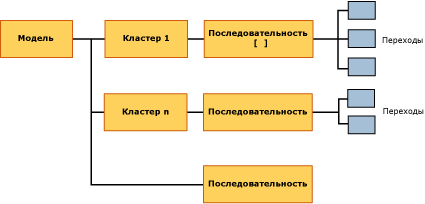

# <a name="mining-model-content-for-sequence-clustering-models"></a>Содержимое моделей интеллектуального анализа данных для моделей кластеризации последовательностей
  В этом разделе приведено описание содержимого модели интеллектуального анализа данных, характерного для моделей, в которых используется алгоритм кластеризации последовательностей (Майкрософт). Описание общей и статистической терминологии, связанной с содержимым модели интеллектуального анализа данных, областью применения которого являются модели всех типов, см. в статье [Содержимое модели интеллектуального анализа данных (службы Analysis Services — интеллектуальный анализ данных)](../../analysis-services/data-mining/mining-model-content-analysis-services-data-mining.md).  
  
## <a name="understanding-the-structure-of-a-sequence-clustering-model"></a>Основные сведения о структуре модели кластеризации последовательностей  
 Модель кластеризации последовательностей содержит один родительский узел (NODE_TYPE = 1), представляющий модель и ее метаданные. С родительским узлом, помеченным **(Все)**, связан узел последовательности (NODE_TYPE = 13), в котором перечислены все переходы, обнаруженные в обучающих данных.  
  
   
  
 Алгоритм также создает несколько кластеров на основе переходов, обнаруженных в данных, и любых других входных атрибутов, включенных во время создания модели, таких как демографические данные клиентов и т. д. Каждый кластер (NODE_TYPE = 5) содержит собственный узел последовательности (NODE_TYPE = 13), где приведены только переходы, использованные для создания этого кластера. Можно выполнить детализацию углублением от узла последовательности, чтобы просмотреть данные отдельных переходов между состояниями (NODE_TYPE = 14).  
  
 Описание переходов последовательностей и состояний с примерами см. в разделе [Microsoft Sequence Clustering Algorithm](../../analysis-services/data-mining/microsoft-sequence-clustering-algorithm.md).  
  
## <a name="model-content-for-a-sequence-clustering-model"></a>Содержимое для модели кластеризации последовательностей  
 В этом разделе приводятся дополнительные сведения о столбцах в содержимом модели интеллектуального анализа данных, которые относятся к кластеризации последовательностей.  
  
 MODEL_CATALOG  
 Имя базы данных, в которой хранится модель.  
  
 MODEL_NAME  
 Имя модели.  
  
 ATTRIBUTE_NAME  
 Всегда пусто.  
  
 NODE_NAME  
 Тип узла. В настоящий момент значение совпадает с NODE_UNIQUE_NAME.  
  
 NODE_UNIQUE_NAME  
 Уникальное имя узла.  
  
 NODE_TYPE  
 Выходными данными модели кластеризации последовательностей являются узлы следующих типов.  
  
|Идентификатор типа узла|Description|  
|------------------|-----------------|  
|1 (модель)|Корневой узел для модели|  
|5 (кластер)|Содержит число переходов в кластере, список атрибутов и статистику, которая описывает значения в кластере.|  
|13 (последовательность)|Содержит список переходов, входящих в кластер.|  
|14 (переход)|Описывает последовательность событий в виде таблицы, первая строка которой содержит начальное состояние, а все остальные строки — последующие состояния, а также статистику по несущему множеству и вероятности.|  
  
 NODE_GUID  
 Пусто.  
  
 NODE_CAPTION  
 Метка или заголовок, связанный с узлом. Используется в целях отображения.  
  
 Во время работы с моделью можно переименовать заголовки кластеров. Однако после закрытия модели новое имя не сохраняется.  
  
 CHILDREN_CARDINALITY  
 Оценка количества дочерних узлов, которые имеет данный узел.  
  
 **Корневой элемент модели** Количество элементов равно количеству кластеров плюс один. Дополнительные сведения см. в разделе [Количество элементов](#bkmk_cardinality).  
  
 **Узлы кластера** Количество элементов всегда равно 1, поскольку каждый кластер имеет единственный дочерний узел, в котором содержится список последовательностей в кластере.  
  
 **Узлы последовательности** Количество элементов равно количеству переходов, входящих в данный кластер. Например, количество элементов узла последовательности для корневого элемента модели показывает, сколько переходов было обнаружено во всей модели.  
  
 PARENT_UNIQUE_NAME  
 Уникальное имя родителя узла.  
  
 Для любых узлов на корневом уровне возвращается значение NULL.  
  
 NODE_DESCRIPTION  
 Совпадает с заголовком узла.  
  
 NODE_RULE  
 Всегда пусто.  
  
 MARGINAL_RULE  
 Всегда пусто.  
  
 NODE_PROBABILITY  
 **Корневой элемент модели** Значение всегда равно 0.  
  
 **Узла кластера** Скорректированное значение вероятности кластера в модели. Сумма скорректированных вероятностей не составляет 1, поскольку метод кластеризации, применяемый в кластеризации последовательностей, допускает частичное включение в несколько кластеров.  
  
 **Узлы последовательности** Значение всегда равно 0.  
  
 **Узлы переходов** Значение всегда равно 0.  
  
 MARGINAL_PROBABILITY  
 **Корневой элемент модели** Значение всегда равно 0.  
  
 **Узлы кластера** Значение совпадает с NODE_PROBABILITY.  
  
 **Узлы последовательности** Значение всегда равно 0.  
  
 **Узлы переходов** Значение всегда равно 0.  
  
 NODE_DISTRIBUTION  
 Таблица, содержащая значения вероятности и другие сведения. Дополнительные сведения см. в разделе [Таблица NODE_DISTRIBUTION](#bkmk_NODEDIST).  
  
 NODE_SUPPORT  
 Количество переходов, входящих в несущее множество этого узла. Таким образом, если в обучающих данных находится 30 примеров последовательности «Продукт А, за которым следует продукт Б», то общее несущее множество составляет 30 переходов.  
  
 **Корневой элемент модели** Общее число переходов в модели.  
  
 **Узлы кластера** Исходное несущее множество для кластера, равное числу обучающих вариантов, из которых образован этот кластер.  
  
 **Узлы последовательности** Значение всегда равно 0.  
  
 **Узлы перехода** Процент вариантов в кластере, представляющих отдельный переход. Может быть значением, большим или равным 0. Вычисляется путем умножения исходного несущего множества для узла кластера на вероятность этого кластера.  
  
 По этому значению можно сказать, сколько обучающих вариантов использовано в переходе.  
  
 MSOLAP_MODEL_COLUMN  
 Неприменимо.  
  
 MSOLAP_NODE_SCORE  
 Неприменимо.  
  
 MSOLAP_NODE_SHORT_CAPTION  
 Значение совпадает с NODE_DESCRIPTION.  
  
## <a name="understanding-sequences-states-and-transitions"></a>Основные сведения о последовательностях, состояниях и переходах.  
 Модель кластеризации последовательностей обладает уникальной структурой, в которой сочетаются два рода объектов с весьма различными типами данных: кластеры и переходы между состояниями.  
  
 Кластеры, создаваемые кластеризацией последовательностей, аналогичны кластерам, создаваемым алгоритмом кластеризации (Майкрософт). Каждый кластер имеет профиль и набор характеристик. Однако в кластеризации последовательностей каждый кластер дополнительно содержит единичный дочерний узел, где перечислены последовательности в данном кластере. Каждый узел последовательности содержит несколько дочерних узлов, которые подробно описывают переходы между состояниями с указанием вероятностей.  
  
 В модели почти всегда находится больше последовательностей, чем можно обнаружить в любом отдельном варианте, поскольку последовательности могут следовать друг за другом. Службы Microsoft Analysis Services сохраняют указатели с одного состояния на другое, чтобы можно было подсчитать число раз, которое случается каждый переход. Также можно найти сведения о количестве раз, когда встречалась последовательность, и вычислить вероятность ее появления по сравнению с полным набором наблюдаемых состояний.  
  
 В следующей таблице показано, как сведения хранятся в модели и как связаны узлы.  
  
|Узел|Имеет дочерний узел|Таблица NODE_DISTRIBUTION|  
|----------|--------------------|------------------------------|  
|Корневой элемент модели|Несколько узлов кластера<br /><br /> Узел с последовательностями для всей модели|Перечислены все продукты в модели с указанием несущего множества и вероятности.<br /><br /> Поскольку метод кластеризации допускает частичное включение в несколько кластеров, несущее множество и вероятность могут иметь дробные значения. Это значит, что каждый отдельный вариант учитывается не строго один раз, а потенциально может принадлежать нескольким кластерам. Поэтому, когда определяется участие варианта в конечном кластере, значение корректируется на величину, равную вероятности этого кластера.|  
|Узел последовательности для модели|Несколько узлов переходов|Перечислены все продукты в модели с указанием несущего множества и вероятности.<br /><br /> Поскольку для модели известно число последовательностей, на этом уровне вычисления несущего множества и вероятности проводятся просто:<br /><br /> <br /><br /> несущее множество равно числу вариантов;<br /><br /> вероятность равна исходной вероятности каждой последовательности в модели. Сумма всех вероятностей должна составлять 1.|  
|Отдельные узлы кластера|Узел с последовательностями, относящимися только к этому кластеру|Перечислены все продукты в кластере, но приведены значения несущего множества и вероятности только для продуктов, являющихся характеристиками этого кластера.<br /><br /> Несущее множество представляет скорректированное значение несущего множества для каждого варианта в этом кластере. Значения вероятности являются скорректированными.|  
|Узлы последовательности для отдельных кластеров|Несколько узлов с переходами только для последовательностей, входящих в данный кластер|Точно те же данные, что и в отдельных узлах кластера.|  
|Переходы|Нет дочерних узлов|Перечислены переходы для первого связанного состояния.<br /><br /> Несущее множество имеет скорректированное значение, равное числу вариантов, которые участвуют в каждом переходе. Значение вероятности является скорректированным и представляется в виде процентного отношения.|  
  
###  <a name="bkmk_NODEDIST"></a> Таблица NODE_DISTRIBUTION  
 В таблице NODE_DISTRIBUTION приведены подробные сведения о вероятности и несущем множестве для переходов и последовательностей в определенном кластере.  
  
 В таблицу переходов всегда добавляется отдельная строка, представляющая возможные значения **Missing** . Сведения о том, на что указывает значение **Missing** и как оно влияет на вычисления, см. в разделе [Отсутствующие значения (службы Analysis Services — интеллектуальный анализ данных)](../../analysis-services/data-mining/missing-values-analysis-services-data-mining.md).  
  
 Вычисления несущего множества и вероятности проводятся по-разному в зависимости от того, применяется ли вычисление к обучающим вариантам или к законченной модели. Это происходит из-за того, что используемый по умолчанию метод кластеризации — максимизация ожидания (EM) — предполагает, что любой вариант может принадлежать нескольким кластерам. Во время вычисления несущего множества для вариантов в модели можно использовать исходные, нескорректированные значения числа вариантов и вероятности. Однако вероятность для любой заданной последовательности в кластере необходимо разделить на сумму всех возможных сочетаний последовательностей и кластеров.  
  
###  <a name="bkmk_cardinality"></a> Количество элементов  
 В модели кластеризации количество элементов родительского узла обычно показывает, сколько кластеров находится в модели. Однако в модели кластеризации последовательностей на уровне кластеров существуют узлы двух типов: узлы первого типа содержат кластеры, а второго — список последовательностей модели в целом.  
  
 Таким образом, чтобы узнать количество кластеров в модели, нужно взять значение NODE_CARDINALITY для узла (Все) и вычесть единицу. Например, если модель образовала 9 кластеров, количество элементов в корневом узле модели будет равно 10. В модели содержатся 9 узлов кластера, каждый из которых обладает собственным узлом последовательностей, и один дополнительный узел последовательностей с меткой кластера 10, который представляет последовательности для модели в целом.  
  
## <a name="walkthrough-of-structure"></a>Пошаговое руководство по структуре  
 Пример может прояснить принципы хранения данных и их возможной интерпретации. Например, самый крупный заказ, которому соответствует самая длинная наблюдаемая цепочка в базовых данных [!INCLUDE[ssSampleDBDWobject](../../includes/sssampledbdwobject-md.md)] , можно найти, используя следующий запрос:  
  
```  
USE AdventureWorksDW2012  
SELECT DISTINCT OrderNumber, Count(*)  
FROM vAssocSeqLineItems  
GROUP BY OrderNumber  
ORDER BY Count(*) DESC  
```  
  
 По этим результатам видно, что заказы с номерами SO72656, SO58845 и SO70714 содержат самые крупные последовательности, по восемь элементов в каждой. Используя идентификаторы заказов, можно просмотреть данные конкретного заказа, чтобы увидеть, какие товары были приобретены и в каком порядке.  
  
|OrderNumber|LineNumber|Модель|  
|-----------------|----------------|-----------|  
|SO58845|1|Mountain-500|  
|SO58845|2|Шина LL Mountain|  
|SO58845|3|Камера шины для велосипеда Mountain|  
|SO58845|4|Набор крыльев для велосипеда Mountain|  
|SO58845|5|Держатель фляги для велосипеда Mountain|  
|SO58845|6|Фляга для воды|  
|SO58845|7|Sport-100|  
|SO58845|8|Кофта с длинными рукавами и эмблемой|  
  
 Однако некоторые клиенты, купившие велосипед Mountain-500, могли приобрести разные товары. Чтобы просмотреть все товары, следующие за велосипедом Mountain-500, можно просмотреть список последовательностей в модели. Далее приведены пошаговые инструкции по просмотру этих последовательностей с помощью двух средств просмотра, доступных в службах [!INCLUDE[ssASnoversion](../../includes/ssasnoversion-md.md)].  
  
#### <a name="to-view-related-sequences-by-using-the-sequence-clustering-viewer"></a>Просмотр связанных последовательностей с помощью средства просмотра кластеризации последовательностей  
  
1.  В обозревателе объектов щелкните модель [Sequence Clustering] правой кнопкой мыши и выберите пункт «Обзор»  
  
2.  В средстве просмотра кластеризации последовательностей щелкните вкладку **Переходы состояния** .  
  
3.  В раскрывающемся списке **Кластер** должен быть выбран пункт **Заполнение (все)** .  
  
4.  Переместите ползунок в левой области панели наверх, чтобы отобразить все ссылки.  
  
5.  Щелкните на диаграмме узел **Mountain-500**.  
  
6.  Выделенные линии указывают на следующие состояния (товары, которые были приобретены после велосипеда Mountain-500), а числа показывают вероятности переходов. Сравните эти значения с результатами в средстве просмотра содержимого моделей общего вида.  
  
#### <a name="to-view-related-sequences-by-using-the-generic-model-content-viewer"></a>Просмотр связанных последовательностей с помощью средства просмотра содержимого моделей общего вида  
  
1.  В обозревателе объектов щелкните модель [Sequence Clustering] правой кнопкой мыши и выберите пункт «Обзор»  
  
2.  В раскрывающемся списке для средства просмотра выберите пункт **Средство просмотра деревьев содержимого общего вида (Майкрософт)**.  
  
3.  На панели **Заголовок узла** щелкните узел с именем **Уровень последовательности для кластера 16**.  
  
4.  Найдите строку NODE_DISTRIBUTION на панели сведений об узле и щелкните в любом месте вложенной таблицы.  
  
     Верхняя строка всегда отводится под значение Missing. Эта строка соответствует состоянию последовательности 0.  
  
5.  Нажмите клавишу СТРЕЛКА ВНИЗ или используйте полосы прокрутки, чтобы прокрутить вложенную таблицу до строки Mountain-500.  
  
     Эта строка соответствуют состоянию последовательности 20.  
  
    > [!NOTE]  
    >  Номер строки для определенной последовательности можно получить программным образом, но во время обычного просмотра может оказаться удобнее просто скопировать вложенную таблицу в книгу Excel.  
  
6.  Вернитесь к панели «Заголовок узла» и разверните узел **Уровень последовательности для кластера 16**, если он еще не развернут.  
  
7.  Найдите среди его дочерних узлов **Строка перехода для состояния последовательности 20**. Щелкните этот узел.  
  
8.  Вложенная таблица NODE_DISTRIBUTION содержит следующие товары и вероятности. Сравните их с результатами на вкладке **Переходы состояния** в средстве просмотра кластеризации последовательностей.  
  
 В следующей таблице показаны результаты из таблицы NODE_DISTRIBUTION с указанием округленных значений вероятности, которые отображаются в графическом средстве просмотра.  
  
|Продукт|Несущее множество (таблица NODE_DISTRIBUTION)|Вероятность (таблица NODE_DISTRIBUTION)|Вероятность (по графику)|  
|-------------|------------------------------------------|------------------------------------------------|--------------------------------|  
|Missing|48,447887|0,138028169|(не показано)|  
|Велосипедная шапочка|10,876056|0,030985915|0,03|  
|Набор крыльев для велосипеда Mountain|80,087324|0,228169014|0,23|  
|Half-Finger Gloves|0,9887324|0,002816901|0,00|  
|Hydration Pack|0,9887324|0,002816901|0,00|  
|Шина LL Mountain|51,414085|0,146478873|0,15|  
|Кофта с длинными рукавами и эмблемой|2,9661972|0,008450704|0,01|  
|Держатель фляги для велосипеда Mountain|87,997183|0,250704225|0,25|  
|Камера шины для велосипеда Mountain|16,808451|0,047887324|0,05|  
|Short-Sleeve Classic Jersey|10,876056|0,030985915|0,03|  
|Sport-100|20,76338|0,05915493|0,06|  
|Фляга для воды|18,785915|0,053521127|0,25|  
  
 Вариант, первоначально выбранный из обучающих данных, содержал товар «Mountain-500», за которым следовал товар «LL Mountain Tire», но можно видеть, что существует множество других возможных последовательностей. Чтобы найти подробные данные для конкретного кластера, необходимо повторить процесс детализации углублением от списка последовательностей в кластере до фактических переходов для каждого состояния или товара.  
  
 От последовательности, указанной в каком-либо кластере, можно сразу перейти к строке перехода. По этой строке перехода можно определить, какой товар будет следующим, а потом вернуться к этому товару в списке последовательностей. Повторяя этот процесс для каждой пары состояний в переходе, можно передвигаться по длинным цепочкам состояний.  
  
## <a name="using-sequence-information"></a>Использование сведений о последовательностях  
 Распространенным сценарием для алгоритма кластеризации последовательностей является отслеживание щелчков мыши пользователя на веб-сайте. Например, если данные получены из записей о покупках, совершенных на веб-сайте электронной коммерции Adventure Works, с помощью результирующей модели кластеризации последовательностей можно выявить закономерности в поведении пользователей, изменить структуру узла электронной коммерции, чтобы устранить проблемы навигации или увеличить продажи.  
  
 Например, анализ может показать, что пользователи, независимо от демографических параметров, всегда следуют вдоль определенной цепочки товаров. Кроме того, может обнаружиться, что пользователи часто выходят с сайта, после того как щелкнут определенный товар. С учетом этого факта можно задаться вопросом — какие дополнительные пути навигации можно предложить пользователям, чтобы побудить их остаться на веб-сайте?  
  
 Если нет дополнительных данных, по которым можно классифицировать пользователей, то можно просто использовать сведения о последовательностях для сбора данных о навигации, чтобы лучше представлять себе общую картину использования веб-узла. Однако если можно собрать сведения о клиентах и сопоставить их с базой данных клиентов, можно объединить возможности кластеризации с прогнозами, основанными на последовательностях, чтобы выработать рекомендации, привязанные к отдельным пользователям. Также возможно построить рекомендации на основе пути навигации, ведущего к текущей странице.  
  
 Другим использованием обширных данных по состояниям и переходам, обрабатываемых моделью кластеризации, является определение возможных путей, которые никогда не используются. Например, если на страницах 1—4 зарегистрировано множество посетителей, но никто из них никогда не переходил на страницу 5, разумно проверить наличие возможных проблем, препятствующих переходу на страницу 5. Это можно сделать, запросив содержимое модели и сравнив результат со списком возможных путей.  Графики, которые показывают все пути навигации по сайту, можно создать программным образом или с помощью разнообразных средств анализа веб-сайтов.  
  
 Сведения о том, как получить список наблюдаемых путей с помощью запроса содержимого модели, а также другие примеры запросов, основанных на модели кластеризации последовательностей, см. в разделе [Примеры запросов к модели кластеризации последовательностей](../../analysis-services/data-mining/sequence-clustering-model-query-examples.md).  
  
## <a name="see-also"></a>См. также  
 [Содержимое модели интеллектуального анализа данных (службы Analysis Services — интеллектуальный анализ данных)](../../analysis-services/data-mining/mining-model-content-analysis-services-data-mining.md)   
 [Microsoft Sequence Clustering Algorithm](../../analysis-services/data-mining/microsoft-sequence-clustering-algorithm.md)   
 [Примеры запросов к модели кластеризации последовательностей](../../analysis-services/data-mining/sequence-clustering-model-query-examples.md)  
  
  
