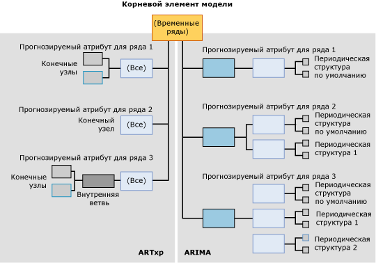

# <a name="mining-model-content-for-time-series-models-analysis-services---data-mining"></a>Содержимое модели интеллектуального анализа данных для моделей временных рядов (службы Analysis Services — интеллектуальный анализ данных)
[!INCLUDE[ssas-appliesto-sqlas](../../includes/ssas-appliesto-sqlas.md)]
  Во всех моделях интеллектуального анализа данных для хранения содержимого применяется одинаковая структура. Эта структура определяется в соответствии с набором строк схемы для содержимого интеллектуального анализа данных. Однако в пределах такой стандартной структуры узлы, содержащие данные, располагаются различным образом, образуя деревья различного типа. В этом разделе описываются правила упорядочения узлов и значение каждого узла в моделях интеллектуального анализа данных, основанных на алгоритме временных рядов [!INCLUDE[msCoName](../../includes/msconame-md.md)] .  
  
 Описание общего содержимого модели интеллектуального анализа данных, областью применения которого являются модели всех типов, см. в статье [Содержимое модели интеллектуального анализа данных (службы Analysis Services — интеллектуальный анализ данных)](../../analysis-services/data-mining/mining-model-content-analysis-services-data-mining.md).  
  
 Во время чтения этого раздела будет полезно просматривать содержимое реальной модели временных рядов. Модель временных рядов можно создать, выполнив задания учебника по основам интеллектуального анализа данных. По учебнику создается модель смешанного типа, в которой обучение выполняется и по алгоритму ARIMA, и по алгоритму ARTXP. Дополнительные сведения о просмотре содержимого модели интеллектуального анализа данных см. в разделе [Средства просмотра моделей интеллектуального анализа данных](../../analysis-services/data-mining/data-mining-model-viewers.md).  
  
## <a name="understanding-the-structure-of-a-time-series-model"></a>Основные сведения о структуре модели временных рядов  
 Модель временных рядов содержит один родительский узел, представляющий модель и ее метаданные. Под этим родительским узлом расположено одно или два дерева временных рядов, в зависимости от алгоритма, по которому создавалась модель.  
  
 Если создать модель смешанного типа, в модели будут два отдельных дерева: одно для алгоритма ARIMA и одно — для ARTXP. Если выбрать для использования только алгоритм ARTXP или только алгоритм ARIMA, в модели будет одно дерево, соответствующее этому алгоритму. Используемый алгоритм задается в параметре FORECAST_METHOD. Дополнительные сведения о выборе между использованием алгоритма ARTXP, ARIMA или смешанной модели см. в разделе [Алгоритм временных рядов (Майкрософт)](../../analysis-services/data-mining/microsoft-time-series-algorithm.md).  
  
 На следующей диаграмме показан пример модели интеллектуального анализа данных на основе временных рядов, созданной с параметрами по умолчанию (смешанный режим). В левой части диаграммы показана модель ARTXP, а в правой — модель ARIMA. Это повышает наглядность изучения различий между моделями.  Модель ARTXP имеет древовидную структуру, последовательно разбивающуюся на ветви меньшего и меньшего размера, а структура, создаваемая алгоритмом ARIMA, больше напоминает пирамиду, выстраиваемую вверх от более мелких компонентов к более крупным.  
  
   
  
 Важно помнить, что данные в деревьях ARIMA и ARTXP выстраиваются по совершенно разным законам, и эти деревья следует рассматривать как связанные только в корневом узле. Два типа представления данных используются в одной модели для повышения удобства, однако с ними следует работать так, как если бы это были две независимые модели. Модель ARTXP представляет реально существующую древовидную структуру, в отличие от модели ARIMA.  
  
 Во время просмотра смешанной модели, в которой используются оба алгоритма (ARIMA и ARTXP) с помощью средства просмотра деревьев содержимого общего вида (Майкрософт) узлы в моделях ARTXP и ARIMA представляются в качестве дочерних узлов родительской модели временных рядов. Однако их можно легко отличить друг от друга по меткам, которыми обозначены узлы.  
  
-   Первый набор узлов помечается меткой (All) и представляет результаты анализа, проводимого алгоритмом ARTXP.  
  
-   Второй набор узлов помечается меткой ARIMA и представляет результаты анализа, проводимого алгоритмом ARIMA.  
  
> [!WARNING]  
>  Имя (All) в дереве ARTXP сохраняется только для обеспечения обратной совместимости. В версиях, предшествующих SQL Server 2008, в алгоритме временных рядов для анализа применялся только алгоритм ARTXP.  
  
 В следующих разделах объясняется, как узлы располагаются внутри каждого из этих типов моделей.  
  
### <a name="structure-of-an-artxp-model"></a>Структура модели ARTXP  
 Алгоритм ARTXP создает модель, близкую к модели, создаваемой по алгоритму дерева принятия решений. Он группирует прогнозируемые атрибуты и разбивает их, когда обнаруживаются существенные различия. Таким образом, в каждой модели ARTXP для каждого прогнозируемого атрибута присутствует отдельная ветвь. Например, в учебнике по основам интеллектуального анализа данных создается модель, прогнозирующая объем продаж для нескольких регионов. В этом случае **[Amount]** является прогнозируемым атрибутом и для каждого региона создается отдельная ветвь. Если в модель входит два прогнозируемых атрибута, например **[Amount]** и **[Quantity]**, то для каждого сочетания атрибута и региона создается отдельная ветвь.  
  
 Верхний узел ветви ARTXP содержит те же данные, что и корневой узел дерева принятия решений. К таким данным относятся число потомков для узла (CHILDREN_CARDINALITY), число вариантов, входящих в несущее множество узла (NODE_SUPPORT), а также разнообразные описательные статистические данные (NODE_DISTRIBUTION).  
  
 Если узел не имеет потомков, это значит, что не были обнаружены важные условия, ради которых было бы разумно разделять варианты на группы большего уровня вложенности. В этом случае ветвь завершается и узел без потомков называется *конечным узлом*. Конечный узел содержит атрибуты, коэффициенты и значения, из которых строится формула ARTXP.  
  
 Подобно модели дерева принятия решений, в некоторых ветвях могут существовать дополнительные разбиения. Например, ветвь дерева, представляющая продажи для Европейского региона, разбивается на две ветви. Разделение выполняется в случае, когда существует условие, по которому две группы значительно различаются. Родительский узел содержит имя атрибута, вызвавшего разбиение, например [Amount], и количество вариантов в родительском узле. В листовых узлах содержатся более подробные данные: значение атрибута, например [Sales] > 10 000 и [Sales] < 10 000, число вариантов, удовлетворяющих каждому условию, и формула ARTXP.  
  
> [!NOTE]  
>  Чтобы просмотреть формулы, полную формулу регрессии следует искать на уровне конечных узлов, а не на промежуточных уровнях и не в корневом узле.  
  
### <a name="structure-of-an-arima-model"></a>Структура модели ARIMA  
 Алгоритм ARIMA создает единый фрагмент данных для каждого сочетания ряда данных (например, **[Region]**) и прогнозируемого атрибута (например, **[Sales Amount]**) — формула, описывающая изменение прогнозируемого атрибута с течением времени.  
  
 Формула для каждого ряда образуется из нескольких компонентов, по одному на каждую периодическую структуру, обнаруженную в данных. Например, в данных, собранных на ежемесячной основе, алгоритм может обнаружить структуры с периодичностью в месяц, квартал или год.  
  
 Для каждой обнаруженной периодической структуры алгоритм выводит отдельное множество родительских и дочерних узлов. Периодичность по умолчанию равна 1, используется для единичного временного среза и автоматически добавляется во все модели. Можно задать возможные периодические структуры, указав несколько значений в параметре PERIODICITY_HINT. Однако алгоритм не будет выводить результаты в соответствии с указаниями, если не будет обнаружена периодическая структура.  
  
 Каждая периодическая структура, выводимая в содержимом модели интеллектуального анализа данных, содержит следующие узлы-компоненты:  
  
-   Узел для *порядка авторегрессии* (AR)  
  
-   Узел для *скользящего среднего* (MA)  
  
 Значения этих терминов см. в разделе [Алгоритм временных рядов (Майкрософт)](../../analysis-services/data-mining/microsoft-time-series-algorithm.md).  
  
 Важной частью формулы является *разностный порядок* , представленный в уравнении. Дополнительные сведения об использовании разностного порядка см. в разделе [Microsoft Time Series Algorithm Technical Reference](../../analysis-services/data-mining/microsoft-time-series-algorithm-technical-reference.md).  
  
## <a name="model-content-for-time-series"></a>Содержимое моделей для временных рядов  
 В этом разделе представлено подробное описание с примерами только для тех столбцов модели интеллектуального анализа данных, которые имеют отношение к моделям временных рядов.  
  
 Сведения о столбцах общего назначения в наборе строк схемы, таких как MODEL_CATALOG и MODEL_NAME, а также объяснение терминологии моделей интеллектуального анализа данных см. в разделе [Содержимое модели интеллектуального анализа данных (службы Analysis Services — интеллектуальный анализ данных)](../../analysis-services/data-mining/mining-model-content-analysis-services-data-mining.md).  
  
 MODEL_CATALOG  
 Имя базы данных, в которой хранится модель.  
  
 MODEL_NAME  
 Имя модели.  
  
 ATTRIBUTE_NAME  
 Прогнозируемый атрибут для ряда данных, представленного в узле. (Это значение совпадает с MSOLAP_MODEL_COLUMN.)  
  
 NODE_NAME  
 Тип узла.  
  
 В текущей версии этот столбец содержит то же значение, что и NODE_UNIQUE_NAME, но такое соответствие может измениться в следующих версиях.  
  
 NODE_UNIQUE_NAME  
 Уникальное имя узла. Родительский узел модели всегда имеет имя **TS**.  
  
 **ARTXP** . Каждый узел обозначается символами TS, за которыми следует шестнадцатеричное числовое значение. Порядок узлов не играет роли.  
  
 Например, узлы ARTXP, расположенные непосредственно под деревом TS, могут иметь номера TS00000001–TS0000000b.  
  
 **ARIMA** . Каждый узел в дереве ARIMA обозначается символами TA, за которыми следует шестнадцатеричное числовое значение. Дочерние узлы содержат уникальное имя родительского узла, за которым следует другое шестнадцатеричное число, указывающее последовательность в пределах узла.  
  
 Все деревья ARIMA имеют совершенно одинаковую структуру. Узлы и соглашения об именах, содержащиеся в каждом узле, представлены в следующей таблице.  
  
|Идентификатор и тип узла ARIMA|Пример имени узла|  
|----------------------------|--------------------------|  
|Корневой узел ARIMA (27)|TA0000000b|  
|Периодическая структура ARIMA (28)|TA0000000b00000000|  
|ARIMA с авторегрессией (29)|TA0000000b000000000|  
|Скользящее среднее ARIMA (30)|TA0000000b000000001|  
  
 NODE_TYPE  
 Модель временных рядов выводит следующие типы узлов в зависимости от алгоритма.  
  
 **ARTXP**  
  
|Идентификатор типа узла|Описание|  
|------------------|-----------------|  
|1 (модель)|Временной ряд|  
|3 (внутренний)|Представляет внутреннюю ветвь в дереве временных рядов ARTXP.|  
|16 (дерево временных рядов)|Корневой узел дерева ARTXP, отвечающий прогнозируемому атрибуту и ряду.|  
|15 (временной ряд)|Конечный узел в дереве ARTXP.|  
  
 **ARIMA**  
  
|Идентификатор типа узла|Описание|  
|------------------|-----------------|  
|27 (ARIMA корневой)|Верхний узел дерева ARIMA.|  
|28 (периодическая структура ARIMA)|Компонент дерева ARIMA, который описывает отдельную периодическую структуру.|  
|29 (ARIMA с авторегрессией)|Содержит коэффициент для одной периодической структуры.|  
|30 (ARIMA скользящее среднее)|Содержит коэффициент для одной периодической структуры.|  
  
 NODE_CAPTION  
 Метка или заголовок, связанные с узлом.  
  
 Этой свойство используется главным образом для отображения.  
  
 **ARTXP** . Содержит условие разбиения для узла, которое отображается в виде сочетания атрибута и диапазона значений.  
  
 **ARIMA** . Содержит формулу ARIMA в краткой форме.  
  
 Сведения о формате формулы ARIMA см. в разделе [Обозначения интеллектуального анализа данных для ARIMA](#bkmk_ARIMA_2).  
  
 CHILDREN_CARDINALITY  
 Количество прямых потомков узла.  
  
 PARENT_UNIQUE_NAME  
 Уникальное имя родителя узла. Для любых узлов на корневом уровне возвращается значение NULL.  
  
 NODE_DESCRIPTION  
 Текстовое описание правил, разбиений и формул в текущем узле.  
  
 **ARTXP** . Дополнительные сведения см. в разделе [Основные сведения о деревьях ARTXP](#bkmk_ARTXP_1).  
  
 **ARIMA** . Дополнительные сведения см. в разделе [Основные сведения о деревьях ARIMA](#bkmk_ARIMA_1).  
  
 NODE_RULE  
 XML-описание правил, разбиений и формул в текущем узле.  
  
 **ARTXP** . Значение NODE_RULE в целом соответствует NODE_CAPTION.  
  
 **ARIMA** . Дополнительные сведения см. в разделе [Основные сведения о деревьях ARIMA](#bkmk_ARIMA_1).  
  
 MARGINAL_RULE  
 XML-описание разбиения содержимого, которое выполняется в этом узле.  
  
 **ARTXP** . Значение MARGINAL_RULE в целом соответствует NODE_DESCRIPTION.  
  
 **ARIMA** . Всегда пустое. Вместо него используется NODE_RULE.  
  
 NODE_PROBABILITY  
 **ARTXP** . Для узлов дерева всегда имеет значение 1. Для конечных узлов равно вероятности достижения этого узла от корневого узла модели.  
  
 **ARIMA** . Всегда равно 0.  
  
 MARGINAL_PROBABILITY  
 **ARTXP** . Для узлов дерева всегда имеет значение 1. Для конечных узлов равно вероятности достижения этого узла от его непосредственного родителя.  
  
 **ARIMA** . Всегда равно 0.  
  
 NODE_DISTRIBUTION  
 Таблица, содержащая гистограмму вероятности узла. В модели временных рядов эта вложенная таблица содержит все компоненты, необходимые для построения действующей формулы регрессии.  
  
 Дополнительные сведения о таблице распределения узлов в дереве ARTXP см. в разделе [Основные сведения о деревьях ARTXP](#bkmk_ARTXP_1).  
  
 Дополнительные сведения о таблице распределения узлов в дереве ARIMA см. в разделе [Основные сведения о дереве ARIMA](#bkmk_ARIMA_1).  
  
 Чтобы просмотреть все константы и другие компоненты, представленные в удобном для чтения формате, откройте [средство просмотра временных рядов](../../analysis-services/data-mining/browse-a-model-using-the-microsoft-time-series-viewer.md), щелкните узел и откройте окно **Обозначения интеллектуального анализа данных**.  
  
 NODE_SUPPORT  
 Число вариантов, поддерживаемое этим узлом.  
  
 **ARTXP** . Для узла **(Все)** это значение указывает общее число временных срезов в ветви.  
  
 Для конечных узлов это значение указывает число временных срезов, которые входят в диапазон, описанный NODE_CAPTION. Суммарное число временных срезов в конечных узлах всегда равно значению NODE_SUPPORT для ветки узла **(Все)** .  
  
 **ARIMA** . Число вариантов, которые входят в текущую периодическую структуру. Это число повторяется во всех узлах текущей периодической структуры.  
  
 MSOLAP_MODEL_COLUMN  
 Прогнозируемый атрибут для ряда данных, представленного в узле. (То же значение, что и для ATTRIBUTE_NAME.)  
  
 MSOLAP_NODE_SCORE  
 Числовое значение, характеризующее информационную ценность узла или разбиения.  
  
 **ARTXP** . Для узлов без разбиения это значение всегда равно 0,0. Для узлов с разделением это значение представляет оценку интересности разбиения.  
  
 Дополнительные сведения об этих методах количественной оценки см. в разделе [Выбор компонентов (интеллектуальный анализ данных)](../../analysis-services/data-mining/feature-selection-data-mining.md).  
  
 **ARIMA**. Информационный критерий Байеса (BIC) для модели ARIMA. Этот показатель устанавливается для всех узлов ARIMA, связанных с формулой.  
  
 MSOLAP_NODE_SHORT_CAPTION  
 **ARTXP**  . Те же данные, что и в NODE_DESCRIPTION.  
  
 **ARIMA** . Те же данные, что и в NODE_CAPTION, то есть формула ARIMA в краткой форме.  
  
##  <a name="bkmk_ARTXP_1"></a> Основные сведения о деревьях ARTXP  
 В модели ARTXP области линейных данных четко отделены от областей данных, которые разбиваются по другим признакам. В случаях, где изменения прогнозируемого атрибута можно непосредственно представить в виде функции независимых переменных, вычисляется формула регрессии, отражающая такую связь.  
  
 Например, если для большинства рядов данных существует прямая корреляция между временем и продажами, каждый ряд будет содержаться в дереве временного ряда (NODE_TYPE =16), которое не имеет потомков и содержит только регрессионное уравнение. Однако, если связь является нелинейной, дерево временного ряда ARTXP может разбиваться на дочерние узлы по некоторым условиям, подобно модели дерева принятия решений. Просматривая содержимое модели в **средстве просмотра деревьев содержимого общего вида (Майкрософт)** , можно увидеть места, где происходит разбиение, и оценить их влияние на линии трендов.  
  
 Чтобы лучше понять это поведение, можно ознакомиться с моделью временных рядов, создаваемой в [учебнике по основам интеллектуального анализа данных](http://msdn.microsoft.com/library/6602edb6-d160-43fb-83c8-9df5dddfeb9c). В этой модели, в основе которой лежит хранилище данных AdventureWorks, не используются особо сложные данные. Поэтому число разбиений в дереве ARTXP невелико. Однако даже в этой относительно простой модели показаны три различных типа разбиения.  
  
-   Линия тренда [Amount] для тихоокеанского региона разбивается по ключу времени. Это значит, что в определенный момент времени происходит изменение тренда. Тренд изменялся по линейному закону только до определенного момента, а затем его кривая приняла другую форму. Например, один временной ряд может продолжаться до 6 августа 2002 г., после чего начинается другой временной ряд.  
  
-   Линия тренда [Amount] для североамериканского региона разбивается по другой переменной. В этом случае тренд для Северной Америки разбивается в зависимости от значения, присутствующего в такой же модели для Европейского региона. Иными словами, когда алгоритм обнаруживает, что значение для Европы изменилось, значение для Северной Америки также изменяется.  
  
-   Линия тренда для Европейского региона разбивается на основании собственных данных.  
  
 Что означает разбиение каждого типа? Интерпретация информации, заключенной в содержимом модели, представляет сложную творческую задачу, для которой необходимо глубокое знакомство с данными и их значением в бизнес-среде.  
  
-   Очевидная связь между трендами для Североамериканского и Европейского региона может означать лишь то, что ряд данных для Европы обладает большей энтропией и в результате для Северной Америки выглядит более слабым. С другой стороны, существенные различия в вычислении показателей для двух регионов могут отсутствовать, и корреляция может оказаться случайной и основываться только на том, что показатели для Европы вычислялись раньше, чем для Северной Америки. Однако может оказаться важным просмотреть данные и убедиться в ложности корреляции либо провести дополнительное исследование и проверить возможное влияние других факторов.  
  
-   Разбиение по ключу времени означает, что в градиенте линии присутствует статистически значимое изменение. Это может быть вызвано математическими факторами, например несущими множествами для каждого диапазона, либо вычислениями энтропии, необходимой для разбиения. Таким образом, разбиение может оказаться недостаточно содержательным с точки зрения значения модели в реальном мире. Однако во время просмотра периода времени, указанного в разбиении, можно обнаружить содержательные корреляции, не представленные в данных, такие как стимулирование сбыта или другие события, которые произошли в это время и могли оказать влияние на данные.  
  
 Если бы данные содержали другие атрибуты, то, скорее всего, можно было бы увидеть более содержательные примеры ветвления в дереве. Например, если бы метеорологические данные отслеживались и использовались в качестве атрибута для анализа, в дереве могло появиться несколько разбиений, представляющих сложную взаимосвязь продаж и погоды.  
  
 Коротко говоря, интеллектуальный анализ данных предоставляет полезные указания на явления в данных, потенциально представляющие интерес, однако для точной интерпретации информации в контексте организации необходимо дополнительное исследование и соответствующая квалификация бизнес-пользователей.  
  
### <a name="elements-of-the-artxp-time-series-formula"></a>Элементы формулы временных рядов ARTXP  
 Чтобы просмотреть полную формулу для дерева или ветви ARTXP, рекомендуется использовать окно **Обозначения интеллектуального анализа данных** в [средстве просмотра временных рядов (Майкрософт)](../../analysis-services/data-mining/browse-a-model-using-the-microsoft-time-series-viewer.md), которое представляет все константы в удобном для чтения формате.  
  
-   [Просмотр формулы для модели временных рядов (интеллектуальный анализ данных)](../../analysis-services/data-mining/view-the-formula-for-a-time-series-model-data-mining.md)  
  
 В следующем разделе приведены образец формулы и объяснение основных терминов.  
  
#### <a name="mining-legend-for-an-artxp-formula"></a>Обозначения интеллектуального анализа данных в формуле ARTXP  
 В следующем примере показана формула ARTXP для одной части модели, показанной в окне **Обозначения интеллектуального анализа данных**. Чтобы просмотреть эту формулу, в средстве просмотра временных рядов (Майкрософт) откройте модель [Forecasting], созданную в руководстве по основам интеллектуального анализа данных, перейдите на вкладку **Модель** и выберите дерево для ряда данных R250: Europe.  
  
 Чтобы просмотреть формулу, используемую в этом примере, щелкните узел, представляющий ряды данных на дату 05.07.2003 или после нее.  
  
 Пример формулы узла дерева:  
  
 `Quantity = 21.322 -0.293 * Quantity(R250 North America,-7) + 0.069 * Quantity(R250 Europe,-1) + 0.023 * Quantity(R250 Europe,-3) -0.142 * Quantity(R750 Europe,-8)`  
  
 В этом случае значение 21 322 отражает значение, прогнозируемое для атрибута Quantity как функция следующих элементов формулы.  
  
 Например, одним из элементов является `Quantity(R250 North America,-7)`. Такая запись обозначает количество товара для североамериканского региона на момент `t-7`, то есть за семь временных срезов до текущего. Значение для этого ряда данных умножается на коэффициент -0,293. Коэффициент для каждого элемента получается в процессе обучения и основан на трендах, имеющихся в данных.  
  
 В этой формуле содержится несколько элементов, поскольку модель вычислила, что характеристика количества в модели R250 для Европейского региона зависит от значения нескольких других рядов данных.  
  
#### <a name="model-content-for-an-artxp-formula"></a>Содержимое модели для формулы ARTXP  
 В следующей таблице показаны те же сведения по этой формуле с использованием содержимого соответствующего узла, которые отображаются в [средстве просмотра деревьев содержимого общего вида (Майкрософт) (интеллектуальный анализ данных)](http://msdn.microsoft.com/library/751b4393-f6fd-48c1-bcef-bdca589ce34c).  
  
|ATTRIBUTE_NAME|ATTRIBUTE_VALUE|SUPPORT|PROBABILITY|VARIANCE|VALUETYPE|  
|---------------------|----------------------|-------------|-----------------|--------------|---------------|  
|Quantity (R250 Europe,y-intercept)|21.3223433563772|11|0|1.65508795539661|11 (отсекаемый отрезок)|  
|Quantity(R250 Europe,-1)|0.0691694140876526|0|0|0|7 (коэффициент)|  
|Quantity(R250 Europe,-1)|20.6363635858123|0|0|182.380682874818|9 (статистика)|  
|Quantity(R750 Europe,-8)|-0.1421203048299|0|0|0|7 (коэффициент)|  
|Quantity(R750 Europe,-8)|22.5454545333019|0|0|104.362130048408|9 (статистика)|  
|Quantity(R250 Europe,-3)|0.0234095979448281|0|0|0|7 (коэффициент)|  
|Quantity(R250 Europe,-3)|24.8181818883176|0|0|176.475304989169|9 (статистика)|  
|Quantity(R250 North America,-7)|-0.292914186039869|0|0|0|7 (коэффициент)|  
|Quantity(R250 North America,-7)|10.36363640433|0|0|701.882534898676|9 (статистика)|  
  
 Как видно из сравнения этих примеров, в содержимое модели интеллектуального анализа данных входят те же данные, что доступны в окне **Обозначения интеллектуального анализа данных**, но с дополнительными столбцами для *дисперсии* и *несущего множества*. Значение для несущего множества соответствует числу вариантов, входящих в несущее множество тренда, описываемого данной формулой.  
  
### <a name="using-the-artxp-time-series-formula"></a>Использование формулы временного ряда ARTXP  
 Для большинства бизнес-пользователей ценность содержимого модели ARTXP состоит в том, что оно позволяет представить данные и в виде древовидной структуры, и в линейной форме.  
  
-   Если изменения прогнозируемого атрибута можно представить как линейную функцию независимых переменных, алгоритм автоматически вычислит регрессионное уравнение и выведет соответствующий ряд в отдельный узел.  
  
-   Когда связь нельзя выразить в виде линейной корреляции, временной ряд разветвляется подобно дереву принятия решений.  
  
 Просматривая содержимое модели в [средстве просмотра временных рядов (Майкрософт)](../../analysis-services/data-mining/browse-a-model-using-the-microsoft-time-series-viewer.md) , можно увидеть места, где происходит разбиение, и оценить их влияние на линии трендов.  
  
 Если в любой части ряда данных существует прямая корреляция между временем и продажами, самым простым способом получить формулу будет скопировать ее из окна **Обозначения интеллектуального анализа данных**, а затем вставить в документ или презентацию, чтобы лучше объяснить модель. Также можно извлечь данные о среднем значении, коэффициенте и других параметрах из таблицы NODE_DISTRIBUTION для данного дерева и использовать их, чтобы рассчитать продолжения для тренда. Если весь ряд проявляет устойчивую линейную связь, то формула будет содержаться в узле (Все). Если в дереве присутствует ветвление, формула будет располагаться в конечном узле.  
  
 Следующий запрос возвращает все конечные узлы ARTXP из модели интеллектуального анализа данных, а также вложенную таблицу NODE_DISTRIBUTION, которая содержит уравнение.  
  
```  
SELECT MODEL_NAME, ATTRIBUTE_NAME, NODE_NAME,  
NODE_CAPTION,   
(SELECT ATTRIBUTE_NAME, ATTRIBUTE_VALUE, [VARIANCE], VALUETYPE  
FROM NODE_DISTRIBUTION) as t  
FROM Forecasting.CONTENT  
WHERE NODE_TYPE = 15  
```  
  
##  <a name="bkmk_ARIMA_1"></a> Основные сведения о деревьях ARIMA  
 Каждая структура в модели ARIMA соответствует некоторой *периодичности* либо *периодической структуре*. Периодическая структура — это закономерность в данных, повторяющаяся на протяжении ряда данных. Допустимы незначительные (в пределах статистической погрешности) отклонения от закономерности. Периодичность измеряется в соответствии с единицами времени по умолчанию, которые использовались в обучении данных. Например, если в обучающих данных для каждого дня содержатся данные о продажах, единицей времени по умолчанию является один день и все периодические структуры определяются в виде определенного числа дней.  
  
 Для каждого периода, обнаруженного алгоритмом, выделяется собственный узел в структуре. Например, в ходе анализа данных о ежедневных продажах модель может обнаружить периодические структуры, соответствующие неделям. В этом случае алгоритм создаст две периодические структуры в законченной модели: одну для суточного периода по умолчанию, которая обозначается {1}, и одну для недельной периодичности, обозначаемую {7}.  
  
 Например, следующий запрос возвращает все структуры ARIMA из модели интеллектуального анализа данных.  
  
```  
SELECT MODEL_NAME, ATTRIBUTE_NAME, NODE_NAME, NODE_CAPTION  
FROM Forecasting.CONTENT  
WHERE NODE_TYPE = 27  
```  
  
 Пример результатов:  
  
|MODEL_NAME|ATTRIBUTE_NAME|NODE_NAME|NODE_TYPE|NODE_CAPTION|  
|-----------------|---------------------|----------------|----------------|-------------------|  
|Forecasting|M200 Europe:Quantity|TA00000000|27|ARIMA (1,0,1)|  
|Forecasting|M200 North America:Quantity|TA00000001|27|ARIMA (1,0,4) X (1,1,4)(6)|  
|Forecasting|M200 Pacific:Quantity|TA00000002|27|ARIMA (2,0,8) X (1,0,0)(4)|  
|Forecasting|M200 Pacific:Quantity|TA00000002|27|ARIMA (2,0,8) X (1,0,0)(4)|  
|Forecasting|R250 Europe:Quantity|TA00000003|27|ARIMA (1,0,7)|  
|Forecasting|R250 North America:Quantity|TA00000004|27|ARIMA (1,0,2)|  
|Прогноз|R250 Pacific:Quantity|TA00000005|27|ARIMA (2,0,2) X (1,1,2)(12)|  
|Forecasting|R750 Europe:Quantity|TA00000006|27|ARIMA (2,1,1) X (1,1,5)(6)|  
|Forecasting|T1000 Europe:Quantity|TA00000009|27|ARIMA (1,0,1)|  
|Forecasting|T1000 North America:Quantity|TA0000000a|27|ARIMA (1,1,1)|  
|Forecasting|T1`000 Pacific:Quantity|TA0000000b|27|ARIMA (1,0,3)|  
  
 По этим результатам, которые можно просмотреть также с помощью [средства просмотра деревьев содержимого общего вида (Майкрософт) (интеллектуальный анализ данных)](http://msdn.microsoft.com/library/751b4393-f6fd-48c1-bcef-bdca589ce34c), можно сразу сказать, какие ряды полностью линейны и какие обладают несколькими периодическими структурами, а также каковы обнаруженные периодичности.  
  
 Например, формула ARIMA для ряда M200 Europe в краткой форме сообщает, что обнаружен только один цикл по умолчанию, суточный. Краткая форма формулы приводится в столбце NODE_CAPTION.  
  
 Однако для ряда M200 North America обнаружена дополнительная периодическая структура. У узла TA00000001 есть два дочерних узла, один из которых содержит формулу (1,0,4), а другой — формулу (1,1,4)(6). Эти формулы объединяются и представляются в родительском узле.  
  
 Для каждой периодической структуры в содержимом модели также присутствуют дочерние узлы *порядка* и *скользящего среднего* . Например, следующий запрос возвращает дочерние узлы одного из узлов, упомянутых в предыдущем примере. Обратите внимание, что имя столбца PARENT_UNIQUE_NAME необходимо заключить в квадратные скобки, чтобы отличить его от зарезервированного ключевого слова с тем же именем.  
  
```  
SELECT *   
FROM Forecasting.CONTENT  
WHERE [PARENT_UNIQUE_NAME] = ' TA00000001'  
```  
  
 Поскольку дерево имеет тип ARIMA, а не ARTXP, нельзя использовать функцию [IsDescendant (DMX)](../../dmx/isdescendant-dmx.md), чтобы вернуть дочерние узлы этой периодической структуры. Вместо этого можно отфильтровать результаты по типам атрибута и узла, чтобы вернуть дочерние узлы, содержащие более подробные данные о построении формулы, включая скользящие средние и разностный порядок.  
  
```  
SELECT MODEL_NAME, ATTRIBUTE_NAME, NODE_UNIQUE_NAME,  
NODE_TYPE,  NODE_CAPTION  
FROM Forecasting.CONTENT  
WHERE [MSOLAP_MODEL_COLUMN] ='M200 North America:Quantity'  
AND (NODE_TYPE = 29 or NODE_TYPE = 30)  
```  
  
 Пример результатов:  
  
|MODEL_NAME|ATTRIBUTE_NAME|NODE_UNIQUE_NAME|NODE_TYPE|NODE_CAPTION|  
|-----------------|---------------------|------------------------|----------------|-------------------|  
|Forecasting|M200 North America:Quantity|TA00000001000000010|29|ARIMA {1,0.961832044807041}|  
|Forecasting|M200 North America:Quantity|TA00000001000000011|30|ARIMA {1,-3.51073103693271E-02,2.15731642954099,-0.220314343327742,-1.33151478258758}|  
|Forecasting|M200 North America:Quantity|TA00000001000000000|29|ARIMA {1,0.643565911081657}|  
|Forecasting|M200 North America:Quantity|TA00000001000000001|30|ARIMA {1,1.45035399809581E-02,-4.40489283927752E-02,-0.19203901352577,0.242202497643993}|  
  
 Эти примеры показывают, что чем дальше углубляться в дерево ARIMA, тем больше открывается подробностей, однако важные данные также представлены в родительском узле.  
  
### <a name="time-series-formula-for-arima"></a>Формула временных рядов для ARIMA  
 Чтобы просмотреть полную формулу для любого узла ARIMA, рекомендуется использовать окно **Обозначения интеллектуального анализа данных** в [средстве просмотра временных рядов (Майкрософт)](../../analysis-services/data-mining/browse-a-model-using-the-microsoft-time-series-viewer.md), которое представляет порядок авторегрессии, скользящие средние и другие элементы формулы в готовом согласованном формате.  
  
-   [Просмотр формулы для временного ряда модели & #40; интеллектуального анализа данных & #41;](../../analysis-services/data-mining/view-the-formula-for-a-time-series-model-data-mining.md)  
  
 В этом разделе приведен образец формулы и объяснение основных терминов.  
  
####  <a name="bkmk_ARIMA_2"></a> Обозначения интеллектуального анализа данных в формуле ARIMA  
 В следующем примере показана формула ARIMA для одной части модели, показанной в обозначениях интеллектуального анализа данных. Чтобы просмотреть эту формулу, откройте модель **Forecasting** в **средстве просмотра временных рядов (Майкрософт)**, перейдите на вкладку **Модель** , выберите дерево для ряда данных **R250: Europe** и узел, который представляет ряд дат, начиная с 05.07.2003. В условных обозначениях интеллектуального анализа данных все константы представлены в удобном для чтения формате, показанном в этом примере.  
  
 Формула ARIMA:  
  
`ARIMA ({1,1},0,{1,1.49791920964142,1.10640053499397,0.888873034670339,-5.05429403071953E-02,-0.905265316720334,-0.961908900643379,-0.649991020901922}) Intercept:56.8888888888889`  
  
 Эта формула записана в полном формате ARIMA, куда входят значения коэффициентов и отсекаемого отрезка. В кратком формате эта формула будет {1,0,7}, где 1 обозначает период как количество временных срезов, 0 указывает разностный порядок, а 7 — количество коэффициентов.  
  
> [!NOTE]  
>  Константа вычисляется службами Analysis Services для расчета дисперсии, но сама константа не отображается нигде в пользовательском интерфейсе. Однако можно просмотреть дисперсию для любой точки в ряде в качестве функции этой константы, если установить флажок **Отображать отклонения** в представлении **Диаграмма** . В подсказке для каждого ряда данных показана дисперсия для определенной прогнозируемой точки.  
  
#### <a name="model-content-for-arima-formula"></a>Содержимое модели для формулы ARIMA  
 Модель ARIMA имеет стандартную структуру, где различные данные хранятся в узлах различных типов. Чтобы просмотреть содержимое модели ARIMA, измените средство просмотра на **средство просмотра деревьев содержимого общего вида (Майкрософт)**, а затем разверните узел, содержащий имя атрибута **R250 Europe: Quantity**.  
  
 Модель ARIMA для ряда данных содержит базовую периодическую формулу в четырех различных форматах, выбор между которыми осуществляется в зависимости от приложения.  
  
 **NODE_CAPTION** . Отображает формулу в кратком формате. Краткий формат сообщает, сколько присутствует периодических структур и сколько коэффициентов в них входит. Например, если формула имеет краткий формат `{4,0,6}`, то узел представляет одну периодическую структуру с 6 коэффициентами. Если краткий формат имеет вид `{2,0,8} x {1,0,0}(4)`, узел содержит две периодические структуры.  
  
 **NODE DESCRIPTION** . Отображает формулу в полном формате, соответствующем виду, в котором формула отображается в окне **Условные обозначения интеллектуального анализа данных**. Полная форма для формулы аналогична краткой, однако в ней вместо подсчета коэффициентов отображаются их фактические значения.  
  
 **NODE_RULE** . Отображает XML-представление для формулы. В зависимости от типа узла в XML-представление может входить одна или несколько периодических структур. В следующей таблице показано, как XML-узлы свертываются, образуя более высокие уровни модели ARIMA.  
  
|Тип узла|XML-содержимое|  
|---------------|-----------------|  
|27 (ARIMA корневой)|Включает все периодические структуры для ряда данных, а также содержимое всех дочерних узлов для каждой периодической структуры.|  
|28 (периодическая структура ARIMA)|Определяет единичную периодическую структуру, включая узел терминов авторегрессии и коэффициенты скользящего среднего.|  
|29 (ARIMA с авторегрессией)|Перечисляет термины для единичной периодической структуры.|  
|30 (ARIMA скользящее среднее)|Перечисляет термины для единичной периодической структуры.|  
  
 **NODE_DISTRIBUTION** . Отображает термины формулы во вложенной таблице, которую можно запросить, чтобы получить отдельные термины. Таблица распределения узлов имеет ту же иерархическую структуру, что и XML-правила. В этом случае корневой узел ряда ARIMA (NODE_TYPE = 27) содержит значение отсекаемого отрезка и периодичности для полной формулы, в которую может входить несколько периодичностей. Дочерние же узлы содержат только данные, относящиеся к определенной периодической структуре или к ее дочерним узлам.  
  
|Тип узла|Attribute|Тип значения|  
|---------------|---------------|----------------|  
|27 (ARIMA корневой)|Intercept<br /><br /> Periodicity|11|  
|28 (периодическая структура ARIMA)|периодичности<br /><br /> Порядок авторегрессии<br /><br /> разностный порядок<br /><br /> Moving average order|12<br /><br /> 13<br /><br /> 15<br /><br /> 14|  
|29 (ARIMA с авторегрессией)|Coefficient<br /><br /> (дополнение коэффициента)|7|  
|30 (ARIMA скользящее среднее)|Значение в момент t<br /><br /> Значение в момент t-1<br /><br /> …<br /><br /> Значение в момент t-n|7|  
  
 Значение *порядка скользящего среднего* указывает на число скользящих средних в ряду. Обычно скользящее среднее вычисляется `n-1` раз, если в ряде содержится `n` членов, однако это число можно сократить для упрощения расчетов.  
  
 Значение *порядка авторегрессии* соответствует числу рядов авторегрессии.  
  
 Значение *разностного порядка* показывает, сколько раз проводилось сравнение рядов или вычисление их разности.  
  
 Перечисление возможных типов значений см. в разделе <xref:Microsoft.AnalysisServices.AdomdServer.MiningValueType>.  
  
### <a name="using-the-arima-tree-information"></a>Использование данных в дереве ARIMA  
 Если в деловом решении используются прогнозы, основанные на алгоритме ARIMA, может понадобиться вставить формулу в отчет, чтобы проиллюстрировать метод, использованный для составления прогноза. Для представления формул в кратком или полном формате можно использовать заголовки или описания соответственно.  
  
 Если разрабатывается приложение, использующее прогнозы временных рядов, может быть полезным получить формулу ARIMA из содержимого модели и затем создать собственные прогнозы. Чтобы получить формулу ARIMA для любых заданных выходных данных, можно непосредственно запросить этот атрибут в корневом узле ARIMA, как показано в предыдущих примерах.  
  
 Если известен идентификатор узла, содержащего нужный ряд, существует два варианта для получения компонентов формулы.  
  
-   Формат вложенной таблицы. Используйте DMX-запрос или запрос через клиент OLEDB.  
  
-   XML-представление. Используйте XML-запрос.  
  
## <a name="remarks"></a>Примечания  
 Получение данных из дерева ARTXP может быть затруднено, поскольку данные для каждого разбиения находятся в разных местах дерева. Таким образом, для модели ARTXP необходимо собрать все компоненты, а затем выполнить определенные операции по обработке, чтобы восстановить полную формулу. Получение формулы из модели ARIMA выполняется проще, поскольку формула доступна по всему дереву. Сведения о создании запроса для получения этих данных см. в разделе [Примеры запросов моделей временных рядов](../../analysis-services/data-mining/time-series-model-query-examples.md).  
  
## <a name="see-also"></a>См. также  
 [Содержимое модели интеллектуального анализа данных & #40; Службы Analysis Services — Интеллектуальный анализ данных & #41;](../../analysis-services/data-mining/mining-model-content-analysis-services-data-mining.md)   
 [Алгоритм временных рядов](../../analysis-services/data-mining/microsoft-time-series-algorithm.md)   
 [Примеры запросов для модели временных рядов](../../analysis-services/data-mining/time-series-model-query-examples.md)   
 [Технический справочник по алгоритму временных рядов (Майкрософт)](../../analysis-services/data-mining/microsoft-time-series-algorithm-technical-reference.md)  
  
  
