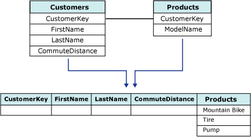

# Вложенные таблицы (службы Analysis Services — интеллектуальный анализ данных)
  В службах [!INCLUDE[ssNoVersion](../../includes/ssnoversion-md.md)] [!INCLUDE[ssASnoversion](../../includes/ssasnoversion-md.md)]данные должны подаваться на вход алгоритма интеллектуального анализа данных в виде последовательности вариантов, содержащихся в таблице вариантов. Но не все варианты можно описать одной строкой данных. Например, некоторый вариант может быть выведен на основании двух таблиц: таблицы, содержащей данные о заказчике, и таблицы, содержащей сведения о покупках заказчика. Одному заказчику из таблицы заказчиков может соответствовать несколько элементов в таблице покупок, что усложняет описание данных в одной строке. [!INCLUDE[ssASnoversion](../../includes/ssasnoversion-md.md)] предоставляют уникальный метод обработки таких случаев с помощью *вложенных таблиц*. Понятие вложенной таблицы демонстрируется на следующей схеме.  
  
   
  
 На этой диаграмме первая таблица, являющаяся «родительской» таблицей, содержит данные о заказчиках и связывает уникальный идентификатор с каждым заказчиком. Вторая таблица, «дочерняя», содержит покупки каждого заказчика. Покупки в дочерней таблице связаны с родительской таблицей уникальным идентификатором — столбцом **CustomerKey** . Третья таблица на диаграмме показывает комбинацию этих двух таблиц.  
  
 Вложенная таблица представлена в таблице вариантов специальным столбцом с типом данных **TABLE**. Для каждой конкретной строки варианта этот тип столбца содержит выбранные строки из «дочерней» таблицы, относящиеся в «родительской» таблице.  
  
 Данные во вложенной таблице могут быть использованы для прогноза, для ввода или для обеих операций. Например, в модели есть два столбца вложенной таблицы: один столбец может содержать список продуктов, приобретенных покупателем, а другой — сведения о хобби и интересах покупателя, например, полученных из его анкеты. В данном сценарии необходимо использовать хобби и интересы покупателя в качестве входных данных для анализа поведения при покупке и прогнозирования вероятных покупок.  
  
## Соединение таблиц вариантов и вложенных таблиц  
 Чтобы создать вложенную таблицу, две таблицы источника должны содержать определенную связь, чтобы элементы в одной таблице могли быть связаны с другой таблицей. В среде [!INCLUDE[ssBIDevStudioFull](../../includes/ssbidevstudiofull-md.md)]можно определять эту связь в представлении источника данных.  
  
> [!NOTE]  
>  Поле **CustomerKey** представляет собой реляционный ключ, который используется для связывания таблицы вариантов и вложенной таблицы в определении представления источников данных, а также для установления связи столбцов в структуре интеллектуального анализа данных. Но, как правило, не следует использовать указанный реляционный ключ в моделях интеллектуального анализа данных, основанных на этой структуре. Обычно лучше исключить из модели интеллектуального анализа данных столбец реляционного ключа, предназначенный исключительно для соединения таблиц и не содержащий данных, интересных для анализа.  
  
 Можно создавать вложенные таблицы программным путем, используя либо расширения интеллектуального анализа данных, либо объекты AMO, или можно использовать мастер интеллектуального анализа данных в конструкторе интеллектуального анализа данных в среде [!INCLUDE[ssBIDevStudioFull](../../includes/ssbidevstudiofull-md.md)].  
  
## Использование столбцов вложенной таблицы в модели интеллектуального анализа данных  
 В таблице вариантов ключами часто являются идентификаторы заказчиков, названия продуктов или последовательные значения дат, то есть данные, которые однозначно определяют строку в таблице. . Но во вложенных таблицах ключом обычно является не реляционный ключ (или внешний ключ), а, скорее, столбец, представляющий моделируемый атрибут.  
  
 Например, если таблица вариантов содержит заказы, а вложенная таблица содержит продукты из заказов, то может оказаться интересным моделирование связи между продуктами, хранящимися во вложенной таблице, с охватом нескольких заказов, которые хранятся в таблице вариантов. Таким образом, несмотря на то что вложенная таблица **Items** соединяется с таблицей вариантов **Orders** по реляционному ключу **OrderID**, сам идентификатор заказа **OrderID** не должен использоваться как ключ вложенной таблицы. Вместо этого в качестве ключа вложенной таблицы следует выбрать столбец **Items** , поскольку этот столбец содержит данные, которые должны быть промоделированы. В большинстве случаев можно без опасений пропустить столбец **OrderID** в модели интеллектуального анализа данных, поскольку связь между таблицей вариантов и вложенной таблицей уже установлена с помощью определения представления источников данных.  
  
 При выборе столбца, предназначенного для использования в качестве ключа вложенной таблицы, необходимо убедиться в том, что значения в этом столбце являются уникальными для каждого варианта. Например, если таблица вариантов представляет заказчиков, а вложенная таблица представляет продукты, приобретенные конкретным заказчиком, то необходимо обеспечить, чтобы ни один продукт не был перечислен больше одного раза для каждого заказчика. Если заказчик приобретал одни и те же продукты больше одного раза, то может потребоваться создать другое представление, имеющее столбец, накапливающий количество покупок, относящихся к каждому продукту.  
  
 Должно быть принято решение о том, как следует обрабатывать повторяющиеся значения во вложенной таблице, в зависимости от того, какая модель интеллектуального анализа данных создается и какова конкретная решаемая экономическая задача. В некоторых сценариях может не иметь значения то, сколько раз заказчик приобретал конкретный продукт, но требуется проверить наличие по меньшей мере одной покупки этого продукта. В других сценариях могут оказаться очень важными количество и последовательность приобретений.  
  
 Если имеет значение то, в каком порядке приобретались продукты, может потребоваться дополнительный столбец, который будет отображать эту последовательность. Если для создания модели используется алгоритм кластеризации последовательности, то необходимо выбрать дополнительный столбец *ключевой последовательности* для представления порядка элементов. Столбец ключевой последовательности представляет собой вложенный ключ особого вида, который используется только в моделях кластеризации последовательностей и требует применения уникального числового типа данных. Например, в качестве значений столбца ключевой последовательности могут использоваться и целые числа, и даты, но все значения последовательности должны быть уникальными. Кроме столбца ключевой последовательности в модели кластеризации последовательностей имеется также ключ вложенной таблицы, который представляет моделируемый атрибут, такой как приобретаемые товары.  
  
### Использование неключевых вложенных столбцов из вложенной таблицы  
 После определения соединения между таблицей вариантов и вложенной таблицей и выбора столбца, содержащего интересующие и уникальные атрибуты, предназначенные для использования в качестве ключа вложенной таблицы, можно включить другие столбцы из вложенной таблицы, чтобы использовать их в качестве входных данных для модели. Все столбцы вложенной таблицы могут использоваться в качестве входных, прогнозируемых и входных или только прогнозируемых.  
  
 Например, если вложенная таблица содержит столбцы **Product**, **ProductQuantity**и **ProductPrice**, можно выбрать **Product** в качестве ключа вложенной таблицы, но добавить столбец **ProductQuantity** к структуре интеллектуального анализа данных, чтобы использовать его данные в качестве входных.  
  
## Фильтрация данных вложенной таблицы  
 В [!INCLUDE[ssCurrent](../../includes/sscurrent-md.md)]предусмотрена возможность создавать фильтры для данных, используемых для обучения или проверки модели интеллектуального анализа данных. Фильтр может также применяться для воздействия на компоновку модели или для проверки модели на подмножестве вариантов. Фильтры могут также применяться к вложенным таблицам. Тем не менее существуют ограничения, касающиеся того, какой синтаксис может использоваться применительно к вложенным таблицам.  
  
 Применение фильтра к вложенной таблице часто осуществляется для проверки на существование атрибута. Например, может быть применен фильтр, который ограничивает количество вариантов, используемых в модели, только теми вариантами, которые имеют указанное значение во вложенной таблице. Кроме того, варианты, используемые в модели, можно ограничить заказчиками, которые не приобретали конкретный продукт.  
  
 При создании фильтров на вложенной таблице можно также использовать такие операторы, как больше или меньше. Например, можно ограничить варианты, используемые в модели, заказчиками, которые приобрели не менее n единиц целевого продукта. Возможность применения фильтра к атрибутам вложенной таблицы способствует значительному повышению гибкости при настройке модели.  
  
 Дополнительные сведения о создании и использовании фильтров для моделей см. в разделе [Фильтры для моделей интеллектуального анализа данных (службы Analysis Services — интеллектуальный анализ данных)](../../analysis-services/data-mining/filters-for-mining-models-analysis-services-data-mining.md).  
  
## См. также:  
 [Алгоритмы интеллектуального анализа данных (службы Analysis Services — интеллектуальный анализ данных)](../../analysis-services/data-mining/data-mining-algorithms-analysis-services-data-mining.md)   
 [Структуры интеллектуального анализа данных (службы Analysis Services — интеллектуальный анализ данных)](../../analysis-services/data-mining/mining-structures-analysis-services-data-mining.md)  
  
  
