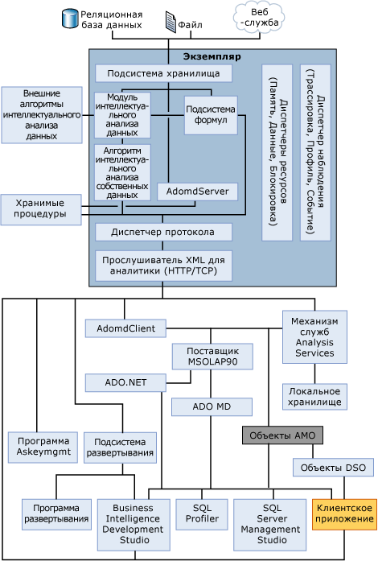

# Физическая архитектура (службы Analysis Services — интеллектуальный анализ данных)
  [!INCLUDE[msCoName](../../includes/msconame-md.md)] [!INCLUDE[ssASnoversion](../../includes/ssasnoversion-md.md)] используются как серверный, так и клиентский компоненты.  
  
-   Серверный компонент реализован в виде службы Microsoft Windows. Службы [!INCLUDE[ssASnoversion](../../includes/ssasnoversion-md.md)] поддерживают установку нескольких экземпляров на одном компьютере, при этом каждый из экземпляров служб реализуется в виде отдельного экземпляра службы Windows.  
  
-   Клиенты обмениваются данными со службами [!INCLUDE[ssASnoversion](../../includes/ssasnoversion-md.md)] с помощью общедоступного стандарта XML для аналитики (XMLA), который представляет собой протокол на базе SOAP для выполнения команд и получения ответов и предоставляется в виде веб-службы. Клиентские модели объектов также предоставляются через XML для аналитики, и доступ к ним производится через управляемый поставщик, например ADOMD.NET, или через собственный поставщик данных OLE DB.  
  
-   Команды запросов могут создаваться с помощью расширений интеллектуального анализа данных — языка запросов, который является отраслевым стандартом и ориентирован на интеллектуальный анализ данных. Язык сценариев служб Analysis Services (ASSL) также может использоваться для управления объектами базы данных служб [!INCLUDE[ssASnoversion](../../includes/ssasnoversion-md.md)] .  
  
## Архитектурная диаграмма  
 Экземпляр служб [!INCLUDE[ssASnoversion](../../includes/ssasnoversion-md.md)] запускается как изолированная служба, взаимодействие с этой службой происходит через XMLA с использованием протокола HTTP или TCP.  
  
 Объекты AMO — это прослойка между пользовательским приложением и экземпляром служб [!INCLUDE[ssASnoversion](../../includes/ssasnoversion-md.md)] , предоставляющим доступ к объектам администрирования [!INCLUDE[ssASnoversion](../../includes/ssasnoversion-md.md)] . Объект AMO — это библиотека классов, которая принимает команды от клиентского приложения и преобразует их в XMLA-сообщения для экземпляра служб [!INCLUDE[ssASnoversion](../../includes/ssasnoversion-md.md)] . Объекты AMO представляют объекты экземпляра служб [!INCLUDE[ssASnoversion](../../includes/ssasnoversion-md.md)] , как классы для приложения конечного пользователя, с элементами-методами, запускающими команды и элементами-свойствами, хранящими данные объектов служб [!INCLUDE[ssASnoversion](../../includes/ssasnoversion-md.md)] .  
  
 На следующем рисунке показана архитектура компонентов служб [!INCLUDE[ssASnoversion](../../includes/ssasnoversion-md.md)] , включая службы, запущенные на экземпляре служб [!INCLUDE[ssASnoversion](../../includes/ssasnoversion-md.md)] , и все пользовательские компоненты, взаимодействующие с этим экземпляром.  
  
 Здесь показано, что единственным путем доступа к экземпляру является прослушиватель XML для аналитики или использование протокола HTTP или TCP.  
  
> [!WARNING]  
>  Объекты DSO устарели. Не следует пользоваться ими при разработке новых решений.  
  
   
  
## Конфигурация сервера  
 Один экземпляр сервера может поддерживать несколько баз данных [!INCLUDE[ssASnoversion](../../includes/ssasnoversion-md.md)] , каждая со своим экземпляром службы [!INCLUDE[ssASnoversion](../../includes/ssasnoversion-md.md)] , который отвечает на запросы клиента и обрабатывает объекты.  
  
 Если необходимо работать с табличными моделями, многомерными моделями и/или моделями интеллектуального анализа данных, то потребуется установка разных экземпляров. [!INCLUDE[ssASnoversion](../../includes/ssasnoversion-md.md)] поддерживают параллельную установку экземпляров, работающих в табличном режиме (с использованием подсистемы хранилища подсистемы аналитики в памяти xVelocity (VertiPaq)), и экземпляров, работающих в одной из обычных конфигураций OLAP, MOLAP или ROLAP. Дополнительные сведения см. в разделе [Определение режима работы сервера экземпляра служб Analysis Services](../../analysis-services/instances/determine-the-server-mode-of-an-analysis-services-instance.md).  
  
 Вся связь между клиентом и сервером служб Analysis Services основана на протоколе XMLA, независимом от платформы или языка. Если от клиента поступает запрос, службы Analysis Services определяют, связан ли он с OLAP или с интеллектуальным анализом данных, и соответствующим образом назначают маршрут. Дополнительные сведения см. в разделе [Серверные компоненты ядра OLAP](../../analysis-services/multidimensional-models/olap-physical/olap-engine-server-components.md).  
  
## См. также  
 [Логическая архитектура (службы Analysis Services — интеллектуальный анализ данных)](../../analysis-services/data-mining/logical-architecture-analysis-services-data-mining.md)  
  
  

