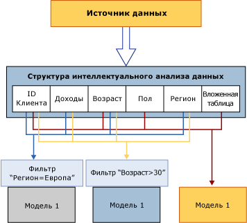

# Обработка объектов интеллектуального анализа данных
  До обработки объект интеллектуального анализа данных представляет собой просто пустой контейнер. *Обработка* модели интеллектуального анализа данных также называется *обучением*.  
  
 **Обработка структур интеллектуального анализа данных.** Структура интеллектуального анализа данных получает данные из внешнего источника, определенного в привязках столбцов и метаданных использования, и считывает данные. Эти данные считываются полностью и затем подвергаются анализу, чтобы получить различную статистику. Службы Analysis Services сохраняют в локальном кэше компактное представление данных, которое удобно для анализа, проводимого алгоритмами интеллектуального анализа данных. После обработки моделей этот кэш можно сохранить или удалить. По умолчанию кэш сохраняется. Дополнительные сведения см. в разделе [Обработка структуры интеллектуального анализа данных](../../analysis-services/data-mining/process-a-mining-structure.md).  
  
 **Обработка моделей интеллектуального анализа данных:** до обработки модель интеллектуального анализа данных пуста и содержит только определения. Чтобы обработать модель интеллектуального анализа данных, необходимо обработать структуру интеллектуального анализа данных, на которой основана модель. Модель интеллектуального анализа данных получает данные из кэша структуры интеллектуального анализа данных, применяет все фильтры, созданные для модели, а затем передает набор данных алгоритму, чтобы выявить закономерности. После обработки модели сохраняются только результаты обработки, но не сами данные. Дополнительные сведения см. в статье [Обработка модели интеллектуального анализа данных](../../analysis-services/data-mining/process-a-mining-model.md).  
  
 На следующей диаграмме показан поток данных во время обработки структуры интеллектуального анализа данных и во время обработки модели интеллектуального анализа данных.  
  
   
  
## Просмотр результатов обработки  
 После обработки структура интеллектуального анализа данных содержит компактное представление данных для использования в статистическом анализе. Если кэш не очищен, доступ к хранящимся в нем данным можно получить следующими способами.  
  
-   Создание запроса DMX-запроса к модели и детализация до уровня структуры. Дополнительные сведения см. в разделе [SELECT FROM &#60;модель&#62;.CASES (расширения интеллектуального анализа данных)](../Topic/SELECT%20FROM%20%3Cmodel%3E.CASES%20\(DMX\).md).  
  
-   Просмотр модели, основанной на структуре, и использование одного из параметров пользовательского интерфейса для детализации до вариантов структуры. Дополнительные сведения см. в разделе [Средства просмотра моделей интеллектуального анализа данных](../../analysis-services/data-mining/data-mining-model-viewers.md) или [Детализация по данным вариантов из модели интеллектуального анализа данных](../../analysis-services/data-mining/drill-through-to-case-data-from-a-mining-model.md).  
  
-   Создание DMX-запроса к вариантам структуры. Дополнительные сведения см. в разделе [SELECT FROM &#60;структура&#62;.CASES](../Topic/SELECT%20FROM%20%3Cstructure%3E.CASES.md).  
  
 Модель интеллектуального анализа данных после обработки содержит только закономерности, полученные во время анализа, и сопоставления результатов модели с обучающими данными в кэше. Можно просмотреть или запросить результаты модели, называемые *содержимым модели*, или запросить варианты модели и структуры, если они помещены в кэш.  
  
 Содержимое каждой модели интеллектуального анализа данных зависит от алгоритма, использованного для ее создания. Например, если одна модель является моделью кластеризации, а другая — моделью дерева принятия решений, содержимое моделей будет сильно различаться, несмотря на то, что модели используют совершенно идентичный набор данных. Дополнительные сведения см. в разделе [Содержимое модели интеллектуального анализа данных (службы Analysis Services — интеллектуальный анализ данных)](../../analysis-services/data-mining/mining-model-content-analysis-services-data-mining.md).  
  
## Требования к обработке  
 Требования к обработке могут отличаться в зависимости от того, основана модель интеллектуального анализа данных только на реляционных данных или на источнике многомерных данных.  
  
 Для обработки источника реляционных данных требуется только создание данных для обучения и выполнения алгоритма интеллектуального анализа относительно этих данных. Но для моделей интеллектуального анализа, основанных на объектах OLAP, например для измерений и мер, базовые данные должны быть представлены в обработанном виде. Для этого может потребоваться обработка многомерных объектов для заполнения модели интеллектуального анализа данных.  
  
 Дополнительные сведения см. в разделе [Требования к обработке и связанные замечания (интеллектуальный анализ данных)](../../analysis-services/data-mining/processing-requirements-and-considerations-data-mining.md).  
  
## См. также  
 [Запросы детализации (интеллектуальный анализ данных)](../../analysis-services/data-mining/drillthrough-queries-data-mining.md)   
 [Структуры интеллектуального анализа данных (службы Analysis Services — интеллектуальный анализ данных)](../../analysis-services/data-mining/mining-structures-analysis-services-data-mining.md)   
 [Модели интеллектуального анализа данных (службы Analysis Services — интеллектуальный анализ данных)](../../analysis-services/data-mining/mining-models-analysis-services-data-mining.md)   
 [Логическая архитектура (службы Analysis Services — интеллектуальный анализ данных)](../../analysis-services/data-mining/logical-architecture-analysis-services-data-mining.md)  
  
  