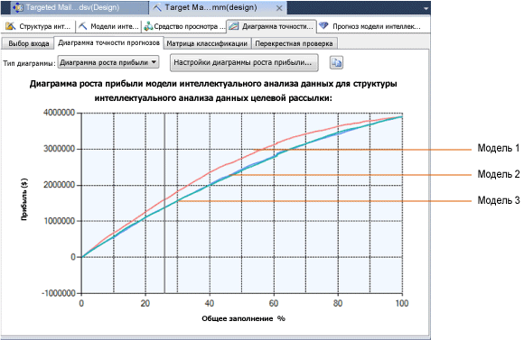

# Диаграмма роста прибыли (службы Analysis Services — интеллектуальный анализ данных)
  В диаграмме роста прибыли отображается теоретический прирост прибыли, связанный с использованием модели интеллектуального анализа данных. Предположим, что модель прогнозирует, с какими клиентами компании следует связаться в определенном бизнес-сценарии. В этом случае следует добавить в диаграмму роста прибыли данные о стоимости проведения кампании целевой рассылки. И тогда в готовой диаграмме вы увидите сравнение прибыли при правильном выборе целевых клиентов и при обращении к клиентам случайным образом.  
  
## Создание диаграммы роста прибыли  
 Диаграмма роста прибыли аналогична диаграмме точности прогнозов. Начните с создания диаграммы точности прогнозов, а затем добавьте сведения об издержках и прибыли.  
  
 Чтобы построить диаграмму роста прибыли, у вас должна быть существующая модель.  
  
 В этом примере мы использовали модель дерева принятия решений по целевой рассылке. Модель выделяет тех клиентов, которые, скорее всего, купят велосипед. **Диаграмма роста прибыли** позволит определить, сколько нужно отобрать клиентов для обращений, чтобы получить максимальную прибыль.  
  
 Если у вас нет образца модели, можно создать его с помощью [Basic Data Mining Tutorial](http://msdn.microsoft.com/library/6602edb6-d160-43fb-83c8-9df5dddfeb9c).  
  
1.  Откройте средство построения диаграммы точности интеллектуального анализа.  
  
    -   В SQL Server Management Studio щелкните правой кнопкой мыши имя модели и выберите **Просмотр диаграммы точности прогнозов**.  
  
    -   В SQL Server Data Tools откройте проект, в котором создана эта модель, и щелкните вкладку **Диаграмма точности интеллектуального анализа** .  
  
2.  На вкладке **Выбор входа** выберите модель и прогнозируемое значение атрибута.  
  
     В данном конкретном случае вас интересует только рентабельность точного прогнозирования одного значения: [Bike Buyer] =1.  
  
     Но бывают ситуации, в которых не менее важно правильно прогнозировать ложные значения. Например, получение ложных положительных заключений при медицинской диагностике может повлечь существенные расходы. При прогнозной оценке прибыльности нужно учесть этот вариант, а также стоимость ложных отрицательных результатов. В таких сценариях следует оценивать все возможные исходы.  
  
3.  Выберите набор данных для проверки. В нашем примере выберите тестовый набор данных.  
  
4.  Затем щелкните вкладку **Диаграмма точности прогнозов** .  
  
     Диаграмма точности прогнозов создается автоматически.  
  
5.  Чтобы преобразовать ее в диаграмму роста прибыли, выберите пункт **Диаграмма роста прибыли** в списке **Тип диаграммы** .  
  
6.  Как только вы выберете диаграмму роста прибыли, автоматически откроется диалоговое окно **Настройка диаграммы роста прибыли** .  
  
     Это диалоговое окно помогает указать издержки и прибыль, связанные с кампанией целевой рассылки. Для диаграммы в этом примере были использованы следующие значения.  
  
    |Настройка|Значение|Комментарии|  
    |-------------|-----------|--------------|  
    |**Заполнение**|20 000|Установите значение для всей целевой популяции   База данных может содержать много заказчиков, но чтобы сэкономить на рассылке, выберите только 20 000 заказчиков, которых модель определяет как наиболее вероятных покупателей. Такой список можно получить, выполнив прогнозирующий запрос с сортировкой по значению вероятности из прогнозирующей модели.|  
    |**Фиксированные издержки**|500|Введите единовременные затраты по организации кампании целевой рассылки, рассчитанной на 20 000 человек. Сюда относятся расходы на печать или расходы на рассылку электронных писем.|  
    |**Индивидуальные издержки**|3|Введите удельные затраты для кампании целевой рассылки.   Эта сумма будет умножена на 20 000 или меньшее число, в зависимости от количества клиентов, которых модель оценит как возможных покупателей.|  
    |**Доход на единицу**|400|Введите значение, представляющее объем прибыли или дохода, который можно ожидать при удачном исходе. В нашем случае мы предположим, что рассылка каталога позволит продать велосипеды или аксессуары на среднюю сумму 400 долларов.   Эта сумма будет использоваться для проектирования общей прибыли, связанной с весьма вероятными вариантами.|  
  
7.  Когда будут готовы все нужные параметры, нажмите кнопку **ОК**.  
  
8.  Диаграмма обновится и покажет кривую прибыли.  
  
## Основные сведения о диаграмме роста прибыли  
 На следующей диаграмме показана диаграмма, которая была основана на этих параметрах. Ось Y на диаграмме представляет прибыль, а ось X — количество клиентов, с которыми связалась компания, в процентах от общего количества.  
  
 Как видите, диаграмма роста прибыли может сравнивать разные модели, если они прогнозируют один и тот же дискретный атрибут.  
  
   
  
 Обратите внимание на серую вертикальную линию на диаграмме. Если щелкнуть и перетащить эту линию, появится всплывающая подсказка с указанием процента целевой аудитории, соответствующего этой точке кривой.  
  
 Когда вы перемещаете линию, окно **Обозначения интеллектуального анализа данных** также обновляется, отображая процентное отношение, оценку прибыли и вероятность прогноза, связанную с процентной долей целевой аудитории на серой вертикальной линии.  
  
 Например, если по этой модели вы определяете, кому отправлять свои рекламные материалы, на основании прогноза вероятности вы можете выбрать 25 % целевой аудитории. При этом площадь под кривой прибыли будет максимальной в диапазоне от 40 % до 70 %. Это означает, что вы можете увеличить прибыль, включив в рассылку большее количество людей, несмотря на снижение процента откликнувшихся.  
  
## Сохранение диаграмм  
 При создании диаграммы точности прогнозов или диаграммы роста прибыли никакие объекты на сервере не создаются. Выполняются только запросы к существующей модели, результаты которых отображаются в средстве просмотра. Если требуется сохранить результаты, следует скопировать диаграмму или результаты в Excel или другой файл.  
  
## См. также  
 Следующие разделы содержат дополнительные сведения о том, как создавать и использовать диаграммы точности.  
  
|Разделы|Ссылки|  
|------------|-----------|  
|Объясняет, как создать диаграмму точности прогнозов для модели целевой рассылки.|[Учебник по основам интеллектуального анализа данных](http://msdn.microsoft.com/library/6602edb6-d160-43fb-83c8-9df5dddfeb9c)   [Проверка точности с помощью диаграмм точности прогнозов (учебник интеллектуального анализа данных — начальный уровень)](http://msdn.microsoft.com/library/822d414b-4a39-473f-80c3-53476e30655a)|  
|Объясняет типы соответствующих диаграмм.|[Диаграмма точности прогнозов (службы Analysis Services — интеллектуальный анализ данных)](../../analysis-services/data-mining/lift-chart-analysis-services-data-mining.md)   [Матрица классификации (службы Analysis Services — интеллектуальный анализ данных)](../../analysis-services/data-mining/classification-matrix-analysis-services-data-mining.md)   [Точечная диаграмма (службы Analysis Services — интеллектуальный анализ данных)](../../analysis-services/data-mining/scatter-plot-analysis-services-data-mining.md)|  
|Описывает перекрестную проверку для моделей интеллектуального анализа данных и структур интеллектуального анализа данных.|[Перекрестная проверка (службы Analysis Services — интеллектуальный анализ данных)](../../analysis-services/data-mining/cross-validation-analysis-services-data-mining.md)|  
|Описывает шаги для создания диаграммы точности прогнозов и других диаграмм точности.|[Задачи и решения по тестированию и проверке (интеллектуальный анализ данных)](../../analysis-services/data-mining/testing-and-validation-tasks-and-how-tos-data-mining.md)|  
  
## См. также  
 [Тестирование и проверка (интеллектуальный анализ данных)](../../analysis-services/data-mining/testing-and-validation-data-mining.md)   
 [Проверка точности с помощью диаграмм точности прогнозов (учебник интеллектуального анализа данных — начальный уровень)](http://msdn.microsoft.com/library/822d414b-4a39-473f-80c3-53476e30655a)  
  
  

