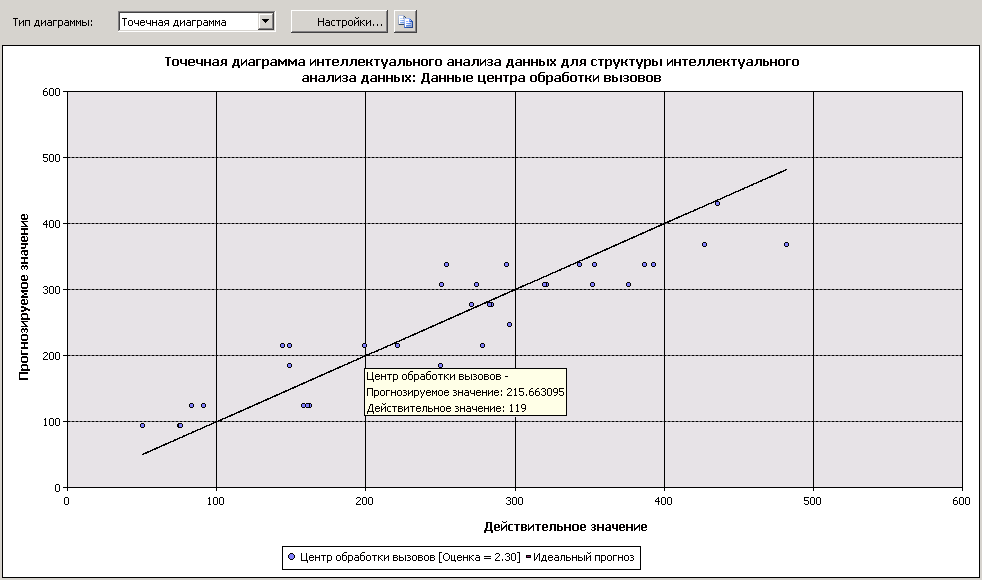

# Точечная диаграмма (службы Analysis Services — интеллектуальный анализ данных)
  На *точечной диаграмме* реальные значения пользовательских данных графически сравниваются с прогнозируемыми значениями в модели. Реальные значения отображаются на оси Х точечной диаграммы; прогнозируемые значения — на оси Y. На ней также отображается линия, отображающая идеальный прогноз, на которой прогнозируемое значение точно совпадает с реальным значением. Расстояние от точки на линии идеальных прогнозов, расположенной под углом в 45 градусов, показывает, насколько хорошо или плохо был выполнен прогноз.  
  
## Основные сведения о точечной диаграмме  
 Рассмотрим модель, при помощи которой в отделе маркетинга компании выполняется прогноз ежедневных продаж, основываясь на количестве переходов по ссылке, отправленной в рекламном электронном письме. Поскольку количество переходов и объем продаж являются непрерывными числовыми значениями, количество переходов можно представить на диаграмме как независимую переменную, а продажи — как зависимую. Прямая линия при этом показывает ожидаемую линейную связь, а точки, рассеянные вокруг линии, показывают, насколько реальные данные отличаются от ожидаемых. С помощью данного анализа можно визуально определить то, насколько набор результатов связан с определенным входом, а также то, насколько велико отклонение от идеальной модели.  
  
## Интерпретация результатов  
 Далее показывается пример точечной диаграммы, созданной для сценария, приведенного ранее.  
  
   
  
 Остановив указатель мыши над любой из точек, разбросанных на линии, можно увидеть в подсказке прогнозируемые и реальные значения. На точечной диаграмме отсутствуют **обозначения интеллектуального анализа данных** , однако сама диаграмма содержит условные обозначения, отражающие результаты, связанные с моделью. Дополнительные сведения об интерпретации этих результатов см. в разделе [Содержимое моделей интеллектуального анализа данных для моделей линейной регрессии (службы Analysis Services — интеллектуальный анализ данных)](../../analysis-services/data-mining/mining-model-content-for-linear-regression-models-analysis-services-data-mining.md).  
  
 Визуальное представление диаграммы можно скопировать в буфер обмена, а лежащие в ее основе данные и формулы — нет. Чтобы узнать формулу регрессии для линии, можно создать запрос к содержимому модели. Дополнительные сведения см. в разделе [Примеры запросов модели линейной регрессии](../../analysis-services/data-mining/linear-regression-model-query-examples.md).  
  
## Ограничения точечных диаграмм  
 Точечную диаграмму можно создать только в том случае, если модель, выбранная на вкладке **Выбор входных данных** , содержит непрерывный прогнозируемый атрибут. Другие параметры выбирать не нужно, тип точечной диаграммы автоматически отображается на вкладке **Диаграмма точности прогнозов** на основе модели и типа атрибута.  
  
 Несмотря на то что модели временной последовательности предсказывают непрерывные числа, нельзя измерить точность модели временной последовательности с помощью точечной диаграммы. Для этого существуют другие методы, например выделение части исторических данных. Дополнительные сведения см. в разделе [Примеры запросов моделей временных рядов](../../analysis-services/data-mining/time-series-model-query-examples.md).  
  
## См. также  
 Следующие разделы содержат дополнительные сведения о том, как создавать и использовать точечные диаграммы и связанные точечные диаграммы.  
  
|Разделы|Ссылки|  
|------------|-----------|  
|Объясняет, как создать диаграмму точности прогнозов для модели целевой рассылки.|[Учебник по основам интеллектуального анализа данных](http://msdn.microsoft.com/library/6602edb6-d160-43fb-83c8-9df5dddfeb9c)   [Проверка точности с помощью диаграмм точности прогнозов (учебник интеллектуального анализа данных — начальный уровень)](http://msdn.microsoft.com/library/822d414b-4a39-473f-80c3-53476e30655a)|  
|Объясняет типы соответствующих диаграмм.|[Диаграмма точности прогнозов (службы Analysis Services — интеллектуальный анализ данных)](../../analysis-services/data-mining/lift-chart-analysis-services-data-mining.md)   [Диаграмма роста прибыли (службы Analysis Services — интеллектуальный анализ данных)](../../analysis-services/data-mining/profit-chart-analysis-services-data-mining.md)   [Матрица классификации (службы Analysis Services — интеллектуальный анализ данных)](../../analysis-services/data-mining/classification-matrix-analysis-services-data-mining.md)|  
|Описывает использование перекрестной проверки для моделей интеллектуального анализа данных и структур интеллектуального анализа данных.|[Перекрестная проверка (службы Analysis Services — интеллектуальный анализ данных)](../../analysis-services/data-mining/cross-validation-analysis-services-data-mining.md)|  
|Описывает шаги для создания диаграммы точности прогнозов и других диаграмм точности.|[Задачи и решения по тестированию и проверке (интеллектуальный анализ данных)](../../analysis-services/data-mining/testing-and-validation-tasks-and-how-tos-data-mining.md)|  
  
## См. также  
 [Тестирование и проверка (интеллектуальный анализ данных)](../../analysis-services/data-mining/testing-and-validation-data-mining.md)  
  
  
