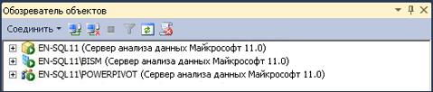

# Определение режима работы сервера экземпляра служб Analysis Services
[!INCLUDE[ssas-appliesto-sqlas](../../includes/ssas-appliesto-sqlas.md)]Службы Analysis Services можно установить в одном из трех серверных режимов: многомерный и интеллектуальный анализ данных (по умолчанию), [!INCLUDE[ssGemini](../../includes/ssgemini-md.md)] для SharePoint и табличный. Режим сервера экземпляра служб Analysis Services определяется во время установки, когда пользователь выбирает параметры для установки сервера.  
  
 Режим сервера определяет тип создаваемого и развертываемого решения. Если программное обеспечение сервера не было установлено и необходимо узнать, в каком режиме установлен сервер, режим можно определить, следуя указаниям в этом разделе. Дополнительные сведения о доступных функциях в определенном режиме см. в разделе [Сравнение табличных и многомерных решений (службы SSAS)](../../analysis-services/comparing-tabular-and-multidimensional-solutions-ssas.md).  
  
 Если режим установленного сервера не нужен, следует удалить и снова установить программное обеспечение, выбрав нужный режим. Также можно установить дополнительный экземпляр служб Analysis Services на том же компьютере, чтобы использовать несколько экземпляров в разных режимах.  
  
## Значки сервера в обозревателе объектов  
 Самый простой способ определить режим сервера — это подключиться к серверу в среде SQL Server Management Studio и посмотреть на значок рядом с именем сервера в обозревателе объектов. На рисунке ниже показаны три экземпляра служб Analysis Services, развернутые в режиме многомерных данных, табличном режиме и режиме [!INCLUDE[ssGemini](../../includes/ssgemini-md.md)] :  
  
   
  
## Просмотр свойства DeploymentMode в файле MSMDSRV.INI  
 Также можно проверить свойство **DeploymentMode** в файле msmdsrv.ini, который имеется в каждом экземпляре служб Analysis Services. Значение этого свойства определяет режим сервера. Допустимые значения: 0 (многомерный), 1 (SharePoint) или 2 (табличный). Чтобы открыть файл msmdsrv.ini, необходимо быть администратором служб [!INCLUDE[ssASnoversion](../../includes/ssasnoversion-md.md)] (то есть членом роли сервера). Этот файл содержит структурированный XML-код. Просмотреть этот файл можно в Блокноте или другом текстовом редакторе.  
  
> [!CAUTION]  
>  Не изменяйте значение свойства **DeploymentMode** . Изменение свойства вручную после установки сервера не поддерживается.  
  
## О свойстве DeploymentMode  
 Свойство**DeploymentMode** определяет контекст работы экземпляра сервера служб Analysis Services. В диалоговых окнах, сообщениях и документации это свойство называется «режим сервера». Это свойство инициализируется программой установки в зависимости от способа установки служб Analysis Services. Это свойство следует рассматривать исключительно как внутреннее и всегда использовать в нем значение, указанное программой установки.  
  
 Ниже приведены допустимые значения для этого свойства.  
  
|Значение|Description|  
|-----------|-----------------|  
|0|Это значение по умолчанию. Оно задает многомерный режим, используемый для обслуживания многомерных баз данных с хранилищем MOLAP, HOLAP и ROLAP, а также с моделями интеллектуального анализа данных.|  
|1|Указывает экземпляры служб Analysis Services, установленные в составе развертывания [!INCLUDE[ssGemini](../../includes/ssgemini-md.md)] для SharePoint. Не следует изменять свойство режима развертывания экземпляра служб Analysis Services, который входит в состав установки [!INCLUDE[ssGemini](../../includes/ssgemini-md.md)] для SharePoint. [!INCLUDE[ssGemini](../../includes/ssgemini-md.md)] больше не будут выполняться на сервере.|  
|2|Задает табличный режим, используемый для размещения табличных шаблонов баз данных, использующих хранение в памяти или хранилище DirectQuery.|  
  
 Это монопольные режимы. На сервере, где настроен табличный режим, не могут работать базы данных служб Analysis Services, содержащие кубы и измерения. Если позволяет оборудование компьютера, можно установить на одном компьютере несколько экземпляров служб Analysis Services и настроить для каждого экземпляра свой режим развертывания. Следует помнить, что службы Analysis Services являются ресурсоемким приложением. Развертывание нескольких экземпляров на одном компьютере рекомендуется только для мощных серверов.  
  
## См. также:  
 [Установка служб Analysis Services](../../analysis-services/instances/install-windows/install-analysis-services.md)   
 [Установка служб Analysis Services в многомерном режиме и режиме интеллектуального анализа данных](http://msdn.microsoft.com/library/8a1f33e8-2bd6-4fb8-bd46-c86f2a067f60)   
 [Установка Power Pivot для SharePoint 2010](http://msdn.microsoft.com/en-us/8d47dde7-c941-4280-a934-e2fe3f9a938f)   
 [Подключение к службам Analysis Services](../../analysis-services/instances/connect-to-analysis-services.md)   
 [Решения табличных моделей &#40; Табличные службы SSAS &#41;](../../analysis-services/tabular-models/tabular-model-solutions-ssas-tabular.md)   
 [Решения многомерной модели (службы SSAS)](../../analysis-services/multidimensional-models/multidimensional-model-solutions-ssas.md)   
 [Модели интеллектуального анализа данных (службы Analysis Services — интеллектуальный анализ данных)](../../analysis-services/data-mining/mining-models-analysis-services-data-mining.md)  
  
  
