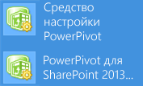

# <a name="install-or-uninstall-the-power-pivot-for-sharepoint-add-in-sharepoint-2013"></a>Установка или удаление надстройки Power Pivot для SharePoint (SharePoint 2013)
  [!INCLUDE[ssGeminiShort2017](../../../includes/ssgeminishort2017-md.md)] представляет собой набор компонентов сервера приложений и служб, которые обеспечивают доступ к данным [!INCLUDE[ssGemini](../../../includes/ssgemini-md.md)] в ферме [!INCLUDE[SPS2013](../../../includes/sps2013-md.md)] . Надстройка [!INCLUDE[ssGemini](../../../includes/ssgemini-md.md)] для SharePoint (**spPowerpivot.msi**) — это пакет установщика, используемый для установки компонентов сервера приложений.  
  
-   Надстройка не требуется для развертываний SharePoint 2010.  
  
-   Надстройка не требуется при развертывании в конфигурации с одиночным сервером, на котором установлено программное обеспечение SharePoint 2013 и [!INCLUDE[ssASnoversion](../../../includes/ssasnoversion-md.md)] в режиме интеграции с SharePoint. Компоненты, которые устанавливаются этой надстройкой, включаются при установке сервера [!INCLUDE[ssASnoversion](../../../includes/ssasnoversion-md.md)] в режиме интеграции с SharePoint. Более сложные примеры развертывания см. в статье [Топологии развертывания для компонентов бизнес-аналитики SQL Server в SharePoint](http://msdn.microsoft.com/library/39f76bc7-94e6-4dbc-bfa5-d56f4430bb26).  
  
 **Примечание.** В этой статье описывается установка файлов решений [!INCLUDE[ssGemini](../../../includes/ssgemini-md.md)] и средства настройки [!INCLUDE[ssGemini](../../../includes/ssgemini-md.md)] для SharePoint 2013. После установки сведения о средстве настройки и дополнительных компонентах см. в разделе [Настройка PowerPivot и развертывание решений (SharePoint 2013)](../../../analysis-services/instances/install-windows/configure-power-pivot-and-deploy-solutions-sharepoint-2013.md).  
  
 Дополнительные сведения о том, как загрузить **spPowerPivot.msi**, см. в документации по [Microsoft® SQL Server® 2014 Power Pivot® для Microsoft SharePoint®](http://go.microsoft.com/fwlink/?LinkID=324854).  
  
 **В этом разделе:**  
  
-   [Историческая справка](#bkmk_background)  
  
-   [Куда устанавливать spPowerPivot.msi?](#bkmk_where_to_install)  
  
-   [Требования и необходимые условия](#bkmk_prereq)  
  
-   [Установка Power Pivot для SharePoint](#bkmk_install)  
  
-   [Развертывание файлов решения SharePoint с помощью средства настройки Power Pivot для SharePoint 2013](#bkmk_deploy_solution)  
  
-   [Удаление или восстановление надстройки](#bkmk_remove_addin)  
  
||  
|-|  
|**[!INCLUDE[applies](../../../includes/applies-md.md)]**  SharePoint 2013|  
  
##  <a name="bkmk_background"></a> Историческая справка  
  
-   **Сервер приложений:** [!INCLUDE[ssGemini](../../../includes/ssgemini-md.md)] в SharePoint 2013 позволяют применять рабочие книги в качестве источников данных, планово обновлять данные, а также использовать панель управления [!INCLUDE[ssGemini](../../../includes/ssgemini-md.md)] .  
  
     [!INCLUDE[ssGeminiShort2017](../../../includes/ssgeminishort2017-md.md)] — это пакет установщика [!INCLUDE[msCoName](../../../includes/msconame-md.md)] Windows (**spPowerpivot.msi**), который выполняет развертывание клиентских библиотек служб Analysis Services и копирует файлы установки [!INCLUDE[ssGeminiShort2017](../../../includes/ssgeminishort2017-md.md)] на компьютер. Установщик не разворачивает и не настраивает функции [!INCLUDE[ssGemini](../../../includes/ssgemini-md.md)] в SharePoint. По умолчанию устанавливаются следующие компоненты:  
  
    -   [!INCLUDE[ssGeminiShort](../../../includes/ssgeminishort-md.md)] 2013. Этот компонент содержит скрипты PowerShell (PS1-файлы), пакеты решения SharePoint (WSP-файлы) и средство настройки [!INCLUDE[ssGeminiShort](../../../includes/ssgeminishort-md.md)] 2013 для развертывания [!INCLUDE[ssGemini](../../../includes/ssgemini-md.md)] в ферме SharePoint 2013.  
  
    -   [!INCLUDE[msCoName](../../../includes/msconame-md.md)] Поставщик OLE DB для служб Analysis Services (MSOLAP).  
  
    -   Поставщик данных ADOMD.NET.  
  
    -   [!INCLUDE[ssNoVersion](../../../includes/ssnoversion-md.md)] Объекты управления аналитикой (AMO-объекты).  
  
-   **Серверные службы.** Если для создания книг, содержащих аналитические данные, используется [!INCLUDE[ssGemini](../../../includes/ssgemini-md.md)] для Excel, то чтобы получать эти данные в серверной среде, необходимо иметь установленные службы Excel с сервером бизнес-аналитики [!INCLUDE[ssASnoversion](../../../includes/ssasnoversion-md.md)] , работающим в режиме интеграции с SharePoint. Вы можете запустить программу установки SQL Server на компьютере, где установлен SharePoint Server 2013 или на другом компьютере, где нет ПО SharePoint. Службы Analysis services нисколько не зависят от SharePoint.  
  
     Дополнительные сведения об установке, отмене установки и настройке серверных служб см. в следующем документе:  
  
    -   [Установка служб Analysis Services в режиме Power Pivot](../../../analysis-services/instances/install-windows/install-analysis-services-in-power-pivot-mode.md)  
  
    -   [Удаление Power Pivot для SharePoint](../../../sql-server/install/uninstall-power-pivot-for-sharepoint.md)  
  
##  <a name="bkmk_where_to_install"></a> Куда устанавливать spPowerPivot.msi?  
 Рекомендуется устанавливать **spPowerPivot.msi** на всех серверах фермы SharePoint, чтобы обеспечить согласованность конфигурации, в том числе на серверы приложений и серверы веб-интерфейса. В пакет установщика входят поставщики данных служб Analysis Services, а также средство настройки [!INCLUDE[ssGeminiShort2017](../../../includes/ssgeminishort2017-md.md)] . При установке **spPowerPivot.msi** вы можете исключить определенные компоненты.  
  
 **Поставщики данных.** Некоторые технологии SharePoint и SQL Server используют поставщики данных служб Analysis Services, включая службы Excel и PerformancePoint, а также Power View. Установка **spPowerPivot.msi** на всех серверах SharePoint обеспечивает полный набор поставщиков данных служб Analysis Services, а также постоянную возможность подключения к [!INCLUDE[ssGemini](../../../includes/ssgemini-md.md)] в ферме.  
  
> [!NOTE]  
>  Необходимо установить поставщики данных служб Analysis services на сервере SharePoint 2013 с помощью **spPowerPivot.msi**. Другие пакеты установщика, доступные в составе пакета дополнительных компонентов [!INCLUDE[ssCurrent](../../../includes/sscurrent-md.md)] , не поддерживаются, поскольку в такие пакеты не входят файлы поддержки SharePoint 2013, которые требуются поставщикам данных для этой среды.  
  
 **Средство настройки.** Средство настройки [!INCLUDE[ssGemini](../../../includes/ssgemini-md.md)] для SharePoint 2013 требуется только на одном из серверов SharePoint. Однако в многосерверных фермах рекомендуется устанавливать средство настройки по крайней мере на 2 сервера, чтобы обеспечить доступ к средству настройки, даже если один из двух серверов находится вне сети.  
  
##  <a name="bkmk_prereq"></a> Требования и необходимые условия  
  
-   [!INCLUDE[msCoName](../../../includes/msconame-md.md)] SharePoint Server 2013.  
  
-   **spPowerPivot.msi** подходит только для 64-разрядной версии в соответствии с требованиями к продуктам и технологиям SharePoint.  
  
-   Сервер в [!INCLUDE[ssGemini](../../../includes/ssgemini-md.md)] режиме. Службы Excel будут использовать экземпляр служб SQL Server Analysis Services в качестве сервера [!INCLUDE[ssGemini](../../../includes/ssgemini-md.md)] . Службы Analysis services могут работать на локальном или удаленном компьютере.  
  
-   **Разрешения.** Чтобы установить [!INCLUDE[ssGeminiShort2017](../../../includes/ssgeminishort2017-md.md)], текущий пользователь должен иметь права администратора на этом компьютере и быть членом группы администраторов фермы SharePoint.  
  
-   Дополнительные сведения о требованиях и необходимых условиях для [!INCLUDE[ssGeminiShort](../../../includes/ssgeminishort-md.md)] см. в статье [Требования к оборудованию и программному обеспечению для сервера служб Analysis Services в режиме интеграции с SharePoint](http://msdn.microsoft.com/library/fb86ca0a-518c-4c61-ae78-7680c57fae1f).  
  
##  <a name="bkmk_install"></a> Установка Power Pivot для SharePoint  
 Пакет установщика **spPowerpivot.msi** поддерживает графический пользовательский интерфейс и режим командной строки. При использовании этих методов установки необходимо запустить MSI-файл с правами администратора. После установки сведения о средстве настройки и дополнительных компонентах см. в разделе [Настройка PowerPivot и развертывание решений (SharePoint 2013)](../../../analysis-services/instances/install-windows/configure-power-pivot-and-deploy-solutions-sharepoint-2013.md).  
  
### <a name="user-interface-installation"></a>Установка с помощью пользовательского интерфейса  
 Чтобы установить [!INCLUDE[ssGeminiShort2017](../../../includes/ssgeminishort2017-md.md)] с помощью графического пользовательского интерфейса, выполните следующие шаги.  
  
1.  Запустите **SpPowerPivot.msi**.  
  
2.  На странице приветствия нажмите кнопку **Далее** .  
  
3.  Прочитайте и примите лицензионное соглашение, затем нажмите кнопку **Далее**.  
  
4.  На странице **Выбор компонентов** все компоненты выбраны по умолчанию.  
  
5.  Нажмите кнопку **Далее**.  
  
6.  Нажмите **Установить** , чтобы завершить установку.  
  
### <a name="command-line-installation"></a>Установка из командной строки  
 Для установки из командной строки откройте командную строку с правами администратора, а затем запустите **spPowerPivot.msi**. Например:  
  
 `Msiexec.exe /i SpPowerPivot.msi`.  
  
 Чтобы создать журнал установки, можно использовать стандартные переключатели ведения журнала MsiExec. В следующем примере создается файл журнала «Install_Log.txt» с помощью переключателя подробного ведения журнала «v».  
  
```  
Msiexec.exe /i SpPowerPivot.msi /L v c:\test\Install_Log.txt  
```  
  
### <a name="quiet-command-line-installation-for-scripting"></a>Автоматическая установка из командной строки для создания скрипта  
 Вы можете использовать переключатели **/q** или **/quiet** для автоматической установки, в ходе которой не будут выводиться никакие диалоговые окна или сообщения. Автоматическая установка удобна, если установку надстройки нужно выполнить из скрипта.  
  
> [!IMPORTANT]  
>  При использовании параметра **/q** для автоматической установки из командной строки условия лицензионного соглашения не отображаются. Независимо от метода установки, использование программного обеспечения регулируется лицензионным соглашением и пользователь несет ответственность за его соблюдение.  
  
 **Выполнение автоматической установки**  
  
1.  Откройте командную строку **с разрешениями администратора**.  
  
2.  Выполните следующую команду:  
  
    ```  
    Msiexec.exe /i spPowerPivot.msi /q  
    ```  
  
### <a name="command-line-installation-to-include-specific-components"></a>Установка из командной строки для включения определенных компонентов  
 Нет необходимости в средстве настройки [!INCLUDE[ssGeminiShort2017](../../../includes/ssgeminishort2017-md.md)] на каждом сервере SharePoint, однако рекомендуется установить этот компонент как минимум на двух серверах, чтобы он был доступен в нужный момент.  
  
 При установке spPowerPivot.msi вы можете использовать командную строку для установки конкретных элементов, например поставщиков данных, и не устанавливать средство настройки [!INCLUDE[ssGeminiShort2017](../../../includes/ssgeminishort2017-md.md)] . Следующая командная строка представляет собой пример установки всех компонентов, кроме средства настройки.  
  
```  
Msiexec /i spPowerPivot.msi AGREETOLICENSE="yes" ADDLOCAL=” SQL_OLAPDM,SQL_ADOMD,SQL_AMO,SQLAS_SP_Common”  
```  
  
|Параметр|Описание|  
|------------|-----------------|  
|Analysis_Server_SP_addin|[!INCLUDE[ssGemini](../../../includes/ssgemini-md.md)] Конфигурация|  
|SQL_OLAPDM|MSOLAP|  
|SQL_ADOMD|Поставщик ADOMD.net|  
|SQL_AMO|Поставщик AMO|  
|SQLAS_SP_Common|Общие компоненты служб Analysis Services для SharePoint 2013|  
  
##  <a name="bkmk_deploy_solution"></a> Развертывание файлов решения SharePoint с помощью средства настройки Power Pivot для SharePoint 2013  
 Три из скопированных на жесткий диск файлов программой spPowerPivot.msi являются файлами решения SharePoint. Область одного файла решения — уровень фермы, а область другого файла — уровень веб-приложения. Это относится к следующим файлам:  
  
-   `PowerPivotFarmSolution.wsp`  
  
-   `PowerPivotFarm14Solution.wsp`  
  
-   `PowerPivotWebApplicationSolution.wsp`  
  
 Файлы решений копируются в следующую папку:  
  
 `ssInstallPathTools\PowerPivotTools\SPAddinConfiguration\Resources`  
  
 После установки MSI-файла запустите средство настройки [!INCLUDE[ssGeminiShort2017](../../../includes/ssgeminishort2017-md.md)] для настройки и развертывания решений в ферме SharePoint.  
  
 **Для запуска средства настройки выполните следующие действия.**  
  
 На экране "Пуск" в Windows введите power и в результатах поиска приложений щелкните **[!INCLUDE[ssGemini](../../../includes/ssgemini-md.md)] для SharePoint 2013**. Обратите внимание, что результаты поиска могут включать две ссылки, поскольку программа установки [!INCLUDE[ssNoVersion](../../../includes/ssnoversion-md.md)] устанавливает отдельное средство настройки служб [!INCLUDE[ssGemini](../../../includes/ssgemini-md.md)] для SharePoint 2010 и SharePoint 2013. Убедитесь, что запущен [!INCLUDE[ssGemini](../../../includes/ssgemini-md.md)] для средства настройки SharePoint 2013.  
  
   
  
 **Or**  
  
1.  Откройте меню **Пуск**, **Все программы**.  
  
2.  Нажмите кнопку [!INCLUDE[ssCurrentUI](../../../includes/sscurrentui-md.md)].  
  
3.  Щелкните **Средства настройки**.  
  
4.  Щелкните **[!INCLUDE[ssGemini](../../../includes/ssgemini-md.md)] для SharePoint 2013**.  
  
 Дополнительные сведения о средстве настройки см. в разделе [Power Pivot Configuration Tools](../../../analysis-services/power-pivot-sharepoint/power-pivot-configuration-tools.md).  
  
##  <a name="bkmk_remove_addin"></a> Удаление или восстановление надстройки  
  
> [!CAUTION]  
>  При удалении **spPowerPivot.msi** удаляются поставщики данных и средства настройки. После удаления поставщиков данных сервер не сможет подключиться к [!INCLUDE[ssGemini](../../../includes/ssgemini-md.md)].  
  
 Удалить или восстановить [!INCLUDE[ssGeminiShort2017](../../../includes/ssgeminishort2017-md.md)] вы можете одним из следующих способов.  
  
1.  **На панели управления Windows.** Выберите [!INCLUDE[ssCurrentUI](../../../includes/sscurrentui-md.md)]**[!INCLUDE[ssGemini](../../../includes/ssgemini-md.md)] для SharePoint 2013**. Нажмите **Удалить** или **Восстановить**.  
  
2.  Запустите spPowerPivot.msi и выберите параметр **Удалить** или **Восстановить** .  
  
 **Из командной строки.** Чтобы восстановить или удалить [!INCLUDE[ssGemini](../../../includes/ssgemini-md.md)] для SharePoint 2013 с помощью командной строки, откройте ее **с правами администратора** и выполните одну из следующих команд:  
  
-   Для восстановления выполните следующую команду:  
  
    ```  
    msiexec.exe /f spPowerPivot.msi  
    ```  
  
 или  
  
-   Для удаления выполните следующую команду:  
  
    ```  
    msiexec.exe /uninstall spPowerPivot.msi  
    ```  
  
  
