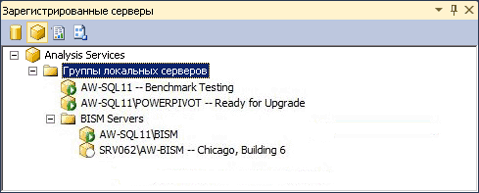

# Регистрация экземпляра служб Analysis Services в группе серверов
[!INCLUDE[ssas-appliesto-sqlas](../../includes/ssas-appliesto-sqlas.md)]
  При наличии большого числа экземпляров сервера служб Analysis Services можно создавать группы серверов в среде Management Studio и тем самым упростить администрирование сервера. Группа серверов должна обеспечить близость связанных серверов внутри рабочей области администрирования. Предположим, нужно управлять десятью отдельными экземплярами служб Analysis Services. Группирование по режиму сервера, времени работы или отделу или региону может упростить просмотр и подключение к экземплярам с одинаковыми характеристиками. Вы можете также добавить описательную информацию, которая поможет вспомнить, каким образом используется сервер.  
  
   
  
 Группы серверов создаются в виде иерархической структуры. Локальная группа серверов — корневой узел. Он всегда содержит экземпляры служб Analysis Services, запущенные на локальном компьютере. Удаленные серверы можно добавить в любую группу, включая локальную группу.  
  
 После создания группы серверов для просмотра и подключения к серверам-членам группы следует использовать панель «Зарегистрированные серверы». Панель фильтрует экземпляры SQL Server по типу сервера (компонент Database Engine, службы Analysis Services, Reporting Services и Integration Services). Для просмотра групп серверов, созданных для типа сервера, щелкните его. Чтобы подключиться к определенному серверу внутри группы, дважды щелкните сервер в группе.  
  
 Сведения о соединении, определенном для сервера, включая имя сервера, сохраняется вместе с регистрацией сервера. Нельзя изменить сведения о соединении или использовать зарегистрированное имя при подключении к серверу, используя другие средства.  
  
## Создание группы серверов и добавление зарегистрированных серверов  
  
1.  В среде Management Studio в меню «Вид» щелкните «Зарегистрированные серверы», чтобы открыть панель «Зарегистрированные серверы» в рабочей области. По умолчанию локальная группа серверов уже создана. Все экземпляры служб Analysis Services, запущенные на локальном сервере, являются ее членами.  
  
2.  Щелкните правой кнопкой мыши локальную группу серверов, выберите «Создать группу серверов» и присвойте группе имя.  
  
3.  Щелкните правой кнопкой мыши группу серверов и выберите «Регистрация нового сервера». Введите сетевое имя локального или удаленного сервера, включая имя экземпляра, если сервер установлен в качестве именованного экземпляра. При необходимости предоставьте имя зарегистрированного сервера, которое отображается в списке «Зарегистрированные серверы». Это имя используется только в списке «Зарегистрированные серверы». Нельзя использовать это имя для переименования сервера или в строке подключения. Имя зарегистрированного сервера может быть более описательным, чем фактическое имя сервера, или включать другие характеристики, помогающие отличить его от других серверов.  
  
  
