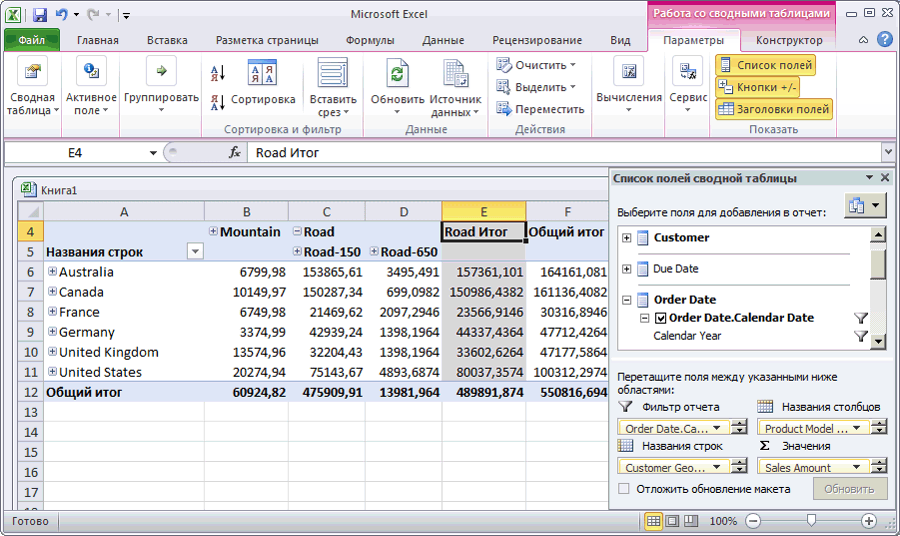

# Занятие 3-5-Просмотр развернутого куба
[!INCLUDE[ssas-appliesto-sqlas](../includes/ssas-appliesto-sqlas.md)]В следующей задаче будут просмотрены [!INCLUDE[ssASnoversion](../includes/ssasnoversion-md.md)] куба учебника по службам. Так как при проведении анализа сравниваются несколько измерений, для просмотра данных воспользуемся сводной таблицей Excel. Разместим в сводной таблице информацию о клиенте, дате и продукте на разных осях, чтобы было видно, как изменяются продажи через Интернет в различные периоды времени, для различных групп клиентов и продуктовых линий.  
  
### Просмотр развернутого куба  
  
1.  Чтобы перейти в конструктор кубов в среде [!INCLUDE[ssBIDevStudio](../includes/ssbidevstudio-md.md)], дважды щелкните куб «Учебник по **[!INCLUDE[ssASnoversion](../includes/ssasnoversion-md.md)] »** в папке **Кубы** в обозревателе решений.  
  
2.  Перейдите на вкладку **Браузер** и на панели инструментов конструктора нажмите кнопку **Повторное соединение** .  
  
3.  Щелкните значок Excel, чтобы запустить программу Excel, используя в качестве источника базу данных рабочей области. Нажмите кнопку **Включить**при появлении запроса на подключение к данным.  
  
4.  В списке полей сводной таблицы разверните группу **Продажи через Интернет**, а затем перетащите показатель **Объем продаж** в область **Значения** .  
  
5.  В списке полей сводной таблицы разверните узел **Продукт**.  
  
6.  Перетащите пользовательскую иерархию **Product Model Lines** в область **Столбцы** .  
  
7.  В списке полей сводной таблицы разверните узел **Клиент**, затем узел **Местоположение**и перетащите иерархию **Customer Geography** из папки отображения расположения в область **Строки** .  
  
8.  В списке полей сводной таблицы разверните узел **Дата заказа**и перетащите иерархию **Order Date.Calendar Date** в область **Фильтр отчета** .  
  
9. Нажмите стрелку справа от фильтра **Order Date.Calendar Date** на панели данных, снимите флажок для уровня **(Все)** , последовательно разверните узлы **2006**, **H1 CY 2006**и **Q1 CY 2006**, установите флажок **Февраль 2006**и нажмите кнопку **ОК**.  
  
    На экран будут выведены продажи через Интернет по регионам и линейкам продуктов в феврале 2006 г., как показано на следующем рисунке.  
  
      
  
## Следующее занятие  
[Урок 4. Определение расширенных свойств атрибутов и измерений](../analysis-services/lesson-4-defining-advanced-attribute-and-dimension-properties.md)  
  
  
  
