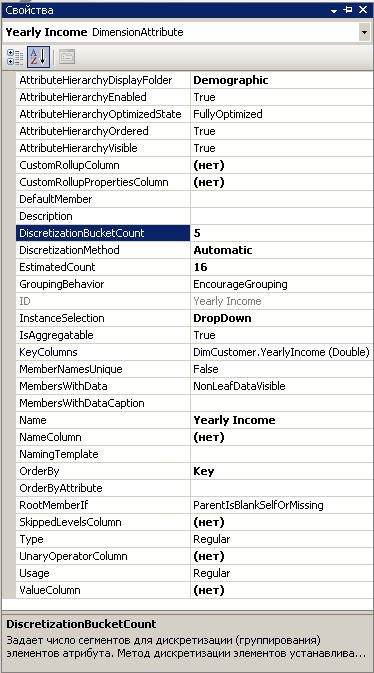
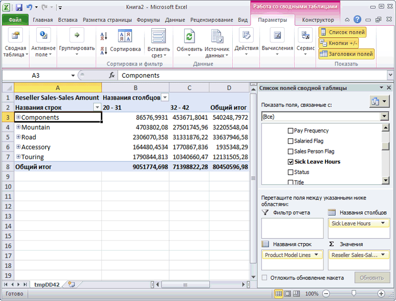

# Занятие 4-3 - автоматическое группирование элементов атрибута
При просмотре куба обычно выполняется распределение по измерениям элементов одной иерархии атрибута на основе элементов другой иерархии атрибута. Например, можно сгруппировать продажи по таким признакам, как город, приобретенный товар или пол. Однако при работе с некоторыми типами атрибутов лучше группировать их элементы автоматически с использованием служб [!INCLUDE[msCoName](../includes/msconame-md.md)] [!INCLUDE[ssASnoversion](../includes/ssasnoversion-md.md)] , основываясь на распределении элементов в рамках иерархии атрибута. Например, с помощью служб [!INCLUDE[ssASnoversion](../includes/ssasnoversion-md.md)] можно объединить заказчиков в группы на основе их годового дохода. При этом пользователь, просматривающий иерархию атрибута, будет видеть названия и значения групп вместо самих элементов групп. Данный подход ограничивает количество отображаемых уровней, что упрощает анализ данных.  
  
Свойство **DiscretizationMethod** определяет, создают ли службы [!INCLUDE[ssASnoversion](../includes/ssasnoversion-md.md)] группирования, а также определяет тип выполняемого группирования. По умолчанию в службах [!INCLUDE[ssASnoversion](../includes/ssasnoversion-md.md)] группирование не выполняется. При включении автоматического группирования можно настроить параметры служб [!INCLUDE[ssASnoversion](../includes/ssasnoversion-md.md)] таким образом, чтобы выполнялся автоматический выбор оптимального метода группирования, основанного на структуре данного атрибута, либо выбрать один из алгоритмов группирования в следующем списке:  
  
**EqualAreas**  
[!INCLUDE[ssASnoversion](../includes/ssasnoversion-md.md)] диапазоны групп создаются таким образом, что элементы измерения распределяются по группам пропорционально.  
  
**Clusters**  
[!INCLUDE[ssASnoversion](../includes/ssasnoversion-md.md)] группы создаются путем проведения одномерной кластеризации входных значений с помощью метода кластеризации К-средних с нормальным распределением. Эта функция применима только в отношении числовых столбцов.  
  
После выбора метода группирования необходимо указать количество групп, используя свойство **DiscretizationBucketCount** . Дополнительные сведения см. в разделе [Группирование элементов атрибутов (дискретизация)](../analysis-services/multidimensional-models/attribute-properties-group-attribute-members.md)  
  
В ходе выполнения задач данного раздела будут опробованы следующие критерии группирования: значение годового дохода в измерении **Заказчик** , количество часов отсутствия по болезни в измерении **Сотрудники** , данные о количестве часов отпуска сотрудников в измерении **Сотрудники** . Затем предстоит выполнить обработку куба учебника по службам [!INCLUDE[ssASnoversion](../includes/ssasnoversion-md.md)] и просмотреть результаты группирования элементов. На конечной стадии будут изменены свойства групп элементов, чтобы выявить эффект от изменения типа группирования.  
  
## Группирование элементов иерархии атрибута в измерении «Заказчик»  
  
1.  В обозревателе решений дважды щелкните элемент **Заказчик** в папке **Измерения** . Откроется конструктор измерений для измерения "Заказчик".  
  
2.  На панели **Представление источника данных** щелкните правой кнопкой мыши таблицу **Заказчик** и выберите пункт **Просмотр данных**.  
  
    Обратите внимание на диапазон данных в столбце **YearlyIncome** . Указанные значения используются для заполнения иерархии атрибута **Yearly Income** , если не включено группирование элементов.  
  
3.  Закройте вкладку **Просмотр таблицы Customer** .  
  
4.  На панели **Атрибуты** выберите атрибут **Yearly Income**.  
  
5.  В окне свойств измените значение свойства **DiscretizationMethod** на **Automatic** , а значение свойства **DiscretizationBucketCount** — на **5**.  
  
    На следующем рисунке показаны измененные свойства атрибута **Yearly Income**.  
  
      
  
## Группирование элементов иерархии атрибута в измерении Employee  
  
1.  В конструкторе измерений откройте измерение «Сотрудник».  
  
2.  На панели **Представление источника данных** щелкните правой кнопкой мыши таблицу **Сотрудник** и выберите пункт **Просмотр данных**.  
  
    Обратите внимание на значения столбцов **SickLeaveHours** и **VacationHours** .  
  
3.  Закройте вкладку **Просмотр таблицы Employee** .  
  
4.  На панели **Атрибуты** выберите атрибут **Sick Leave Hours**.  
  
5.  В окне свойств измените значение свойства **DiscretizationMethod** на **Clusters** , а значение свойства **DiscretizationBucketCount** — на **5**.  
  
6.  На панели **Атрибуты** выберите атрибут **Vacation Hours**.  
  
7.  В окне свойств измените значение свойства **DiscretizationMethod** на **Равные области** , а значение свойства **DiscretizationBucketCount** на **5**.  
  
## Просмотр измененных иерархий атрибутов  
  
1.  В меню **Построение** среды [!INCLUDE[ssBIDevStudioFull](../includes/ssbidevstudiofull-md.md)]выберите команду **Развернуть Analysis Services Tutorial**.  
  
2.  После завершения развертывания переключитесь в конструктор кубов на куб по службам [!INCLUDE[ssASnoversion](../includes/ssasnoversion-md.md)] Tutorial, а затем нажмите кнопку **Повторное соединение** на вкладке **Обозреватель** .  
  
3.  Щелкните ярлык Excel, а затем выберите **Включить**.  
  
4.  Перетащите меру **Продажи через Интернет — сумма продаж** в область значений списка полей сводной таблицы.  
  
5.  В списке полей разверните измерение **Продукт** , а затем перетащите пользовательскую иерархию **Линии моделей товаров** в область **Метки строк** списка полей.  
  
6.  В списке полей разверните измерение **Заказчик** , разверните папку отображения **Демография** и перетащите иерархию атрибута **Годовой доход** в область **Метки столбцов** .  
  
    Теперь элементы иерархии атрибута **Годовой доход** сгруппированы в шесть сегментов, один из которых содержит данные о клиентах с неизвестным годовым доходом. Отображаются не все сегменты.  
  
7.  Удалите иерархию атрибута **Годовой доход** из области столбцов и удалите меру **Продажи через Интернет — сумма продаж** из области **Значения** .  
  
8.  Добавьте меру **Товарооборот посредников — сумма продаж** в область данных.  
  
9. В списке полей разверните измерение **Сотрудник** , затем узел **Организация**, а затем перетащите **Часы отсутствия по болезни** в область **Метки столбцов**.  
  
    Обратите внимание, что все продажи были сделаны сотрудниками, включенными в одну из двух групп. Кроме того, обратите внимание, что сотрудники, отсутствовавшие по болезни от 32 до 42 часов, сделали существенно больше продаж, чем сотрудники, отсутствовавшие от 20 часов до 31 часа.  
  
    На приведенном ниже рисунке приведена зависимость объемов продаж от количества часов отпуска по болезни.  
  
      
  
10. Удалите иерархию атрибута **Sick Leave Hours** из раздела столбцов панели **Данные** .  
  
11. Добавьте столбец **Vacation Hours** к разделу столбцов панели **Данные** .  
  
    Обратите внимание, что отображаются две группы, созданные с помощью метода группирования по равным областям. Остальные три группы не показаны, так как не содержат значений.  
  
## Изменение свойств группирования и просмотр результата изменений  
  
1.  Откройте в конструкторе измерений измерение **Сотрудник** и выберите на панели **Атрибуты** атрибут **Часы отпуска** .  
  
2.  В окне свойств задайте для свойства **DiscretizationBucketCount** значение **10.**  
  
3.  В меню **Построение** среды [!INCLUDE[ssBIDevStudio](../includes/ssbidevstudio-md.md)]выберите команду **Развернуть Analysis Services Tutorial**.  
  
4.  После завершения развертывания переключитесь обратно в конструктор кубов на куб по службам [!INCLUDE[ssASnoversion](../includes/ssasnoversion-md.md)] Tutorial.  
  
5.  На вкладке **Обозреватель** нажмите кнопку **Повторное подключение** , щелкните значок Excel и снова создайте сводную таблицу, чтобы просмотреть результаты изменения метода группирования.  
  
    1.  Перетащите меру «Товарооборот посредников — сумма продаж» в область значений  
  
    2.  Перетащите атрибут «Часы отпуска» (в папке «Организация сотрудников») в область столбцов  
  
    3.  Перетащите атрибут «Линии моделей товаров» в область строк  
  
    Обратите внимание, что созданы три группы элементов атрибута **Часы отпуска** , в которых содержатся значения по продажам товаров. В остальных 7 группах содержатся элементы без данных о продажах.  
  
## Следующая задача занятия  
[Скрытие и отключение иерархий атрибутов](../analysis-services/lesson-4-4-hiding-and-disabling-attribute-hierarchies.md)  
  
## См. также:  
[Группирование элементов атрибутов (дискретизация)](../analysis-services/multidimensional-models/attribute-properties-group-attribute-members.md)  
  
  
  

