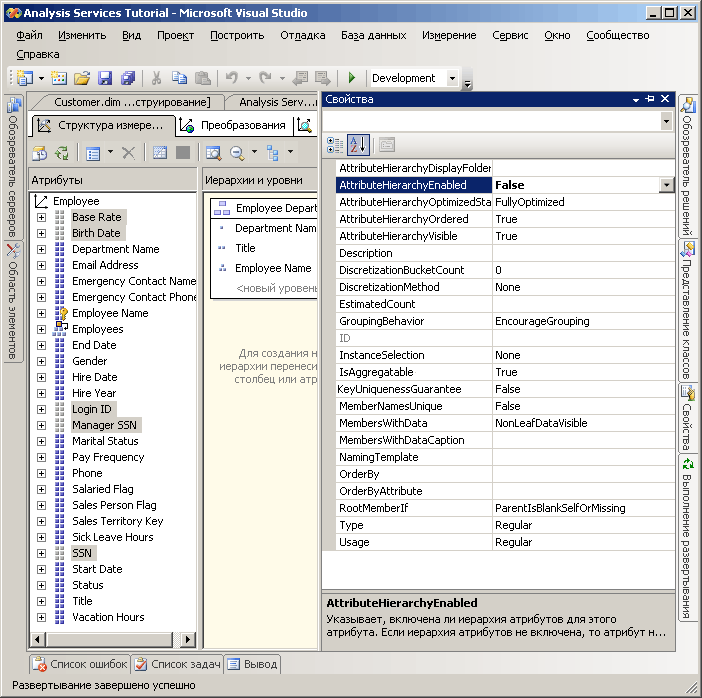
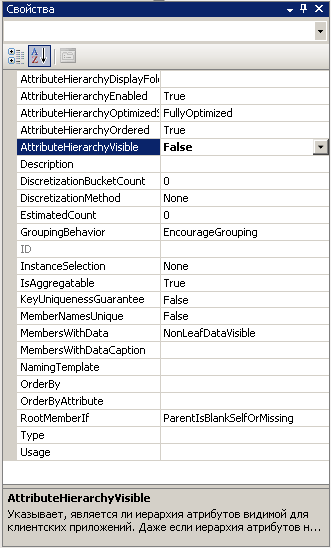

# Занятие 4-4-скрытие и отключение иерархий атрибутов
По умолчанию иерархия атрибута создается для каждого атрибута в измерении и каждая иерархия доступна для разделения данных фактов по измерениям. Эта иерархия состоит из уровня «Все» и уровня подробностей, содержащего все элементы иерархии. Ранее рассматривался вопрос о том, что атрибуты можно организовывать в пользовательские иерархии для предоставления путей перемещения в кубе. В определенных случаях может потребоваться отключить или скрыть некоторые атрибуты и их иерархии. Например, определенные атрибуты, такие как номера социального страхования или номера национальной принадлежности, ставки заработной платы, даты рождения и имена входа в систему не являются атрибутами, по которым пользователь будет организовывать измерения куба. Эти сведения обычно просматриваются только для справки по конкретному члену атрибута. Данные иерархии атрибутов может потребоваться скрыть, оставляя видимыми только сами атрибуты как свойства члена конкретного атрибута. Кроме того, может возникнуть необходимость сделать элементы других атрибутов, такие как имена заказчиков или почтовые индексы, видимыми только при просмотре через пользовательскую иерархию, а не независимо через иерархию атрибута. Одной из причин для этого может быть большое число различающихся элементов в иерархии атрибута. Наконец, чтобы увеличить производительность обработки, следует выключить иерархии атрибутов, которыми не будут пользоваться пользователи.  
  
Значение свойства **AttributeHierarchyEnabled** определяет, создана ли иерархия атрибута. Если значением свойства является **False**, иерархия атрибутов не создана и атрибут нельзя использовать в качестве уровня пользовательской иерархии, то есть иерархия атрибутов существует только как свойство элемента. Однако отключенную иерархию атрибута можно использовать для сортировки элементов другого атрибута. Если значением свойства **AttributeHierarchyEnabled** является **True**, значение свойства **AttributeHierarchyVisible** определяет, является ли иерархия атрибута видимой независимо от пользовательской иерархии.  
  
Если иерархия атрибута включена, может возникнуть необходимость указать значения следующих трех дополнительных свойств.  
  
-   **IsAggregatable**  
  
    По умолчанию для всех иерархий атрибутов задается уровень «(Все)». Чтобы отключить уровень "(Все)" для включенной иерархии атрибутов, задайте для этого свойства значение **False**.  
  
    > [!NOTE]  
    > Атрибут, свойство **IsAggregatable** которого установлено в значение false, может использоваться только в качестве корневого элемента многоуровневой иерархии, и для него должен быть указан элемент по умолчанию (в противном случае элемент по умолчанию будет выбран ядром служб [!INCLUDE[ssASnoversion](../includes/ssasnoversion-md.md)] ).  
  
-   **AttributeHierarchyOrdered**  
  
    По умолчанию в службах [!INCLUDE[ssASnoversion](../includes/ssasnoversion-md.md)] элементы включенных иерархий атрибутов сортируются при обработке, а затем сохраняются в зависимости от значения свойства **OrderBy** , например «Имя» или «Ключ». Если сортировка не важна, производительность обработки можно повысить, указав для этого свойства значение **False**.  
  
-   **AttributeHierarchyOptimizedState**  
  
    По умолчанию в службах [!INCLUDE[ssASnoversion](../includes/ssasnoversion-md.md)] создается индекс для каждой включенной иерархии атрибута при обработке, чтобы повысить производительность выполнения запросов. Если не планируется использовать иерархию атрибута для просмотра, можно повысить производительность обработки, задав в качестве значения этого свойства **NotOptimized**. Тем не менее, если скрытая иерархия используется в качестве ключевого атрибута измерения, создание индекса элементов атрибута позволит повысить производительность.  
  
Эти свойства неприменимы, если иерархия атрибута отключена.  
  
В задачах этого раздела необходимо отключить номера социального страхования и другие атрибуты в измерении «Сотрудники», которые не будут использоваться для просмотра. Затем предстоит скрыть иерархии атрибутов имени заказчика и почтового кода в измерении «Заказчик». Если у этих иерархий много элементов атрибутов, их просмотр будет достаточно медленным вне зависимости от пользовательской иерархии.  
  
## Определение свойств иерархии атрибута в измерении «Сотрудники»  
  
1.  Перейдите в конструктор измерений на измерение «Сотрудники» и откройте вкладку **Обозреватель** .  
  
2.  Проверьте, включены ли в список **Иерархия** следующие иерархии атрибутов:  
  
    -   **Базовая ставка**  
  
    -   **Дата рождения**  
  
    -   **Идентификатор входа**  
  
    -   **ИНН менеджера**  
  
    -   **ИНН**  
  
3.  Перейдите на вкладку **Структура измерения** , а затем выберите следующие атрибуты на панели **Атрибуты** . Можно выбрать несколько мер. Для этого щелкните каждую из них, удерживая нажатой клавишу CTRL.  
  
    -   **Базовая ставка**  
  
    -   **Дата рождения**  
  
    -   **Идентификатор входа**  
  
    -   **ИНН менеджера**  
  
    -   **ИНН**  
  
4.  В окне свойств установите для свойства **AttributeHierarchyEnabled** выбранных атрибутов значение **False** .  
  
    Обратите внимание, что на панели **Атрибуты** значок каждого из атрибута изменился и указывает, что этот атрибут отключен.  
  
    На рисунке ниже показано, что для свойства **AttributeHierarchyEnabled** выбранных атрибутов установлено значение False.  
  
      
  
5.  В меню **Сборка** выберите команду **Развернуть Analysis Services Tutorial**.  
  
6.  После успешного окончания обработки перейдите на вкладку **Обзор** , нажмите кнопку **Повторное соединение**и затем попытайтесь просмотреть измененные иерархии атрибутов.  
  
    Обратите внимание, что элементы измененных атрибутов недоступны для просмотра в качестве иерархий атрибутов в списке **Иерархия** . При попытке добавления отключенной иерархии атрибута в качестве уровня пользовательской иерархии будет выведено сообщение об ошибке, уведомляющее о том, что для включения в пользовательскую иерархию необходимо активировать иерархию атрибута.  
  
## Настройка свойств иерархии атрибута в измерении «Заказчик»  
  
1.  Перейдите в конструктор измерений на измерение «Заказчик» и откройте вкладку **Обозреватель** .  
  
2.  Проверьте, включены ли в список **Иерархия** следующие иерархии атрибутов:  
  
    -   **Полное имя**  
  
    -   **Почтовый индекс**  
  
3.  Перейдите на вкладку **Структура измерения** и выберите следующие атрибуты на панели **Атрибуты** , удерживая нажатой клавишу CTRL, чтобы выделить несколько атрибутов одновременно:  
  
    -   **Полное имя**  
  
    -   **Почтовый индекс**  
  
4.  В окне свойств установите для свойства **AttributeHierarchyEnabled** выбранных атрибутов значение **False** .  
  
    Поскольку элементы этих иерархий атрибутов будут использоваться для разделения данных фактов по измерениям, их сортировка и оптимизация повысит производительность. Таким образом, свойства этих атрибутов изменять не следует.  
  
    На рисунке ниже показано свойство **AttributeHierarchyVisible** , для которого установлено значение False.  
  
      
  
5.  Перетащите атрибут **Почтовый индекс** с панели **Атрибуты** в пользовательскую иерархию **География заказчика** панели **Иерархии и уровни** непосредственно под уровень **Город** .  
  
    Обратите внимание, что скрытый атрибут по-прежнему может быть уровнем пользовательской иерархии.  
  
6.  В меню **Сборка** выберите команду **Развернуть Analysis Services Tutorial**.  
  
7.  После успешного окончания развертывания перейдите на вкладку **Браузер** измерения «Заказчик» и нажмите кнопку **Повторное соединение**.  
  
8.  Попробуйте выбрать одну из измененных иерархий атрибутов в списке **Иерархия** .  
  
    Обратите внимание, что ни одна из измененных иерархий атрибутов не отображается в списке **Иерархия** .  
  
9. В списке **Иерархия** выберите значение **География заказчика**и просмотрите каждый из уровней на панели браузера.  
  
    Обратите внимание на то, что скрытые уровни **Почтовый индекс** и **Полное имя**видны в пользовательской иерархии.  
  
## Следующая задача занятия  
[Сортировка элементов атрибута по вторичному атрибуту](../analysis-services/lesson-4-5-sorting-attribute-members-based-on-a-secondary-attribute.md)  
  
  
  
