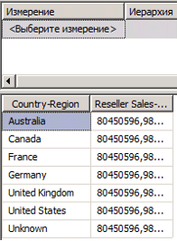
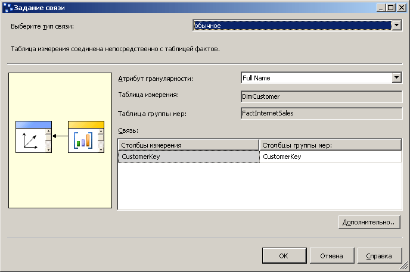

# Занятие 5-1-Определение ссылочной связи
До сих пор в этом учебнике каждое определенное измерение куба основывалось на таблице, непосредственно связанной с таблицей фактов для группы мер через связь «внешний ключ — первичный ключ». В задачах этого раздела измерение **География** будет связано с таблицей фактов через измерение **Торговый посредник** , которое называется *ссылочным измерением*. Это позволяет пользователям распределить товарооборот посредников по географии. Дополнительные сведения см. в разделе [Определение ссылочной связи и свойств ссылочной связи](../analysis-services/multidimensional-models/define-a-referenced-relationship-and-referenced-relationship-properties.md).  
  
## Распределение показателя «Товарооборот посредников» по измерению «География»  
  
1.  В обозревателе решений щелкните правой кнопкой мыши куб **Учебник по службам Analysis Services** в папке **Кубы** и выберите пункт **Обзор**.  
  
2.  Удалите из области данных все иерархии и убедитесь в том, что мера **Товарооборот посредников — объем продаж** появилась в области данных панели данных. Если эта мера на панели данных отсутствует, добавьте ее.  
  
3.  Из измерения **География** на панели метаданных перетащите определяемую пользователем иерархию **География** в область **Перетащите сюда поля строк** на панели данных.  
  
    Обратите внимание на то, что мера **Товарооборот посредников — объем продаж** распределена по элементам атрибута **Страна или регион** в иерархии **Регионы** неверно. Значение меры **Товарооборот посредников — объем продаж** повторяется для каждого элемента атрибута **Страна или регион** .  
  
      
  
4.  Откройте конструктор представлений источника данных для представления источников данных **Adventure Works DW 2012** .  
  
5.  На панели **Организатор диаграмм** просмотрите связь между таблицами **Geography** и **ResellerSales** .  
  
    Обратите внимание, что прямой связи между этими таблицами нет. Однако между ними существует косвенная связь через таблицу **Reseller** или **SalesTerritory** .  
  
6.  Дважды щелкните стрелку, представляющую связь между таблицей **Geography** и **Reseller** .  
  
    Обратите внимание, что в диалоговом окне **Изменение связи** столбец **GeographyKey** является первичным ключом в таблице **Geography** и внешним ключом в таблице **Reseller** .  
  
7.  Нажмите кнопку **Отмена**, перейдите в конструктор кубов для куба "Учебник по службам [!INCLUDE[ssASnoversion](../includes/ssasnoversion-md.md)] " и откройте вкладку **Использование измерений** .  
  
    Обратите внимание на то, что измерение куба **География** сейчас не имеет связей ни с группой мер **Продажи через Интернет** , ни с группой мер **Товарооборот посредников** .  
  
8.  Нажмите кнопку с многоточием (**…**) в ячейке **Полное имя** на пересечении измерения **Заказчик** и группы мер **Продажи через Интернет** .  
  
    Обратите внимание на то, что в диалоговом окне **Задание связи** между таблицей измерения **DimCustomer** и таблицей группы мер **FactInternetSales** определена связь с типом **обычная** , которая основана на столбце **CustomerKey** в каждой из этих таблиц. Все связи, определенные в этом учебнике до настоящего момента, имели такой тип.  
  
    На рисунке ниже показано диалоговое окно **Задание связи** с обычной связью между таблицей измерения **DimCustomer** и таблицей группы мер **FactInternetSales** .  
  
      
  
9. Нажмите кнопку **Отмена**.  
  
10. Нажмите кнопку с многоточием (**…**) в ячейке без имени на пересечении измерения **География** и группы мер **Товарооборот посредников** .  
  
    Обратите внимание на то, что в диалоговом окне **Задание связи** в настоящее время не определены никакие связи между измерением куба "География" и группой мер "Товарооборот посредников". Невозможно определить обычную связь, поскольку не существует прямой связи между таблицей измерения для измерения «География» и таблицей фактов для группы мер «Товарооборот посредников».  
  
11. В списке **Выберите тип связи** выберите значение **Ссылочная**.  
  
    Для определения ссылочной связи указывается измерение, непосредственно связанное с таблицей группы мер, которое называется *промежуточным измерением*и может использоваться в службах [!INCLUDE[ssASnoversion](../includes/ssasnoversion-md.md)] для связи ссылочного измерения с таблицей фактов. Затем следует указать атрибут, который связывает это ссылочное измерение с данным промежуточным измерением.  
  
12. В списке **Промежуточное измерение** выберите значение **Торговый посредник**.  
  
    Базовая таблица для измерения «География» связана с таблицей фактов через базовую таблицу для измерения «Торговый посредник».  
  
13. В списке **Атрибут ссылочного измерения** выберите значение **Ключ "География"**, а затем попробуйте выбрать **Ключ "География"** в списке **Атрибут промежуточного измерения** .  
  
    Обратите внимание на то, что параметр **Ключ "География"** не отображается в списке **Атрибут промежуточного измерения** . Это обусловлено тем, что столбец **GeographyKey** не определен в качестве атрибута измерения **Торговый посредник** .  
  
14. Нажмите кнопку **Отмена**.  
  
В следующей задаче предстоит решить эту проблему, определив атрибут, основанный на столбце GeographyKey в измерении «Торговый посредник».  
  
## Определение атрибута промежуточного измерения и ссылочной связи измерений  
  
1.  Откройте измерение **Торговый посредник** в конструкторе измерений и просмотрите столбцы в таблице **Reseller** на панели **Представление источника данных** , а также определенные атрибуты в измерении **Торговый посредник** на панели **Атрибуты** .  
  
    Обратите внимание, что, хотя GeographyKey определен как столбец в таблице Reseller, в измерении «Торговый посредник», основанном на этом столбце, атрибуты измерения не определены. «Geography» определена как атрибут измерения в измерении «География», поскольку это ключевой столбец, связывающий базовую таблицу для этого измерения с таблицей фактов.  
  
2.  Чтобы добавить атрибут **Географический ключ** в измерение **Торговый посредник**, щелкните правой кнопкой столбец **GeographyKey** на панели **Представление источника данных** и выберите команду **Создать атрибут из столбца**.  
  
3.  На панели **Атрибуты** выберите атрибут **Географический ключ** и в окне свойств задайте для свойства **AttributeHierarchyOptimizedState** значение **NotOptimized**, а для свойств **AttributeHierarchyOrdered** и **AttributeHierarchyVisible** — значение **False**.  
  
    Атрибут «Ключ "География"» в измерении «Торговый посредник» будет использоваться только чтобы связать измерение «География» с таблицей фактов «Товарооборот посредников». Поскольку он не будет использоваться для навигации и просмотра, не имеет смысла определять его как видимый. Помимо этого, упорядочение и оптимизация иерархии атрибута отразились бы на производительности обработки данных только отрицательно. Однако, чтобы служить связью между двумя измерениями, этот атрибут должен быть активирован.  
  
4.  Перейдите в конструкторе кубов к кубу "Учебник по службам [!INCLUDE[ssASnoversion](../includes/ssasnoversion-md.md)] ", откройте вкладку **Использование измерений** и нажмите кнопку с многоточием (**…**) на пересечении группы мер **Товарооборот посредников** и измерения куба **География** .  
  
5.  В списке **Выберите тип связи** выберите значение **Ссылочная**.  
  
6.  В списке **Промежуточное измерение** выберите значение **Торговый посредник**.  
  
7.  В списке **Атрибут ссылочного измерения** выберите **Ключ "География"**, а затем выберите **Ключ "География"** в списке **Атрибут промежуточного измерения** .  
  
    Обратите внимание, что установлен флажок **Материализовать** . Это является установкой по умолчанию для многомерных измерений OLAP (MOLAP). Материализация связи атрибута изменения заставляет значение связи между таблицей фактов и ссылочным измерением для каждой строки при обработке материализоваться, то есть сохраняться в структуре измерения MOLAP на время обработки. Это оказывает незначительное влияние на производительность и требования к хранению данных, но увеличивает производительность запросов (иногда значительно).  
  
8.  Нажмите кнопку **ОК**.  
  
    Обратите внимание, что измерение куба **География** теперь связано с группой мер **Товарооборот посредников** . Значок указывает, что связь является ссылочной связью измерений.  
  
9. В списке **Измерения** на вкладке **Использование измерений** щелкните правой кнопкой мыши измерение **География**и выберите команду **Переименовать**.  
  
10. Измените название этого измерения куба на **География торгового посредника**.  
  
    Так как это измерение куба теперь связано с группой мер **Товарооборот посредников** , явное определение его использования в кубе поможет пользователям в работе и позволит избежать возможных недоразумений.  
  
## Как правильно распределить показатель «Товарооборот посредников» по измерению «География»  
  
1.  В меню **Сборка** выберите команду **Развернуть Analysis Services Tutorial**.  
  
2.  После успешного завершения развертывания в конструкторе кубов, где открыт куб **Tutorial, перейдите на вкладку** Браузер [!INCLUDE[ssASnoversion](../includes/ssasnoversion-md.md)] и нажмите кнопку **Повторное соединение** .  
  
3.  На панели метаданных разверните элемент **География торгового посредника**, щелкните правой кнопкой мыши пункт **Географии**и выберите команду **Добавить в область строк**.  
  
    Обратите внимание на то, что мера **Товарооборот посредников — объем продаж** теперь верно распределена по элементам атрибута **Страна или Регион** в пользовательской иерархии **Географии** , что показано на рисунке ниже.  
  
      
  
## Следующая задача занятия  
[Определение связи фактов](../analysis-services/lesson-5-2-defining-a-fact-relationship.md)  
  
## См. также:  
[Связи атрибутов](../analysis-services/multidimensional-models-olap-logical-dimension-objects/attribute-relationships.md)  
[Определение ссылочной связи и свойств ссылочной связи](../analysis-services/multidimensional-models/define-a-referenced-relationship-and-referenced-relationship-properties.md)  
  
  
  

