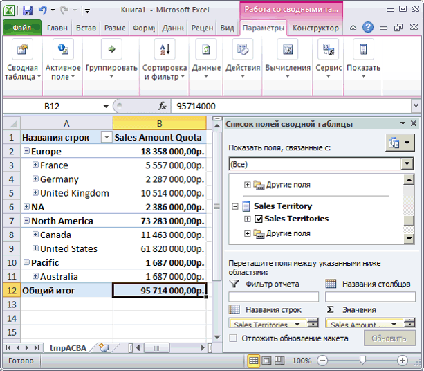
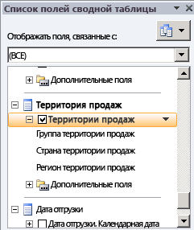
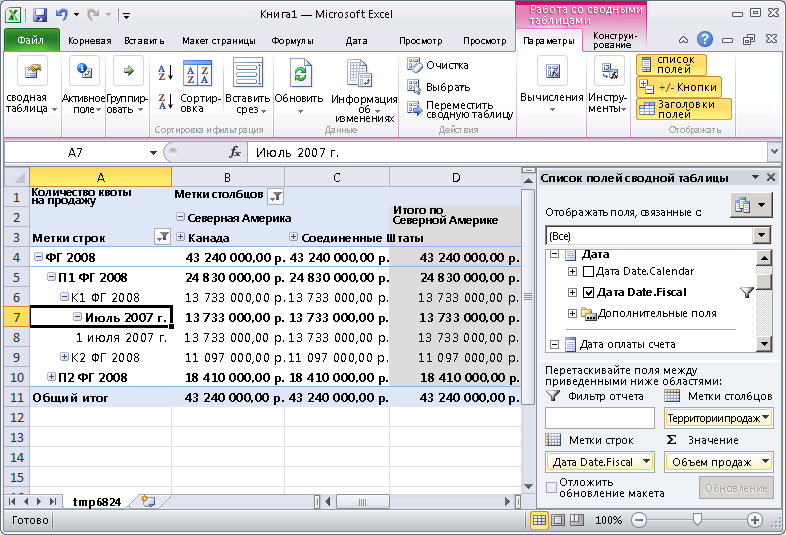
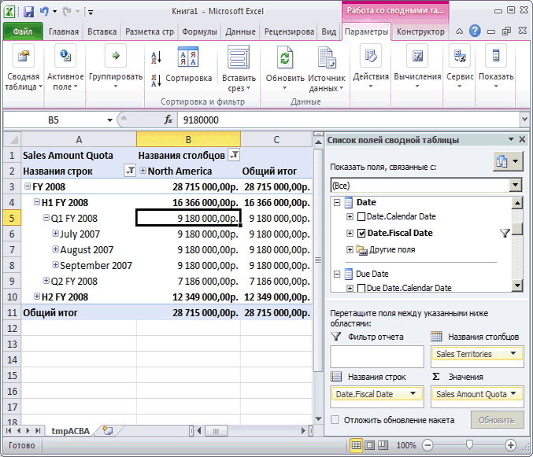

# Занятие 5-4-определение степени гранулярности измерения в группе мер
Для разных целей пользователям может понадобиться измерять данные фактов с разной степенью гранулярности или точности. Например, сведения о продажах через посредников или о продажах через Интернет могут записываться каждый день, в то время как данные о квотах продаж могут существовать только для уровня месяца или квартала. В таких случаях пользователям требуется, чтобы измерение времени обладало разной степенью гранулярности для каждой из этих разных таблиц фактов. Определить новое измерение базы данных как измерение времени с другой степенью гранулярности проще всего с помощью служб [!INCLUDE[ssASnoversion](../includes/ssasnoversion-md.md)].  
  
По умолчанию, если измерение используется в группе мер, службы [!INCLUDE[ssASnoversion](../includes/ssasnoversion-md.md)]выполняют грануляцию данных в этом измерении на основе ключевого атрибута измерения. Например, если измерение времени включено в группу мер и применяемая по умолчанию степень гранулярности измерения времени составляет один день, то применяемая по умолчанию степень детализации этого измерения в группе мер также равна одному дню. Это применимо во многих случаях, например для групп мер **Internet Sales** и **Товарооборот посредников** в этом учебнике. Но когда такое измерение включается в иные типы групп мер, такие как квоты продаж или группа бюджетных показателей, более подходящей степенью гранулярности будет месяц или квартал.  
  
Чтобы указать степень гранулярности измерения куба, которая отличается от используемой по умолчанию, следует изменить атрибут гранулярности данного измерения куба как применяемого в конкретной группе мер на вкладке **Использование измерений** в конструкторе кубов. При изменении степени детализации измерения в конкретной группе мер на атрибут, отличный от ключевого атрибута данного измерения, необходимо обеспечить прямую или косвенную связь всех остальных атрибутов в этой группе мер с новым атрибутом гранулярности. Для этого следует указать связи атрибутов между другими атрибутами и атрибутом, заданным как атрибут гранулярности для этой группы мер. В этом случае следует указать дополнительные связи атрибутов, не удаляя существующие связи между атрибутами. Атрибут, указанный как атрибут гранулярности, становится ключевым атрибутом в группе мер для оставшихся атрибутов измерения. Если требуемые связи атрибутов не указаны, в службах [!INCLUDE[ssASnoversion](../includes/ssasnoversion-md.md)] статистические вычисления будут вестись неверно, что демонстрируют задачи данного занятия.  
  
Дополнительные сведения см. в разделе [Связи измерений](../analysis-services/multidimensional-models-olap-logical-cube-objects/dimension-relationships.md), [Определение обычной связи и ее свойств](../analysis-services/multidimensional-models/define-a-regular-relationship-and-regular-relationship-properties.md).  
  
В задачах данного раздела требуется добавить группу мер Sales Quotas и определить помесячную степень гранулярности измерения даты в этой группе мер. Затем предстоит определить связи атрибутов месяца с другими атрибутами измерения, чтобы обеспечить правильность статистических вычислений в службах [!INCLUDE[ssASnoversion](../includes/ssasnoversion-md.md)] .  
  
## Добавление таблиц и определение группы мер Sales Quotas  
  
1.  Перейдите в представление источника данных **Adventure Works DW 2012** .  
  
2.  Щелкните правой кнопкой мыши в любом месте панели **Организатор диаграмм** , выберите пункт **Создать диаграмму**и назовите схему **Квоты продаж**.  
  
3.  Перетащите таблицы **Employee**, **Sales Territory**и **Date** с панели **Таблицы** на панель **Диаграмма** .  
  
4.  Добавьте таблицу **FactSalesQuota** на панель **Диаграмма** , щелкнув правой кнопкой мыши на панели **Диаграмма** и выбрав команду **Добавить или удалить таблицы**.  
  
    Обратите внимание, что таблица **SalesTerritory** связана с таблицей **FactSalesQuota** через таблицу **Сотрудник** .  
  
5.  Просмотрите столбцы таблицы **FactSalesQuota** и исследуйте данные в этой таблице.  
  
    Обратите внимание, что внутри этой таблицы гранулярность данных равна календарному кварталу, что является наиболее подробным уровнем детализации в таблице FactSalesQuota.  
  
6.  В конструкторе представлений источника данных измените свойство **FriendlyName** таблицы **FactSalesQuota** на **SalesQuotas**.  
  
7.  Переключитесь на куб [!INCLUDE[ssASnoversion](../includes/ssasnoversion-md.md)] Tutorial и откройте вкладку **Структура куба** .  
  
8.  Щелкните правой кнопкой мыши панель **Меры** , выберите команду **Создать группу мер**, в диалоговом окне **Создание группы мер** щелкните **SalesQuotas** и нажмите кнопку **ОК**.  
  
    Группа мер **Sales Quotas** будет отображена в панели **Меры** . В панели **Измерения** обратите внимание, что определено новое измерение куба **Date** на основе измерения **Date** базы данных. Определение нового измерения куба по времени объясняется неопределенностью в вопросе, какое из существующих связанных со временем измерений куба должно быть связано в службах [!INCLUDE[ssASnoversion](../includes/ssasnoversion-md.md)] со столбцом **DateKey** таблицы фактов **FactSalesQuota** , которая лежит в основе группы мер "Квоты продаж". Это будет исправлено позже, в другой задаче текущего раздела.  
  
9. Раскройте группу мер **Sales Quotas** .  
  
10. В панели **Меры** выберите элемент **Sales Amount Quota**и в окне свойств задайте для свойства **FormatString** значение **Валюта** .  
  
11. Выберите меру **Число квот продаж** и в окне свойств задайте для свойства **FormatString** значение **#,#** .  
  
12. Удалите меру **Calendar Quarter** из группы мер **Sales Quotas** .  
  
    [!INCLUDE[ssASnoversion](../includes/ssasnoversion-md.md)] будет определено, что лежащий в основе показателя Calendar Quarter столбец содержит меры. Однако данный столбец и столбец CalendarYear содержат значения, которые будут использованы позднее в этом разделе для связывания группы мер Sales Quotas с измерением даты.  
  
13. На панели **Меры** щелкните правой кнопкой мыши группу мер **Квоты продаж** и выберите команду **Создать меру**.  
  
    Будет открыто диалоговое окно **Создать меру** , содержащее доступные исходные столбцы для меры с типом использования **Sum**.  
  
14. В диалоговом окне **Создать меру** в списке **Использование** выберите значение **Подсчет различных объектов** , убедитесь, что в списке **Исходная таблица** выбрана таблица **SalesQuotas** , выберите в списке **Исходный столбец** столбец **EmployeeKey** и нажмите кнопку **ОК**.  
  
    Обратите внимание, что это измерение создается в новой группе мер с именем **Sales Quotas 1**. Меры числа различных объектов в [!INCLUDE[ssNoVersion](../includes/ssnoversion-md.md)] создаются в их собственных группах мер, чтобы повысить скорость обработки.  
  
15. Задайте для свойства **Name** меры **Количество различных ключей сотрудников** значение **Число менеджеров по продажам**, а для свойства **FormatString** значение **#,#** .  
  
## Просмотр мер в группе Sales Quota по датам  
  
1.  В меню **Сборка** выберите команду **Развернуть Analysis Services Tutorial**.  
  
2.  После успешного завершения развертывания в конструкторе кубов, где открыт куб "Учебник по **", перейдите на вкладку** Браузер [!INCLUDE[ssASnoversion](../includes/ssasnoversion-md.md)] и нажмите кнопку **Повторное соединение**.  
  
3.  Щелкните ярлык Excel, а затем выберите **Включить**.  
  
4.  В списке полей сводной таблицы разверните группу мер **Sales Quotas** , а затем перетащите меру **Sales Amount Quota** в область значений.  
  
5.  Разверните измерение **Территория продаж** и перетащите определенную пользователем иерархию **Территории продаж** в область меток строк.  
  
    Обратите внимание, что измерение куба Sales Territory ни прямо, ни косвенно не связано с таблицей фактов квот продаж, как показано на следующем рисунке.  
  
      
  
    На следующих этапах этого раздела будет определена ссылочная связь измерений между данным измерением и данной таблицей фактов.  
  
6.  Переместите определенную пользователем иерархию **Sales Territories** из области «Метки строк» в область «Метки столбцов».  
  
7.  В списке полей сводной таблицы выберите определенную пользователем иерархию **Территории продаж** и щелкните стрелку вниз справа.  
  
      
  
8.  В фильтре установите флажок «Выбрать все», чтобы сбросить все выбранные элементы, а затем выберите только **North America**.  
  
      
  
9. В списке полей сводной таблицы разверните узел **Дата**.  
  
10. Перетащите определенную пользователем иерархию **Date.Fiscal Дата** в область «Метки строк».  
  
11. Внутри сводной таблицы щелкните стрелку вниз рядом с названием «Метки строк». Снимите флажки для всех годов, кроме **FY 2008**.  
  
    Обратите внимание, что на уровне **Month** появился только элемент **July 2007** вместо элементов **July, 2007**, **August, 2007**и **September, 2007** уровня **Month** , а на уровне **Date** появился только один элемент **July 1, 2007** вместо всех дней июля (31). Это обусловлено тем, что для данной таблицы фактов степень гранулярности установлена на уровне квартала, а степень гранулярности для измерения **Time** установлена на уровне дня. Это будет изменено позже, в следующей задаче данного раздела.  
  
    Кроме того, обратите внимание, что значение **Sales Amount Quota** на уровнях месяца и дня равно соответствующему значению на уровне квартала и составляет 13 733 000,00 доллара США. Это связано с тем, что самый подробный уровень данных для группы мер «Квоты продаж» соответствует кварталу. Это поведение будет изменено на занятии 6.  
  
    На следующем рисунке показаны значения элемента **Sales Amount Quota**.  
  
      
  
## Определение свойств использования измерений для группы мер Sales Quotas  
  
1.  Откройте в конструкторе измерений измерение **Сотрудник** , щелкните правой кнопкой мыши столбец **SalesTerritoryKey** на панели **Представление источника данных** и выберите команду **Создать атрибут из столбца**.  
  
2.  В панели **Атрибуты** выберите атрибут **SalesTerritoryKey**и в окне свойств задайте для свойства **AttributeHierarchyVisible** значение **False** , затем для свойства **AttributeHierarchyOptimizedState** задайте значение **NotOptimized**, а для свойства **AttributeHierarchyOrdered** — значение **False**.  
  
    Этот атрибут необходим для связи измерения **Территория продаж** с группами мер **Квоты продаж** и **Квоты продаж 1** в качестве ссылочного измерения.  
  
3.  В конструкторе кубов выберите куб [!INCLUDE[ssASnoversion](../includes/ssasnoversion-md.md)] Tutorial и откройте вкладку **Использование измерений** , а затем просмотрите использование измерений в группах мер **Sales Quotas** и **Sales Quotas 1** .  
  
    Обратите внимание, что измерения куба **Сотрудник** и **Дата** соединены с группами мер **Квоты продаж и Квоты продаж 1** обычными связями. Кроме того, обратите внимание, что измерение куба **Территория продаж** не связано ни с одной из этих групп мер.  
  
4.  Щелкните ячейку на пересечении группы мер **Квоты продаж** и измерения **Территория продаж** , а затем нажмите кнопку обзора (**...**). Будет открыто диалоговое окно **Задание связи** .  
  
5.  В списке **Выберите тип связи** выберите значение **Ссылочная**.  
  
6.  В списке **Промежуточное измерение** выберите значение **Employee**.  
  
7.  В списке **Атрибут ссылочного измерения** выберите значение **Sales Territory Region**.  
  
8.  В списке **Атрибут промежуточного измерения** выберите значение **Sales Territory Key**. (Ключевым столбцом атрибута «Регион территории продаж» является столбец SalesTerritoryKey.)  
  
9. Убедитесь, что установлен флажок **Материализовать** .  
  
10. Нажмите кнопку **ОК**.  
  
11. Щелкните ячейку на пересечении группы мер **Квоты продаж 1** и измерения **Территория продаж** , а затем нажмите кнопку обзора (**...**). Будет открыто диалоговое окно **Задание связи** .  
  
12. В списке **Выберите тип связи** выберите значение **Ссылочная**.  
  
13. В списке **Промежуточное измерение** выберите значение **Employee**.  
  
14. В списке **Атрибут ссылочного измерения** выберите значение **Sales Territory Region**.  
  
15. В списке **Атрибут промежуточного измерения** выберите значение **Sales Territory Key**. (Ключевым столбцом атрибута «Регион территории продаж» является столбец SalesTerritoryKey.)  
  
16. Убедитесь, что установлен флажок **Материализовать** .  
  
17. Нажмите кнопку **ОК**.  
  
18. Удалите измерение куба **Date** .  
  
    Вместо четырех связанных со временем измерений куба в качестве даты, относительно которой будут распределяться квоты продаж, будет использоваться измерение куба **Дата заказа** из группы мер **Квоты продаж** . Это измерение куба также будет использоваться как первичное измерение даты в кубе.  
  
19. В списке **Измерения** переименуйте измерение куба **Order Date** в **Date**.  
  
    Переименование измерения куба **Order Date** на **Date** упрощает его восприятие как первичного измерения даты в этом кубе.  
  
20. Нажмите кнопку обзора (**…**) в ячейке на пересечении группы мер **Квоты продаж** и измерения **Дата** .  
  
21. В диалоговом окне **Определение связи** в списке **Выберите тип связи** выберите значение **Обычная** .  
  
22. В списке **Атрибут гранулярности** выберите значение **Calendar Quarter**.  
  
    Будет выведено предупреждение, что в качестве атрибута гранулярности выбран неключевой атрибут и необходимо убедиться, что все остальные атрибуты прямо или косвенно связаны с этим атрибутом гранулярности, указав их в качестве свойств элементов.  
  
23. В области **Связи** диалогового окна **Задание связи** соедините столбцы измерений **CalendarYear** и **CalendarQuarter** из таблицы, лежащей в основе измерения Date куба, со столбцами **CalendarYear** и **CalendarQuarter** из таблицы, лежащей в основе группы мер Sales Quota, а затем нажмите кнопку **ОК**.  
  
    > [!NOTE]  
    > Атрибут Calendar Quarter определен как атрибут гранулярности для измерения Date куба в группе мер Sales Quotas, однако атрибут Date продолжает оставаться атрибутом гранулярности для групп мер Internet Sales и Reseller Sales.  
  
24. Повторите предыдущие четыре шага для группы мер **Sales Quotas 1** .  
  
## Определение связей атрибутов между атрибутом Calendar Quarter и другими атрибутами измерения даты  
  
1.  Отройте в **конструкторе измерений** измерение **Date** и перейдите на вкладку **Связи атрибутов** .  
  
    Обратите внимание, что, хотя атрибут **Календарный год** связан с атрибутом **Календарный квартал** через атрибут **Календарное полугодие** , атрибуты финансового календаря связаны только друг с другом. Они не соединены с атрибутом **Календарный квартал** , и потому статистические вычисления в группе мер **Квоты продаж** будут выполняться неправильно.  
  
2.  На диаграмме щелкните правой кнопкой мыши атрибут **Календарный квартал** , а затем выберите команду **Создать связь атрибутов**.  
  
3.  В диалоговом окне **Создание связи атрибутов** поле **Исходный атрибут** имеет значение **Calendar Quarter**. Установите поле **Связанный атрибут** в значение **Fiscal Quarter**.  
  
4.  Нажмите кнопку **ОК**.  
  
    Обратите внимание на предупреждение о том, что измерение **Дата** содержит одну или несколько избыточных связей атрибутов, которые могут помешать статистической обработке данных, если в кубе в качестве атрибута гранулярности используется неключевой атрибут.  
  
5.  Удалите связь атрибута **Финансовый квартал** с атрибутом **Название месяца** .  
  
6.  В меню **Файл** выберите команду **Сохранить все**.  
  
## Просмотр мер в группе Sales Quota по датам  
  
1.  В меню **Сборка** выберите команду **Развернуть Analysis Services Tutorial**.  
  
2.  После успешного завершения развертывания перейдите на вкладку **Браузер** конструктора кубов для куба [!INCLUDE[ssASnoversion](../includes/ssasnoversion-md.md)] Tutorial и нажмите кнопку **Повторное соединение**.  
  
3.  Щелкните ярлык Excel, а затем выберите **Включить**.  
  
4.  Перетащите меру **Sales Amount Quota** в область значений.  
  
5.  Перетащите определенную пользователем иерархию **Sales Territories** в область «Метки столбцов», а затем примените фильтр по значению **North America**.  
  
6.  Перетащите пользовательскую иерархию **Date.FiscalDate** в область «Метки строк», а затем щелкните стрелку вниз рядом с названием **Метки столбцов** в сводной таблице и снимите все флажки, кроме **FY 2008**, чтобы отобразить данные только для финансового года 2008.  
  
7.  Нажмите кнопку «ОК».  
  
8.  Последовательно разверните элементы **FY 2008**, **H1 FY 2008**и **Q1 FY 2008**.  
  
    На следующем рисунке показана сводная таблица для куба [!INCLUDE[ssASnoversion](../includes/ssasnoversion-md.md)] Tutorial, при этом группа мер Sales Quota правильно распределена по измерениям.  
  
    Обратите внимание, что все элементы уровня финансового квартала имеют значение, соответствующее уровню квартала. Возьмем для примера **Q1 FY 2008** . Квота $ 9 180 000,00 для **Q1 FY 2008** также является значением каждого элемента этого квартала. Это обусловлено тем, что для данной таблицы фактов степень гранулярности установлена на уровне квартала, а степень гранулярности для измерения Date также установлена на уровне квартала. На занятии 6 рассматривается, как распределять квартальную сумму пропорционально по месяцам.  
  
      
  
## Следующее занятие  
[Занятие 6. Определение вычислений](../analysis-services/lesson-6-defining-calculations.md)  
  
## См. также:  
[Связи измерений](../analysis-services/multidimensional-models-olap-logical-cube-objects/dimension-relationships.md)  
[Определение обычной связи и ее свойств](../analysis-services/multidimensional-models/define-a-regular-relationship-and-regular-relationship-properties.md)  
[Работа с диаграммами в конструкторе представлений источника данных (службы Analysis Services)](../analysis-services/multidimensional-models/work-with-diagrams-in-data-source-view-designer-analysis-services.md)  
  
  
  

