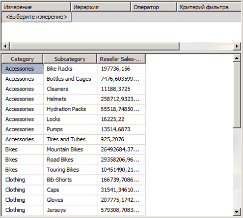
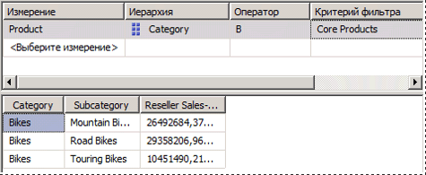
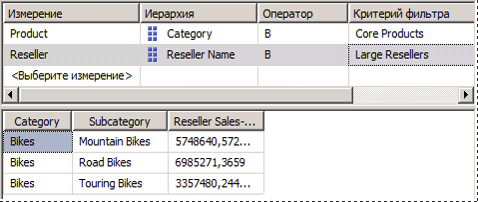

# <a name="lesson-6-2---defining-named-sets"></a>Урок 6-2 - определении именованных наборов
[!INCLUDE[ssas-appliesto-sqlas](../includes/ssas-appliesto-sqlas.md)]

Именованный набор представляет собой многомерное выражение, возвращающее набор (множество) элементов измерения. Можно определять именованные наборы и сохранять их как часть определения куба, а также создавать именованные наборы в клиентских приложениях. Для создания именованных наборов используется сочетание данных куба, арифметических операторов, чисел и функций. Именованные наборы могут применяться пользователями в запросах многомерных выражений в клиентских приложениях, а также для определения наборов во вложенных кубах. Вложенный куб представляет собой коллекцию перекрестно соединенных наборов, ограничивающую для последующих инструкций пространство куба заданным подпространством. Определение ограниченного пространства куба является базовой концепцией в построении сценариев многомерных выражений.  
  
Именованные наборы упрощают запросы многомерных выражений и служат удобными псевдонимами для сложных регулярно используемых выражений наборов. Например, можно определить именованный набор с именем «Крупные торговые посредники», содержащий набор элементов измерения «Торговые посредники», у которых имеется наибольшее число служащих. Тогда конечные пользователи смогут использовать именованный набор «Крупные торговые посредники» в запросах, а вы сможете использовать его, чтобы определить набор во вложенном кубе. Определения именованных наборов хранятся в кубах, но их значения существуют только в памяти. Чтобы создать именованный набор, можно воспользоваться командой **Создать именованный набор** на вкладке **Вычисления** конструктора кубов. Дополнительные сведения см. в разделе [Вычисления](../analysis-services/multidimensional-models-olap-logical-cube-objects/calculations.md), [Создание именованных наборов](../analysis-services/multidimensional-models/create-named-sets.md).  
  
В заданиях этого раздела требуется определить два именованных набора: именованный набор «Основные товары» и именованный набор «Крупные торговые посредники».  
  
## <a name="defining-a-core-products-named-set"></a>Определение именованного набора «Основные товары»  
  
1.  Перейдите на вкладку **Вычисления** конструктора кубов, перейдите к кубу [!INCLUDE[ssASnoversion](../includes/ssasnoversion-md.md)] Tutorial и нажмите кнопку **Представление формы** на панели инструментов.  
  
2.  В области **Организатор скриптов** щелкните элемент **[Общая доля продаж по всей номенклатуре продукции]** и на панели инструментов вкладки **Вычисления** нажмите кнопку **Создать именованный набор** .  
  
    При определении нового вычисления на вкладке **Вычисления** следует помнить, что вычисления разрешаются в том порядке, в каком они приведены на панели **Организатор скриптов** . Положение фокуса ввода в этой панели при создании нового вычисления определяет порядок выполнения вычисления; определение нового вычисления создается непосредственно за тем вычислением, на котором находится фокус ввода.  
  
3.  В поле **Имя** измените имя нового именованного набора на **[Основные товары]**.  
  
    На панели **Организатор скриптов** обратите внимание на особый значок, отличающий именованный набор от команды скрипта или вычисляемого элемента.  
  
4.  На вкладке **Метаданные** панели **Средства вычисления** последовательно раскройте элементы **Продукт**, **Категория**, **Элементы**и **Все товары**.  
  
    > [!NOTE]  
    > Если в области **Средства вычисления** не отображаются метаданные, нажмите кнопку **Повторное соединение** на панели инструментов. Если это не помогает, возможно, следует выполнить обработку куба или запустить экземпляр служб [!INCLUDE[ssASnoversion](../includes/ssasnoversion-md.md)].  
  
5.  Перетащите элемент **Велосипеды** в поле **Выражение** .  
  
    Создано выражение набора, которое будет возвращать набор элементов, относящихся к категории «Велосипед» в измерении «Продукт».  
  
## <a name="defining-a-large-resellers-named-set"></a>Определение именованного набора «Крупные торговые посредники»  
  
1.  Щелкните правой кнопкой мыши пункт **[Основные товары]** на панели **Организатор скриптов** и выберите пункт **Создать именованный набор**.  
  
2.  В поле **Имя** измените имя этого именованного набора на **[Крупные торговые посредники]**.  
  
3.  В поле **Выражение** введите **Exists()**.  
  
    Для получения набора элементов с наибольшим числом сотрудников из иерархии атрибута "Имя торгового посредника" при ее пересечении с набором элементов в иерархии атрибута "Количество сотрудников" будет использована функция Exists.  
  
4.  На панели **Метаданные** области **Средства вычисления** раскройте измерение **Торговый посредник** , а затем раскройте иерархию атрибута **Имя торгового посредника** .  
  
5.  Перетащите уровень **Имя торгового посредника** в скобки выражения набора Exists.  
  
    Для получения всех элементов этого набора будет использоваться функция Members. Дополнительные сведения см. в разделе [Элементы (набор) (MDX)](../mdx/members-set-mdx.md).  
  
6.  После части выражения набора введите точку, а затем добавьте функцию Members. Выражение должно иметь следующий вид:  
  
    ```  
    Exists([Reseller].[Reseller Name].[Reseller Name].Members)  
    ```  
  
    Теперь, когда определен первый набор для выражения Exists, можно приступить к добавлению второго набора — набора элементов измерения "Торговый посредник", который содержит наибольшее количество сотрудников.  
  
7.  На панели **Метаданные** области **Средства вычисления** раскройте пункт **Количество сотрудников** в измерении "Торговый посредник", затем — строку **Элементы**и уровень **Все торговые посредники**.  
  
    Обратите внимание, что элементы этой иерархии атрибута не распределены по группам.  
  
8.  Откройте конструктор измерений для измерения **Торговый посредник** и в панели **Атрибуты** выберите элемент **Количество сотрудников** .  
  
9. В окне свойств измените значение свойства **DiscretizationMethod** на **Автоматический**, а затем измените значение свойства **DiscretizationBucketCount** на **5**. Дополнительные сведения см. в разделе [Группирование элементов атрибутов (дискретизация)](../analysis-services/multidimensional-models/attribute-properties-group-attribute-members.md).  
  
10. В меню **Построение** среды [!INCLUDE[ssBIDevStudioFull](../includes/ssbidevstudiofull-md.md)]выберите команду **Развернуть Analysis Services Tutorial**.  
  
11. После успешного завершения развертывания переключитесь в конструктор кубов, выберите куб учебника по службам [!INCLUDE[ssASnoversion](../includes/ssasnoversion-md.md)] и нажмите кнопку **Повторное соединение** на панели инструментов **Вычисления** .  
  
12. На вкладке **Метаданные** панели **Средства вычисления** раскройте пункт **Количество сотрудников** в измерении **Торговый посредник** , затем — строку **Элементы**и уровень **Все торговые посредники**.  
  
    Обратите внимание, что элементы иерархии атрибута теперь содержатся в пяти группах с номерами от 0 до 4. Чтобы увидеть номер группы, наведите курсор на группу, чтобы просмотреть всплывающую подсказку. Для диапазона `2 -17`всплывающая подсказка должна содержать `[Reseller].[Number of Employees].&[0]`.  
  
    Элементы этой иерархии атрибута распределены по группам, так как свойству DiscretizationBucketCount присвоено значение **5** , а свойству DiscretizationMethod — значение **Автоматический**.  
  
13. В поле **Выражение** добавьте запятую в выражении для набора Exists после функции Members и перед закрывающей скобкой, а затем перетащите элемент **83 — 100** с панели **Метаданные** и поместите его после запятой.  
  
    Составлено выражение для набора Exists, которое будет возвращать набор элементов, пересекающийся с двумя указанными наборами: набором всех торговых посредников и набором посредников, имеющих от 83 до 100 сотрудников, когда на одной из осей будет находиться именованный набор "Крупные торговые посредники".  
  
    На рисунке ниже показана панель **Выражения для вычислений** для именованного набора **[Крупные торговые посредники]** .  
  
    ![Панель «Выражения вычисления» для [Крупные торговые посредники]](../analysis-services/media/l6-named-set-02.gif "панель «выражения вычисления» для [Крупные торговые посредники]")  
  
14. На панели инструментов вкладки **Вычисления** нажмите кнопку **Представление скрипта**и просмотрите два именованных набора, которые были добавлены к скрипту вычислений.  
  
15. Добавьте к скрипту вычислений новую строку непосредственно перед первой командой CREATE SET, а затем добавьте к скрипту в отдельной строке следующий текст:  
  
    ```  
    /* named sets */  
    ```  
  
    Определены два именованных набора, которые отображаются на панели **Организатор скриптов** . Теперь можно приступить к развертыванию этих именованных наборов и просмотру соответствующих измерений в кубе [!INCLUDE[ssASnoversion](../includes/ssasnoversion-md.md)] Tutorial.  
  
## <a name="browsing-the-cube-by-using-the-new-named-sets"></a>Просмотр куба с использованием новых именованных наборов  
  
1.  В меню **Построение** среды [!INCLUDE[ssBIDevStudio](../includes/ssbidevstudio-md.md)]выберите команду **Развернуть Analysis Services Tutorial**.  
  
2.  После успешного окончания развертывания откройте вкладку **Обозреватель** и нажмите кнопку **Повторное соединение**.  
  
3.  Очистите сетку в области данных.  
  
4.  Добавьте меру **Товарооборот посредников — сумма продаж** в область данных.  
  
5.  Разверните измерение «Товар», а затем добавьте в область строк элементы «Категория» и «Подкатегория», как показано на следующем рисунке.  
  
      
  
6.  На панели **Метаданные** в измерении **Товар** перетащите **Основные товары** в область фильтра.  
  
    Обратите внимание, что в кубе остались только элемент **Велосипед** атрибута **Категория** и элементы подкатегорий, входящих в категорию **Велосипед** . Это произошло потому, что именованный набор **Основные товары** используется для определения вложенного куба. Этот вложенный куб ограничивает элементы атрибута **Категория** в измерении **Товар** внутри вложенного куба элементами именованного набора **Основные товары** , как показано на следующем рисунке.  
  
      
  
7.  На панели **Метаданные** разверните узел **Торговый посредник**, добавьте элемент **Крупные торговые посредники** в область фильтра.  
  
    Обратите внимание, что мера «Товарооборот посредников — сумма продаж» на панели данных содержит объем продаж только для крупных посредников, продающих велосипеды. Кроме того, обратите внимание, что в панели Фильтр теперь отображаются два созданных именованных набора, которые используются для определения именно этого вложенного куба, как показано на следующем рисунке.  
  
      
  
## <a name="next-lesson"></a>Следующее занятие  
[Занятие 7: Определение ключевых показателей эффективности & #40; Ключевые показатели эффективности & #41;](../analysis-services/lesson-7-defining-key-performance-indicators-kpis.md)  
  
## <a name="see-also"></a>См. также  
[Вычисления](../analysis-services/multidimensional-models-olap-logical-cube-objects/calculations.md)  
[Создание именованных наборов](../analysis-services/multidimensional-models/create-named-sets.md)  
  
  
  
