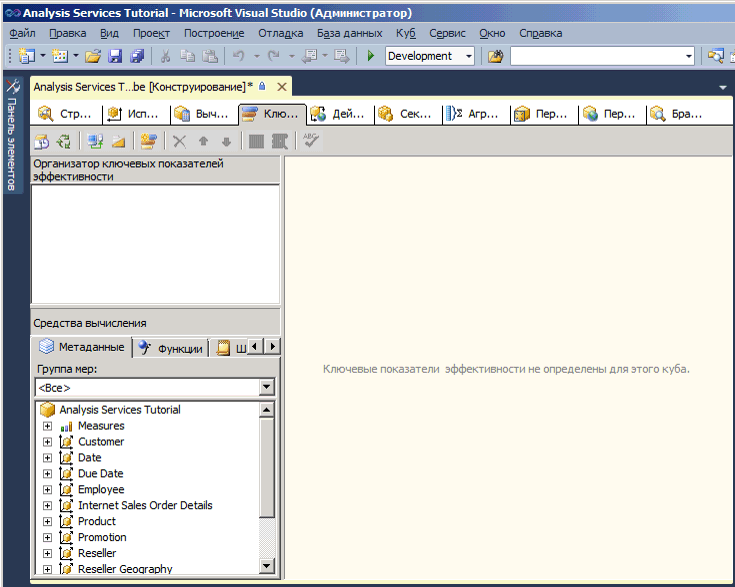
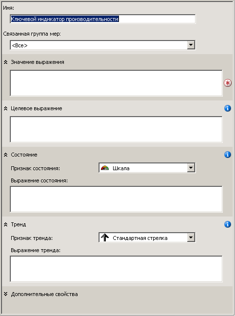

# <a name="lesson-7-1---defining-and-browsing-kpis"></a>Занятие 7-1-Определение и поиск ключевых показателей эффективности
Чтобы определить ключевые показатели эффективности, сначала задается имя показателя и группа мер, с которой он будет связан. Ключевой показатель эффективности может быть связан со всеми группами мер или с одной из них. Затем предстоит определить следующие элементы ключевого показателя эффективности:  
  
-   Выражение значения  
  
    Выражение значения представляет собой физическая мера (например, «Продажи»), вычисляемая мера (такая как «Прибыль») или вычисление, которое определено в ключевом показателе эффективности с использованием многомерного выражения.  
  
-   Целевое выражение  
  
    Целевое выражение представляет собой константу или многомерное выражение, результатом которого является значение, определяющее цель для меры, которая определяется выражением значения. Например, целевое выражение может быть суммой, на которую руководство предприятия хотело бы увеличить продажи или прибыль.  
  
-   Выражение состояния  
  
    Выражение состояния является многомерным выражением, в результате вычисления которого службы [!INCLUDE[ssASnoversion](../includes/ssasnoversion-md.md)] возвращают текущее состояние выражения значения относительно целевого выражения. Целевое значение представляет собой нормализованное значение в диапазоне от -1 до +1 (-1 — очень плохо, а +1 — очень хорошо). Выражение состояния отображается в графическом виде, позволяя легко определить состояние выражения значения относительно целевого выражения.  
  
-   Выражение тренда  
  
    Выражение тренда является многомерным выражением, которое используется в службах [!INCLUDE[ssASnoversion](../includes/ssasnoversion-md.md)] для вычисления текущего тренда (тенденции к увеличению или уменьшению) выражения значения по сравнению с целевым выражением. Выражение тренда помогает пользователю быстро определить, улучшается или ухудшается выражение значения относительно целевого выражения. С выражением тренда может быть связано одно или несколько графических изображений, что помогает пользователям быстро понять текущий тренд.  
  
В дополнение к перечисленным элементам, которые указываются для ключевого показателя эффективности, можно настроить несколько свойств ключевого показателя эффективности. К этим свойствам относятся папка отображения, родительский ключевой показатель эффективности, если показатель вычисляется по данным других показателей, текущий элемент времени (при его наличии), вес показателя (при его наличии), а также описание показателя.  
  
> [!NOTE]  
> Другие примеры ключевых показателей эффективности см. на вкладке "Шаблоны" панели "Средства вычисления" или в примерах для образца хранилища данных **Adventure Works DW 2012** . Дополнительные сведения об установке этой базы данных см. в разделе [Установка образцов данных и проектов для учебника по многомерному моделированию в службах Analysis Services](../analysis-services/install-sample-data-and-projects.md).  
  
В задачах этого занятия будут определены ключевые показатели эффективности в проекте [!INCLUDE[ssASnoversion](../includes/ssasnoversion-md.md)] Tutorial и выполнен их просмотр в кубе [!INCLUDE[ssASnoversion](../includes/ssasnoversion-md.md)] Tutorial. Будут определены следующие ключевые показатели эффективности.  
  
-   Доход от продаж через торгового посредника  
  
    С помощью этого показателя можно оценить, как фактический товарооборот посредников соотносится с квотами на продажи через посредников, как близко находится достигнутый объем продаж к целевому и каков тренд достижения цели.  
  
-   Коэффициент общей валовой прибыли продукта  
  
    Этот ключевой показатель эффективности показывает, насколько близок коэффициент общей валовой прибыли для каждого продукта к целевой границе, а также показывает тренд достижения этой цели.  
  
## <a name="defining-the-reseller-revenue-kpi"></a>Определение ключевого показателя эффективности «Доход от продаж через торгового посредника»  
  
1.  Откройте в конструкторе кубов куб [!INCLUDE[ssASnoversion](../includes/ssasnoversion-md.md)] Tutorial и перейдите на вкладку **Ключевые показатели эффективности** .  
  
    Вкладка **Ключевые показатели эффективности** содержит несколько панелей. В левой части вкладки расположены панели **Организатор ключевых показателей эффективности** и **Средства вычисления** . Панель отображения в центре вкладки содержит подробные сведения о показателе, выбранном на панели **Организатор ключевых показателей эффективности** .  
  
    На рисунке ниже показана вкладка **Ключевые показатели эффективности** конструктора кубов.  
  
      
  
2.  На панели инструментов вкладки **Ключевые показатели эффективности** нажмите кнопку **Создать ключевой показатель** .  
  
    На панели отображения будет выведен пустой шаблон показателя, как показано на следующем рисунке.  
  
      
  
3.  В поле **Имя** введите **Доход от продаж через торгового посредника**и выберите **Товарооборот посредников** в списке **Связанная группа мер** .  
  
4.  На вкладке **Метаданные** панели **Средства вычисления** раскройте узлы **Меры**и **Товарооборот посредника**и перетащите меру **Товарооборот посредников — объем продаж** в поле **Выражение значения** .  
  
5.  На вкладке **Метаданные** панели **Средства вычисления** раскройте узлы **Меры**и **Квоты продаж**и перетащите меру **Квота объемов продаж** в поле **Целевое выражение** .  
  
6.  Убедитесь в том, что в списке **Признак состояния** выбрано значение **Шкала** , и введите в поле **Выражение состояния** следующее многомерное выражение:  
  
    ```  
    Case  
     When   
      KpiValue("Reseller Revenue")/KpiGoal("Reseller Revenue")>=.95  
       Then 1  
     When  
      KpiValue("Reseller Revenue")/KpiGoal("Reseller Revenue")<.95  
       And   
      KpiValue("Reseller Revenue")/KpiGoal("Reseller Revenue")>=.85  
       Then 0  
      Else-1  
    End  
    ```  
  
    Многомерное выражение служит основой оценки достижения целевого значения. Данное многомерное выражение определяет, что если фактический товарооборот посредников составляет более 85 % от целевого объема, то для заполнения графического изображения используется значение 0. Так как в качестве графического символа используется шкала, указатель шкалы находится посередине. Если фактический товарооборот посредников составляет более 90 %, указатель будет показывать три четверти шкалы.  
  
7.  Убедитесь в том, что в списке **Признак тренда** выбрано значение **Стандартная стрелка** , и введите в поле **Выражение тренда** следующее выражение:  
  
    ```  
    Case  
     When IsEmpty  
      (ParallelPeriod  
       ([Date].[Calendar Date].[Calendar Year],1,  
           [Date].[Calendar Date].CurrentMember))  
      Then 0    
     When  (  
      KpiValue("Reseller Revenue") -   
       (KpiValue("Reseller Revenue"),   
        ParallelPeriod  
         ([Date].[Calendar Date].[Calendar Year],1,  
           [Date].[Calendar Date].CurrentMember))  
          /  
          (KpiValue ("Reseller Revenue"),  
           ParallelPeriod  
            ([Date].[Calendar Date].[Calendar Year],1,  
             [Date].[Calendar Date].CurrentMember)))  
           >=.02  
      Then 1  
       When(  
        KpiValue("Reseller Revenue") -   
         (KpiValue ( "Reseller Revenue" ),  
          ParallelPeriod  
           ([Date].[Calendar Date].[Calendar Year],1,  
            [Date].[Calendar Date].CurrentMember))  
           /  
            (KpiValue("Reseller Revenue"),  
             ParallelPeriod  
              ([Date].[Calendar Date].[Calendar Year],1,  
                [Date].[Calendar Date].CurrentMember)))  
            <=.02  
      Then -1  
       Else 0  
    End  
    ```  
  
    Это многомерное выражение служит основой оценки тренда по достижению заданной цели.  
  
## <a name="browsing-the-cube-by-using-the-reseller-revenue-kpi"></a>Просмотр куба с использованием ключевого показателя эффективности «Доход от продаж через торгового посредника»  
  
1.  В меню **Сборка** среды [!INCLUDE[ssBIDevStudioFull](../includes/ssbidevstudiofull-md.md)]выберите пункт **Развернуть Analysis Services Tutorial**.  
  
2.  После успешного завершения развертывания на панели инструментов вкладки **Ключевые показатели эффективности** нажмите кнопку **Представление браузера** , а затем кнопку **Повторное соединение**.  
  
    На панели **Браузер ключевых показателей эффективности** отображаются шкалы состояния и тренда на основании значений установленного по умолчанию элемента каждого из измерений вместе с текущим и целевым значениями. По умолчанию для каждого из измерений задан элемент «Все» уровня «Все», поскольку в качестве элемента по умолчанию не был указан другой элемент измерения.  
  
3.  На панели фильтра в списке **Измерение** выберите **Территория продаж** , в списке **Иерархия** выберите **Территории продаж** , в списке **Оператор** выберите **Равно** , а затем в списке **Критерий фильтра** установите флажок **Северная Америка** и нажмите кнопку **ОК**.  
  
4.  В следующей строке панели **Фильтр** в списке **Измерение** выберите пункт **Дата** , в списке **Иерархия** выберите пункт **Календарная дата** , в списке **Оператор** выберите пункт **Равно** , а затем в списке **Критерий фильтра** установите флажок **Q3 CY 2007** и нажмите кнопку **ОК**.  
  
5.  Щелкните в любом месте панели **Браузер ключевых показателей эффективности** , чтобы обновить значения показателя **Доход от продаж через торгового посредника**.  
  
    Обратите внимание, что разделы **Значение**, **Цель**и **Состояние** ключевого показателя эффективности отражают значения для нового периода времени.  
  
## <a name="defining-the-product-gross-profit-margin-kpi"></a>Определение ключевого показателя эффективности «Коэффициент общей валовой прибыли продукта»  
  
1.  Нажмите кнопку **Представление формы** на панели инструментов вкладки **Ключевые показатели эффективности** , а затем кнопку **Создать ключевой показатель эффективности** .  
  
2.  В поле **Имя** введите **Коэффициент общей валовой прибыли продукта**, а затем убедитесь в том, что в списке **<All>** Связанная группа мер **появился элемент** .  
  
3.  На вкладке **Метаданные** панели **Средства вычисления** перетащите меру **Итоговый коэффициент валовой прибыли** в поле **Выражение значения** .  
  
4.  В поле **Целевое выражение** введите следующее выражение:  
  
    ```  
    Case  
        When [Product].[Category].CurrentMember Is  
          [Product].[Category].[Accessories]  
        Then .40                   
        When [Product].[Category].CurrentMember   
          Is [Product].[Category].[Bikes]  
        Then .12                  
        When [Product].[Category].CurrentMember Is  
          [Product].[Category].[Clothing]  
        Then .20  
        When [Product].[Category].CurrentMember Is  
          [Product].[Category].[Components]  
        Then .10  
        Else .12              
    End  
    ```  
  
5.  В списке **Признак состояния** выберите **Цилиндр**.  
  
6.  Введите следующее многомерное выражение в поле **Выражение состояния** :  
  
    ```  
    Case  
        When KpiValue( "Product Gross Profit Margin" ) /   
             KpiGoal ( "Product Gross Profit Margin" ) >= .90  
        Then 1  
        When KpiValue( "Product Gross Profit Margin" ) /   
             KpiGoal ( "Product Gross Profit Margin" ) <  .90  
             And   
             KpiValue( "Product Gross Profit Margin" ) /   
             KpiGoal ( "Product Gross Profit Margin" ) >= .80  
        Then 0  
        Else -1  
    End  
    ```  
  
    Многомерное выражение служит основой оценки достижения целевого значения.  
  
7.  Убедитесь в том, что в списке **Признак тренда** выбрано значение **Стандартная стрелка** , и введите в поле **Выражение тренда** следующее многомерное выражение:  
  
    ```  
    Case  
    When IsEmpty  
      (ParallelPeriod  
       ([Date].[Calendar Date].[Calendar Year],1,  
           [Date].[Calendar Date].CurrentMember))  
      Then 0    
       When VBA!Abs  
        (  
          KpiValue( "Product Gross Profit Margin" ) -   
           (  
             KpiValue ( "Product Gross Profit Margin" ),  
              ParallelPeriod  
              (   
                [Date].[ Calendar Date].[ Calendar Year],  
                1,  
                [Date].[ Calendar Date].CurrentMember  
              )  
            ) /  
            (  
              KpiValue ( "Product Gross Profit Margin" ),  
              ParallelPeriod  
              (   
                [Date].[ Calendar Date].[ Calendar Year],  
                1,  
                [Date].[ Calendar Date].CurrentMember  
              )  
            )    
          ) <=.02  
      Then 0  
      When KpiValue( "Product Gross Profit Margin" ) -   
           (  
             KpiValue ( "Product Gross Profit Margin" ),  
             ParallelPeriod  
             (   
               [Date].[ Calendar Date].[ Calendar Year],  
               1,  
               [Date].[ Calendar Date].CurrentMember  
             )  
           ) /  
           (  
             KpiValue ( "Product Gross Profit Margin" ),  
             ParallelPeriod  
             (   
               [Date].[Calendar Date].[Calendar Year],  
               1,  
               [Date].[Calendar Date].CurrentMember  
             )  
           )  >.02  
      Then 1  
      Else -1  
    End  
    ```  
  
    Это многомерное выражение служит основой оценки тренда по достижению заданной цели.  
  
## <a name="browsing-the-cube-by-using-the-total-gross-profit-margin-kpi"></a>Просмотр куба с использованием ключевого показателя эффективности «Итоговый коэффициент валовой прибыли»  
  
1.  В меню **Сборка** выберите пункт **Развернуть Analysis Services Tutorial**.  
  
2.  После успешного завершения развертывания нажмите кнопку **Повторное подключение** на панели инструментов вкладки **Ключевые показатели эффективности** , а затем перейдите на панель **Представление браузера**.  
  
    Ключевой показатель эффективности **Коэффициент общей валовой прибыли продукта** показывает значение показателя для **Q3 CY 2007** и территории продаж **Северная Америка** .  
  
3.  На панели **Фильтр** в списке **Измерение** выберите значение **Продукт** , в списке **Иерархия** укажите значение **Категория** , в списке **Оператор** выберите значение **Равно** , а затем в списке **Критерий фильтра** выберите значение **Велосипеды** и нажмите кнопку **ОК**.  
  
    Выводится коэффициент валовой прибыли для продажи велосипедов через посредников в Северной Америке для Q3 CY 2007.  
  
## <a name="next-lesson"></a>Следующее занятие  
[Занятие 8. Определение действий](../analysis-services/lesson-8-defining-actions.md)  
  

