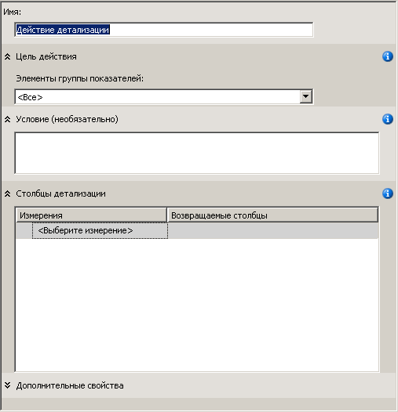
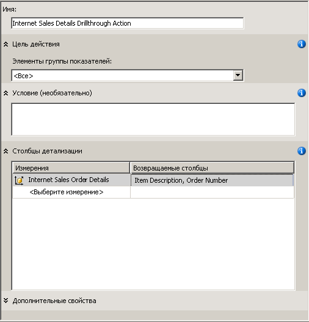
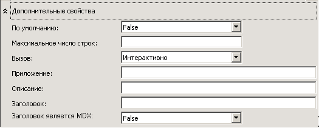
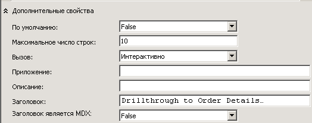
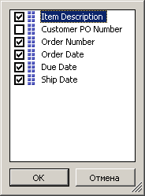
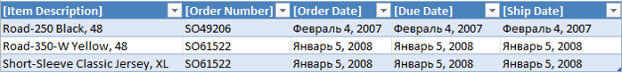

# Занятие 8-1-Определение и использование действия детализации
[!INCLUDE[ssas-appliesto-sqlas](../includes/ssas-appliesto-sqlas.md)]

Распределение данных фактов по измерениям фактов без верной фильтрации данных, возвращаемых запросом, может привести к снижению его производительности. Чтобы избежать этого, можно определить действие детализации, которое ограничит общее число возвращаемых строк. Это позволит значительно повысить производительность выполнения запросов.  
  
В задачах этого раздела предстоит создать действие детализации, возвращающее пользователям через Интернет подробные сведения о заказе на продажу.  
  
## Определение свойств действия детализации  
  
1.  Откройте куб "Учебник по [!INCLUDE[ssASnoversion](../includes/ssasnoversion-md.md)] " в конструкторе кубов и перейдите на вкладку **Действия** .  
  
    Вкладка **Действия** содержит несколько панелей. В левой части вкладки находятся панели **Организатор действий** и **Средства вычисления** . Справа от них находится панель **Отображение** , содержащая подробные сведения о действии, выбранном на панели **Организатор действий** .  
  
    На рисунке ниже показана вкладка **Действия** конструктора кубов.  
  
      
  
2.  На панели инструментов вкладки **Действия** нажмите кнопку **Создать действие детализации** .  
  
    В панели отображения появится пустой шаблон действия.  
  
      
  
3.  В поле **Имя** измените имя действия на **Действие детализации продаж через Интернет**.  
  
4.  В списке **Элементы группы мер** выберите значение **Продажи через Интернет**.  
  
5.  В поле **Столбцы детализации** выберите в списке **Измерения** значение **Подробности заказа через Интернет** .  
  
6.  В списке **Возвращаемые столбцы** установите флажки **Описание элемента** и **Номер заказа** , а затем нажмите кнопку **ОК**. На следующем рисунке показано, как выглядит шаблон действия в этот момент времени данной процедуры.  
  
      
  
7.  Разверните поле **Дополнительные свойства** , как показано на рисунке ниже.  
  
      
  
8.  В поле **Максимальное число строк** введите значение **10**.  
  
9. В поле **Заголовок** введите **Детализация сведений о заказе**.  
  
    Эти настройки ограничивают количество возвращаемых строк и указывают заголовок, отображаемый в меню клиентского приложения. На рисунке ниже показаны эти параметры в поле **Дополнительные свойства** .  
  
      
  
## Использование действия детализации  
  
1.  В меню **Сборка** выберите команду **Развернуть Analysis Services Tutorial**.  
  
2.  После успешного завершения развертывания в конструкторе кубов, где открыт куб **Tutorial, перейдите на вкладку** Браузер [!INCLUDE[ssASnoversion](../includes/ssasnoversion-md.md)] и нажмите кнопку **Повторное соединение** .  
  
3.  Запустите Excel.  
  
4.  Добавьте меру **Продажи через Интернет — объем продаж** в область значений.  
  
5.  Добавьте определенную пользователем иерархию **География заказчика** из папки **Расположение** в измерении **Заказчик** в область **Фильтр отчета** .  
  
6.  В сводной таблице в столбце **География заказчика**добавьте фильтр, который выбирает одного заказчика. Разверните узлы **Все заказчики**, **Австралия**, **Квинсленд**, **Брисбейн**, **4000**, установите флажок **Адам Пауэл**и нажмите кнопку **ОК**.  
  
    В области данных будет отображена итоговая сумма продаж компании [!INCLUDE[ssSampleDBCoFull](../includes/sssampledbcofull-md.md)] Адаму Пауэлу.  
  
7.  Щелкните правой кнопкой мыши объем продаж, наведите указатель на пункт **Дополнительные действия**, а затем щелкните **Детализация сведений о заказе**.  
  
    В окне **Средство просмотра выборки данных**приводятся подробные сведения о заказах, отправленных Адаму Пауэлу, как показано на рисунке ниже. Однако были бы полезны некоторые дополнительные сведения, например дата заказа, дата оплаты счета и дата отгрузки. В следующей процедуре эти дополнительные сведения будут добавлены.  
  
      
  
8.  Закрыть Excel/  
  
## Изменение действия детализации  
  
1.  Откройте измерение **Подробности заказа через Интернет** в конструкторе измерений.  
  
    Обратите внимание, что для этого измерения определены только три атрибута.  
  
2.  На панели **Представление источника данных** щелкните правой кнопкой мыши свободную область и выберите команду **Показать все таблицы**.  
  
3.  В меню **Формат** наведите указатель на пункт **Автомакет** и выберите пункт **Диаграмма**.  
  
4.  Найдите таблицу **InternetSales (dbo.FactInternetSales)** , щелкнув правой кнопкой мыши свободный участок панели **Представление источника данных** . Выберите команду **Найти таблицу** , выберите **InternetSales** , а затем нажмите кнопку **ОК**.  
  
5.  Создайте новые атрибуты, основанные на следующих столбцах:  
  
    -   OrderDateKey  
  
    -   DueDateKey  
  
    -   ShipDateKey  
  
6.  Для свойства **Имя** атрибута **Ключ даты заказа** задайте значение **Дата заказа** . Затем нажмите кнопку обзора, относящуюся к свойству **Столбец имени** , и в диалоговом окне **Столбец имени** выберите в качестве исходной таблицы **Date** , а в качестве исходного столбца — SimpleDate. [!INCLUDE[clickOK](../includes/clickok-md.md)]  
  
7.  Для свойства **Имя** атрибута **Ключ срока заказа** задайте значение **Срок заказа**, а затем точно так же, как и для атрибута **Ключ даты заказа** , задайте для свойства **Столбец имени** значение **Date.SimpleDate (WChar)**.  
  
8.  Задайте для свойства **Имя** атрибута **Ключ даты отгрузки** значение **Дата отгрузки**, а для свойства **Столбец имени** этого атрибута — значение **Date.SimpleDate (WChar)**.  
  
9. Перейдите на вкладку **Действия** конструктора кубов для куба "Учебник по [!INCLUDE[ssASnoversion](../includes/ssasnoversion-md.md)] ".  
  
10. В поле **Столбцы детализации** установите флажки, добавив в список **Возвращаемые столбцы** перечисленные ниже столбцы, и нажмите кнопку **ОК**.  
  
    -   Дата заказа  
  
    -   Срок заказа  
  
    -   Дата отгрузки  
  
    На следующем рисунке эти столбцы выделены.  
  
      
  
## Просмотр измененного действия детализации  
  
1.  В меню **Сборка** выберите команду **Развернуть Analysis Services Tutorial**.  
  
2.  После успешного завершения развертывания в конструкторе кубов, где открыт куб "Учебник по **", перейдите на вкладку** Браузер [!INCLUDE[ssASnoversion](../includes/ssasnoversion-md.md)] и нажмите кнопку **Повторное соединение** .  
  
3.  Запустите Excel.  
  
4.  Создайте сводную таблицу снова с помощью меры **Продажи через Интернет — объем продаж** в области значений и **География заказчика** в фильтре отчета.  
  
    Добавьте фильтр по элементам **Все заказчики**, **Австралия**, **Квинсленд**, **Брисбен**, **4000**, **Адам Пауэл**.  
  
5.  Щелкните ячейку данных **Продажи через Интернет — объем продаж** , наведите указатель на пункт **Дополнительные действия**и щелкните **Детализация сведения о заказе**.  
  
    Подробные сведения о заказах, поставленных Адаму Пауэллу, отображаются на временном листе. Доступны для просмотра описание элемента, номер заказа, дата заказа, срок заказа и дата отгрузки, как показано на следующем рисунке.  
  
      
  
## Следующее занятие  
[Занятие 9: Определение перспектив и переводов](../analysis-services/lesson-9-defining-perspectives-and-translations.md)  
  
## См. также  
[Действия (службы Analysis Services — многомерные данные)](../analysis-services/multidimensional-models/actions-analysis-services-multidimensional-data.md)  
[Действия в многомерных моделях](../analysis-services/multidimensional-models/actions-in-multidimensional-models.md)  
[Связи измерений](../analysis-services/multidimensional-models-olap-logical-cube-objects/dimension-relationships.md)  
[Определение связи фактов](../analysis-services/lesson-5-2-defining-a-fact-relationship.md)  
[Определение связей фактов и свойств связей фактов](../analysis-services/multidimensional-models/define-a-fact-relationship-and-fact-relationship-properties.md)  
  
  
  
