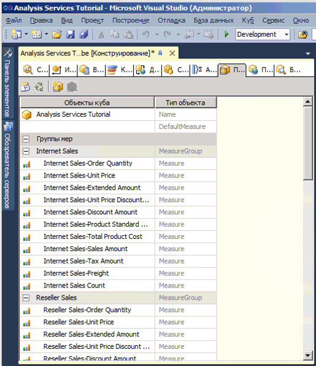
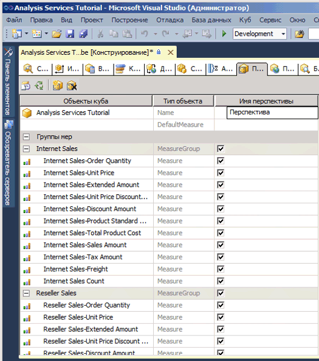
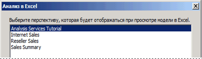
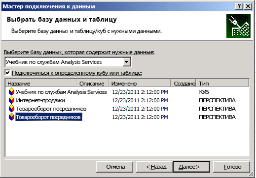
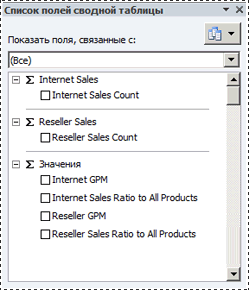

# Занятие 9-1-Определение и поиск перспектив
Перспектива может упростить вид куба для определенных целей. По умолчанию пользователям доступны для просмотра все элементы куба, на которые они имеют разрешения. Все элементы, которые видит пользователь при просмотре всего куба служб [!INCLUDE[ssASnoversion](../includes/ssasnoversion-md.md)] , называются перспективой по умолчанию для куба. Представление полного куба может оказаться слишком сложным для перемещений, особенно для тех пользователей, которым для решения задач, связанных с бизнес-аналитикой и отчетностью, достаточно доступа лишь к малой его части.  
  
Чтобы упростить излишне сложный куб, можно создать его отображаемые подмножества, называемые *перспективами*, которые отражают лишь небольшую часть групп мер, мер, измерений, атрибутов, иерархий, ключевых показателей эффективности, операций и вычисляемых элементов этого куба. Это может оказаться полезным для работы с клиентскими приложениями, написанных для предыдущей версии служб [!INCLUDE[ssASnoversion](../includes/ssasnoversion-md.md)]. Эти клиенты не имеют концепции, например папок отображения или перспектив, но перспектива рассматривается клиентами прошлых версий как куб. Дополнительные сведения см. в разделах [Перспективы](../analysis-services/multidimensional-models-olap-logical-cube-objects/perspectives.md)и [Перспективы в многомерных моделях](../analysis-services/multidimensional-models/perspectives-in-multidimensional-models.md).  
  
> [!NOTE]  
> Перспектива не является механизмом безопасности, она призвана повысить удобство работы пользователя. Все параметры безопасности перспективы наследуются из базового куба.  
  
В задачах этого раздела будет определено несколько разных перспектив, в которых затем будет просмотрен куб.  
  
## Определение перспективы Internet Sales  
  
1.  Откройте конструктор кубов для куба "Учебник по службам [!INCLUDE[ssASnoversion](../includes/ssasnoversion-md.md)] " и перейдите на вкладку **Перспективы** .  
  
    Все объекты и их типы отображаются на панели **Перспективы** , как показано на рисунке ниже.  
  
      
  
2.  На панели инструментов вкладки **Перспективы** нажмите кнопку **Создать перспективу** .  
  
    Новая перспектива появится в столбце **Имя перспективы** с заданным по умолчанию именем **Перспектива**, как показано на рисунке ниже. Обратите внимание, что для каждого из объектов установлен флажок. Пока не снят флажок для одного из объектов, перспектива будет идентична заданной по умолчанию перспективе данного куба.  
  
      
  
3.  Измените имя перспективы на **Продажи через Интернет**.  
  
4.  В следующей строке задайте для свойства DefaultMeasure значение **Продажи через Интернет — объем продаж**.  
  
    При просмотре куба с помощью этой перспективы будет видна именно эта мера, если не будет выбрана другая.  
  
    > [!NOTE]  
    > В окне свойств на вкладке [!INCLUDE[ssASnoversion](../includes/ssasnoversion-md.md)] Структура куба **можно также указать меру по умолчанию для всего куба учебника по службам** .  
  
5.  Снимите флажки для следующих объектов:  
  
    -   группа мер**Товарооборот посредников** ;  
  
    -   группа мер**Квоты продаж** ;  
  
    -   группа мер**Квоты продаж 1** ;  
  
    -   измерение куба**Торговый посредник** ;  
  
    -   измерение куба**География торгового посредника** ;  
  
    -   измерение куба**Территория продаж** ;  
  
    -   измерение куба**Сотрудник** ;  
  
    -   измерение куба**Продвижение** ;  
  
    -   ключевой показатель эффективности**Доход от продаж через торгового посредника** ;  
  
    -   именованный набор**Крупные торговые посредники** ;  
  
    -   вычисляемый элемент**Итоговая сумма продаж** ;  
  
    -   вычисляемый элемент**Общая стоимость товара** ;  
  
    -   вычисляемый элемент**Коэффициент валовой прибыли торгового посредника** ;  
  
    -   вычисляемый элемент**Итоговый коэффициент валовой прибыли** ;  
  
    -   вычисляемый элемент**Доля продаж через торгового посредника по всей номенклатуре продукции** ;  
  
    -   вычисляемый элемент**Общая доля продаж по всей номенклатуре продукции** .  
  
    Эти объекты не связаны с продажами через Интернет.  
  
    > [!NOTE]  
    > В каждом из измерений отдельно можно выбрать пользовательские иерархии и атрибуты, которые должны отображаться в данной перспективе.  
  
## Определение перспективы Reseller Sales  
  
1.  На панели инструментов вкладки **Перспективы** нажмите кнопку **Создать перспективу** .  
  
2.  Изменение имени новой перспективы на **Товарооборот посредников**.  
  
3.  Установите меру **Товарооборот посредников — объем продаж** в качестве меры по умолчанию.  
  
    Если пользователи выполняют просмотр куба при помощи этой перспективы, они будут видеть именно эту меру, если не выберут другую.  
  
4.  Снимите флажки для следующих объектов:  
  
    -   группа мер**Продажи через Интернет** ;  
  
    -   группа мер**Причина покупки через Интернет** ;  
  
    -   измерение куба**Заказчик** ;  
  
    -   измерение куба**Подробности заказа через Интернет** ;  
  
    -   измерение куба**Причина покупки** ;  
  
    -   действие детализации**Действие детализации продаж через Интернет** ;  
  
    -   вычисляемый элемент**Итоговая сумма продаж** ;  
  
    -   вычисляемый элемент**Общая стоимость товара** ;  
  
    -   вычисляемый элемент**Коэффициент валовой прибыли от продаж через Интернет** ;  
  
    -   вычисляемый элемент**Итоговый коэффициент валовой прибыли** ;  
  
    -   вычисляемый элемент**Доля продаж через Интернет по всей номенклатуре продукции** ;  
  
    -   вычисляемый элемент**Общая доля продаж по всей номенклатуре продукции** .  
  
    Эти объекты не связаны с продажами через торгового посредника.  
  
## Определение перспективы сводки о продажах  
  
1.  На панели инструментов вкладки **Перспективы** нажмите кнопку **Создать перспективу** .  
  
2.  Измените имя новой перспективы на **Сводка по продажам**.  
  
    > [!NOTE]  
    > Нельзя указывать вычисляемую меру как меру по умолчанию.  
  
3.  Снимите флажки для следующих объектов:  
  
    -   группа мер**Продажи через Интернет** ;  
  
    -   группа мер**Товарооборот посредников** ;  
  
    -   группа мер**Причина покупки через Интернет** ;  
  
    -   группа мер**Квоты продаж** ;  
  
    -   группа мер**Квоты продаж 1** ;  
  
    -   измерение куба**Подробности заказа через Интернет** ;  
  
    -   измерение куба**Причина покупки** ;  
  
    -   действие детализации**Действие детализации продаж через Интернет** ;  
  
4.  Установите флажки для следующих объектов:  
  
    -   мера**Число продаж через Интернет** ;  
  
    -   мера**Число продаж через торговых посредников** .  
  
## Просмотр куба в каждой из перспектив  
  
1.  В меню **Сборка** выберите команду **Развернуть Analysis Services Tutorial**.  
  
2.  После успешного завершения развертывания перейдите на вкладку **Браузер** и нажмите кнопку **Повторное соединение** .  
  
3.  Запустите Excel.  
  
4.  При выполнении команды «Анализ в Excel» выводится запрос выбора перспективы, которая будет использоваться при просмотре модели в Excel, как показано на следующем рисунке.  
  
      
  
5.  Кроме того, можно запустить Excel из меню «Пуск» Windows, определить подключение к базе данных учебника по службам Analysis Services на узле localhost и выбрать перспективу в мастере подключения к данным, как показано на следующем рисунке.  
  
      
  
6.  Выберите **Продажи через Интернет** в списке **Перспектива** и проверьте меры и измерения в области метаданных.  
  
    Обратите внимание, что отображаются только те объекты, которые определены для перспективы «Internet Sales».  
  
7.  На панели "Метаданные" разверните узел **Меры**.  
  
    Обратите внимание на то, что отображается только группа мер **Продажи через Интернет** , а также вычисляемые элементы **Коэффициент валовой прибыли от продаж через Интернет** и **Доля продаж через Интернет по всей номенклатуре продукции** .  
  
8.  В модели снова выберите Excel. Выберите **Сводка по продажам**.  
  
    Обратите внимание, что в каждой из этих групп мер отображается лишь одна мера, как показано на следующем рисунке.  
  
      
  
## Следующая задача занятия  
[Определение и просмотр переводов](../analysis-services/lesson-9-2-defining-and-browsing-translations.md)  
  
## См. также:  
[Perspectives](../analysis-services/multidimensional-models-olap-logical-cube-objects/perspectives.md)  
[Перспективы в многомерных моделях](../analysis-services/multidimensional-models/perspectives-in-multidimensional-models.md)  
  
  
  
