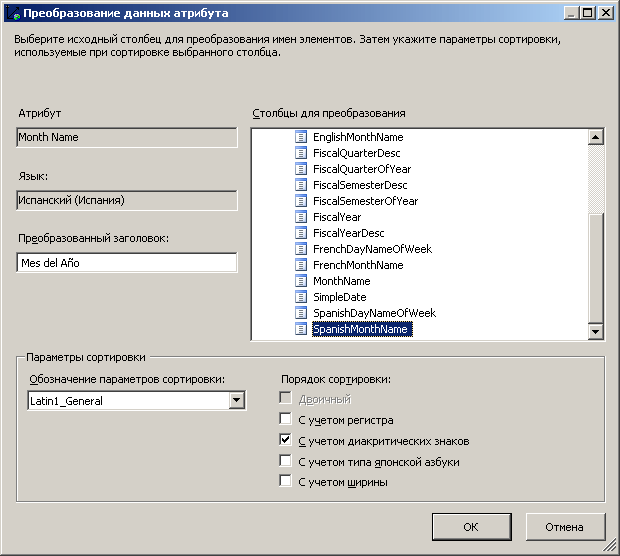
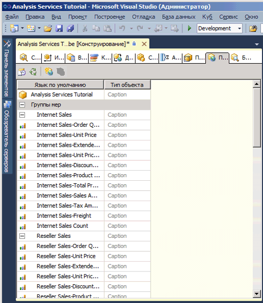
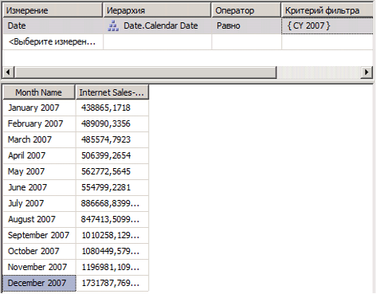

# Урок 9 – 2-Определение и Просмотр переводов
[!INCLUDE[ssas-appliesto-sqlas](../includes/ssas-appliesto-sqlas.md)]

Перевод — это представление на некотором языке названий следующих объектов служб [!INCLUDE[ssASnoversion](../includes/ssasnoversion-md.md)] : Объекты включают в себя группы мер, меры, измерения, атрибуты, иерархии, ключевые показатели эффективности, действия и вычисляемые элементы. Переводы обеспечивают серверную поддержку клиентских приложений, которые поддерживают несколько языков. Такой клиент передает идентификатор локали экземпляру служб [!INCLUDE[ssASnoversion](../includes/ssasnoversion-md.md)], который на его основе подбирает набор переводов, которые будут использоваться при выдаче метаданных для объектов служб [!INCLUDE[ssASnoversion](../includes/ssasnoversion-md.md)] . Если объект служб [!INCLUDE[ssASnoversion](../includes/ssasnoversion-md.md)] не содержит перевода для указанного языка или не содержит перевода для конкретного объекта, метаданные будут возвращены клиенту на языке по умолчанию. Например, если пользователь из Франции обращается к кубу с рабочей станции, работающей с французскими настройками локали, ему будут доступны заголовки и значения свойств элементов на французском языке при условии наличия перевода для французского языка. Однако если к тому же кубу обращается пользователь из Германии с рабочей станции, работающий с немецкими настройками локали, то ему будут доступны заголовки и значения свойств элементов на немецком языке. Дополнительные сведения см. в разделах [Переводы измерений](../analysis-services/multidimensional-models-olap-logical-dimension-objects/dimension-translations.md), [Переводы куба](../analysis-services/multidimensional-models-olap-logical-cube-objects/cube-translations.md)и [Поддержка параметров перевода в службах Analysis Services](../analysis-services/translation-support-in-analysis-services.md).  
  
В задачах этого раздела предстоит указать переводы метаданных для ограниченного набора объектов измерения даты и объектов куба в кубе учебника по службам [!INCLUDE[ssASnoversion](../includes/ssasnoversion-md.md)] . Затем следует просмотреть эти объекты измерения и куба, чтобы проверить переводы метаданных.  
  
## Задание переводов для метаданных измерения даты  
  
1.  Откройте измерение **Дата** в конструкторе измерений и перейдите на вкладку **Переводы** .  
  
    Отобразятся метаданные языка по умолчанию для каждого объекта измерения. Языком по умолчанию для куба учебника по службам [!INCLUDE[ssASnoversion](../includes/ssasnoversion-md.md)] является английский.  
  
2.  На панели инструментов вкладки **Переводы** нажмите кнопку **Создать перевод** .  
  
    В диалоговом окне **Выбор языка** будет раскрыт список языков.  
  
3.  Выберите значение **испанский (Испания)** и нажмите кнопку **ОК**.  
  
    Появится новый столбец, в котором, при необходимости, можно задать испанский перевод для объектов метаданных. В этом учебнике будет переведено лишь небольшое количество объектов исключительно для демонстрации процесса перевода.  
  
4.  На панели инструментов вкладки **Переводы** нажмите кнопку **Создать перевод** , а затем в диалоговом окне **Выбор языка** выберите значение **Французский (Франция)** и нажмите кнопку **ОК**.  
  
    Отобразится новый столбец, где можно задать перевод для французского языка.  
  
5.  В строке объекта **Заголовок** измерения **Дата** в столбце перевода **испанский (Испания)** введите **Fecha**, а в столбце перевода **французский (Франция)**  — **Temps**.  
  
6.  В строке объекта **Заголовок** атрибута **Название месяца** введите в столбце перевода **испанский (Испания)** значение **Mes del Año** , а в столбце перевода **французский (Франция)** — значение **Mois d'Année** .  
  
    Обратите внимание, что при вводе этих переводов многоточие (**...** ) отображается. Если нажать кнопку с многоточием, то можно будет выбрать столбец в базовой таблице, который содержит переводы для каждого из элементов иерархии атрибутов.  
  
7.  Нажмите кнопку с многоточием (**...** ) для **испанский (Испания)** перевод для **название месяца** атрибута.  
  
    Будет открыто диалоговое окно **Перевод данных атрибута** .  
  
8.  В списке **Столбцы перевода** выберите **SpanishMonthName**, как показано на рисунке ниже.  
  
      
  
9. Нажмите кнопку **ОК**и нажмите кнопку с многоточием (**...** ) для **французский (Франция)** перевод для **название месяца** атрибута.  
  
10. В списке **Столбцы перевода** выберите **FrenchMonthName**и нажмите кнопку **ОК**.  
  
    Шаги этой процедуры иллюстрируют процесс определения перевода метаданных объектов и элементов измерений.  
  
## Определение перевода для метаданных куба учебника по службам Analysis Services  
  
1.  Перейдите в конструктор кубов к кубу учебника по [!INCLUDE[ssASnoversion](../includes/ssasnoversion-md.md)] и откройте вкладку **Переводы** .  
  
    Появятся метаданные на языке, установленном по умолчанию для каждого из объектов куба, как показано на рисунке ниже. Языком по умолчанию для куба учебника по службам [!INCLUDE[ssASnoversion](../includes/ssasnoversion-md.md)] является английский.  
  
      
  
2.  На панели инструментов вкладки **Переводы** нажмите кнопку **Создать перевод** .  
  
    В диалоговом окне **Выбор языка** будет раскрыт список языков.  
  
3.  Выберите значение **испанский (Испания)** и нажмите кнопку **ОК**.  
  
    Появится новый столбец, в котором, при необходимости, можно задать испанский перевод для объектов метаданных. В этом учебнике будет переведено лишь небольшое количество объектов исключительно для демонстрации процесса перевода.  
  
4.  На панели инструментов вкладки **Переводы** нажмите кнопку **Создать перевод** , затем в диалоговом окне **Выбор языка** выберите значение **Французский (Франция)** и нажмите кнопку **ОК**.  
  
    Отобразится новый столбец, где можно задать перевод для французского языка.  
  
5.  В строке объекта **Заголовок** измерения **Дата** в столбце перевода **испанский (Испания)** введите **Fecha** , а в столбце перевода **французский (Франция)** — **Temps** .  
  
6.  В строке объекта **Заголовок** группы мер **Продажи через Интернет** в столбце перевода **испанский (Испания)** введите значение **Ventas del lnternet** , а в столбце перевода **французский (Франция)** — значение **Ventes D'Internet** .  
  
7.  В строке объекта **Заголовок** группы мер "Продажи через Интернет — объем продаж" в столбце перевода **испанский (Испания)** введите значение **Cantidad de las Ventas del Internet** , а в столбце перевода **французский (Франция)** — значение **Quantité de Ventes d'Internet** .  
  
    Шаги этой процедуры иллюстрируют процесс определения переводов метаданных объектов кубов.  
  
## Просмотр куба с использованием переводов  
  
1.  В меню **Сборка** выберите команду **Развернуть Analysis Services Tutorial**.  
  
2.  После успешного окончания развертывания перейдите на вкладку **Браузер** и нажмите кнопку **Повторное соединение**.  
  
3.  Удалите все иерархии и меры на панели **Данные[!INCLUDE[ssASnoversion](../includes/ssasnoversion-md.md)] и выберите "Учебник по** " в списке **Перспективы**.  
  
4.  На панели метаданных разверните узел **Меры**, а затем **Продажи через Интернет**.  
  
    Обратите внимание, что в группе мер показатель **Продажи через Интернет — объем продаж** отображается на английском.  
  
5.  На панели инструментов выберите в списке **Язык** значение **испанский (Испания)** .  
  
    Обратите внимание, что элементы в панели метаданных заполняются повторно. После заполнения элементов в панели метаданных обратите внимание, что мера «Продажи через Интернет — сумма продаж» больше не отображается в папке отображения «Продажи через Интернет». Теперь она отображается на испанском языке в новой папке отображения с именем **Ventas del lnternet**, как показано на рисунке ниже.  
  
      
  
6.  На панели метаданных щелкните правой кнопкой мыши **Cantidad de las Ventas del Internet** и выберите команду **Добавить в запрос**.  
  
7.  На панели метаданных последовательно разверните узлы **Fecha**и **Fecha.Calendar Date**, щелкните правой кнопкой мыши элемент **Fecha.Calendar Date**и выберите команду **Добавить в фильтр**.  
  
8.  На панели **Фильтр** выберите **CY 2007** в качестве критерия фильтра.  
  
9. На панели метаданных щелкните правой кнопкой мыши **Mes del Ano** и выберите команду **Добавить в запрос**.  
  
    Обратите внимание, что имена месяцев отображаются на испанском языке, как показано на рисунке ниже.  
  
      
  
10. На панели инструментов в списке **Язык** выберите значение **французский (Франция)** .  
  
    Обратите внимание, что имена месяцев и имя меры теперь также отображаются на французском языке.  
  
## Следующее занятие  
[Занятие 10. Определение ролей администрирования](../analysis-services/lesson-10-defining-administrative-roles.md)  
  
## См. также  
[Переводы измерений](../analysis-services/multidimensional-models-olap-logical-dimension-objects/dimension-translations.md)  
[Переводы куба](../analysis-services/multidimensional-models-olap-logical-cube-objects/cube-translations.md)  
[Поддержка параметров перевода в службах Analysis Services](../analysis-services/translation-support-in-analysis-services.md)  
  
  
  
