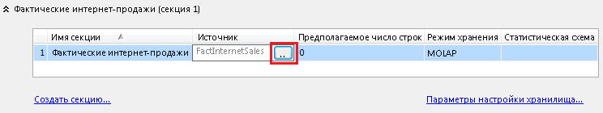

# Создание локальной секции и управление ей (Analysis Services)
  Для улучшения производительности обработки можно создать дополнительные секции для группы мер. Несколько секций позволяют разделять фактические данные между соответствующим числом файлов физических данных на локальном и удаленных серверах. В службах Analysis Services секции могут обрабатываться параллельно, что дает больше контроля над процессом обработки рабочих нагрузок на сервере.  
  
 Секции могут создаваться во время разработки модели в среде [!INCLUDE[ssBIDevStudio](../../includes/ssbidevstudio-md.md)] или при развертывании решения с помощью [!INCLUDE[ssManStudioFull](../../includes/ssmanstudiofull-md.md)] или XMLA-скрипта. Рекомендуется выбрать и использовать только один подход. При использовании разных средств может возникнуть ситуация, когда изменения, внесенные в развернутую базу данных с помощью [!INCLUDE[ssManStudioFull](../../includes/ssmanstudiofull-md.md)] , будут перезаписаны последующим развертыванием решения из [!INCLUDE[ssBIDevStudio](../../includes/ssbidevstudio-md.md)].  
  
## Перед началом  
 Убедитесь, что у вас установлен выпуск Business Intelligence или Enterprise. Выпуск Standard не поддерживает работу с множественными секциями. Чтобы проверить выпуск, щелкните правой кнопкой мыши узел сервера в [!INCLUDE[ssManStudioFull](../../includes/ssmanstudiofull-md.md)] и выберите пункт **Отчеты** | **Общие**. Дополнительные сведения о доступности функций см. в разделе [Функции, поддерживаемые различными выпусками SQL Server 2016](../Topic/Features%20Supported%20by%20the%20Editions%20of%20SQL%20Server%202016.md).  
  
 Важно понять, что секции должны иметь одинаковую агрегатную схему, если вы в будущем планируете выполнять их объединение. Объединять можно только секции с одними и теми же режимами хранения и агрегатными схемами.  
  
> [!TIP]  
>  Изучите данные в представлении источника данных (DSV), чтобы узнать диапазон и глубину секционируемых данных. Например, если планируется разбиение по дате, можно выполнить сортировку по столбцу даты, чтобы определить верхний и нижний предел каждой секции.  
  
## Выбор метода  
 Самое важное требование при создании секций — сегментировать данные, чтобы не было повторяющихся строк. Все данные должны храниться только в одной секции, что позволяет избежать двойного подсчета строк. Таким образом, рекомендуется разбивать данные по DATE, чтобы можно было определить четкие границы каждой секции.  
  
 Для распределения данных по нескольким секциям можно использовать какой-либо из методов, описанных ниже. Следующие методы можно использовать для сегментирования данных.  
  
|Метод|Рекомендации|  
|---------------|---------------------|  
|Применение SQL-запросов для сегментирования фактических данных|Источником для секций могут быть SQL-запросы. Во время обработки SQL-запрос получает данные. Предложение WHERE запроса обеспечивает фильтрацию, которая сегментирует данные для каждой секции. Службы Analysis Services формируют запрос автоматически, но необходимо дополнить предложение WHERE, чтобы правильно сегментировать данные.   Основное преимущество данного подхода заключается в простоте разбиения данных из одной исходной таблицы. Если все исходные данные берутся из большой таблицы фактов, можно построить запросы, которые будут фильтровать данные в дискретные секции, без создания дополнительных структур данных в представлении источника данных (DSV).   Единственный недостаток данного метода — использование запросов приведет к потере привязки между секцией и DSV. Если впоследствии обновить DSV в проекте Analysis Services, например добавив столбцы к таблице фактов, нужно будет вручную изменить запросы для каждой секции и добавить в них новый столбец. Второй метод, описанный далее, не имеет такого недостатка.|  
|Применение таблиц в DSV для сегментирования фактических данных|В DSV секцию можно привязать к таблице, именованному запросу или представлению. В качестве основы секции все три вышеуказанных элемента эквивалентны. Целая таблица, именованный запрос или представление предоставляет все данные для одной секции.   Использование таблицы, представления или именованного запроса означает размещение всей логики выбора данных в DSV, что упрощает ее сопровождение. Важное преимущество данного подхода заключается в том, что сохраняются привязки таблиц. Если позже исходная таблица обновится, не нужно будет изменять секции, которые ее используют. Во-вторых, все таблицы, именованные запросы и представления хранятся в общем рабочем пространстве, поэтому проведение обновлений становится более удобным и отпадает необходимость отдельно изменять запросы секций.|  
  
## Вариант 1. Фильтрация таблицы фактов для нескольких секций  
 Создание нескольких секций начинается с изменения свойства **Source** стандартной секции. По умолчанию для каждой группы мер создается одна секция, привязанная к одной таблице в DSV. Перед добавлением нескольких секций вначале следует изменить исходную секцию, чтобы она содержала только часть фактических данных. Затем можно перейти к созданию дополнительных секций для остальной части данных.  
  
 Формируйте фильтры так, чтобы данные не дублировались в разных секциях. Фильтр секции задает, какие данные в таблице фактов используются в секции. Важно, чтобы фильтры для всех секций в кубе извлекали взаимоисключающие наборы данных из таблицы фактов. Одни и те же фактические данные могут быть учтены дважды, если они появляются в нескольких секциях.  
  
1.  В обозревателе решений [!INCLUDE[ssBIDevStudio](../../includes/ssbidevstudio-md.md)] дважды щелкните куб, чтобы открыть его в конструкторе кубов, и выберите вкладку **Секции**.  
  
2.  Разверните группу мер, к которой добавляются секции. По умолчанию для каждой группы мер в кубе определяется одна секция, привязанная к таблице фактов в DSV.  
  
3.  В столбце Source нажмите кнопку обзора (. .), чтобы открыть окно выбора источника секции.  
  
       
  
4.  В поле выбора типа привязки укажите **Привязка запроса**. Автоматически появится SQL-запрос выбора данных.  
  
5.  В предложении WHERE добавьте фильтр, который сегментирует данные для этой секции.  
  
     Примеры синтаксиса предложений WHERE: `WHERE OrderDateKey >= '20060101'` или `WHERE OrderDateKey BETWEEN '20051001' AND '20051201'`. Другие примеры см. в разделе [WHERE (Transact-SQL)](../../t-sql/queries/where-transact-sql.md).  
  
     Обратите внимание, что следующие фильтры являются взаимоисключающими в пределах каждого набора:  
  
    |||  
    |-|-|  
    |Набор 1:|"Год_продаж" = 2012   "Год_продаж" = 2013|  
    |Набор 2:|"Континент" = 'Северная_Америка'   "Континент" = 'Европа'   "Континент" = 'Южная_Америка'|  
    |Набор 3:|"Страна" = 'США'   "Страна" = 'Мексика'   ("Country" <> 'USA' AND "Country" <> 'Mexico')|  
  
6.  Щелкните **Проверить** , чтобы определить наличие синтаксических ошибок, и нажмите кнопку **ОК**.  
  
7.  Повторите предыдущие шаги и создайте оставшиеся секции, изменяя предложение WHERE, чтобы выбирался следующий срез данных.  
  
8.  Разверните решение или обработайте секцию, чтобы загрузить данные. Обработайте все секции.  
  
9. Изучите куб, чтобы проверить правильность возвращаемых данных.  
  
 После получения группы мер с несколькими секциями можно создать дополнительные секции в [!INCLUDE[ssManStudioFull](../../includes/ssmanstudiofull-md.md)]. Под группой мер щелкните папку Partitions правой кнопкой мыши и выберите **Создать секции**, чтобы запустить соответствующий мастер.  
  
> [!NOTE]  
>  Вместо фильтрации данных в секции можно использовать тот же запрос для создания именованного запроса в DSV, затем настроить секцию на основе этого именованного запроса.  
  
## Вариант 2. Использование таблиц, представлений и именованных запросов  
 Если DSV уже организует факты в отдельные таблицы (например, по годам или кварталам), можно создать секции на основе отдельных таблиц, где каждая секция имеет собственную исходную таблицу данных. Именно так разбиваются группы мер по умолчанию, но в случае нескольких секций вы разбиваете исходную секцию на несколько секций и сопоставляете каждую новую секцию с источником данных.  
  
 Представления и именованные запросы функционально эквивалентны таблицам, поскольку все три объекта определяются в DSV и привязываются к секции с помощью параметра Table Binding в окне выбора источника секции. Для каждого сегмента данных в секции можно создать представление или именованный запрос. Дополнительные сведения см. в разделе [Определение именованных запросов в представлении источника данных (службы Analysis Services)](../../analysis-services/multidimensional-models/define-named-queries-in-a-data-source-view-analysis-services.md).  
  
> [!IMPORTANT]  
>  При создании взаимоисключающих именованных запросов для секций в представлении источника данных убедитесь, что комбинированные данные для секций включают все данные из группы мер, которую необходимо включить в куб. Убедитесь, что не осталось секции по умолчанию, основанной на всей таблице для группы мер, иначе секции, основанные на запросах, будут перекрывать запрос, основанный на полной таблице.  
  
1.  Создайте один или несколько именованных запросов, которые будут источником секции. Дополнительные сведения см. в разделе [Определение именованных запросов в представлении источника данных (службы Analysis Services)](../../analysis-services/multidimensional-models/define-named-queries-in-a-data-source-view-analysis-services.md).  
  
     Именованный запрос должен основываться на таблице фактов, связанной с группой мер. Например, если разбивается группа мер FactInternetSales, именованные запросы в DSV должны в инструкции FROM указывать таблицу FactInternetSales.  
  
2.  В обозревателе решений [!INCLUDE[ssBIDevStudio](../../includes/ssbidevstudio-md.md)] дважды щелкните куб, чтобы открыть его в конструкторе кубов, и выберите вкладку **Секции**.  
  
3.  Разверните группу мер, к которой добавляются секции.  
  
4.  Чтобы запустить мастер создания секции, нажмите кнопку **Создать секцию** . Если вы создали именованные запросы, используя таблицу фактов, привязанную к группе мер, необходимо просмотреть именованные запросы, созданные на предыдущем шаге.  
  
5.  В окне указания сведений об источнике выберите один из именованных запросов, созданных ранее. Если нет именованных запросов, вернитесь в DSV и проверьте инструкцию FROM.  
  
6.  Нажмите кнопку **Далее** , чтобы принять стандартные значения для каждой последующей страницы.  
  
7.  На последней странице мастера задайте секции подходящее имя.  
  
8.  Нажмите кнопку **Готово**.  
  
9. Повторите предыдущие шаги и создайте оставшиеся секции, выбирая другой именованный запрос, чтобы выбирался следующий срез данных.  
  
10. Разверните решение или обработайте секцию, чтобы загрузить данные. Обработайте все секции.  
  
11. Изучите куб, чтобы проверить правильность возвращаемых данных.  
  
## Следующий шаг  
 При создании взаимоисключающих запросов для секций убедитесь, что комбинированные данные секций включают все данные, которые необходимо включить в куб.  
  
 В качестве последнего действия обычно необходимо удалить секцию по умолчанию, которая была основана на самой таблице (если она еще есть), иначе секции, основанные на запросах, будут перекрываться с запросом, основанным на полной таблице.  
  
## См. также  
 [Секции (службы Analysis Services — многомерные данные)](../../analysis-services/multidimensional-models-olap-logical-cube-objects/partitions-analysis-services-multidimensional-data.md)   
 [Удаленные секции](../Topic/Remote%20Partitions.md)   
 [Объединение секций в службах Analysis Services (службы SSAS  — многомерные данные)](../../analysis-services/multidimensional-models/merge-partitions-in-analysis-services-ssas-multidimensional.md)  
  
  