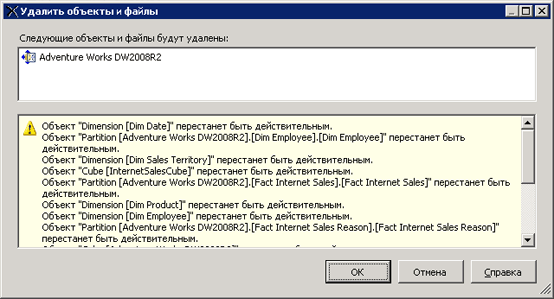

# Удаление представления источников данных (службы Analysis Services)
[!INCLUDE[ssas-appliesto-sqlas](../../includes/ssas-appliesto-sqlas.md)]
  При отсутствии необходимости использования файла представления источников данных (DSV) в проекте OLAP его можно удалить из проекта среды [!INCLUDE[ssBIDevStudioFull](../../includes/ssbidevstudiofull-md.md)].  
  
 Удаление DSV необратимо. Восстановление удаленного источника DSV в проекте среды [!INCLUDE[ssASnoversion](../../includes/ssasnoversion-md.md)] невозможно.  
  
 Файлы представления источников данных (DSV), от которых зависят другие объекты, не могут быть удалены из базы данных среды [!INCLUDE[ssASnoversion](../../includes/ssasnoversion-md.md)] , открытой в среде [!INCLUDE[ssBIDevStudioFull](../../includes/ssbidevstudiofull-md.md)] в режиме «в сети». Для удаления DSV из проекта, который имеет подключение к базе данных, запущенной на сервере, прежде всего необходимо удалить все объекты базы данных среды [!INCLUDE[ssASnoversion](../../includes/ssasnoversion-md.md)] , зависящие от самого DSV.  
  
 Удаление DSV сделает недействительными все зависящие от него объекты среды [!INCLUDE[ssASnoversion](../../includes/ssasnoversion-md.md)] , поэтому перед удалением DSV обратите внимание на список всех связанных с ним объектов. Внимательно изучите список объектов, убедитесь, что в нем отсутствуют объекты, необходимые для дальнейшего использования.  
  
   
  
## См. также  
 [Представления источников данных в многомерных моделях](../../analysis-services/multidimensional-models/data-source-views-in-multidimensional-models.md)   
 [Изменение свойств в представлении источника данных (службы Analysis Services)](../../analysis-services/multidimensional-models/change-properties-in-a-data-source-view-analysis-services.md)  
  
  
