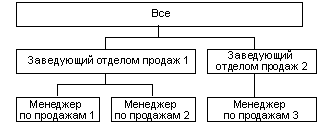

# Родительские атрибуты измерения
  В службах [!INCLUDE[msCoName](../../includes/msconame-md.md)] [!INCLUDE[ssNoVersion](../../includes/ssnoversion-md.md)] [!INCLUDE[ssASnoversion](../../includes/ssasnoversion-md.md)]о содержимом элементов измерения обычно делается общее предположение. Конечные элементы содержат данные, полученные непосредственно из основных источников данных; неконечные элементы содержат данные статистических вычислений, рассчитанных по дочерним элементам.  
  
 Тем не менее в иерархии вида «родители-потомки» некоторые неконечные элементы вместе со статистическими выражениями над дочерними элементами также могут содержать данные из основных источников данных. Для таких неконечных элементов в иерархии вида «родители-потомки» создаются специальные, формируемые системой дочерние элементы, содержащие данные из основной таблицы фактов. Такие элементы называются *элементами данных*, они непосредственно связаны с неконечным элементом дерева, который не зависит от суммарного значения, вычисленного для его потомков.  
  
 Элементы данных можно использовать только в измерениях с иерархией вида «родители-потомки», они видны только в том случае, если родительский элемент допускает это. Для контроля видимости элементов данных можно воспользоваться конструктором измерений. Чтобы отобразить элементы данных, задайте свойству **MembersWithData** для родительского атрибута значение **NonLeafDataVisible**. Чтобы скрыть элементы данных в родительском атрибуте, задайте свойству **MembersWithData** для родительского атрибута значение **NonLeafDataHidden**.  
  
 Это свойство не влияет на процесс статистического вычисления неконечных элементов, элемент данных всегда участвует в вычислении агрегатов в качестве дочернего элемента. Однако нормальное статистическое поведение можно изменить при помощи формулы пользовательской свертки. Функция многомерных выражений [DataMember](../../mdx/datamember-mdx.md) позволяет обращаться к значению связанного элемента данных, независимо от значения свойства **MembersWithData** .  
  
 Свойство **MembersWithDataCaption** родительского атрибута предоставляет службам [!INCLUDE[ssASnoversion](../../includes/ssasnoversion-md.md)] шаблон именования, используемый для формирования имен элементов данных.  
  
## Использование элементов данных  
 Элементы данных удобно использовать при статистической обработке мер организационных измерений с иерархией вида «родители-потомки». Например, на следующей диаграмме показано измерение, представляющее объем валовой выручки на трех уровнях. Первый уровень показывает общий объем валовой выручки всех продавцов. Второй уровень содержит объем выручки всех подчиненных каждого менеджера по продажам и, наконец, третий уровень содержит объем выручки каждого продавца в отдельности.  
  
   
  
 Обычно, значение элемента Sales Manager 1 бывает выведено путем статистического вычисления значений элементов Salesperson 1 и Salesperson 2. Тем не менее, поскольку менеджер Sales Manager 1 также продавал товары, элемент должен содержать данные из таблицы фактов, поскольку она может содержать данные о валовой выручке, связанные с элементом Sales Manager 1.  
  
 Кроме того, индивидуальная комиссия продавцов может различаться. В таком случае используются два различных масштаба для вычисления комиссии для отдельных объемов валовой выручки менеджеров по продажам, в отличие от общего объема валовой выручки, формируемого их подчиненными. Следовательно, важно иметь возможность доступа к данным основной таблицы фактов для неконечных элементов. Функция многомерных выражений **DataMember** позволяет получить индивидуальный объем валовой выручки элемента Sales Manager 1, а пользовательское выражение свертки — исключить элемент данных из статистического значения для элемента Sales Manager 1 и вычислить объем валовой выручки всех менеджеров по продажам, которые связаны с этим элементом.  
  
## См. также раздел  
 [Справочник по свойствам атрибута измерения](../../analysis-services/multidimensional-models/dimension-attribute-properties-reference.md)   
 [Родитель потомок измерения](../../analysis-services/multidimensional-models/parent-child-dimension.md)  
  
  
