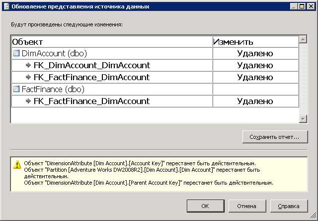

# Обновление схемы в представлении источника данных (службы Analysis Services)
[!INCLUDE[ssas-appliesto-sqlas](../../includes/ssas-appliesto-sqlas.md)]
  После определения представления источников данных в проекте или базе данных [!INCLUDE[ssASnoversion](../../includes/ssasnoversion-md.md)] можно изменить схему базового источника данных. Эти изменения не определяются и не обновляются автоматически в проекте разработки. Более того, при развертывании проекта на сервере будут возникать ошибки обработки, если службы Analysis Services не смогут подключиться к внешнему источнику данных.  
  
 Для обновления представления источников данных так, чтобы он соответствовал внешнему источнику данных, можно обновить представление источника данных в среде Business Intelligence Development Studio (BIDS). Обновление представления источников данных приводит к выявлению изменений относительно внешнего источника данных, на котором основывается представление, и созданию списка добавлений или удалений во внешнем источнике данных. После этого можно применить набор изменений к представлению источников данных, который снова выровняет представление относительно базового источника данных. Обратите внимание, что для последующего обновления кубов и измерений в проекте, использующем представление источника данных, могут потребоваться дополнительные усилия.  
  
 Этот раздел включает следующие подразделы:  
  
 [Изменения, поддерживаемые в обновлении](#bkmk_changlist)  
  
 [Обновить представление источника данных в SQL Server Data Tools](#bkmk_DSVrefresh)  
  
##   Изменения, поддерживаемые в обновлении  
 Обновление представления источников данных может включать любые из следующих действий.  
  
-   Удаление таблиц, столбцов и связей  
  
-   Добавление столбцов и связей относительно таблиц, уже включенных в представление источника данных  
  
-   Добавление новых ограничений уникальностей. Если для таблицы в представлении источника данных существует логический первичный ключ и при этом к таблице в источнике данных добавляется физический ключ, то логический ключ удаляется и заменяется физическим ключом.  
  
 Обновление никогда не добавляет новые таблицы в представление источника данных. Если нужно добавить новую таблицу, придется добавить ее вручную. Дополнительные сведения см. в разделе [Добавление или удаление таблиц или представлений в представлении источника данных (службы Analysis Services)](../../analysis-services/multidimensional-models/adding-or-removing-tables-or-views-in-a-data-source-view-analysis-services.md).  
  
##   Обновить представление источника данных в SQL Server Data Tools  
 Чтобы обновить представление источника данных, дважды щелкните представление источника данных из обозревателя решений в [!INCLUDE[ssBIDevStudioFull](../../includes/ssbidevstudiofull-md.md)].  Откроется конструктор представления источника данных.  Затем нажмите кнопку Обновить представление источника данных в конструкторе или выберите **обновление** меню представления источника данных.  
  
 При этом службы [!INCLUDE[ssASnoversion](../../includes/ssasnoversion-md.md)] запрашивают реляционный источник данных и выявляют изменения в соответствующих таблицах или представлениях. Если не удается установить соединения со всеми базовыми источниками данных, но в них существуют изменения, то они будут отображены в диалоговом окне **Обновление представления источников данных** .  
  
   
  
 В диалоговом окне перечисляются таблицы, столбцы, ограничения и связи, которые будут удалены или добавлены в представление источника данных. В отчете также указывается любой именованный запрос или вычисление, которые не могут быть успешно подготовлены. Объекты, на которые оказывается влияние, представлены в древовидном представлении, в котором столбцы и связи расположены под таблицами, а для каждого объекта обозначается тип изменения (удаления или добавления). Стандартные значки объектов представления источников данных обозначают тип объекта, на который оказывается влияние.  
  
 Обновление полностью основано на именах базовых объектов. Следовательно, при переименовании базового объекта в источнике данных конструктор представления источников данных рассматривает переименованный объект как две отдельные операции — удаление и добавление. В таком случае может возникнуть необходимость вручную добавить переименованный объект обратно в представление источника данных. Также может возникнуть необходимость в повторном создании связей или логических первичных ключей.  
  
> [!IMPORTANT]  
>  Если стало известно о переименовании таблицы в источнике данных, то может возникнуть необходимость применить команду **Заменить таблицу** для замены таблицы на переименованную таблицу до обновления представления источников данных. Дополнительные сведения см. в разделе [Замена таблицы или именованного запроса в представлении источника данных (службы Analysis Services)](../../analysis-services/multidimensional-models/replace-a-table-or-a-named-query-in-a-data-source-view-analysis-services.md).  
  
 После изучения отчета можно принять изменения или отменить обновления, аннулировав любые изменения. Все изменения должны быть приняты или отклонены вместе. Не предусмотрена возможность выбирать отдельные элементы в списке. Также можно сохранить отчет об изменениях.  
  
## См. также  
 [Представления источников данных в многомерных моделях](../../analysis-services/multidimensional-models/data-source-views-in-multidimensional-models.md)  
  
  
