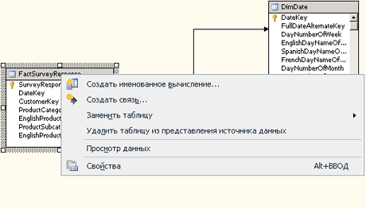

# Работа с диаграммами в конструкторе представлений источника данных (службы Analysis Services)
  Диаграмма представления источников данных (DSV) — это визуальное представление объектов в виде DSV. С диаграммой можно работать интерактивно. Она позволяет добавить, скрыть, удалить или изменить определенные объекты. Можно также создать несколько диаграмм одного и того же представления DSV, чтобы сосредоточить внимание на подмножестве объектов.  
  
 Чтобы изменить зону диаграммы, которая появляется на панели диаграмм, нажмите четырехстороннюю стрелку в правом нижнем углу панели и перетащите поле выбора на эскиз диаграммы до тех пор, пока не будет выделена та область, которая должна появиться на панели диаграмм.  
  
 Этот раздел включает следующие подразделы:  
  
 [Добавление диаграммы](#bkmk_add)  
  
 [Изменение и удаление диаграммы](#bkmk_edit)  
  
 [Поиск таблиц в диаграмме](#bkmk_findtables)  
  
 [Упорядочение объектов в диаграмме](#bkmk_arrangeobjects)  
  
 [Сохранение упорядочивания объектов](#bkmk_preserve)  
  
##   Добавление диаграммы  
 Диаграммы DSV создаются автоматически при создании представления DSV. После создания представления DSV можно создавать дополнительные диаграммы, удалять их или скрывать определенные объекты для создания более управляемых представлений DSV.  
  
 Чтобы создать новую диаграмму, щелкните правой кнопкой мыши в любом месте на панели **Организатор диаграмм** и выберите пункт **Создать диаграмму**.  
  
 При первоначальном создании представления источников данных в проекте службы Analysis Services все таблицы и представления, добавленные в представление источника данных, добавляются в диаграмму \<Все таблицы>. Эта диаграмма отображается на панели организатора диаграмм в конструкторе представлений источников данных, таблицы в этой диаграмме (а также их столбцы и связи) перечисляются на панели «Таблицы» и графически отображаются на панели «Диаграмма». Однако поскольку к диаграмме \<Все таблицы> добавляются таблицы, представления и именованные запросы, большое число объектов на этой диаграмме затрудняет отображение связей, особенно когда множество таблиц фактов добавляется в диаграмму, а таблицы измерений связаны с множеством таблиц фактов.  
  
 Для уменьшения визуальных помех, если необходимо просмотреть только подмножество таблиц в представлении источника данных, можно определить подчиненные диаграммы (называемые просто диаграммами), состоящие из выбранных подмножеств таблиц, представлений и именованных запросов в представлении источника данных. Диаграммы можно использовать для группирования элементов в представлении источника данных в соответствии с потребностями бизнеса или решения.  
  
 Можно группировать связанные таблицы и именованные запросы в отдельные диаграммы для бизнес-целей и облегчить понимание представления источников данных, содержащего множество таблиц, представлений и именованных запросов. Одна и та же таблица или именованный запрос могут быть включены в несколько диаграмм, за исключением диаграммы \<Все таблицы>. На диаграмме \<Все таблицы> все объекты, содержащиеся в представлении источника данных, отображаются однократно.  
  
##   Изменение и удаление диаграммы  
 Во время работы с диаграммой обращайте внимание на команды, которые используются для добавления и удаления объектов. Например, если удалить объект из диаграммы, то этот объект будет удален и из представления DSV. Чтобы удалить объект только из диаграммы, воспользуйтесь командой **Спрятать таблицу** .  
  
   
  
 Хотя можно спрятать отдельные объекты, команда «Показать связанные таблицы» возвращает все объекты в диаграмме. Чтобы вернуть в рабочее пространство только отдельные объекты, перетащите их из панели «Таблицы» мышью.  
  
##   Поиск таблиц в диаграмме  
 Если схема большая, то прокрутка до конкретной таблицы на панели **Диаграмма** может быть затруднена. Однако следующие средства облегчают поиск таблицы в диаграмме.  
  
-   Выполните прокрутку списка таблиц на панели **Таблицы** .  
  
     Для включения таблицы в отображаемую в данный момент диаграмму перетащите ее мышью из панели **Таблицы** на панель диаграммы.  
  
     Для выравнивания по центру таблицы, уже включенной в диаграмму, выберите ее на панели **Таблицы** .  
  
-   Указатель таблиц на панели **Диаграмма** — указатель таблиц представляет собой значок с 4 стрелками, который расположен на пересечении вертикальной и горизонтальной полос прокрутки в правом нижнем углу панели **Диаграмма**. Он открывает уменьшенное представление текущей диаграммы на панели «Диаграмма». Это уменьшенное представление можно использовать для перемещения представления на панели «Диаграмма» в любое местоположение на диаграмме.  
  
-   Используйте диалоговое окно **Поиск таблицы** — щелкните правой кнопкой мыши свободную область на панели "Диаграмма" и выберите пункт **Найти таблицу**. Либо выберите команду **Найти таблицу** на панели инструментов или в меню **Представление источника данных** .  
  
     Можно вводить строки и символы-шаблоны в поле «Фильтр», чтобы просматривать подмножества таблиц в диаграмме.  
  
##   Упорядочение объектов в диаграмме  
 Хотя конструктор представлений источников данных позволяет задать несколько диаграмм, чтобы сделать представление источника данных более понятным, диаграммы, содержащие десятки таблиц, может быть трудно читать, а изменение макетов таблиц вручную — это трудоемкий процесс. Конструктор представлений источников данных может автоматически расположить таблицы в текущей диаграмме на основе связей между таблицами в ней, используя прямоугольный или диагональный макет.  
  
-   В прямоугольном макете линии связей чертятся между таблицами, а не между столбцами. Линии связей рисуются горизонтально и вертикально между таблицами.  
  
-   В диагональном макете линии связей чертятся по возможности непосредственно между связанными столбцами в таблицах. Связь с несколькими столбцами присоединяется к первому связанному столбцу в таблице. Если столбцы в таблице не видны, линии чертятся к верхней части таблицы.  
  
##   Сохранение упорядочивания объектов  
 После того как вы вручную расположили таблицы нужным образом, добавление других таблиц в диаграмму может привести к ее обновлению, при котором все изменения, внесенные в расположение объектов, могут быть потеряны.  
  
 С большей вероятностью это может произойти при добавлении таблицы, в результате которого организатор диаграмм переместит другие таблицы, чтобы разместить новую. Затем оптимизатор перерисовывает диаграмму, чтобы все таблицы и связывающие их линии были представлены правильно. В этот момент все внесенные вручную изменения в расположение конкретных объектов могут быть потеряны.  
  
 Чтобы избежать этой проблемы, добавьте все таблицы, прежде чем задавать окончательные настройки. При этом объекты сохранят свое положение на диаграмме, когда она будет открыта в следующий раз.  
  
## См. также  
 [Представления источников данных в многомерных моделях](../../analysis-services/multidimensional-models/data-source-views-in-multidimensional-models.md)   
 [Конструктор представлений источников данных (службы Analysis Services — многомерные данные)](../Topic/Data%20Source%20View%20Designer%20\(Analysis%20Services%20-%20Multidimensional%20Data\).md)  
  
  