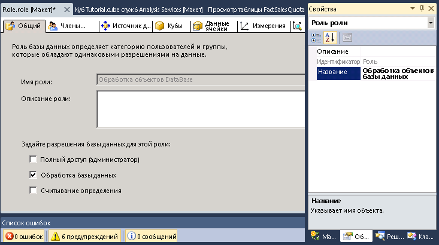
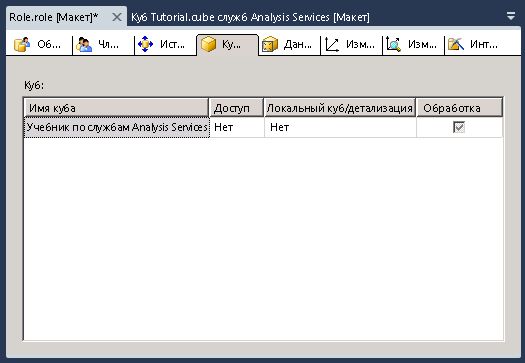

# Урок 10 - Предоставление разрешений на обработку базы данных
[!INCLUDE[ssas-appliesto-sqlas](../../includes/ssas-appliesto-sqlas.md)]

После установки экземпляра служб [!INCLUDE[ssASnoversion](../../includes/ssasnoversion-md.md)]все члены роли администратора сервера [!INCLUDE[ssASnoversion](../../includes/ssasnoversion-md.md)] в этом экземпляре получают разрешения уровня сервера для выполнения любых задач в пределах этого экземпляра служб [!INCLUDE[ssASnoversion](../../includes/ssasnoversion-md.md)]. По умолчанию другие пользователи не имеют разрешения на администрирование или просмотр объектов данного экземпляра служб [!INCLUDE[ssASnoversion](../../includes/ssasnoversion-md.md)].  
  
Член роли администратора сервера может предоставлять пользователям административный доступ на уровне сервера, включая их в эту роль. Член роли администратора сервера имеет ограниченные права, но также может открывать пользователям доступ, предоставляя им ограниченный или полный набор разрешений на администрирование или доступ на уровне базы данных. Ограниченные права на администрирование включают в себя разрешения на обработку или определение чтения на уровне базы данных, куба или измерения.  
  
В задачах этого раздела будет определена роль безопасности «Обработка объектов базы данных», которая предоставляет членам этой роли разрешение на обработку всех объектов базы данных, не предоставляя прав на просмотр данных в базе данных.  
  
## Определение роли «Обработка объектов базы данных»  
  
1.  В обозревателе решений щелкните правой кнопкой мыши элемент **Роли** и выберите команду **Создать роль** , чтобы открыть конструктор ролей.  
  
2.  Установите флажок **Обработка базы данных** .  
  
3.  В окне свойств укажите для свойства **Имя** новой роли значение **Обработка объектов базы данных**.  
  
      
  
4.  Перейдите на вкладку **Членство** конструктора ролей и нажмите кнопку **Добавить**.  
  
5.  Введите учетные записи пользователей домена Windows или группы, которые будут членами этой роли. Щелкните **Проверить имена** , чтобы проверить сведения об учетных записях, затем нажмите кнопку **ОК**.  
  
6.  Перейдите на вкладку **Кубы** конструктора ролей.  
  
    Обратите внимание, что члены этой роли имеют разрешение на обработку этой базы данных, но не имеют разрешения на доступ к данным в кубе учебника по службам [!INCLUDE[ssASnoversion](../../includes/ssasnoversion-md.md)] и не имеют доступа к локальному кубу и детализации, как показано на следующем рисунке.  
  
      
  
7.  Перейдите на вкладку **Измерения** конструктора ролей.  
  
    Обратите внимание, что члены этой роли имеют разрешения на обработку всех объектов измерения этой базы данных и по умолчанию имеют разрешения на чтение для каждого объекта измерения в базе данных учебника по службам [!INCLUDE[ssASnoversion](../../includes/ssasnoversion-md.md)] .  
  
8.  В меню **Сборка** выберите команду **Развернуть Analysis Services Tutorial**.  
  
    Роль «Обработка объектов базы данных» определена и развернута. После развертывания куба в производственной среде администраторы развернутого куба могут по мере необходимости добавлять пользователей в эту роль, чтобы передавать ответственность за обработку определенным пользователям.  
  
> [!NOTE]  
> Завершенный проект десятого занятия доступен для загрузки и установки образцов. Дополнительные сведения см. в статье [Установка образцов данных и проектов для учебника по многомерному моделированию в службах Analysis Services](install-sample-data-and-projects.md).  
  
## См. также  
[Роли и разрешения (службы Analysis Services)](../multidimensional-models/roles-and-permissions-analysis-services.md)  
  
  
  
