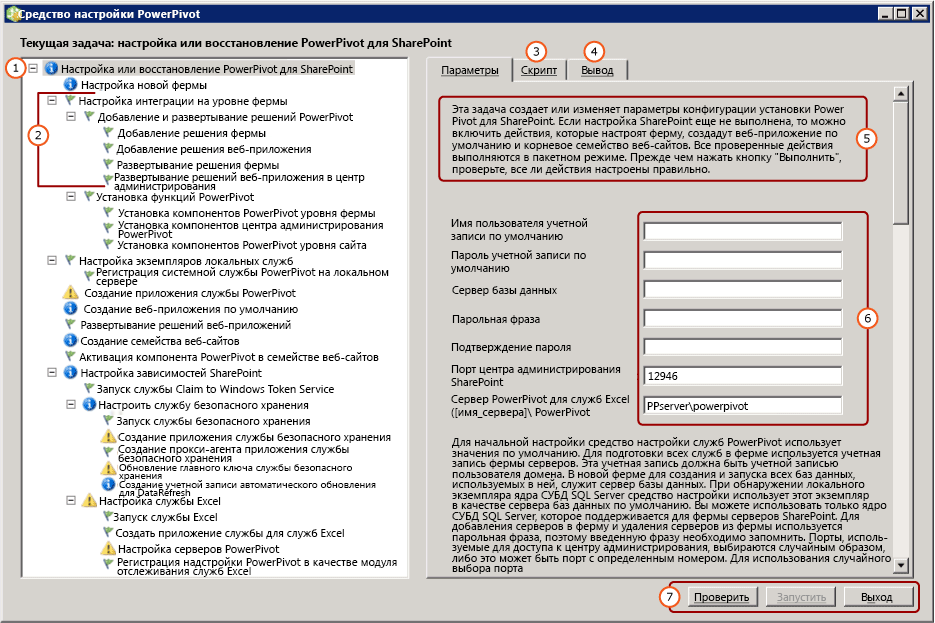

# <a name="configure-or-repair-power-pivot-for-sharepoint-2013"></a>Настройка или восстановление Power Pivot для SharePoint 2013
[!INCLUDE[ssas-appliesto-sqlas](../../includes/ssas-appliesto-sqlas.md)]Для настройки или восстановления установки [!INCLUDE[ssCurrent](../../includes/sscurrent-md.md)] [!INCLUDE[ssGemini](../../includes/ssgemini-md.md)] для SharePoint 2013 используйте [!INCLUDE[ssGemini](../../includes/ssgemini-md.md)] для средства настройки SharePoint. Работа средства настройки начинается со сканирования системы, в результате которого возвращается список действий, необходимых для завершения или восстановления установки. Мастер установки [!INCLUDE[ssCurrent](../../includes/sscurrent-md.md)] установит средства настройки [!INCLUDE[ssGemini](../../includes/ssgemini-md.md)] для SharePoint 2010, а также средство настройки [!INCLUDE[ssGemini](../../includes/ssgemini-md.md)] для SharePoint 2013. В этом разделе описывается средство настройки [!INCLUDE[ssGemini](../../includes/ssgemini-md.md)] для SharePoint 2013. Дополнительные сведения о SharePoint 2010 см. в разделе [Настройка или восстановление PowerPivot для SharePoint 2010 (средство настройки PowerPivot)](http://msdn.microsoft.com/en-us/d61f49c5-efaa-4455-98f2-8c293fa50046).  
  
 **[!INCLUDE[applies](../../includes/applies-md.md)]**  SharePoint 2013  
  
 **В этом разделе:**  
  
 [Перед началом](#bkmk_before)  
  
 [Использование инструмента настройки Power Pivot для SharePoint 2013](#bkmk_using)  
  
 [Шаги настройки](#bkmk_steps)  
  
 [Вводимые значения для настройки сервера](#bkmk_input)  
  
 [Следующие шаги](#bkmk_nextsteps)  
  
##  <a name="bkmk_before"></a> Перед началом  
 Средство настройки [!INCLUDE[ssGemini](../../includes/ssgemini-md.md)] для SharePoint 2013 сканирует программные файлы, параметры реестра и доступные порты. Для максимально эффективного использования средства обратите внимание на следующее.  
  
-   Общие требования для запуска средства настройки [Power Pivot Configuration Tools](../../analysis-services/power-pivot-sharepoint/power-pivot-configuration-tools.md).  
  
-   [!INCLUDE[ssGemini](../../includes/ssgemini-md.md)] для SharePoint 2013 предпочтительно использовать веб-приложение, настроенное на использования проверки подлинности на основе утверждений. Если средство настройки [!INCLUDE[ssGemini](../../includes/ssgemini-md.md)] для SharePoint 2013 создает приложение автоматически, то это приложение настраивается для использования проверки подлинности Windows на основе утверждений. Дополнительные сведения о требованиях к проверке подлинности см. в разделе [Power Pivot Authentication and Authorization](../../analysis-services/power-pivot-sharepoint/power-pivot-authentication-and-authorization.md).  
  
-   Чтобы было возможным создание веб-приложения, для средства настройки[!INCLUDE[ssGemini](../../includes/ssgemini-md.md)] для SharePoint 2013 должен быть открыт порт 80.  
  
##  <a name="bkmk_using"></a> Использование инструмента настройки Power Pivot для SharePoint 2013  
 На первой странице средства представлена сводка вводимых значений, используемых для настройки фермы SharePoint. В дополнение к вводимым значениям, которые указывает пользователь, для настройки системы используются значения по умолчанию. Имена по умолчанию используются для приложений служб, их баз данных и свойств.  
  
> [!TIP]  
>  Если средство настройки сканирует компьютер и возвращает пустой список задач на левой панели, то никакие компоненты и параметры настройки не требуют. Для изменения конфигурации SharePoint или [!INCLUDE[ssGemini](../../includes/ssgemini-md.md)] используйте Windows PowerShell или страницы управления в центре администрирования SharePoint. Дополнительные сведения см. в разделе [Настройка и администрирование сервера PowerPivot в центре администрирования](../../analysis-services/power-pivot-sharepoint/power-pivot-server-administration-and-configuration-in-central-administration.md).  
  
 Значения для учетных записей служб могут использоваться для нескольких служб. Например, средство настройки использует учетную запись по умолчанию на первой странице для настройки всех удостоверений пула приложений. Эти учетные записи можно изменить позднее, отредактировав свойства приложения службы в центре администрирования.  
  
 Средство предоставляет интерфейс с вкладками, где находятся значения параметров, скрипты Windows PowerShell и сообщения о состоянии.  
  
 Для настройки сервера средство использует Windows PowerShell. Для просмотра скрипта Windows PowerShell, который используется средством для настройки сервера, перейдите на вкладку **Скрипт** .  
  
   
  
||Description|  
|-|-----------------|  
|**(1)**|Окно «Список задач».|  
|**(2)**|Отдельные действия.|  
|**(3)**|Скрипты Windows PowerShell, созданные средством настройки.|  
|**(4)**|Сообщения журнала, созданные при запуске проверки или действий.|  
|**(5)**|Описание страницы.|  
|**(6)**|Входные параметры|  
|**(7)**|Кнопка **Выполнить** включена после проверки действий.|  
  
##  <a name="bkmk_steps"></a> Шаги настройки  
 Ссылка в инструменте настройки видна только тогда, когда [!INCLUDE[ssGemini](../../includes/ssgemini-md.md)] для SharePoint 2013 установлен на локальном сервере.  
  
1.  В меню **Пуск** последовательно щелкните **Все программы**, [!INCLUDE[ssCurrentUI](../../includes/sscurrentui-md.md)], **Средства настройки**, **[!INCLUDE[ssGemini](../../includes/ssgemini-md.md)] для SharePoint 2013**.  
  
2.  Щелкните **Настройка или восстановление [!INCLUDE[ssGemini](../../includes/ssgemini-md.md)] для SharePoint**.  
  
3.  Разверните окно в полный размер. Внизу окна должна появиться строка кнопок с командами **Проверить**, **Выполнить**и **Завершить работу** .  
  
4.  **Учетная запись по умолчанию.** На вкладке «Параметры» введите учетную запись пользователя домена, которая будет использоваться как **Имя пользователя по умолчанию**. Она будет использоваться для подготовки необходимых служб, в том числе пула приложений службы [!INCLUDE[ssGemini](../../includes/ssgemini-md.md)] . Не указывайте встроенную учетную запись, например Network Service или Local System. Средство блокирует конфигурации, в которых указываются встроенные учетные записи.  
  
     **Парольная фраза.** Введите парольную фразу. Если ферма SharePoint является новой, то парольная фраза используется при добавлении в нее новых серверов и приложений SharePoint. Если ферма уже существует, введите парольную фразу, которая позволяет добавить приложение службы в ферму.  
  
5.  **Порт.** Можно также указать номер порта, используемый для подключения к веб-приложению центра администрирования, либо использовать предоставляемый случайно номер. Прежде чем предложить номер порта, средство настройки проверит, свободен ли он.  
  
6.  На главной странице введите имя сервера [!INCLUDE[ssCurrent](../../includes/sscurrent-md.md)][!INCLUDE[ssGemini](../../includes/ssgemini-md.md)] , работающего в режиме интеграции с SharePoint.  
  
7.  При необходимости просмотрите остальные входные значения, которые использовались для завершения каждого действия. Дополнительные сведения о каждой из них см. в подразделе [Вводимые значения для настройки сервера](#bkmk_input) в этом разделе.  
  
8.  При необходимости удалите действия, которые не нужно выполнять. Например, при дальнейшей необходимости настройки службы Secure Store щелкните **Настроить службу Secure Store**и снимите флажок **Включить данное действие в список задач**.  
  
9. Нажмите кнопку **Проверить** , чтобы проверить, имеет ли средство достаточно данных для выполнения действий в списке.  
  
10. Нажмите кнопку **Выполнить** для выполнения всех действий из списка задач. Кнопка **Запустить** становится доступной после выполнения проверки действий. Если кнопка **Выполнить** недоступна, сначала нажмите кнопку **Проверить** .  
  
     Если выдается сообщение об ошибке, аналогичное следующему, проверьте, запущен ли экземпляр базы данных SQL Server.  
  
    ```  
    Cannot connect to the database server instance  
    ```  
  
11. [Verify a Power Pivot for SharePoint Installation](../../analysis-services/instances/install-windows/verify-a-power-pivot-for-sharepoint-installation.md).  
  
##  <a name="bkmk_input"></a> Вводимые значения для настройки сервера  
 Средство настройки [!INCLUDE[ssGemini](../../includes/ssgemini-md.md)] использует сочетание вводимых значений, задаваемых пользователем, и значений по умолчанию, которые оно обнаруживает или использует автоматически.  
  
 Отображаемый в средствах настроек список действий зависит от текущей конфигурации фермы SharePoint. Например, если ферма SharePoint уже настроена, в этом списке не будет действий по настройке фермы или созданию веб-приложения. Это средство можно запускать в любое время для настройки, восстановления или обнаружения ошибок конфигурации. Если в ферме не запущены необходимые службы, например службы Excel или Secure Store, средство определит отсутствующие службы и предложит варианты по их запуску. Если не требуются никакие действия, список задач будет пустым.  
  
 В следующей таблице перечислены значения, которые используются для настройки сервера.  
  
|Страница|Вводимое значение|Source|Description|  
|----------|-----------------|------------|-----------------|  
|**Настройка или восстановление [!INCLUDE[ssGemini](../../includes/ssgemini-md.md)] для SharePoint**|Учетная запись по умолчанию|Текущий пользователь|Учетной записью по умолчанию является учетная запись пользователя домена Windows, которая используется для провизионирования общих служб в ферме. Они используются для провизионирования следующим образом.|  
||||-<br />                    [!INCLUDE[ssGemini](../../includes/ssgemini-md.md)] .|  
||||Служба Secure Store.|  
||||Службы Excel.|  
||||Удостоверение пула веб-приложений.|  
||||Администратор семейства веб-сайтов.|  
||||Учетная запись автоматического обновления данных [!INCLUDE[ssGemini](../../includes/ssgemini-md.md)] .|  
||||По умолчанию используется учетная запись домена текущего пользователя.<br /><br /> Примечание. Рекомендуется заменить значение по умолчанию, если только сервер не настраивается для целей непроизводственного или пробного использования.<br /><br /> После настройки или исправления можно будет изменить удостоверения службы в центре администрирования.<br /><br /> При необходимости в средстве настройки [!INCLUDE[ssGemini](../../includes/ssgemini-md.md)] можно указать выделенные учетные записи для выполнения следующих задач.|  
||||Веб-приложение с использованием страницы **Создание веб-приложения по умолчанию** (при условии, что инструмент используется для создания веб-приложения для фермы).|  
||||-<br />                    [!INCLUDE[ssGemini](../../includes/ssgemini-md.md)] с использованием страницы **Создание автоматической учетной записи для обновления данных** из данного инструмента.|  
||Сервер базы данных|Локальный именованный экземпляр [!INCLUDE[ssGemini](../../includes/ssgemini-md.md)] (если таковой имеется)|Если экземпляр ядра СУБД установлен в виде именованного экземпляра [!INCLUDE[ssGemini](../../includes/ssgemini-md.md)] , средство заполнит поле сервера базы данных именем данного экземпляра. Если ядро СУБД не установлено, это поле будет пустым.<br /><br /> Параметр**Сервер базы данных**  является обязательным. Это может быть любая версия или выпуск SQL Server, которые поддерживаются для ферм SharePoint.|  
||Парольная фраза|Вводимые пользователем данные|При создании новой фермы указанная парольная фраза будет использоваться как парольная фраза для фермы. При добавлении [!INCLUDE[ssGemini](../../includes/ssgemini-md.md)] для SharePoint в существующую ферму введите парольную фразу существующей фермы.|  
||Порт центра администрирования SharePoint|По умолчанию (при необходимости)|Если ферма не настроена, средство предложит варианты по ее созданию, включая создание конечной точки HTTP для центра администрирования. Для этого выбирается случайно созданный незадействованный номер порта.|  
||[!INCLUDE[ssGemini](../../includes/ssgemini-md.md)] для служб Excel ([ServerName]\ [!INCLUDE[ssGemini](../../includes/ssgemini-md.md)])|Вводимые пользователем данные|Сервер [!INCLUDE[ssGemini](../../includes/ssgemini-md.md)] необходим службам Excel для поддержки базовых функций [!INCLUDE[ssGemini](../../includes/ssgemini-md.md)] . Введенное на этой странице имя сервера также добавляется в список на странице **Настройка серверов [!INCLUDE[ssGemini](../../includes/ssgemini-md.md)]**.|  
|**Настройка новой фермы**|Сервер базы данных<br /><br /> Учетная запись фермы<br /><br /> Парольная фраза<br /><br /> Порт центра администрирования SharePoint|По умолчанию (при необходимости)|Настройки по умолчанию для данных, введенных на главной странице.|  
|**Создание приложения службы [!INCLUDE[ssGemini](../../includes/ssgemini-md.md)]**|Имя приложения службы|По умолчанию|[!INCLUDE[ssGemini](../../includes/ssgemini-md.md)] . Именем по умолчанию является **По умолчанию [!INCLUDE[ssGemini](../../includes/ssgemini-md.md)] Service Application**. В средстве можно указать другое значение.|  
||Сервер базы данных|По умолчанию|Сервер базы данных, на котором размещается база данных приложения службы [!INCLUDE[ssGemini](../../includes/ssgemini-md.md)] . Имя сервера по умолчанию то же, что у сервера базы данных, используемого для фермы. Можно указать другое значение, отличное от имени сервера по умолчанию.|  
||Имя базы данных|По умолчанию|Имя базы данных, создаваемой для приложения службы [!INCLUDE[ssGemini](../../includes/ssgemini-md.md)] . Имя базы данных по умолчанию формируется исходя из имени приложения службы, за которым следует идентификатор GUID, обеспечивающий его уникальность. В средстве можно указать другое значение.|  
|**Создание веб-приложения по умолчанию**|Имя веб-приложения|По умолчанию (при необходимости)|Если веб-приложений не существует, то средство создает одно веб-приложение. Веб-приложение будет настроено для использования классического режима проверки подлинности и будет прослушивать порт 80. Максимальный размер файла для передачи устанавливается равным 2047, что является максимально допустимым значением в SharePoint. Большой размер файла для передачи позволяет передавать объемные файлы [!INCLUDE[ssGemini](../../includes/ssgemini-md.md)] на сервер.|  
||URL-адрес|По умолчанию (при необходимости)|Средство создает URL-адрес на основании имени сервера с использованием соглашений об именах файлов, принятых в SharePoint.|  
||Пул приложений|По умолчанию (при необходимости)|Средство создает пул приложений по умолчанию в службах IIS.|  
||Учетная запись и пароль пула веб-приложений|По умолчанию (при необходимости)|Учетная запись пула приложений основана на учетной записи по умолчанию, однако ее можно изменить в средстве.|  
||Сервер базы данных|По умолчанию (при необходимости)|Для хранения базы данных приложения автоматически выбирается экземпляр базы данных по умолчанию, однако в средстве можно выбрать другой экземпляр SQL Server.|  
||Имя базы данных|По умолчанию (при необходимости)|Имя базы данных приложения службы. Имя базы данных соответствует соглашениям об именах файлов, принятым в SharePoint, однако можно выбрать другое имя.|  
|**Развертывание решения веб-приложения**|URL-адрес|По умолчанию (при необходимости)|URL-адрес по умолчанию берется из веб-приложения по умолчанию.|  
||Максимальный размер файла (МБ)|По умолчанию (при необходимости)|Значение по умолчанию — 2047. Библиотеки документов SharePoint также имеют максимальный размер, и параметр [!INCLUDE[ssGemini](../../includes/ssgemini-md.md)] не должен превышать параметр библиотеки документов. Дополнительные сведения см. в разделе [Настройка максимального размера передаваемого файла (PowerPivot для SharePoint)](../../analysis-services/power-pivot-sharepoint/configure-maximum-file-upload-size-power-pivot-for-sharepoint.md).|  
|**Создание семейства веб-сайтов**|Администратор сайта|По умолчанию (при необходимости)|Средство использует учетную запись по умолчанию. Изменить ее можно на странице **Создание семейства веб-сайтов** .|  
||Адрес электронной почты для связи|По умолчанию (при необходимости)|Если на сервере настроена система Microsoft Outlook, средство будет использовать адрес электронной почты текущего пользователя. В противном случае будет использоваться заполнитель.|  
||URL-адрес сайта|По умолчанию (при необходимости)|Средство создает URL-адрес сайта с использованием такого же контекста именования URL-адресов, как в SharePoint.|  
||Заголовок сайта|По умолчанию (при необходимости)|В качестве заголовка по умолчанию инструмент использует **Сайт [!INCLUDE[ssGemini](../../includes/ssgemini-md.md)]**.|  
|**Активация компонента [!INCLUDE[ssGemini](../../includes/ssgemini-md.md)] в семействе веб-сайтов**|URL-адрес сайта||URL-адрес семейства веб-сайтов, для которого активируются функции [!INCLUDE[ssGemini](../../includes/ssgemini-md.md)] .|  
||Включение расширенной функции для этого сайта||Включить функцию «PremiumSite» на сайте SharePoint.|  
|**Создание приложения службы Secure Store**|Имя приложения службы|По умолчанию (при необходимости)|Введите имя приложения службы Secure Store.|  
||Сервер базы данных|Вводимые пользователем данные|Введите имя сервера базы данных для приложения службы Secure Store.|  
|**Создание прокси-агента приложения службы Secure Store**|Имя приложения службы|По умолчанию (при необходимости)|Введите имя приложения службы Secure Store, которое введено на предыдущей странице.|  
||Прокси-сервер приложения службы|По умолчанию (при необходимости)|Введите имя прокси-сервера приложения службы Secure Store. Это имя появится в группе соединений (по умолчанию), которая связывает приложения с веб-приложениями содержимого SharePoint.|  
|**Обновление главного ключа службы Secure Store**|Прокси-сервер приложения службы|По умолчанию (при необходимости)|Введите имя прокси-сервера приложения службы Secure Store, которое вводилось на предыдущей странице.|  
||Парольная фраза|Вводимые пользователем данные|Для шифрования данных используется главный ключ. По умолчанию для формирования ключа используется та же парольная фраза, с помощью которой выполняется подготовка новых серверов в ферме. Парольную фразу по умолчанию можно заменить на уникальную парольную фразу.|  
|**Создание учетной записи автоматического обновления для DataRefresh**|Идентификатор целевого приложения|По умолчанию (при необходимости)|Создайте целевое приложение для хранения учетных данных, используемых для автоматического обновления данных [!INCLUDE[ssGemini](../../includes/ssgemini-md.md)] .<br /><br /> Идентификатор приложения может быть описательным текстом.|  
||Понятное имя для целевого приложения|По умолчанию (при необходимости)||  
||Автоматические имя пользователя и пароль учетной записи|По умолчанию (при необходимости)|Введите данные учетной записи пользователя Windows, которые используются целевым приложением и для автоматического обновления данных. Дополнительные сведения см. в разделе [Настройка обновления данных служб Excel Services с помощью учетной записи службы автоматического обновления в SharePoint Server 2013](http://technet.microsoft.com/library/hh525344\(office.15\).aspx) (http://technet.microsoft.com/en-us/library/hh525344(office.15).aspx).|  
||URL-адрес сайта|По умолчанию (при необходимости)|Введите URL-адрес сайта семейства сайтов, сопоставленного с целевым приложением. Для сопоставления с дополнительными семействами веб-сайтов воспользуйтесь центром администрирования SharePoint.|  
|**Создать приложение службы для служб Excel**|Имя приложения службы|По умолчанию (при необходимости)|Введите имя приложения службы. На сервере баз данных фермы SharePoint будет создана база данных приложения службы с тем же именем.|  
|**Настройте серверы [!INCLUDE[ssGemini](../../includes/ssgemini-md.md)]**|Имя приложения службы|По умолчанию (при необходимости)|Имя приложения службы, введенное на предыдущей странице.|  
||[!INCLUDE[ssGemini](../../includes/ssgemini-md.md)] Имя сервера||Список зарегистрированных серверов [!INCLUDE[ssGemini](../../includes/ssgemini-md.md)] .<br /><br /> Имя сервера, введенное на предыдущей странице, автоматически добавляется на этой.|  
|**Регистрация надстройки [!INCLUDE[ssGemini](../../includes/ssgemini-md.md)] в качестве модуля отслеживания использования служб Excel**|Имя приложения службы||Имя приложения службы, введенное на предыдущей странице.|  
|||||  
  
 Если инструмент настройки [!INCLUDE[ssGemini](../../includes/ssgemini-md.md)] для SharePoint 2013 создает ферму, то при этом он создает необходимые базы данных на сервере базы данных с использованием соглашений об именования файлов, принятых в SharePoint. Изменить имя базы данных фермы нельзя.  
  
 Если средство создает семейство веб-сайтов, то создает базу данных содержимого на сервере баз данных с использованием соглашений об именах файлов, принятых в SharePoint. Изменить имя базы данных содержимого нельзя.  
  
## <a name="verify-the-configuration"></a>Проверка конфигурации  
 См. подраздел "Проверка конфигурации [!INCLUDE[ssGemini](../../includes/ssgemini-md.md)]" раздела [Настройка PowerPivot и развертывание решений (SharePoint 2013)](../../analysis-services/instances/install-windows/configure-power-pivot-and-deploy-solutions-sharepoint-2013.md).  
  
##  <a name="bkmk_nextsteps"></a> Следующие шаги  
 Существует несколько дополнительных задач, которые необходимо выполнить после завершения установки сервера.  
  
-   Предоставление разрешений SharePoint пользователям и группам. Эта задача необходима для обеспечения доступа к сайтам и их содержимому.  
  
-   Изменение удостоверений пула приложений службы для запуска из другой учетной записи. Указание другого удостоверения для служб и приложений рекомендуется для повышения безопасности развертывания SharePoint.  
  
-   Создайте дополнительные надежные сайты в службах Excel, чтобы можно было устанавливать разрешения и параметры конфигурации, которые наиболее подходят для доступа к данным [!INCLUDE[ssGemini](../../includes/ssgemini-md.md)] .  
  
-   Для поддержки обновления данных на сервере установите широко применяемые поставщики данных.  
  
### <a name="grant-sharepoint-permissions-to-workbook-users"></a>Предоставление разрешений SharePoint пользователям книги  
 Для публикации и просмотра книг пользователям требуются разрешения SharePoint. Пользователям, которые будут просматривать опубликованные книги, необходимо предоставить разрешение **Просмотр** , а пользователям, которые публикуют и обрабатывают книги, необходимо предоставить разрешение **Участие** . Для предоставления разрешений необходимо быть администратором семейства веб-сайтов.  
  
1.  На сайте SharePoint 2013 щелкните значок параметров  и нажмите кнопку **параметры сайта**.  
  
2.  Нажмите **Разрешения сайта** в группе **Пользователи и разрешения** .  
  
3.  Создавайте группы по мере необходимости, если требуется набор пользователей с разрешениями **Участие** , и отдельную группу для набора пользователей только с разрешениями **Просмотр** .  
  
4.  Введите учетные записи пользователей или групп домена Windows, которые будут иметь членство в группах. Как и ранее, адреса электронной почты или группы распределения следует использовать только в том случае, если приложение настроено для классической проверки подлинности.  
  
### <a name="install-data-providers-used-in-data-refresh-and-check-user-permissions"></a>Установка поставщиков данных, используемых для обновления данных, и проверка разрешений пользователя  
 Обновление данных на сервере позволяет пользователям импортировать обновленные данные в свои книги в автоматическом режиме. Для успешного обновления данных сервер, на котором работают службы Analysis Services в режиме интеграции с SharePoint, должен иметь те же поставщики данных, что использовались и для первоначального импорта данных. Кроме того, учетная запись пользователя, под которой выполняется обновление данных, часто должна иметь разрешение на чтение из внешних источников данных. Чтобы гарантировать успешное завершение операции, необходимо проверить требования для включения и настройки обновления данных. Дополнительные сведения см. в разделе [Обновление данных PowerPivot с SharePoint 2010](http://msdn.microsoft.com/en-us/01b54e6f-66e5-485c-acaa-3f9aa53119c9).  
  
> [!NOTE]  
>  Для [!INCLUDE[ssCurrent](../../includes/sscurrent-md.md)][!INCLUDE[ssGemini](../../includes/ssgemini-md.md)] для SharePoint 2013 поставщики данных устанавливаются при запуске установщика **spPowerPivot.msi** и инструмента настройки [!INCLUDE[ssGemini](../../includes/ssgemini-md.md)] для SharePoint 2013. Дополнительные сведения см. в разделе [Установка или удаление надстройки Power Pivot для SharePoint (SharePoint 2013)](../../analysis-services/instances/install-windows/install-or-uninstall-the-power-pivot-for-sharepoint-add-in-sharepoint-2013.md).  
  
### <a name="change-application-pool-and-service-identities-in-sharepoint"></a>Изменение пула приложений или идентификаторов служб в SharePoint  
 Средство настройки [!INCLUDE[ssGemini](../../includes/ssgemini-md.md)] подготавливает компоненты фермы, приложения и службы для работы от одной учетной записи. Это упрощает установку, однако система при этом не будет удовлетворять требованиям безопасности фермы SharePoint. Чтобы добиться более высокого уровня надежности системы, после завершения установки измените удостоверения пулов приложений и служб таким образом, чтобы они работали под разными учетными записями. Дополнительные сведения см. в разделе [Настройка учетных записей служб PowerPivot](../../analysis-services/power-pivot-sharepoint/configure-power-pivot-service-accounts.md).  
  
### <a name="create-additional-trusted-sites-in-excel-services"></a>Создание дополнительных надежных сайтов в службах Excel  
 Можно добавить надежные сайты в службы Excel, чтобы изменять разрешения и параметры конфигурации для сайтов, предоставляющих книги Excel и данные [!INCLUDE[ssGemini](../../includes/ssgemini-md.md)] . Дополнительные сведения см. в разделе [Создание надежного расположения для сайтов PowerPivot в центре администрирования](../../analysis-services/power-pivot-sharepoint/create-a-trusted-location-for-power-pivot-sites-in-central-administration.md).  
  
### <a name="build-a-includessgeminiincludesssgemini-mdmd-workbook"></a>Построение книги [!INCLUDE[ssGemini](../../includes/ssgemini-md.md)]  
 После установки компонентов сервера на ферму можно перейти к созданию первой книги Excel 2013, в которой будут использоваться внедренные данные [!INCLUDE[ssGemini](../../includes/ssgemini-md.md)] , а затем опубликовать ее в библиотеке SharePoint. Также можно передать или опубликовать образец книги [!INCLUDE[ssGemini](../../includes/ssgemini-md.md)] , чтобы проверить доступ к данным [!INCLUDE[ssGemini](../../includes/ssgemini-md.md)] в SharePoint. Дополнительные сведения см. в следующих разделах:  
  
-   [Power Pivot справки](https://support.office.com/en-us/article/Power-Pivot-Help-241aac41-92e3-4e46-ae58-2f2cd7dbcf4f) (https://support.office.com/en-us/article/Power-Pivot-Help-241aac41-92e3-4e46-ae58-2f2cd7dbcf4f).  
  
-   [Запуск PowerPivot в Excel 2013](http://office.microsoft.com/excel-help/start-powerpivot-in-excel-2013-add-in-HA102837097.aspx?CTT=5&origin=HA102837110) (http://office.microsoft.com/excel-help/start-powerpivot-in-excel-2013-add-in-HA102837097.aspx?CTT=5&origin=HA102837110).  
  
### <a name="add-additional-analysis-services-servers-in-sharepoint-mode"></a>Добавление серверов службы Analysis Services в режиме интеграции с SharePoint  
 В дальнейшем, если потребуются дополнительные возможности по хранению и обработке данных, в ферму можно будет добавить дополнительные серверы для работы служб Analysis Services в режиме интеграции с SharePoint. Для [!INCLUDE[ssCurrent](../../includes/sscurrent-md.md)][!INCLUDE[ssGemini](../../includes/ssgemini-md.md)] для SharePoint 2013 новые серверы [!INCLUDE[ssASnoversion](../../includes/ssasnoversion-md.md)] устанавливаются в режиме интеграции с SharePoint, а затем настраиваются службы Excel. Дополнительные сведения см. в подразделе "Действия после установки одиночного сервера" раздела [Установка служб Analysis Services в режиме PowerPivot](../../analysis-services/instances/install-windows/install-analysis-services-in-power-pivot-mode.md).  
  
## <a name="additional-resources"></a>Дополнительные ресурсы  
  [Отправка отзыва и контактных данных через веб-сайт Microsoft SQL Server Connect](https://connect.microsoft.com/SQLServer/Feedback) (https://connect.microsoft.com/SQLServer/Feedback).  
  
## <a name="see-also"></a>См. также:  
 [Установка или удаление надстройки Power Pivot для SharePoint (SharePoint 2013)](../../analysis-services/instances/install-windows/install-or-uninstall-the-power-pivot-for-sharepoint-add-in-sharepoint-2013.md)   
 [Средства настройки PowerPivot](../../analysis-services/power-pivot-sharepoint/power-pivot-configuration-tools.md)   
 [Настройка и администрирование сервера Power Pivot в центре администрирования](../../analysis-services/power-pivot-sharepoint/power-pivot-server-administration-and-configuration-in-central-administration.md)   
 [Обновление книг и запланированное обновление данных (SharePoint 2013 )](../../analysis-services/instances/install-windows/upgrade-workbooks-and-scheduled-data-refresh-sharepoint-2013.md)  
  
  
