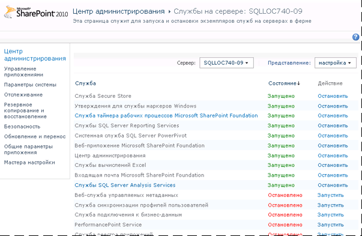
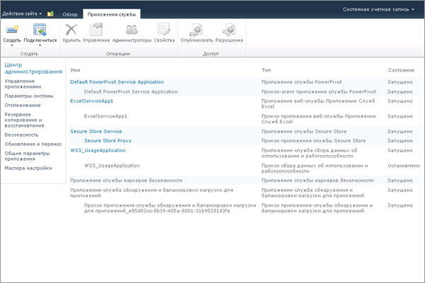

# Настройка правил определения работоспособности PowerPivot
  [!INCLUDE[ssGemini](../../includes/ssgemini-md.md)] для SharePoint включает правила определения работоспособности SharePoint, позволяющие отслеживать и устранять проблемы доступности и конфигурации сервера. Правила определения работоспособности, которые применяются к [!INCLUDE[ssGemini](../../includes/ssgemini-md.md)] для SharePoint, отображаются на странице Review rule definitions (Просмотр определений правил).  
  
 Правила определения исправности позволяют заранее выявлять проблемы сервера, которые в итоге могут привести к нарушениям работы служб. [!INCLUDE[ssGemini](../../includes/ssgemini-md.md)] для SharePoint предоставляет ряд правил, позволяющих выявлять и устранять проблемы, прежде чем они коснутся пользователей. Многие из этих правил можно настроить в соответствии с уникальными характеристиками конкретного развертывания. Например, если требуется больше времени на принятие мер в ответ на нехватку места на диске, можно увеличить пороговое значение доступного пространства с 5 до 10 %, чтобы предупреждение поступало раньше.  
  
 Существует возможность настройки правил, сигнализирующих о потреблении ресурсов или доступности сервера. Настройка полезна в этих областях, поскольку емкость базовой системы значительно различается в зависимости от используемых серверов и топологий развертывания. В то же время настройка недоступна для правил, которые следят за конфигурацией сервера или аспектами, связанными с безопасностью. Эти правила должны действовать одинаково на всех установленных экземплярах.  
  
||  
|-|  
|**[!INCLUDE[applies](../../includes/applies-md.md)]** SharePoint 2013 #124; SharePoint 2010|  
  
 **Примечание** . Параметры правил определения работоспособности настраиваются независимо для экземпляра служб SQL Server Analysis Services и приложения службы [!INCLUDE[ssGemini](../../includes/ssgemini-md.md)] . Инструкции данного раздела позволяют настроить правила определения исправности для каждой службы. В развертывании SharePoint 2013 [!INCLUDE[ssGeminiShort](../../includes/ssgeminishort-md.md)] использует только приложение службы. Поэтому [!INCLUDE[ssGeminiShort](../../includes/ssgeminishort-md.md)] устанавливает разные наборы правил определения исправности для разных версий SharePoint. См. столбец "Версия" в разделе [Справочник по правилам для определения работоспособности (PowerPivot для SharePoint)](../../analysis-services/power-pivot-sharepoint/health-rules-reference-power-pivot-for-sharepoint.md). Также для отображения списка установленных правил можно выполнить следующую команду Windows PowerShell.  
  
```  
Get-SPHealthAnalysisRule | select name, enabled, summary | where {$_.summary -like “*power*”}  | format-table -property * -autosize | out-default  
```  
  
 **В этом разделе:**  
  
 [Просмотр правил определения работоспособности PowerPivot](#bkmk_view)  
  
 [Настройка правил определения исправности, используемых для оценки стабильности сервера (службы SQL Server Analysis Services)](#bkmk_HR_SSAS)  
  
 [Настройка правил определения работоспособности, используемых для оценки стабильности работы приложения (приложение службы PowerPivot)](#bkmk_evaluate_application_stability)  
  
## Предварительные требования  
 Для изменения свойств конфигурации экземпляра служб Analysis Services и приложения службы [!INCLUDE[ssGemini](../../includes/ssgemini-md.md)] необходимы права администратора.  
  
##  <a name="bkmk_view"></a> Просмотр правил определения работоспособности PowerPivot  
  
1.  В центре администрирования SharePoint выберите **Отслеживание**, а в разделе **Анализатор исправности** щелкните **Просмотр определений правил**.  
  
2.  В разделе "Конфигурация" найдите правила с префиксом **[!INCLUDE[ssGemini](../../includes/ssgemini-md.md)]:** . Все правила определения работоспособности, относящиеся к [!INCLUDE[ssGemini](../../includes/ssgemini-md.md)], имеют этот префикс, что позволяет отличить их от встроенных правил SharePoint.  
  
 Эти правила отображаются на странице **Обзор проблем и решений** при обнаружении проблем.  
  
 Если есть основания полагать, что возникла проблема, которую необходимо исследовать немедленно, проверку правила можно выполнить вручную, чтобы выяснить, имеется ли проблема.  
  
 Для этого щелкните правило, чтобы открыть его определение, а затем нажмите кнопку **Выполнить** на ленте. Щелкните **Закрыть** , чтобы вернуться на страницу **Обзор проблем и решений** для просмотра отчета. Если правилом обнаружена проблема, на странице появится предупреждение или сообщение об ошибке. В некоторых случаях сообщение об ошибке или предупреждение появляется только через несколько минут.  
  
##  <a name="bkmk_HR_SSAS"></a> Настройка правил определения исправности, используемых для оценки стабильности сервера (службы SQL Server Analysis Services)  
 Экземпляр служб Analysis Services содержит правила определения исправности, которые позволяют обнаружить проблемы на системном уровне (ЦП, память и место на диске, используемое в целях кэширования). Следуйте приведенным далее инструкциям для изменения пороговых значений, вызывающих срабатывание конкретных правил определения исправности.  
  
1.  В центре администрирования SharePoint в разделе **Системные параметры** щелкните **Управление службами на сервере**.  
  
2.  В верхней части страницы выберите сервер фермы SharePoint, на котором имеется экземпляр служб Analysis Services (на следующем рисунке имя сервера — AW-SRV033). В списке служб появятся службы**SQL Server Analysis Services** .  
  
       
  
3.  Нажмите **Службы SQL Server Analysis Services**.  
  
4.  На страницах свойств служб в разделе «Параметры правил определения исправности» измените следующие настройки.  
  
     Недостаточный объем выделенных ресурсов ЦП (по умолчанию 80 %)  
     Это правило определения исправности срабатывает, если загрузка ресурсов ЦП, используемых процессом сервера служб Analysis Services (msmdsrv.exe), остается на уровне 80% или выше в течение более чем 4 часов (как указано параметром «Интервал сбора данных»).  
  
     Этот параметр конфигурации соответствует следующему определению правила на странице **Обзор проблем и решений** : **[!INCLUDE[ssGemini](../../includes/ssgemini-md.md)]: ресурсы ЦП недостаточны для выполнения запрошенных операций службами Analysis Services.**  
  
     Недостаточный объем ресурсов ЦП в системе (по умолчанию 90 %)  
     Это правило определения исправности срабатывает, если загрузка ресурсов ЦП, используемых сервером, остается на уровне 90% или выше в течение более чем 4 часов (как указано параметром «Интервал сбора данных»). Чрезмерная загрузка ЦП измеряется в рамках алгоритма распределения нагрузки с учетом исправности, который отслеживает загрузку ЦП в качестве показателя исправности сервера.  
  
     Этот параметр конфигурации соответствует следующему определению правила на странице **Обзор проблем и решений** : **[!INCLUDE[ssGemini](../../includes/ssgemini-md.md)]: общая загрузка ЦП слишком велика.**  
  
     Пороговое значение недостаточного объема памяти (по умолчанию 5 %)  
     На сервере приложений SharePoint для экземпляра служб SQL Server Analysis Services должен быть всегда зарезервирован небольшой объем памяти, который никогда не используется. Так как большая часть операций на сервере связана с использованием памяти, сервер работает лучше, если загружен не полностью. Величина 5 % от неиспользуемой памяти вычисляется относительно объема, выделенного службам Analysis Services. Например, если общий объем памяти составляет 200 ГБ и службам Analysis Services выделено 80 % (или 160 ГБ), то 5 % неиспользуемой памяти — это 5 % от 160 ГБ (или 8 ГБ).  
  
     Этот параметр конфигурации соответствует следующему определению правила на странице **Обзор проблем и решений** : **[!INCLUDE[ssGemini](../../includes/ssgemini-md.md)]: службы Analysis Services не имеют достаточно памяти для выполнения запрошенных операций.**  
  
     Максимальное количество соединений (по умолчанию 100).  
     Это правило определения исправности срабатывает, если количество подключений к экземпляру служб Analysis Services остается на уровне 100 или выше в течение более чем 4 часов (как указано параметром «Интервал сбора данных»). Это значение по умолчанию задается произвольно (не зависит от характеристик оборудования сервера и от активности пользователей), и его можно изменять в любую сторону в зависимости от объема ресурсов сервера и типичных показателей активности пользователей в среде.  
  
     Этот параметр конфигурации соответствует следующему определению правила на странице **Обзор проблем и решений** : **[!INCLUDE[ssGemini](../../includes/ssgemini-md.md)]: большое число подключений свидетельствует о необходимости задействовать дополнительные серверы, чтобы справиться с нагрузкой.**  
  
     Недостаточный объем места на диске (по умолчанию 5 %)  
     Место на диске используется для кэширования данных [!INCLUDE[ssGemini](../../includes/ssgemini-md.md)] при каждом запросе базы данных. Это правило позволяет узнать о нехватке места на диске. По умолчанию это правило определения исправности срабатывает, когда объем свободного места на диске становится меньше 5 % объема диска, на котором расположена папка резервного копирования. Дополнительные сведения об использовании диска см. в разделе [Настройка использования места на диске (PowerPivot для SharePoint)](../../analysis-services/power-pivot-sharepoint/configure-disk-space-usage-power-pivot-for-sharepoint.md).  
  
     Этот параметр конфигурации соответствует следующему определению правила на странице **Обзор проблем и решений** : **[!INCLUDE[ssGemini](../../includes/ssgemini-md.md)]: недостаток места на диске, на который кэшируются данные [!INCLUDE[ssGemini](../../includes/ssgemini-md.md)] .**  
  
     Интервал сбора данных (в часах)  
     Можно указать период сбора данных, используемый для вычисления числовых значений, вызывающих срабатывание правил определения исправности. Хотя система постоянно отслеживается, пороговые значения, вызывающие срабатывание предупреждений правил определения исправности, вычисляются с использованием данных, созданных в течение стандартного интервала. Интервал по умолчанию равен 4 часам. Сервер извлекает данные о системе и загрузке, собранные в течение предыдущих 4 часов, для вычисления количества соединений пользователей, использования места на диске и коэффициентов загрузки ЦП и памяти.  
  
##  <a name="bkmk_evaluate_application_stability"></a> Настройка правил определения работоспособности, используемых для оценки стабильности работы приложения (приложение службы PowerPivot)  
  
1.  В разделе «Управление приложениями» центра администрирования выберите пункт **Управление приложениями служб**.  
  
2.  На странице "Приложения службы" щелкните **Приложение службы [!INCLUDE[ssGemini](../../includes/ssgemini-md.md)] по умолчанию**.  
  
       
  
3.  Откроется информационная панель управления [!INCLUDE[ssGemini](../../includes/ssgemini-md.md)] . В списке **Действия** выберите **Настройка параметров приложения службы** , чтобы открыть страницу параметров приложений службы.  
  
       
  
4.  В разделе «Параметры правил определения исправности» измените следующие параметры.  
  
     Отношение числа загрузок к числу соединений (по умолчанию 20 %)  
     Это правило определения исправности срабатывает, если число событий загрузки относительно велико по сравнению с числом событий соединения. Это означает, что сервер слишком быстро выгружает базы данных или что параметры сокращения объема кэша слишком ограничительны.  
  
     Этот параметр конфигурации соответствует следующему определению правила на странице **Обзор проблем и решений** : **[!INCLUDE[ssGemini](../../includes/ssgemini-md.md)]: слишком высокое отношение события загрузки к числу соединений.**  
  
     Интервал сбора данных (по умолчанию 4 часа)  
     Можно указать период сбора данных, используемый для вычисления числовых значений, вызывающих срабатывание правил определения исправности. Хотя система постоянно отслеживается, пороговые значения, вызывающие срабатывание предупреждений правил определения исправности, вычисляются с использованием данных, созданных в течение стандартного интервала. Интервал по умолчанию равен 4 часам. Сервер извлекает данные о системе и загрузке, собранные в течение предыдущих 4 часов, для вычисления соотношения загрузки к сбору.  
  
     Проверка обновлений файла [!INCLUDE[ssGemini](../../includes/ssgemini-md.md)] Management Dashboard.xlsx (по умолчанию 5 дней)  
     Файл [!INCLUDE[ssGemini](../../includes/ssgemini-md.md)] Management Dashboard.xlsx является источником данных для отчетов информационной панели управления [!INCLUDE[ssGemini](../../includes/ssgemini-md.md)]. В конфигурации сервера по умолчанию XLSX-файл каждый день обновляется данными об использовании, собранными SharePoint и системной службой [!INCLUDE[ssGemini](../../includes/ssgemini-md.md)] . В случае необновления файла правило определения исправности сообщает об этом как о проблеме. По умолчанию правило срабатывает, если метка времени файла не изменялась в течение 5 дней.  
  
     Дополнительные сведения о сборе данных об использовании см. в разделе [Настройка сбора данных об использовании с PowerPivot для SharePoint](../../analysis-services/power-pivot-sharepoint/configure-usage-data-collection-for-power-pivot-for-sharepoint.md).  
  
     Этот параметр конфигурации соответствует следующему определению правила на странице **Обзор проблем и решений** : **[!INCLUDE[ssGemini](../../includes/ssgemini-md.md)]: данные об использовании не обновляются с ожидаемой частотой.**  
  
## См. также  
 [Настройка использования места на диске (PowerPivot для SharePoint)](../../analysis-services/power-pivot-sharepoint/configure-disk-space-usage-power-pivot-for-sharepoint.md)   
 [Информационная панель управления PowerPivot и данные об использовании](../../analysis-services/power-pivot-sharepoint/power-pivot-management-dashboard-and-usage-data.md)  
  
  