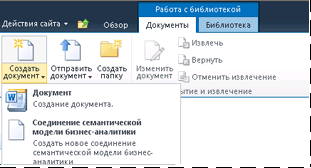
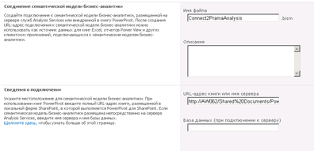

# Создание подключения между семантической моделью бизнес-аналитики и книгой PowerPivot
[!INCLUDE[ssas-appliesto-sqlas](../../includes/ssas-appliesto-sqlas.md)]Приведенные в этом разделе помогут настроить соединение семантической модели бизнес-Аналитики, который перенаправляет [!INCLUDE[ssGemini](../../includes/ssgemini-md.md)] книгу в той же ферме.  
  
 После создания соединения семантической модели бизнес-аналитики и настройки разрешений SharePoint это соединение можно использовать в качестве источника данных для отчетов Excel или [!INCLUDE[ssCrescent](../../includes/sscrescent-md.md)] .  
  
 Этот раздел включает следующие подразделы: Выполните задачи в указанном порядке.  
  
 [Проверка предварительных требований](#bkmk_prereq)  
  
 [Создание подключения](#bkmk_create)  
  
 [Настройка разрешений SharePoint для соединения семантической модели бизнес-аналитики](#bkmk_permissions)  
  
 [Настройка разрешений SharePoint для книги](#bkmk_userdb)  
  
 [Следующие шаги](#bkmk_next)  
  
##   Проверка предварительных требований  
 Для создания файла соединения семантической модели бизнес-аналитики требуется разрешение «Участие» или выше.  
  
 Необходима библиотека, поддерживающая тип содержимого соединения семантической модели бизнес-аналитики. Дополнительные сведения см. в разделе [Добавление типа содержимого соединения для семантической модели бизнес-аналитики в библиотеку (PowerPivot для SharePoint)](../../analysis-services/power-pivot-sharepoint/add-bi-semantic-model-connection-content-type-to-library.md).  
  
 Необходимо знать URL-адрес [!INCLUDE[ssGemini](../../includes/ssgemini-md.md)] книги, для которой настраивается соединение семантической модели бизнес-Аналитики (например, `http://adventure-works/shared documents/myworkbook.xlsx`). Книга должна находиться в той же ферме.  
  
 Все компьютеры и пользователи, участвующие в последовательности соединения, должны относиться к одному домену или находиться в доверенном домене (двустороннее доверие).  
  
##   Создание подключения  
  
1.  В библиотеке, в которой будет размещаться соединение семантической модели бизнес-аналитики, нажмите кнопку **Документы** на ленте SharePoint. Щелкните стрелку вниз на кнопке "Новый документ" и выберите **Файл соединения BISM** , чтобы открыть страницу "Создание соединения BISM".  
  
       
  
2.  В качестве значения свойства **Сервер** задайте URL-адрес книги [!INCLUDE[ssGemini](../../includes/ssgemini-md.md)] в SharePoint (например, `http://mysharepoint/shared documents/myWorkbook.xlsx`. При развертывании [!INCLUDE[ssGemini](../../includes/ssgemini-md.md)] для SharePoint данные могут быть загружены на любой сервер в ферме. По этой причине при подключениях к данным [!INCLUDE[ssGemini](../../includes/ssgemini-md.md)] указывается только путь к рабочей книге. Системная служба [!INCLUDE[ssGemini](../../includes/ssgemini-md.md)] определяет, какой сервер загружает данные.  
  
     Не указывайте значение свойства **База данных** . Оно не используется при указании расположения книги [!INCLUDE[ssGemini](../../includes/ssgemini-md.md)] .  
  
     Страница должна выглядеть примерно так, как на следующей иллюстрации.  
  
       
  
     (Необязательно.) При наличии разрешений SharePoint для книги выполняется дополнительная проверка, что позволяет убедиться в правильности расположения. Если разрешения на доступ к данным нет, предоставляется возможность сохранить соединение семантической модели бизнес-аналитики без проверки.  
  
##   Настройка разрешений SharePoint для соединения семантической модели бизнес-аналитики  
 Для использования соединения семантической модели бизнес-аналитики в качестве источника данных для книги Excel или отчета служб Reporting Services необходимо разрешение **Чтение** для элемента соединения семантической модели бизнес-аналитики в библиотеке SharePoint. Уровень разрешения "Чтение" включает разрешение **Открытие элементов** , которое позволяет загружать сведения о соединении семантической модели бизнес-аналитики в приложение Excel для рабочего стола.  
  
 В SharePoint имеется несколько способов предоставления разрешений. В следующей процедуре описывается создание новой группы с именем **Пользователи BISM** , которая получает уровень разрешений **Чтение** .  
  
 Изменять разрешения могут только владельцы сайтов.  
  
1.  В разделе "Действия сайта" щелкните **Разрешения сайта**.  
  
2.  Щелкните **Создать группу** и укажите для новой группы имя **Пользователи BISM**.  
  
3.  Выберите уровень разрешений **Чтение** и нажмите кнопку **Создать**.  
  
4.  Выберите **Пользователи BISM** в поле "Пользователи и группы".  
  
5.  Наведите указатель мыши на пункт "Создать", выберите **Добавить пользователей**и добавьте учетные записи пользователей или групп.  
  
     Теперь у этих пользователей и групп будет разрешение «Чтение» для всего сайта, включая все библиотеки и списки, которые наследуют разрешения на уровне сайта. Если эти разрешения оказываются слишком большими, можно удалить данную группу из определенных библиотек, списков или элементов.  
  
 Чтобы выборочно удалить разрешения на уровне элемента, выполните следующие действия.  
  
1.  Выберите документ в библиотеке. Нажмите правую кнопку со стрелкой вниз и выберите пункт **Управление разрешениями**.  
  
2.  По умолчанию элемент наследует разрешения. Чтобы изменить разрешения для отдельных документов в этой библиотеке, нажмите кнопку **Прекратить наследование разрешений**.  
  
3.  Установите флажок для группы **Пользователи BISM**.  
  
4.  Нажмите кнопку **Удалить разрешения пользователя**.  
  
##   Настройка разрешений SharePoint для книги  
 При использовании базы данных [!INCLUDE[ssGemini](../../includes/ssgemini-md.md)] в книге Excel разрешения SharePoint для книги Excel определяют доступ к данным через соединение семантической модели бизнес-аналитики. Все пользователи, обращающиеся к книге, должны иметь применительно к ней разрешения «Чтение» для ее использования в качестве внешнего источника данных.  
  
 Если группа **Пользователи BISM** создана с помощью вышеописанной процедуры, учетные записи пользователей и групп, входящих в группу **Пользователи BISM** , получают достаточные разрешения для книги и файла подключения семантической модели бизнес-аналитики при условии, что в книге используются унаследованные разрешения.  
  
##   Следующие шаги  
 После создания и обеспечения безопасности соединения семантической модели бизнес-аналитики его можно указать в качестве источника данных. Дополнительные сведения см. в разделе [Использование соединения семантической модели бизнес-аналитики в службах Excel или Reporting Services](../../analysis-services/power-pivot-sharepoint/use-a-bi-semantic-model-connection-in-excel-or-reporting-services.md).  
  
## См. также:  
 [Соединение семантической модели бизнес-аналитики PowerPivot (BISM-файлы)](../../analysis-services/power-pivot-sharepoint/power-pivot-bi-semantic-model-connection-bism.md)   
 [Использовать соединение семантической модели бизнес-Аналитики в Excel или Reporting Services](../../analysis-services/power-pivot-sharepoint/use-a-bi-semantic-model-connection-in-excel-or-reporting-services.md)   
 [Создание подключения между семантической моделью бизнес-аналитики и книгой PowerPivot](../../analysis-services/power-pivot-sharepoint/create-a-bi-semantic-model-connection-to-a-tabular-model-database.md)  
  
  
