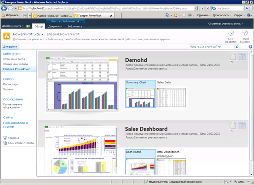

# Создание и настройка коллекции Power Pivot
[!INCLUDE[ssas-appliesto-sqlas](../../includes/ssas-appliesto-sqlas.md)][!INCLUDE[ssGemini](../../includes/ssgemini-md.md)] Коллекции — это специальный тип библиотеки документов SharePoint, которая предоставляет широкие возможности просмотра и управления документами для опубликованных книг Excel и отчетов служб Reporting Services, содержащих [!INCLUDE[ssGemini](../../includes/ssgemini-md.md)] данных.  
  
##   В этом разделе  
  
-   [Предварительные требования](#prereq)  
  
-   [Обзор](#overview)  
  
-   [Создание коллекции Power Pivot](#createlib)  
  
-   [Настройка библиотеки коллекции Power Pivot](#customize)  
  
-   [Отключение или скрытие кнопки обновления](#bkmk_hide_refresh_button)  
  
-   [Переключение в вид «Галерея» или «Театр»](#switch)  
  
##   Предварительные требования  
  
-   Необходимо наличие Silverlight. Silverlight можно загрузить и установить через Центр обновления Майкрософт. Если библиотека [!INCLUDE[ssGemini](../../includes/ssgemini-md.md)] просматривается с помощью браузера без Silverlight, перейдите по ссылке, чтобы установить Silverlight. После установки Silverlight необходимо закрыть и вновь открыть браузер.  
  
    > [!NOTE]  
    >  Для коллекции Power Pivot требуется Microsoft Silverlight.  Браузер Microsoft Edge не поддерживает Silverlight.   
    > Чтобы просмотреть содержание библиотеки в Edge, щелкните вкладку **Библиотека** в коллекции Power Pivot, а затем измените представление библиотеки документов на **Все документы**.    
    > Чтобы изменить представление по умолчанию, щелкните вкладку **Библиотека** и щелкните "Изменить представление". Щелкните "Сделать представлением по умолчанию", а затем "ОК", чтобы сохранить представление по умолчанию.  
    >  Дополнительную информацию о том, что поддерживается в Edge, см. в статье блога Windows [Побег из прошлого, часть 2: прощание с ActiveX, VBScript...](https://blogs.windows.com/msedgedev/2015/05/06/a-break-from-the-past-part-2-saying-goodbye-to-activex-vbscript-attachevent/)  
  
-   Для создания библиотеки необходимо быть владельцем сайта, на котором она создается.  
  
-   Для публикации или передачи файла необходимо иметь разрешения «Участие» или выше.  
  
-   [!INCLUDE[ssGemini](../../includes/ssgemini-md.md)] не может находиться на ограниченном сайте. Родительский сайт, который содержит галерею [!INCLUDE[ssGemini](../../includes/ssgemini-md.md)] , должен быть добавлен либо в перечень доверенных сайтов, либо в зону "Местная интрасеть".  
  
-   Для приложения необходимо развернуть решение веб-приложения [!INCLUDE[ssGemini](../../includes/ssgemini-md.md)] и активировать функцию [!INCLUDE[ssGemini](../../includes/ssgemini-md.md)] для семейства веб-сайтов. Дополнительные сведения см. в статьях [Развертывание решений PowerPivot в SharePoint](../../analysis-services/power-pivot-sharepoint/deploy-power-pivot-solutions-to-sharepoint.md) и[Включение интеграции функций PowerPivot для семейств веб-сайтов в центре администрирования](../../analysis-services/power-pivot-sharepoint/activate-power-pivot-integration-for-site-collections-in-ca.md).  
  
-   Для просмотра или создания отчета Reporting Services, созданного на основе книги [!INCLUDE[ssGemini](../../includes/ssgemini-md.md)] , книга и отчет должны находиться в одной библиотеке галереи [!INCLUDE[ssGemini](../../includes/ssgemini-md.md)] . Используемая в отчете книга [!INCLUDE[ssGemini](../../includes/ssgemini-md.md)] должна содержать внедренные данные или не более одного внешнего источника данных, представляющего собой книгу [!INCLUDE[ssGemini](../../includes/ssgemini-md.md)] .  
  
##   Обзор  
 [!INCLUDE[ssGemini](../../includes/ssgemini-md.md)] является шаблоном библиотеки, который доступен при установке [!INCLUDE[ssGeminiLong](../../includes/ssgeminilong-md.md)] на сервере SharePoint. Коллекция [!INCLUDE[ssGemini](../../includes/ssgemini-md.md)] позволяет получить не только точное предварительное отображение содержимого файла, но и факты о происхождении документа. Можно быстро просмотреть, кто создал документ и когда он был изменен в последний раз. Чтобы создать изображения для предварительного просмотра, коллекция [!INCLUDE[ssGemini](../../includes/ssgemini-md.md)] использует службу моментальных снимков, которая может считывать книги [!INCLUDE[ssGemini](../../includes/ssgemini-md.md)] и отчеты служб Reporting Services, содержащие данные [!INCLUDE[ssGemini](../../includes/ssgemini-md.md)] . Если опубликовать файл, который служба моментальных снимков не может прочитать, то для этого файла будет недоступно изображение просмотра.  
  
 Изображение предварительного просмотра зависит от способа подготовки книги к просмотру в службах Excel. Представление в галерее [!INCLUDE[ssGemini](../../includes/ssgemini-md.md)] должно совпадать с тем, которое появляется при просмотре книги [!INCLUDE[ssGemini](../../includes/ssgemini-md.md)] в браузере. Однако область предварительного просмотра ограничена. Чтобы разместить книгу или отчет в доступной области, может потребоваться усечение. Чтобы просмотреть полный документ, может понадобиться открыть книгу или отчет.  
  
 Обновление данных книги [!INCLUDE[ssGemini](../../includes/ssgemini-md.md)] из внешних источников данных полностью поддерживается в коллекции [!INCLUDE[ssGemini](../../includes/ssgemini-md.md)] , однако требует дополнительной настройки. Администратор фермы или службы обязан добавить коллекцию [!INCLUDE[ssGemini](../../includes/ssgemini-md.md)] в качестве доверенного расположения служб Excel. Дополнительные сведения см. в разделе [Создание надежного расположения для сайтов PowerPivot в центре администрирования](../../analysis-services/power-pivot-sharepoint/create-a-trusted-location-for-power-pivot-sites-in-central-administration.md).  
  
##   Создание коллекции Power Pivot  
 [!INCLUDE[ssGemini](../../includes/ssgemini-md.md)] создается при установке [!INCLUDE[ssGeminiLong](../../includes/ssgeminilong-md.md)] с параметром «Новый сервер». При добавлении [!INCLUDE[ssGeminiShort](../../includes/ssgeminishort-md.md)] к существующей ферме или в случае, если необходима новая библиотека, можно создать ее для приложения или сайта.  
  
1.  1.  **SharePoint 2010**: щелкните **Действия сайта** в левом верхнем углу на домашней странице сайта.  
  
    2.  Нажмите кнопку **Дополнительные параметры**.  
  
    3.  Выберите пункт **Коллекция [!INCLUDE[ssGemini](../../includes/ssgemini-md.md)]** в разделе "Библиотеки".  
  
    1.  **SharePoint 2013**: щелкните значок параметров . Щелкните **Содержание сайта**.  
  
    2.  Щелкните **Добавить приложение**.  
  
    3.  Щелкните **Коллекция [!INCLUDE[ssGemini](../../includes/ssgemini-md.md)]**.  
  
2.  Введите имя библиотеки. Обязательно включите описательную информацию. Она поможет пользователям определить, что библиотека содержит снимки для предварительного просмотра книг [!INCLUDE[ssGemini](../../includes/ssgemini-md.md)] и отчетов служб Reporting Services.  
  
3.  Нажмите кнопку **Создать**.  
  
4.  Попросите администратора службы или фермы добавить галерею [!INCLUDE[ssGemini](../../includes/ssgemini-md.md)] в качестве доверенного расположения служб Excel. Этот шаг необходим, чтобы избежать ошибок во время настройки книги для обновления данных [!INCLUDE[ssGemini](../../includes/ssgemini-md.md)] . Дополнительные сведения об этой задаче см. в разделе [Создание надежного расположения для сайтов PowerPivot в центре администрирования](../../analysis-services/power-pivot-sharepoint/create-a-trusted-location-for-power-pivot-sites-in-central-administration.md).  
  
 Ссылка на библиотеку «Галерея [!INCLUDE[ssGemini](../../includes/ssgemini-md.md)] » появляется на панели навигации «Быстрый запуск» данного сайта.  
  
 При необходимости можно создать другие библиотеки галереи [!INCLUDE[ssGemini](../../includes/ssgemini-md.md)] , если нужно для разных сайтов и семейств веб-сайтов задать различные разрешения.  
  
##   Настройка библиотеки коллекции Power Pivot  
 [!INCLUDE[ssGemini](../../includes/ssgemini-md.md)] представляет собой библиотеку документов SharePoint. Поэтому для изменения ее параметров и работы с отдельными документами можно пользоваться стандартным набором инструментов для библиотек SharePoint. Каждая созданная библиотека может быть настроена отдельно с применением различных представлений и параметров настройки.  
  
 Чтобы настроить внешний вид отображения книги в списке, можно изменить порядок сортировки и фильтры. По умолчанию документы представлены в том порядке, в котором они были внесены в список. Последний внесенный документ отображается сверху. После публикации документ сразу появляется в списке. После обновления и повторной публикации документ занимает новое место в списке.  
  
 Нельзя включить или отключить предварительный просмотр для конкретных документов. Служба моментальных снимков создает изображения для предварительного просмотра всех книг [!INCLUDE[ssGemini](../../includes/ssgemini-md.md)] и отчетов служб Reporting Services, основанных на книгах [!INCLUDE[ssGemini](../../includes/ssgemini-md.md)] , хранящихся в той же библиотеке. Эти изображения могут просматривать все пользователи, имеющие разрешения на просмотр документа.  
  
 Нельзя расширить галерею [!INCLUDE[ssGemini](../../includes/ssgemini-md.md)] , чтобы предоставить предварительный просмотр для документов других типов. Предварительный просмотр поддерживается только для книг Excel 2010 или отчетов служб SQL Server 2008 R2 Reporting Services, содержащих данные [!INCLUDE[ssGemini](../../includes/ssgemini-md.md)] .  
  
 Нельзя изменить параметры, управляющие источниками данных в документе. Данные об отдельных документах, например об авторе или последнем изменении книги, определяются фиксированным набором неизменяемых столбцов.  
  
#### Изменение порядка сортировки, добавление фильтров или ограничение числа документов  
 [!INCLUDE[ssGemini](../../includes/ssgemini-md.md)] всегда отображает значения полей «Последнее обновление» и «Создано». Отключить эти столбцы нельзя. Нельзя сделать доступными другие столбцы для библиотеки. Используйте следующие инструкции для изменения порядка сортировки, добавления фильтра или ограничения числа отображаемых документов.  
  
1.  На сайте SharePoint откройте коллекцию [!INCLUDE[ssGemini](../../includes/ssgemini-md.md)] .  
  
2.  На ленте нажмите кнопку **Библиотека**.  
  
3.  **SharePoint 2010:** в разделе пользовательских представлений выберите **Изменить это представление**.  
  
     **SharePoint 2013:** в разделе **Управление представлениями**щелкните **Изменить представление**.  
  
4.  В сортировке укажите критерии отображения книги в списке. По умолчанию документы перечисляются в том порядке, в котором они были добавлены в список.  
  
5.  В фильтре укажите критерии отображения книги в зависимости от значений набора столбцов. Например, можно не отображать книги, созданные ранее определенной даты.  
  
6.  В ограничении элемента укажите параметры отображения библиотек галереи [!INCLUDE[ssGemini](../../includes/ssgemini-md.md)] , содержащих большое число документов. Можно ограничить фактическое число элементов в списке и отображать элементы пакетами.  
  
7.  Нажмите кнопку **ОК** , чтобы сохранить внесенные изменения.  
  
####   Отключение или скрытие кнопки обновления  
 Кнопку **Управление обновлением данных** скрыть нельзя. Однако кнопка становится недоступной, если пользователь не имеет достаточных разрешений.  
  
   
  
 Владельцы книг или авторы должны иметь разрешение **Участие** , чтобы иметь возможность создавать расписание обновления данных для книги. Пользователи с разрешениями "Участие" могут открывать и изменять страницу конфигурации обновления данных, задавая учетные данные и создавая расписание обновления данных.  
  
 Пользователям, которые имеют только уровень разрешений **Просмотр** или **Чтение** , кнопка обновления будет недоступна. Кнопка обновления будет видима, но отключена. Дополнительные сведения см. в разделе [Пользовательские разрешения и уровни разрешений в SharePoint 2013](http://technet.microsoft.com/library/cc721640.aspx).  
  
##   Переключение в вид «Галерея» или «Театр»  
 Область просмотра может различаться в зависимости от настроек представления библиотеки. В режиме галереи можно навести указатель мыши на отдельный лист книги, чтобы увеличить его в области просмотра.  
  
   
  
 В следующей таблице описываются различные макеты для представления эскизов миниатюр каждой просматриваемой страницы.  
  
|Просмотр|Description|  
|----------|-----------------|  
|Режим галереи (по умолчанию)|Галерея является представлением по умолчанию для галереи [!INCLUDE[ssGemini](../../includes/ssgemini-md.md)] . Область просмотра отображается слева. Миниатюры меньшего размера всех листов последовательно отображаются рядом с областью просмотра слева направо.|  
|Все документы|Это стандартный макет всех библиотек документов. Можно выбрать этот режим для управления отдельными документами или просмотра содержимого библиотеки в формате списка.   Это представление служит для изменения свойств, удаления или перемещения отдельных документов.   При включении управления версиями необходимо использовать это представление при добавлении и извлечении документов из библиотеки.|  
|Режим театра и режим карусели|Эти специализированные режимы рекомендуется использовать при отображении небольшого количества связанных документов. Поворот миниатюр включает все страницы всех документов в библиотеке. При наличии большого количества документов эти режимы не рекомендуется использовать для пользователей, которым необходимо найти или открыть определенную книгу [!INCLUDE[ssGemini](../../includes/ssgemini-md.md)] .   Режим театра: область предварительного просмотра центрируется. Миниатюры всех листов меньшего размера отображаются на обеих сторонах в нижней части страницы.   Режим карусели: область предварительного просмотра центрируется. Миниатюры, которые отображаются непосредственно до и после текущей миниатюры, располагаются рядом с областью предварительного просмотра.|  
  
### Переключение в другое представление  
  
1.  На сайте SharePoint откройте коллекцию [!INCLUDE[ssGemini](../../includes/ssgemini-md.md)] .  
  
2.  На ленте нажмите кнопку **Библиотека**.  
  
3.  В области "Управление представлениями" текущего представления выберите желаемое представление в списке. В число стандартных представлений входят «Галерея», «Театр» и «Карусель». Либо можно выбрать параметр «Все документы», если нужно перемещать, удалять документы или управлять документами в библиотеке.  
  
## См. также  
 [Устранение неполадок установки PowerPivot для SharePoint](../../analysis-services/troubleshoot-a-power-pivot-for-sharepoint-installation.md)   
 [Использование коллекции PowerPivot](../../analysis-services/power-pivot-sharepoint/use-power-pivot-gallery.md)   
 [Создание надежного расположения для сайтов PowerPivot в центре администрирования](../../analysis-services/power-pivot-sharepoint/create-a-trusted-location-for-power-pivot-sites-in-central-administration.md)   
 [Удаление коллекции Power Pivot](../../analysis-services/power-pivot-sharepoint/delete-power-pivot-gallery.md)  
  
  
