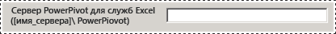
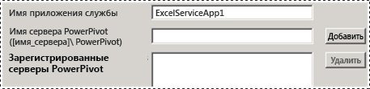
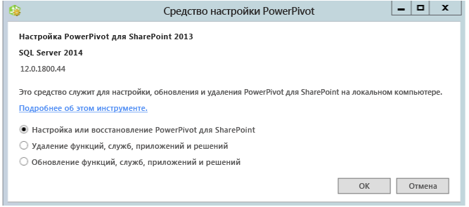

# Средства настройки PowerPivot
  Средства настройки [!INCLUDE[ssGemini](../../includes/ssgemini-md.md)] позволяют настраивать, восстанавливать или удалять [!INCLUDE[ssCurrent](../../includes/sscurrent-md.md)] [!INCLUDE[ssGeminiShort](../../includes/ssgeminishort-md.md)]  
  
 Мастер установки [!INCLUDE[ssCurrent](../../includes/sscurrent-md.md)] не устанавливает средства настройки [!INCLUDE[ssGemini](../../includes/ssgemini-md.md)] для SharePoint. Средства настройки можно будет скачать, начиная со следующего выпуска [!INCLUDE[ssCurrent](../../includes/sscurrent-md.md)].  
  
 В этом разделе описываются принципы использования средств [!INCLUDE[ssGemini](../../includes/ssgemini-md.md)] и различия между ними.  
  
 **[!INCLUDE[applies](../../includes/applies-md.md)]**  SharePoint 2013  
  
 **В этом разделе.**  
  
-   [Требования к использованию средств настройки](#bkmk_requirements)  
  
-   [2 версии средства настройки](#bkmk_twoversions)  
  
-   [Общие сведения об использовании средства настройки PowerPivot](#bkmk_overview)  
  
-   [Запуск одного из средств настройки PowerPivot](#bmkm_start_tool)  
  
##   Требования к использованию средств настройки  
  
-   Необходимо быть администратором фермы.  
  
-   Необходимо быть администратором сервера для экземпляра служб Analysis Services (только для SharePoint 2010).  
  
-   Необходимо быть членом роли db_owner в базе данных конфигурации фермы.  
  
-   При работе со средствами настройки порты TCP/IP не задействуются, поэтому не нужно выполнять какую-либо особую настройку брандмауэра. При работе со средством настройки подразумевается, что веб-приложения и общие службы входят в состав платформы SharePoint. Может потребоваться настройка брандмауэра для сервера служб [!INCLUDE[ssASnoversion](../../includes/ssasnoversion-md.md)] . Дополнительные сведения см. в статье [Configure the Windows Firewall to Allow Analysis Services Access](../../analysis-services/instances/configure-the-windows-firewall-to-allow-analysis-services-access.md).  
  
##   2 версии средства настройки  
 Мастер установки [!INCLUDE[ssCurrent](../../includes/sscurrent-md.md)] установит средства настройки [!INCLUDE[ssGemini](../../includes/ssgemini-md.md)] для SharePoint 2010, а также средство настройки [!INCLUDE[ssGemini](../../includes/ssgemini-md.md)] для SharePoint 2013.  
  
 Средства можно использовать только с экземпляром [!INCLUDE[ssCurrent](../../includes/sscurrent-md.md)] или [!INCLUDE[ssSQL11SP1](../../includes/sssql11sp1-md.md)] объекта [!INCLUDE[ssGeminiShort](../../includes/ssgeminishort-md.md)]. Не следует использовать средства с установками [!INCLUDE[ssKilimanjaro](../../includes/sskilimanjaro-md.md)] .  
  
|Название|Поддерживаемая версия SharePoint|Подробные данные конфигурации|  
|----------|-------------------------------------|----------------------------|  
|[!INCLUDE[ssGemini](../../includes/ssgemini-md.md)] для SharePoint 2013|SharePoint 2013|[Настройка или восстановление Power Pivot для SharePoint 2013 (Средство настройки Power Pivot)](../../analysis-services/power-pivot-sharepoint/configure-or-repair-power-pivot-for-sharepoint-2013.md)|  
|[!INCLUDE[ssGemini](../../includes/ssgemini-md.md)] Средство настройки|SharePoint 2010 с @@@SharePoint 2010@@@|[Настройка или восстановление PowerPivot для SharePoint 2010 (средство настройки PowerPivot)](http://msdn.microsoft.com/ru-ru/d61f49c5-efaa-4455-98f2-8c293fa50046)|  
  
###   Отличия двух средств настройки  
 Две версии средств настройки похожи, однако есть отличия в этапах настройки, которые применяются средствами. Отличия обусловлены расхождениями в SharePoint 2010 и SharePoint 2013, а также различием в архитектуре версии SQL Server 2012 SP1 [!INCLUDE[ssGemini](../../includes/ssgemini-md.md)] для SharePoint и предыдущих версий [!INCLUDE[ssGemini](../../includes/ssgemini-md.md)] для SharePoint.  
  
 В следующей таблице приводится описание новых и измененных функций в средстве **[!INCLUDE[ssGemini](../../includes/ssgemini-md.md)] для SharePoint 2013** . Таблица также содержит описание возможностей в **средстве настройки [!INCLUDE[ssGemini](../../includes/ssgemini-md.md)]**, не входящих в средство настройки [!INCLUDE[ssGemini](../../includes/ssgemini-md.md)] для SharePont 2013. Строки в таблице располагаются в том же порядке, что и вкладки в средстве настройки.  
  
|[!INCLUDE[ssGemini](../../includes/ssgemini-md.md)] для SharePoint 2013|[!INCLUDE[ssGemini](../../includes/ssgemini-md.md)] Средство настройки|  
|--------------------------------------------------------------|-----------------------------------------------|  
|На главной странице появился новый параметр для **[!INCLUDE[ssGemini](../../includes/ssgemini-md.md)] Server для служб Excel**. Параметр поддерживает новую архитектуру с экземпляром служб [!INCLUDE[ssASnoversion](../../includes/ssasnoversion-md.md)] , выполняемым за пределами фермы SharePoint. Необходимо настроить службы Excel для использования одного или нескольких серверов служб [!INCLUDE[ssASnoversion](../../includes/ssasnoversion-md.md)] , работающих в режиме интеграции с SharePoint.   ||  
||Средство 2010 содержит страницу **Регистрация служб SQL Server Analysis Services ([!INCLUDE[ssGemini](../../includes/ssgemini-md.md)]) на локальном сервере** для настройки локального экземпляра [!INCLUDE[ssASnoversion](../../includes/ssasnoversion-md.md)]. Эта страница не является частью средства 2013, поскольку локальный экземпляр [!INCLUDE[ssASnoversion](../../includes/ssasnoversion-md.md)]отсутствует.   |  
||Страница **Создание приложения службы **[!INCLUDE[ssGemini](../../includes/ssgemini-md.md)] содержит дополнительный параметр **Обновить книги, чтобы получить возможность обновления данных**. Этот параметр недоступен в средстве 2013.   |  
|В средстве 2013 появилась новая страница **Настройка серверов [!INCLUDE[ssGemini](../../includes/ssgemini-md.md)]**. Эта страница поддерживает новую архитектуру экземпляра [!INCLUDE[ssASnoversion](../../includes/ssasnoversion-md.md)] , выполняемого за пределами фермы SharePoint. По умолчанию имя сервера, указанное на главной странице в текстовом поле **[!INCLUDE[ssGemini](../../includes/ssgemini-md.md)] Server для Excel Services**, также отображается на вкладке **Настройка серверов [!INCLUDE[ssGemini](../../includes/ssgemini-md.md)]**.   ||  
|В средстве 2013 появилась новая страница **Зарегистрируйте надстройку [!INCLUDE[ssGemini](../../includes/ssgemini-md.md)] как модуль отслеживания служб Excel**. Службы Excel SharePoint 2010 не отслеживают сведения об использовании [!INCLUDE[ssGemini](../../includes/ssgemini-md.md)].||  
||Средство 2010 содержит страницу **Добавить MSOLAP.5 в качестве доверенного поставщика** для регистрации MSOLAP, чтобы службы Excel могли загружать в SharePoint 2010 модели [!INCLUDE[ssGemini](../../includes/ssgemini-md.md)] . Эта страница не является частью средства 2013. SharePoint 2013 со службами Excel не использует поставщика MSOLAP для моделей загрузки.|  
  
##   Общие сведения об использовании средства настройки PowerPivot  
 При запуске одного из средств настройки [!INCLUDE[ssGemini](../../includes/ssgemini-md.md)] средство оценивает существующую установку для определения применимых операций. Для новой установки доступна только задача настройки. После настройки сервера появляется задача удаления. Если исходной установкой является экземпляр [!INCLUDE[ssKilimanjaro](../../includes/sskilimanjaro-md.md)] , в списке доступных задач появится обновление.  
  
 При отсутствии навыков работы с центром администрирования или Windows PowerShell это средство настройки можно использовать как альтернативу указанным инструментам для установки [!INCLUDE[ssGeminiShort](../../includes/ssgeminishort-md.md)] .  
  
 Кроме того, средство умеет определять, настроена ли ферма, и не отсутствуют ли необходимые компоненты. Если программные файлы SharePoint установлены, но ферма не настроена, средство предоставляет действия для настройки фермы и установки [!INCLUDE[ssGeminiShort](../../includes/ssgeminishort-md.md)] .  
  
 Ознакомьтесь с вкладкой **Сценарий** , чтобы изучить возможности настройки [!INCLUDE[ssGemini](../../includes/ssgemini-md.md)] и SharePoint с помощью Windows PowerShell. Дополнительные сведения см. в следующих разделах:  
  
-   [Настройка PowerPivot с помощью Windows PowerShell](../../analysis-services/power-pivot-sharepoint/power-pivot-configuration-using-windows-powershell.md)  
  
-   [Справочник по PowerShell для Power Pivot для SharePoint](../../analysis-services/powershell/powershell-reference-for-power-pivot-for-sharepoint.md)  
  
> [!NOTE]  
>  Средство не настраивает службы Reporting Services. При добавлении служб Reporting Services в среду SharePoint их следует устанавливать и настраивать отдельно. Дополнительные сведения см. в следующих разделах:  
>   
>  -   [Установка первого сервера отчетов в режиме интеграции с SharePoint](../../reporting-services/install-windows/install-the-first-report-server-in-sharepoint-mode.md).  
> -   [Установка служб Reporting Services в режиме SharePoint для SharePoint 2010](http://msdn.microsoft.com/ru-ru/47efa72e-1735-4387-8485-f8994fb08c8c).  
  
##   Запуск одного из средств настройки PowerPivot  
  
1.  На странице **Пуск** введите **powerpivot**.  
  
     На странице **Пуск** введите **powerpivot** или в меню **Пуск** выберите пункт **Все программы**, затем [!INCLUDE[ssCurrentUI](../../includes/sscurrentui-md.md)], **Средства настройки** и, наконец, один из следующих вариантов:  
  
    -   **Средство настройки [!INCLUDE[ssGemini](../../includes/ssgemini-md.md)]**.  
  
    -   **или**  
  
    -   **[!INCLUDE[ssGemini](../../includes/ssgemini-md.md)] для SharePoint 2013**.  
  
       
  
     **Примечание.** Эти средства доступны, только если на локальном сервере установлен компонент [!INCLUDE[ssGeminiShort](../../includes/ssgeminishort-md.md)] .  
  
2.  Во время запуска средство настройки проверяет состояние установки и предоставляет задачи, допустимые для нее.  
  
3.  В зависимости от текущего состояния установки можно выполнить одну или несколько задач, указанных далее.  
  
    1.  Установите переключатель **Настройка или восстановление [!INCLUDE[ssGemini](../../includes/ssgemini-md.md)] для SharePoint** для выполнения задач после установки или для восстановления установки.  
  
    2.  Нажмите кнопку **Удаление компонентов, служб, приложений и решений** для удаления компонентов и решений с фермы.  
  
    3.  Нажмите кнопку **Обновление компонентов, служб, приложений и решений** для обновления компонентов и решений, установленных с помощью предыдущей версии [!INCLUDE[ssGeminiShort](../../includes/ssgeminishort-md.md)].  
  
     Например, на изображении показана страница запуска средства настройки [!INCLUDE[ssGemini](../../includes/ssgemini-md.md)] для SharePoint 2013.  
  
       
  
 Каждая задача состоит из индивидуальных действий, которые касаются определенных аспектов настройки сервера. Например, задача настройки включает действия по развертыванию решений, созданию приложения службы [!INCLUDE[ssGemini](../../includes/ssgemini-md.md)] , активации компонентов и настройки обновления данных. Список действий зависит от текущего состояния установки. Если действие не требуется, средство исключает его из списка задач.  
  
 При нажатии кнопки «Пуск» средство обработает все действия в пакетном режиме. Несмотря на то что каждое действие отображается как отдельный элемент в списке задач, все действия в составе задачи обрабатываются вместе. Обрабатываются только те действия, которые проходят проверку. Для прохождения проверки, возможно, потребуется добавить или изменить некоторые из входных значений.  
  
## См. также  
 [Upgrade Power Pivot for SharePoint](../../database-engine/install-windows/upgrade-power-pivot-for-sharepoint.md) Рассматривает рабочий процесс, который обновляет установку, уже существующую в ферме.  
  
 [Удаление Power Pivot для SharePoint](../../sql-server/install/uninstall-power-pivot-for-sharepoint.md) Рассматривает рабочий процесс, который удаляет с фермы службы, решения и страницы приложений [!INCLUDE[ssGemini](../../includes/ssgemini-md.md)] для SharePoint.  
  
 [Настройка PowerPivot с помощью Windows PowerShell](../../analysis-services/power-pivot-sharepoint/power-pivot-configuration-using-windows-powershell.md)  
  
 [Настройка и администрирование сервера Power Pivot в центре администрирования](../../analysis-services/power-pivot-sharepoint/power-pivot-server-administration-and-configuration-in-central-administration.md)  
  
  