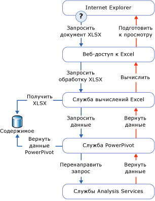

# Доступ к данным PowerPivot
[!INCLUDE[ssas-appliesto-sqlas](../../includes/ssas-appliesto-sqlas.md)]
  В этом разделе описаны способы извлечения данных из книги [!INCLUDE[ssGemini](../../includes/ssgemini-md.md)] , опубликованной в библиотеке SharePoint.  
  
 [!INCLUDE[ssGemini](../../includes/ssgemini-md.md)] хранятся в книге Excel. Строка подключения — это URL-адрес книги на сайте SharePoint.  
  
 [!INCLUDE[ssGemini](../../includes/ssgemini-md.md)] чаще всего используются книгой, в которой они содержатся, в качестве данных сводных таблиц и диаграмм. Также данные [!INCLUDE[ssGemini](../../includes/ssgemini-md.md)] могут быть использованы в качестве внешнего источника данных, когда книга, информационная панель или отчет подключается к отдельному XLSX-файлу Excel в SharePoint и извлекает данные для последующего использования. Клиентские инструменты, которые обычно используют данные [!INCLUDE[ssGemini](../../includes/ssgemini-md.md)] , — это Excel, [!INCLUDE[ssCrescent](../../includes/sscrescent-md.md)], другие отчеты служб Reporting Services и PerformancePoint.  
  
 На рабочем столе надстройка [!INCLUDE[ssGemini](../../includes/ssgemini-md.md)] использует AMO и ADOMD.NET для создания, обработки и отправки запросов данных [!INCLUDE[ssGemini](../../includes/ssgemini-md.md)] в клиентской рабочей области.  
  
 На ферме SharePoint службы Excel используют локальный поставщик OLE DB для MSOLAP для подключения к данным [!INCLUDE[ssGemini](../../includes/ssgemini-md.md)] . Поставщик отправляет запрос на подключение к [!INCLUDE[ssGemini](../../includes/ssgemini-md.md)] для SharePoint на ферме. Сервер загружает данные, выполняет запрос и возвращает результирующий набор.  
  
##   Запрос данных Power Pivot в SharePoint  
 При просмотре книги [!INCLUDE[ssGemini](../../includes/ssgemini-md.md)] из библиотеки SharePoint данные [!INCLUDE[ssGemini](../../includes/ssgemini-md.md)] , содержащиеся в книге, обнаруживаются, извлекаются и обрабатываются отдельными экземплярами сервера служб Analysis Services в ферме, пока службы Excel подготавливают слой представления данных. Полностью обработанную книгу можно просмотреть в окне браузера или классическом приложении Excel 2010 с надстройкой [!INCLUDE[ssGemini](../../includes/ssgemini-md.md)] .  
  
 Следующая диаграмма иллюстрирует путь обработки запроса в ферме. Поскольку данные [!INCLUDE[ssGemini](../../includes/ssgemini-md.md)] входят в состав книги Excel 2010, обработка запроса осуществляется при открытии пользователем книги Excel из библиотеки SharePoint и при взаимодействии со сводной таблицей или сводной диаграммой, которые содержат данные [!INCLUDE[ssGemini](../../includes/ssgemini-md.md)] .  
  
   
  
 Компоненты служб Excel и [!INCLUDE[ssGemini](../../includes/ssgemini-md.md)] для SharePoint обрабатывают различные фрагменты одного и того же XLSX-файла книги. Службы Excel обнаруживают данные [!INCLUDE[ssGemini](../../includes/ssgemini-md.md)] и запрашивают обработку на сервере [!INCLUDE[ssGemini](../../includes/ssgemini-md.md)] в ферме. Сервер [!INCLUDE[ssGemini](../../includes/ssgemini-md.md)] выделяет запрос к экземпляру [!INCLUDE[ssGeminiSrv](../../includes/ssgeminisrv-md.md)] , который извлекает данные из книги в библиотеке содержимого и загружает их. Данные, сохраненные в памяти, присоединяются к подготовленной книге и передаются обратно в веб-службу доступа Excel для отображения в окне браузера.  
  
 Не все данные в книге [!INCLUDE[ssGemini](../../includes/ssgemini-md.md)] обрабатываются [!INCLUDE[ssGemini](../../includes/ssgemini-md.md)] для SharePoint. Службы Excel обрабатывают данные таблиц и ячеек листа. [!INCLUDE[ssGemini](../../includes/ssgemini-md.md)] для SharePoint обрабатывает только сводные таблицы, сводные диаграммы и срезы, которые расходятся с данными [!INCLUDE[ssGemini](../../includes/ssgemini-md.md)] .  
  
## См. также  
 [Подключитесь к службам Analysis Services](../../analysis-services/instances/connect-to-analysis-services.md)   
 [Доступ к данным табличной модели](../../analysis-services/tabular-models/tabular-model-data-access.md)  
  
  
