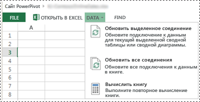
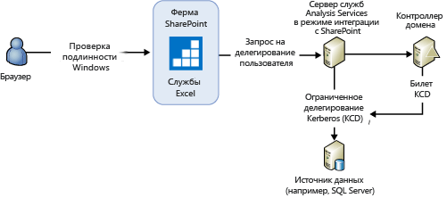
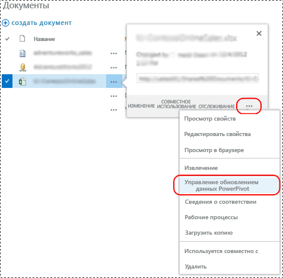
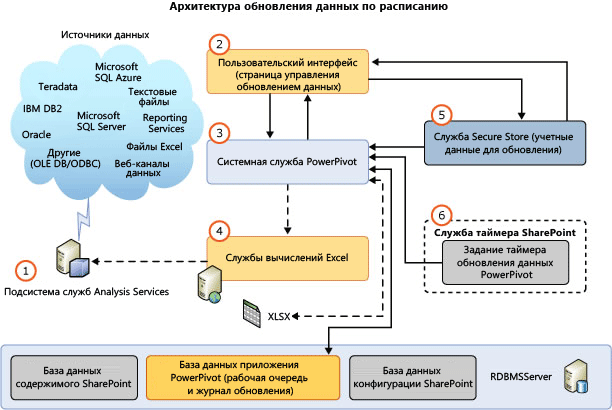
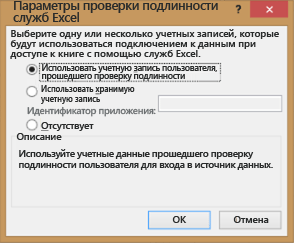

# Обновление данных PowerPivot в SharePoint 2013
  Обновление данных служб [!INCLUDE[ssGemini](../../includes/ssgemini-md.md)] в SharePoint 2013 использует службы Excel в качестве основного компонента для загрузки и обновления данных модели на экземпляре [!INCLUDE[ssCurrent](../../includes/sscurrent-md.md)] [!INCLUDE[ssASnoversion](../../includes/ssasnoversion-md.md)] в режиме интеграции с SharePoint. Сервер [!INCLUDE[ssASnoversion](../../includes/ssasnoversion-md.md)] работает на внешней ферме SharePoint. Архитектура служб SharePoint 2013 Excel поддерживает как **интерактивное** , так и **плановое**обновление данных.  
  
 **[!INCLUDE[applies](../../includes/applies-md.md)]**  SharePoint 2013  
  
 **В этом разделе:**  
  
-   [Interactive Data Refresh](#bkmk_interactive_refresh)  
  
-   [Проверка подлинности Windows с подключением к данным книги и интерактивным обновлением данных](#bkmk_windows_auth_interactive_data_refresh)  
  
-   [Scheduled Data Refresh](#bkmk_scheduled_refresh)  
  
-   [Архитектура планового обновления данных в SharePoint 2013](#bkmk_refresh_architecture)  
  
-   [Другие вопросы проверки подлинности](#datarefresh_additional_authentication)  
  
-   [Дополнительные сведения](#bkmk_moreinformation)  
  
## Историческая справка  
 Службы SharePoint Server 2013 Excel управляют обновлением данных для книг Excel 2013 и запускают обработку модели данных на сервере [!INCLUDE[ssCurrent](../../includes/sscurrent-md.md)] [!INCLUDE[ssASnoversion](../../includes/ssasnoversion-md.md)] , работающем в режиме интеграции с SharePoint. Для книг Excel 2010 службы Excel также управляют загрузкой и сохранением книг и моделей данных. Однако при этом службы Excel при отправке команд обработки к модели данных полагаются на системные службы [!INCLUDE[ssGemini](../../includes/ssgemini-md.md)] . В следующей таблице сведены компоненты, которые отправляют команды на обновление данных, в зависимости он версии книги. В качестве рабочей среды подразумевается ферма SharePoint 2013, настроенная на использование служб [!INCLUDE[ssCurrent](../../includes/sscurrent-md.md)] Analysis Server в режиме интеграции с SharePoint.  
  
||||  
|-|-|-|  
||Книги Excel 2013|Книги Excel 2010|  
|Запуск обновления данных|**Интерактивное:** пользователь, прошедший проверку подлинности   **Плановое** [!INCLUDE[ssGemini](../../includes/ssgemini-md.md)] Системная служба|[!INCLUDE[ssGemini](../../includes/ssgemini-md.md)] Системная служба|  
|Загрузка книги из баз данных содержимого|Службы SharePoint 2013 Excel|Службы SharePoint 2013 Excel|  
|Загрузка модели данных на экземпляр служб Analysis Services|Службы SharePoint 2013 Excel|Службы SharePoint 2013 Excel|  
|Отправка команд обработки на экземпляр служб Analysis Services|Службы SharePoint 2013 Excel|[!INCLUDE[ssGemini](../../includes/ssgemini-md.md)] Системная служба|  
|Обновление данных книги|Службы SharePoint 2013 Excel|Службы SharePoint 2013 Excel|  
|Сохранение книги и модели данных в базе данных содержимого|**Интерактивное:** Н/Д   **Плановое:** службы SharePoint 2013 Excel|Службы SharePoint 2013 Excel|  
  
 В следующей таблице сведены поддерживаемые возможности обновления на ферме SharePoint 2013, настроенной на использование служб [!INCLUDE[ssCurrent](../../includes/sscurrent-md.md)] Analysis Server в режиме интеграции с SharePoint.  
  
|Книга создана в|плановое|Интерактивное обновление данных|  
|-------------------------|----------------------------|-------------------------|  
|[!INCLUDE[ssGemini](../../includes/ssgemini-md.md)] 2008 R2 для Excel|Не поддерживается. Обновите книгу **(\*)**|Не поддерживается. Обновите книгу **(\*)**|  
|[!INCLUDE[ssGemini](../../includes/ssgemini-md.md)] 2012 для Excel|Поддерживается|Не поддерживается. Обновите книгу **(\*)**|  
|Excel 2013|Поддерживается|Поддерживается|  
  
 **(\*)** Дополнительные сведения об обновлении книг см. в статье [Обновление книг и создание расписания обновления данных (SharePoint 2013)](../../analysis-services/instances/install-windows/upgrade-workbooks-and-scheduled-data-refresh-sharepoint-2013.md).  
  
##   Interactive Data Refresh  
 Интерактивное или ручное обновление данных в службах SharePoint Server 2013 Excel Services может обновить модели сведениями из оригинальных источников данных. Интерактивное обновление данных становится доступным после настройки приложения служб Excel путем регистрации сервера [!INCLUDE[ssASnoversion](../../includes/ssasnoversion-md.md)] в режиме интеграции с SharePoint. Дополнительные сведения см. в разделе [Управление параметрами модели данных в службах Excel (SharePoint Server 2013)](http://technet.microsoft.com/library/jj219780.aspx) (http://technet.microsoft.com/library/jj219780.aspx).  
  
> [!NOTE]  
>  Интерактивное обновление данных доступно только для книг, созданных в Excel 2013. При попытке обновления книг Excel 2010 в службах Excel отображается сообщение об ошибке: "Ошибка операции[!INCLUDE[ssGemini](../../includes/ssgemini-md.md)] . Книга была создана в более ранней версии Excel и [!INCLUDE[ssGemini](../../includes/ssgemini-md.md)] . Ее нельзя обновить, пока не будет обновлен файл". Дополнительные сведения об обновлении книг см. в статье [Обновление книг и создание расписания обновления данных (SharePoint 2013)](../../analysis-services/instances/install-windows/upgrade-workbooks-and-scheduled-data-refresh-sharepoint-2013.md).  
  
 **Основная особенность интерактивного обновления**  
  
-   При интерактивном обновлении данных обновляются только данные в сеансе текущего пользователя. Данные автоматически не сохраняются в книге, хранящейся в базе данных содержимого SharePoint.  
  
-   **Учетные данные.** При интерактивном обновлении данных в качестве учетных данных для подключения к источнику данных можно использовать удостоверение текущего, вошедшего в систему пользователя либо сохраненные учетные данные. Какие именно учетные данные используются, зависит от настроек проверки подлинности служб Excel при подключении к внешнему источнику данных для книги.  
  
-   **Поддерживаемые книги:**  книги, созданные в Excel 2013.  
  
 **Обновление данных**  
  
-   См. порядок действий на иллюстрации.  
  
1.  В библиотеке документов SharePoint откройте книгу [!INCLUDE[ssGemini](../../includes/ssgemini-md.md)] в браузере.  
  
2.  В окне браузера в меню **Данные** выберите пункт **Обновить выбранное соединение** или **Обновить все соединения**.  
  
3.  Службы Excel загружают базу данных [!INCLUDE[ssGemini](../../includes/ssgemini-md.md)] , обрабатывают ее, а затем выполняют запрос к ней, чтобы обновить кэш книги Excel.  
  
4.  **Примечание.** Обновленная книга в библиотеку документов автоматически не сохраняется.  
  
   
  
###   Проверка подлинности Windows с подключением к данным книги и интерактивным обновлением данных  
 Службы Excel отправляют серверу службы Analysis Services команду обработки на олицетворение учетной записи пользователя. Чтобы получить системные права, достаточные для выполнения процедуры делегирования и олицетворения для пользователя, учетная запись службы Analysis Services запрашивает право доступа **Работа в режиме операционной системы** на локальном сервере. Кроме того, сервер службы Analysis Services должен иметь возможность делегировать учетные записи пользователя источникам данных. Результат запроса отправляется службам Excel.  
  
 Типичные действия пользователя: когда клиент выбирает пункт "Обновить все подключения" в книге Excel 2013, содержащей модель [!INCLUDE[ssGemini](../../includes/ssgemini-md.md)] , появляется следующее сообщение об ошибке:  
  
-   **Ошибка обновления внешних данных.** Возникла ошибка при обработке модели данных в книге. Повторите попытку. Не удалось обновить одно или несколько подключений в данной книге.  
  
 В зависимости от используемого поставщика данных вы увидите в журнале ULS сообщение, аналогичное следующему.  
  
 **С помощью SQL Native Client:**  
  
-   Не удалось создать внешнее соединение или выполнить запрос. Сообщение поставщика. Был задан, но не используется внешний объект «DataSource», ссылающийся на идентификаторы «20102481-39c8-4d21-bf63-68f583ad22bb».  Ошибка OLE DB или ODBC. При установлении соединения с сервером SQL Server произошла ошибка, связанная с сетью или с определенным экземпляром. Сервер не найден или недоступен. Проверьте, правильно ли указано имя экземпляра и настроен ли SQL Server для открытия удаленных соединений. Дополнительные сведения см. в электронной документации по SQL Server; 08001; Поставщик SSL: затребованный пакет безопасности не существует; 08001; Клиенту не удается установить связь; 08001; Клиент не поддерживает шифрование; 08001,  , имя соединения: ThisWorkbookDataModel, книга: book1.xlsx.  
  
 **Для поставщика Microsoft OLE DB для SQL Server:**  
  
-   Не удалось создать внешнее соединение или выполнить запрос. Сообщение поставщика: «Задан, но не используется внешний объект DataSource, соответствующий идентификатору 6e711bfa-b62f-4879-a177-c5dd61d9c242». Ошибка OLE DB или ODBC. , имя соединения: ThisWorkbookDataModel, книга: OLEDB Provider.xlsx.  
  
 **Для поставщика данных .NET Framework для SQL Server:**  
  
-   Не удалось создать внешнее соединение или выполнить запрос. Сообщение поставщика. Был задан, но не используется внешний объект «DataSource», ссылающийся на идентификаторы f5fb916c-3eac-4d07-a542-531524c0d44a.  Ошибки в реляционном модуле высокого уровня. Следующее исключение возникло при использовании управляемого интерфейса IDbConnection: не удалось загрузить файл или сборку «System.Transactions, Version=4.0.0.0, Culture=neutral, PublicKeyToken=b77a5c561934e089» или один из его зависимых компонентов. Либо не обеспечен необходимый уровень олицетворения, либо уровень олицетворения недопустим. (Исключение HRESULT: 0x80070542.)  , имя соединения: ThisWorkbookDataModel, книга: NETProvider.xlsx.  
  
 **Сводка шагов настройки** Настройка права доступа **Работа в качества части операционной системы** на локальном сервере  
  
1.  На сервере службы Analysis Services в режиме интеграции с SharePoint добавьте учетную запись службы Analysis Services в право доступа «Работа в качестве части операционной системы»:  
  
    1.  Запустите «`secpol.msc`»  
  
    2.  Выберите **Параметр локальной безопасности**, затем **Локальные политики**, а затем **Назначение прав пользователя**.  
  
    3.  Добавьте учетную запись службы.  
  
2.  Перезапустите службы Excel и перезагрузите сервер службы Analysis Services.  
  
3.  Делегирование от учетной записи службы Excel или службы токенов Claims to Windows (C2WTS) экземпляру служб Analysis services не требуется. Поэтому никакая настройка KCD из служб Excel или c2WTS службе [!INCLUDE[ssGemini](../../includes/ssgemini-md.md)] AS не нужна. Если серверный источник данных находится на том же сервере, что и экземпляр [!INCLUDE[ssASnoversion](../../includes/ssasnoversion-md.md)] , ограниченное делегирование Kerberos не требуется. Однако учетной записи службы [!INCLUDE[ssASnoversion](../../includes/ssasnoversion-md.md)] необходимо право на работу в качестве части операционной системы.  
  
   
  
 Дополнительные сведения см. в статье [Работа в режиме операционной системы](http://technet.microsoft.com/library/cc784323\(WS.10\).aspx) (http://technet.microsoft.com/library/cc784323(WS.10).aspx).  
  
##   Scheduled Data Refresh  
 **Основные особенности планового обновления данных**  
  
-   Требует развертывания надстройки [!INCLUDE[ssGemini](../../includes/ssgemini-md.md)] для SharePoint. Дополнительные сведения см. в разделе [Установка или удаление надстройки Power Pivot для SharePoint (SharePoint 2013)](../../analysis-services/instances/install-windows/install-or-uninstall-the-power-pivot-for-sharepoint-add-in-sharepoint-2013.md).  
  
-   Пользователь настраивает расписание обновления для книги. В запланированное время системная служба [!INCLUDE[ssGemini](../../includes/ssgemini-md.md)] отправляет службе Excel запрос на:  
  
    -   обработку базы данных [!INCLUDE[ssGemini](../../includes/ssgemini-md.md)] ;  
  
    -   обновление книги;  
  
    -   сохранение книги в базе данных содержимого.  
  
-   **Учетные данные.** Используется сохраненные учетные данные. Удостоверение текущего пользователя не используется.  
  
-   **Поддерживаемые книги.** Книги, созданные с помощью надстройки [!INCLUDE[ssSQL11](../../includes/sssql11-md.md)][!INCLUDE[ssGemini](../../includes/ssgemini-md.md)] для Excel 2010 или с помощью Excel 2013. Не поддерживаются книги, созданные в Excel 2010 с помощью надстройки [!INCLUDE[ssKilimanjaro](../../includes/sskilimanjaro-md.md)][!INCLUDE[ssGemini](../../includes/ssgemini-md.md)] . Обновите книгу по крайней мере до формата [!INCLUDE[ssSQL11](../../includes/sssql11-md.md)][!INCLUDE[ssGemini](../../includes/ssgemini-md.md)] . Дополнительные сведения об обновлении книг см. в статье [Обновление книг и создание расписания обновления данных (SharePoint 2013)](../../analysis-services/instances/install-windows/upgrade-workbooks-and-scheduled-data-refresh-sharepoint-2013.md).  
  
 Отображение страницы **Управление обновлением данных**  
  
-   См. порядок действий на иллюстрации.  
  
1.  В библиотеке документов SharePoint нажмите кнопку **Меню открытия** (**…**) для книги [!INCLUDE[ssGemini](../../includes/ssgemini-md.md)].  
  
2.  Нажмите вторую кнопку **Меню открытия** и выберите **Управление обновлением данных [!INCLUDE[ssGemini](../../includes/ssgemini-md.md)]**.  
  
3.  На странице **Управление обновлением данных** щелкните **Включить** , а затем настройте расписание обновления.  
  
4.  В указанное время системная служба [!INCLUDE[ssGemini](../../includes/ssgemini-md.md)] отправляет службе Excel запрос на:  
  
    -   загрузку и обработку модели данных [!INCLUDE[ssGemini](../../includes/ssgemini-md.md)] ;  
  
    -   обновление книги;  
  
    -   сохранение книги в базе данных содержимого.  
  
   
  
> [!TIP]  
>  Сведения об обновлении книг из SharePoint Online см. в техническом документе [Refreshing Excel workbooks with embedded Power Pivot models from SharePoint Online](http://technet.microsoft.com/library/jj992650.aspx) (Обновление книг Excel с внедренными моделями PowerPivot из SharePoint Online) (http://technet.microsoft.com/library/jj992650.aspx).  
  
##   Архитектура планового обновления данных в SharePoint 2013  
 На следующем рисунке показана архитектура обновления данных для SharePoint 2013 и SQL Server 2012 с пакетом обновления 1 (SP1).  
  
   
  
||Description||  
|-|-----------------|-|  
|**(1)**|Подсистема служб Analysis Services|Сервер [!INCLUDE[ssCurrent](../../includes/sscurrent-md.md)][!INCLUDE[ssASnoversion](../../includes/ssasnoversion-md.md)] , работающем в режиме интеграции с SharePoint. Сервер работает за пределами фермы SharePoint.|  
|**(2)**|Пользовательский интерфейс|Пользовательский интерфейс состоит из двух страниц. На одной из них определяется расписание, а на второй можно просмотреть журнал обновления. Эти страницы не осуществляют прямого доступа к базам данных приложения службы [!INCLUDE[ssGemini](../../includes/ssgemini-md.md)] , но пользуются системной службой [!INCLUDE[ssGemini](../../includes/ssgemini-md.md)] для доступа к этим базам данных.|  
|**(3)**|[!INCLUDE[ssGemini](../../includes/ssgemini-md.md)] Системная служба|Эта служба устанавливается при развертывании надстройки [!INCLUDE[ssGemini](../../includes/ssgemini-md.md)] для SharePoint.   Она служит для выполнения следующих действий.|  
|||В этой службе размещается исполняющий механизм планирования обновления, который вызывает API служб Excel для обновления данных в книгах Excel 2013. Для книг Excel 2010 эта служба непосредственно выполняет обработку модели данных, но продолжает обрабатывать запросы служб Excel на загрузку модели данных и обновление книги.|  
|||Эта служба содержит методы для таких компонентов, как страницы пользовательского интерфейса, для обмена данными с системной службой.|  
|||Управляет запросами на внешний доступ к книгам как к источнику данных, принимаемыми через веб-службу [!INCLUDE[ssGemini](../../includes/ssgemini-md.md)] .|  
|||Управление запросами на плановое обновление данных по заданиям таймера и страницам конфигурации. Эта служба управляет запросами на считывание данных из базы данных приложения службы и запускает обновление данных вместе со службами Excel.|  
|||Обработка использования и связанные задания таймера.|  
|**(4)**|Службы вычислений Excel|Отвечают за загрузку моделей данных.|  
|**(5)**|Служба Secure Store|Если проверка подлинности в книге выставлена в **Использовать учетную запись пользователя вошедшего в систему** или **Нет**, то для обновления данных используются учетные данные, хранящиеся в целевом приложении Secure Store. Дополнительные сведения см. в подразделе [Другие вопросы проверки подлинности](#datarefresh_additional_authentication) этой статьи.|  
|**(6)**|[!INCLUDE[ssGemini](../../includes/ssgemini-md.md)] задание таймера обновления данных|Указывает системной службе [!INCLUDE[ssGemini](../../includes/ssgemini-md.md)] подключиться к службам Excel для обновления моделей данных.|  
  
 [!INCLUDE[ssASnoversion](../../includes/ssasnoversion-md.md)] требуются соответствующие поставщики данных и клиентские библиотеки, чтобы сервер [!INCLUDE[ssASnoversion](../../includes/ssasnoversion-md.md)] в режиме интеграции с SharePoint мог обращаться к источникам данных.  
  
> [!NOTE]  
>  Так как системная служба [!INCLUDE[ssGemini](../../includes/ssgemini-md.md)] больше не загружает и не сохраняет модели [!INCLUDE[ssGemini](../../includes/ssgemini-md.md)] , большинство настроек кэширования моделей на сервере приложений к ферме SharePoint 2013 не применяются.  
  
## Данные журнала обновления данных  
 **Данные об использовании** . Здесь можно просмотреть данные об обновлении данных на информационной панели управления [!INCLUDE[ssGemini](../../includes/ssgemini-md.md)] . Просмотр данных об использовании  
  
1.  В центре администрирования SharePoint щелкните **Панель мониторинга управления [!INCLUDE[ssGemini](../../includes/ssgemini-md.md)]** в группе **Общие параметры приложения**.  
  
2.  В нижней части панели мониторинга см. **Обновление данных — последние действия** и **Обновление данных — последние ошибки**.  
  
3.  Дополнительные сведения об использовании и о том, как включить сбор этих данных, см. в разделе [Power Pivot Management Dashboard and Usage Data](../../analysis-services/power-pivot-sharepoint/power-pivot-management-dashboard-and-usage-data.md).  
  
 **Данные журнала диагностики.** Можно просмотреть журнал диагностики SharePoint, связанный с обновлением данных. Сначала проверьте конфигурацию ведения журнала диагностики в разделе **Служба [!INCLUDE[ssGemini](../../includes/ssgemini-md.md)]** на странице **Мониторинг** центра администрирования SharePoint. Может потребоваться повышение уровня журнала до регистрации «событий минимальной важности». Например, временно установите значение **Подробно** и снова выполните операцию обновления данных.  
  
 Журнал содержит следующие сведения:  
  
-   **Область** **службы [!INCLUDE[ssGemini](../../includes/ssgemini-md.md)]**.  
  
-   Категория **Обновления данных**.  
  
 Просмотрите **Настройка ведения журнала диагностики**. Дополнительные сведения см. в разделе [Настройка и просмотр файлов журнала SharePoint и журнала диагностики (Power Pivot для SharePoint)](../../analysis-services/power-pivot-sharepoint/configure-and-view-sharepoint-and-diagnostic-logging.md).
  
##   Другие вопросы проверки подлинности  
 Параметры в диалоговом окне **Параметры проверки подлинности служб Excel** в Excel 2013 задают удостоверение Windows, которым службы Excel и [!INCLUDE[ssASnoversion](../../includes/ssasnoversion-md.md)] пользуются для обновления данных.  
  
-   **Использовать учетную запись пользователя, прошедшего проверку подлинности.**Службы Excel выполняют обновление данных с удостоверением текущего пользователя, вошедшего в систему.  
  
-   **Использовать сохраненные учетные данные**. Предполагается использование идентификатора приложения в службе SharePoint Secure Store, по которому службы Excel извлекают имя пользователя и пароль для проверки подлинности при обновлении данных.  
  
-   **Нет.**Используются **Учетная запись службы для автоматической обработки** службы Excel. Эта учетная запись службы связана с прокси-сервером Secure Store. Настройте параметры на странице **Параметры приложения служб Excel** в разделе **Внешние данные** .  
  
 Открытие диалогового окна «Параметры проверки подлинности»  
  
1.  Откройте вкладку **Данные** в Excel 2013.  
  
2.  Нажмите на ленте **Соединения** .  
  
3.  В диалоговом окне **Соединения книги**выберите соединение и нажмите **Свойства**.  
  
4.  В диалоговом окне **Свойства соединения** нажмите **Определение**, а затем нажмите кнопку **Параметры проверки подлинности…** .  
  
   
  
 Дополнительные сведения об аутентификации при обновлении данных и использовании учетных данных см. в записи блога [Refreshing PowerPivot Data in SharePoint 2013](http://blogs.msdn.com/b/analysisservices/archive/2012/12/21/refreshing-powerpivot-data-in-sharepoint-2013.aspx)(Обновление данных PowerPivot в SharePoint 2013).  
  
##   Дополнительные сведения  
 [Troubleshooting Power Pivot Data Refresh](http://social.technet.microsoft.com/wiki/contents/articles/3870.troubleshooting-powerpivot-data-refresh.aspx)(Устранение неполадок при обновлении данных PowerPivot).  
  
 [Службы Excel в SharePoint 2013](http://msdn.microsoft.com/library/sharepoint/jj164076\(v=office.15\)) (http://msdn.microsoft.com/library/sharepoint/jj164076 (v=office.15).  
  
## См. также:  
 [Установка служб Analysis Services в режиме Power Pivot](../../analysis-services/instances/install-windows/install-analysis-services-in-power-pivot-mode.md)  
  
  
