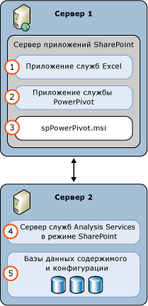

# Power Pivot для SharePoint (SSAS)
[!INCLUDE[ssas-appliesto-sqlas](../../includes/ssas-appliesto-sqlas.md)]
  Сервер [!INCLUDE[ssASnoversion](../../includes/ssasnoversion-md.md)] в режиме [!INCLUDE[ssGemini](../../includes/ssgemini-md.md)] обеспечивает размещение данных [!INCLUDE[ssGemini](../../includes/ssgemini-md.md)] на сервере в ферме SharePoint. [!INCLUDE[ssGemini](../../includes/ssgemini-md.md)] — здесь данные представляют собой модель аналитических данных, которая создается в одной из следующих программ:  
  
-   Надстройка [!INCLUDE[ssGemini](../../includes/ssgemini-md.md)] для Excel 2010  
  
-   Excel 2013  
  
-   Excel 2016  
  
 **[!INCLUDE[applies](../../includes/applies-md.md)]**  [!INCLUDE[ssGeminiShort](../../includes/ssgeminishort-md.md)] 2016 | [!INCLUDE[ssGeminiShort](../../includes/ssgeminishort-md.md)] 2013  
  
 Для размещения этих данных на сервере требуются SharePoint, службы Excel и установка компонента [!INCLUDE[ssGemini](../../includes/ssgemini-md.md)] для SharePoint. Данные загружаются в экземпляры [!INCLUDE[ssGemini](../../includes/ssgemini-md.md)] для SharePoint, где их можно обновлять по расписанию с помощью функции обновления данных [!INCLUDE[ssGemini](../../includes/ssgemini-md.md)] , предоставляемой сервером для книг Excel 2010 или [!INCLUDE[ssGemini](../../includes/ssgemini-md.md)] для книг Excel 2013 и 2016.  
  
## Power Pivot для SharePoint 2016  
 [!INCLUDE[ssCurrent](../../includes/sscurrent-md.md)] [!INCLUDE[ssGeminiShort](../../includes/ssgeminishort-md.md)] поддерживает использование [!INCLUDE[msCoName](../../includes/msconame-md.md)] SharePoint 2016 и [!INCLUDE[offOnlineServer](../../includes/offonlineserver-md.md)] рабочих книг Excel, содержащих модели данных и отчеты [!INCLUDE[ssRSnoversion](../../includes/ssrsnoversion-md.md)] Power View.  
  
 Excel в [!INCLUDE[offOnlineServer](../../includes/offonlineserver-md.md)] включает функции модели данных для обеспечения взаимодействия с книгой [!INCLUDE[ssGemini](../../includes/ssgemini-md.md)] в браузере. Не обязательно развертывать отдельную надстройку [!INCLUDE[ssGemini](../../includes/ssgemini-md.md)] для SharePoint 2016 в ферме. Достаточно установить сервер [!INCLUDE[ssASnoversion](../../includes/ssasnoversion-md.md)] в режиме [!INCLUDE[ssGemini](../../includes/ssgemini-md.md)] и зарегистрировать сервер на [!INCLUDE[offOnlineServer](../../includes/offonlineserver-md.md)].  
  
 Развернув надстройку [!INCLUDE[ssGemini](../../includes/ssgemini-md.md)] для SharePoint 2016, можно задействовать дополнительные функции и компоненты в ферме SharePoint. К дополнительным компонентам относится коллекция [!INCLUDE[ssGemini](../../includes/ssgemini-md.md)] и планирование обновления данных.  
  
   
  
## Power Pivot для SharePoint 2013  
 [!INCLUDE[ssCurrent](../../includes/sscurrent-md.md)] [!INCLUDE[ssGeminiShort](../../includes/ssgeminishort-md.md)] поддерживает использование службами Excel для [!INCLUDE[msCoName](../../includes/msconame-md.md)] SharePoint 2013 рабочих книг Excel, содержащих модели данных и отчеты [!INCLUDE[ssRSnoversion](../../includes/ssrsnoversion-md.md)] Power View.  
  
 Службы Excel в SharePoint 2013 включают функции модели данных для обеспечения взаимодействия с книгой [!INCLUDE[ssGemini](../../includes/ssgemini-md.md)] в браузере. Не обязательно развертывать отдельную надстройку [!INCLUDE[ssGemini](../../includes/ssgemini-md.md)] для SharePoint 2013 в ферме. Достаточно установить сервер [!INCLUDE[ssASnoversion](../../includes/ssasnoversion-md.md)] в режиме SharePoint и зарегистрировать сервер в параметрах **Модель данных** служб Excel.  
  
 Развернув надстройку [!INCLUDE[ssGemini](../../includes/ssgemini-md.md)] для SharePoint 2013, можно задействовать дополнительные функции и компоненты в ферме SharePoint. К дополнительным компонентам относится коллекция [!INCLUDE[ssGemini](../../includes/ssgemini-md.md)] , планирование обновления данных, а также панель мониторинга [!INCLUDE[ssGemini](../../includes/ssgemini-md.md)] .  
  
   
  
##   В этом разделе  
 [Настройка и администрирование сервера Power Pivot в центре администрирования](../../analysis-services/power-pivot-sharepoint/power-pivot-server-administration-and-configuration-in-central-administration.md)  
  
 [Настройка PowerPivot с помощью Windows PowerShell](../../analysis-services/power-pivot-sharepoint/power-pivot-configuration-using-windows-powershell.md)  
  
 [Средства настройки PowerPivot](../../analysis-services/power-pivot-sharepoint/power-pivot-configuration-tools.md)  
  
 [Проверка подлинности и авторизация PowerPivot](../../analysis-services/power-pivot-sharepoint/power-pivot-authentication-and-authorization.md)  
  
 [Настройка правил определения работоспособности PowerPivot](../../analysis-services/power-pivot-sharepoint/configure-power-pivot-health-rules.md)  
  
 [Информационная панель управления PowerPivot и данные об использовании](../../analysis-services/power-pivot-sharepoint/power-pivot-management-dashboard-and-usage-data.md)  
  
 [Коллекция PowerPivot](http://msdn.microsoft.com/library/2a0db616-e08e-4062-aac8-979f8cad7794)  
  
 [Доступ к данным PowerPivot](../../analysis-services/power-pivot-sharepoint/power-pivot-data-access.md)  
  
 [Обновление данных Power Pivot](../../analysis-services/power-pivot-sharepoint/power-pivot-data-refresh.md)  
  
 [Веб-каналы данных Power Pivot](../../analysis-services/power-pivot-sharepoint/power-pivot-data-feeds.md)  
  
 [Соединение семантической модели бизнес-аналитики PowerPivot (BISM-файлы)](../../analysis-services/power-pivot-sharepoint/power-pivot-bi-semantic-model-connection-bism.md)  
  
 **В других разделах**  
  
## Дополнительные темы  
 [Обновление Power Pivot для SharePoint](../../database-engine/install-windows/upgrade-power-pivot-for-sharepoint.md)  
  
 [Установка служб Analysis Services в режиме Power Pivot](../../analysis-services/instances/install-windows/install-analysis-services-in-power-pivot-mode.md)  
  
 [Справочник по PowerShell для Power Pivot для SharePoint](../../analysis-services/powershell/powershell-reference-for-power-pivot-for-sharepoint.md)  
  
 [Примеры топологий и стоимость лицензирования для SQL Server 2016 Business Intelligence](http://msdn.microsoft.com/library/682b8711-407a-48d1-9807-415d4c24dad6)  
  
## См. также  
 [Планирование и развертывание PowerPivot](http://go.microsoft.com/fwlink/?linkID=220972)   
 [Аварийное восстановление PowerPivot для SharePoint](http://go.microsoft.com/fwlink/p/?LinkId=389570)  
  
  
