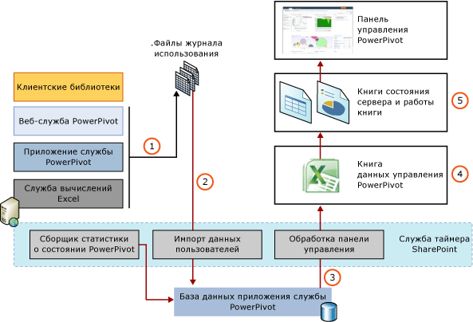

# Сбор данных об использовании PowerPivot
[!INCLUDE[ssas-appliesto-sqlas](../../includes/ssas-appliesto-sqlas.md)]
  Сбор данных об использовании — это функция SharePoint на уровне фермы. [!INCLUDE[ssGemini_md](../../includes/ssgemini-md.md)] для SharePoint использует и дополняет эту систему для создания отчетов на информационной панели управления [!INCLUDE[ssGemini_md](../../includes/ssgemini-md.md)] , которые показывают, как используются данные и службы [!INCLUDE[ssGemini_md](../../includes/ssgemini-md.md)] . В зависимости от способа установки SharePoint сбор данных об использовании для фермы может быть отключен. Для создания данных об использовании, которые будут отображаться на информационной панели управления [!INCLUDE[ssGemini_md](../../includes/ssgemini-md.md)] , администратор фермы должен включить ведение журнала использования.  
  
 Сведения о работе с данными об использовании на панели мониторинга управления [!INCLUDE[ssGemini_md](../../includes/ssgemini-md.md)] см. в разделе [Информационная панель управления PowerPivot и данные об использовании](../../analysis-services/power-pivot-sharepoint/power-pivot-management-dashboard-and-usage-data.md).  
  
  
##   Сбор данных об использовании и архитектура подготовки отчетов  
 [!INCLUDE[ssGemini_md](../../includes/ssgemini-md.md)] данные об использовании собираются, хранятся и обрабатываются с помощью разных функций инфраструктуры SharePoint и компонентов сервера Power Pivot. Инфраструктура SharePoint предоставляет централизованную службу использования и встроенные задания таймера. [!INCLUDE[ssGemini_md](../../includes/ssgemini-md.md)] для SharePoint добавляет долгосрочное хранение данных об использовании [!INCLUDE[ssGemini_md](../../includes/ssgemini-md.md)] и отчеты по операциям, которые можно просмотреть в центре администрирования SharePoint.  
  
 Данные о событиях передаются в систему сбора данных об использовании на сервере приложений или клиентском веб-интерфейсе. Данные об использовании заданием таймера из временных файлов данных на физическом сервере в постоянное хранилище на сервере базы данных. На следующей диаграмме представлены компоненты и процессы, которые перемещают данные об использовании по системе сбора данных и отчетности.  
  
 **Примечание.** Проверка включения сбора данных об использовании. Для этого перейдите в раздел **Наблюдение** в центре администрирования SharePoint. Дополнительные сведения см. в разделе [Настройка сбора данных об использовании с PowerPivot для SharePoint](../../analysis-services/power-pivot-sharepoint/configure-usage-data-collection-for-power-pivot-for-sharepoint.md).  
  
   
  
|Стадия|Описание|  
|-----------|-----------------|  
|1|Сбор данных об использовании запускается событиями, которые создаются компонентами [!INCLUDE[ssGemini_md](../../includes/ssgemini-md.md)] и поставщиками данных [!INCLUDE[ssASnoversion_md](../../includes/ssasnoversion-md.md)] в развертываниях SharePoint. Некоторые события являются настраиваемыми, то есть могут быть включены или отключены. Это, например, события соединения, загрузки, выгрузки и времени ответа, которые отслеживаются службой [!INCLUDE[ssGemini_md](../../includes/ssgemini-md.md)] на сервере приложений. Остальные события управляются исключительно сервером и не могут быть отключены. Такие события включают обновление данных и события исправности сервера.   Изначально данные об использовании собираются и сохраняются в локальных файлах журнала средствами сбора данных системы SharePoint. Эти файлы и их расположение являются частью стандартной системы сбора данных об использовании в SharePoint. Файлы находятся в одном и том же расположении на каждом из серверов фермы. Чтобы просмотреть или изменить расположение каталога ведения журнала, откройте страницу **Наблюдение** в центре администрирования SharePoint и нажмите кнопку **Настройка сбора данных об использовании и исправности**.|  
|2|Задание таймера "Импорт данных об использовании Microsoft SharePoint Foundation" с заданной периодичностью (по умолчанию — каждый час) перемещает данные об использовании из локальных файлов в базу данных приложения службы [!INCLUDE[ssGemini_md](../../includes/ssgemini-md.md)] . Если в ферме есть несколько приложений службы [!INCLUDE[ssGemini_md](../../includes/ssgemini-md.md)] , у каждого будет своя база данных. Каждое событие содержит системные сведения, которые определяют, какое приложение службы [!INCLUDE[ssGemini_md](../../includes/ssgemini-md.md)] создало это событие. Идентификаторы приложений обеспечивают привязку данных об использовании к создавшему их приложению.|  
|3|Данные копируются во внутреннюю базу данных отчетов, которая доступна на панели мониторинга управления [!INCLUDE[ssGemini_md](../../includes/ssgemini-md.md)] в центре администрирования.|  
|4|Источник данных ― это книга [!INCLUDE[ssGemini_md](../../includes/ssgemini-md.md)] , к которой можно обращаться для создания пользовательских отчетов в Excel. Существует только один экземпляр исходной книги. Все локализованные отчеты создаются на основе одной и той же исходной книги.|  
|5|Данные об использовании представлены в отчетах приложений службы [!INCLUDE[ssGemini_md](../../includes/ssgemini-md.md)] для администраторов приложения службы, которые управляют производительностью и доступностью сервера. Для поддерживаемых SharePoint языков создаются локализованные экземпляры книг. Дополнительные сведения см. в подразделе [Составление отчетов о данных об использовании](#reporting) в данном разделе.|  
  
##   Источники данных об использовании  
 Если сбор данных об использовании включен, то данные формируются для следующих событий сервера.  
  
|Событие|Описание|Настраиваемый|  
|-----------|-----------------|------------------|  
|Соединения|Подключения к серверу выполняются от имени пользователя, который запрашивает данные [!INCLUDE[ssGemini_md](../../includes/ssgemini-md.md)] в книге Excel. События подключения идентифицируют пользователя, который подключился к книге [!INCLUDE[ssGemini_md](../../includes/ssgemini-md.md)] . В отчетах эти данные служат для определения наиболее активных пользователей, источников данных [!INCLUDE[ssGemini_md](../../includes/ssgemini-md.md)] , к которым обращаются одни и те же пользователи, и анализа тенденций по времени подключения.|Включение и отключение функции описано в статье [Настройка сбора данных об использовании с PowerPivot для SharePoint](../../analysis-services/power-pivot-sharepoint/configure-usage-data-collection-for-power-pivot-for-sharepoint.md).|  
|Время ответа на запрос|Статистика ответов на запросы, которая классифицирует запросы исходя из продолжительности их выполнения. Статистика ответов на запросы показывает закономерности длительности обработки запросов сервером.|Включение и отключение функции описано в статье [Configure Usage Data Collection for &#40;Power Pivot for SharePoint](../../analysis-services/power-pivot-sharepoint/configure-usage-data-collection-for-power-pivot-for-sharepoint.md).|  
|Загрузка данных|Операции загрузки данных [!INCLUDE[ssGeminiSrv](../../includes/ssgeminisrv-md.md)]. События загрузки данных помогают определить, какие источники данных чаще всего используются.|Включение и отключение функции описано в статье [Настройка сбора данных об использовании с PowerPivot для SharePoint](../../analysis-services/power-pivot-sharepoint/configure-usage-data-collection-for-power-pivot-for-sharepoint.md).|  
|Выгрузка данных|Операции выгрузки данных приложениями службы [!INCLUDE[ssGemini_md](../../includes/ssgemini-md.md)] . [!INCLUDE[ssGeminiSrv](../../includes/ssgeminisrv-md.md)] выгружает неактивные источники данных [!INCLUDE[ssGemini_md](../../includes/ssgemini-md.md)] , когда они не используются, когда на сервере возникает нехватка памяти или когда нужна дополнительная память для выполнения заданий обновления данных.|Включение и отключение функции описано в статье [Настройка сбора данных об использовании с PowerPivot для SharePoint](../../analysis-services/power-pivot-sharepoint/configure-usage-data-collection-for-power-pivot-for-sharepoint.md).|  
|Исправность сервера|Операции сервера, которые показывают исправность сервера, измеряемое в степени загруженности ЦП и памяти. Данные являются журнальными. Они не обеспечивают возможность просмотра текущей нагрузки на сервер в режиме реального времени.|Нет. Данные об использовании всегда собираются для этого события.|  
|Обновление данных|Операции обновления данных, инициируемые службой [!INCLUDE[ssGemini_md](../../includes/ssgemini-md.md)] для обновления данных по расписанию. Журнал использования для обновления данных собирается на уровне приложения для построения отчетов по операциям и отражается на странице «Управление обновлением данных» в каждой из книг.   **Примечание.** Для [!INCLUDE[ssSQL11SP1_md](../../includes/sssql11sp1-md.md)] и развертываний SharePoint 2013, обновление данных управляют службы Excel, а не сервер служб Analysis Services.|Нет. Данные об использовании обновления данных собираются всегда, если включить обновление данных для приложения службы [!INCLUDE[ssGemini_md](../../includes/ssgemini-md.md)] .|  
  
##   Задания таймера и служб  
 В следующей таблице описаны службы и хранилища сбора данных в системе сбора данных об использовании. Инструкции о том, как переопределить расписание заданий таймера для принудительного обновления данных сервер работоспособности и использования данных в [!INCLUDE[ssGemini_md](../../includes/ssgemini-md.md)] панели мониторинга управления, см. в разделе [введите здесь описание ссылки](../../analysis-services/power-pivot-sharepoint/power-pivot-data-refresh-with-sharepoint-2013.md). Задания таймера можно посмотреть в центре администрирования SharePoint. Перейдите на страницу **Наблюдение**и нажмите кнопку **Проверка состояния заданий**. Нажмите кнопку **Просмотр определений заданий**.  
  
|Компонент|Расписание по умолчанию|Описание|  
|---------------|----------------------|-----------------|  
|Служба таймера SharePoint (SPTimerV4)||Данная служба Windows работает локально на каждом клиентском компьютере на ферме и обрабатывает все задания таймера, которые определяются на уровне фермы.|  
|Импорт данных об использовании Microsoft SharePoint Foundation|Каждые 30 минут в SharePoint 2010. Каждые 5 минут в SharePoint 2013.|Это задание таймера настраивается глобально на уровне фермы. Задание перемещает данные об использовании из локальных файлов журнала в централизованную базу данных сбора данных об использовании. Можно запустить это задание таймера вручную, чтобы принудительно выполнить операцию импорта данных.|  
|Задание таймера обработки данных об использовании Microsoft SharePoint Foundation|(Ежедневно в 3:00 ночи).|Начиная с SQL Server 2012 [!INCLUDE[ssGemini_md](../../includes/ssgemini-md.md)] для SharePoint, это задание таймера поддерживается для сценариев обновления или миграции, при которых в базах данных об использовании SharePoint могут находиться устаревшие данные об использовании. Начиная с SQL Server 2012 [!INCLUDE[ssGemini_md](../../includes/ssgemini-md.md)] для SharePoint, базы данных использования SharePoint не задействованы для сбора данных об использовании [!INCLUDE[ssGemini_md](../../includes/ssgemini-md.md)] и рабочего процесса панели мониторинга. Чтобы переместить все остальные связанные данные [!INCLUDE[ssGemini_md](../../includes/ssgemini-md.md)] из базы данных использования SharePoint в базы данных приложения службы [!INCLUDE[ssGemini_md](../../includes/ssgemini-md.md)] , задание таймера можно запустить вручную.   Это задание таймера настраивается глобально на уровне фермы. Задание проверяет данные об использовании с истекшим сроком в центральной базе данных сбора данных об использовании (то есть все записи старше 30 дней). Для серверов [!INCLUDE[ssGemini_md](../../includes/ssgemini-md.md)] в ферме это задание таймера выполняет дополнительную проверку данных об использовании [!INCLUDE[ssGemini_md](../../includes/ssgemini-md.md)] . Если данные об использовании [!INCLUDE[ssGemini_md](../../includes/ssgemini-md.md)] обнаружены, задание перемещает данные в базу данных приложения службы, находя необходимую базу данных по идентификатору приложения.   Это задание можно запустить вручную, чтобы принудительно выполнить проверку данных с истекшим сроком действия или импорт данных об использовании [!INCLUDE[ssGemini_md](../../includes/ssgemini-md.md)] в базу данных приложения службы [!INCLUDE[ssGemini_md](../../includes/ssgemini-md.md)] .|  
|[!INCLUDE[ssGemini_md](../../includes/ssgemini-md.md)] "|(Ежедневно в 3:00 ночи).|Это задание таймера обновляет внутреннюю книгу [!INCLUDE[ssGemini_md](../../includes/ssgemini-md.md)] , которая предоставляет административные данные на панель мониторинга [!INCLUDE[ssGemini_md](../../includes/ssgemini-md.md)] . Оно возвращает обновленные данные, управляемые SharePoint, в том числе имена серверов, имена пользователей, имена приложений и имена файлов, которые отображаются в отчетах панели мониторинга или в веб-частях.|  
  
##   Составление отчетов о данных об использовании  
 Просмотреть сведения об использовании данных [!INCLUDE[ssGemini_md](../../includes/ssgemini-md.md)] можно во встроенных отчетах панели мониторинга [!INCLUDE[ssGemini_md](../../includes/ssgemini-md.md)] . Встроенные отчеты объединяют данные об использовании, которые извлекаются из структур данных отчетов в базе данных приложения службы. Поскольку базовые данные отчетов обновляются ежедневно, встроенные отчеты об использовании показывают обновленные сведения только после того, как задание таймера для обработки данных об использовании Microsoft SharePoint Foundation скопирует данные в базу данных приложения службы [!INCLUDE[ssGemini_md](../../includes/ssgemini-md.md)] . По умолчанию это производится раз в день.  
  
 Дополнительные сведения о просмотре отчетов см. в разделе [Power Pivot Management Dashboard and Usage Data](../../analysis-services/power-pivot-sharepoint/power-pivot-management-dashboard-and-usage-data.md).  
  
## См. также  
 [Информационная панель управления PowerPivot и данные об использовании](../../analysis-services/power-pivot-sharepoint/power-pivot-management-dashboard-and-usage-data.md)   
 [Справочник по параметрам конфигурации (PowerPivot для SharePoint)](../../analysis-services/power-pivot-sharepoint/configuration-setting-reference-power-pivot-for-sharepoint.md)   
 [Настройка сбора данных об использовании с PowerPivot для SharePoint](../../analysis-services/power-pivot-sharepoint/configure-usage-data-collection-for-power-pivot-for-sharepoint.md)  
  
  
