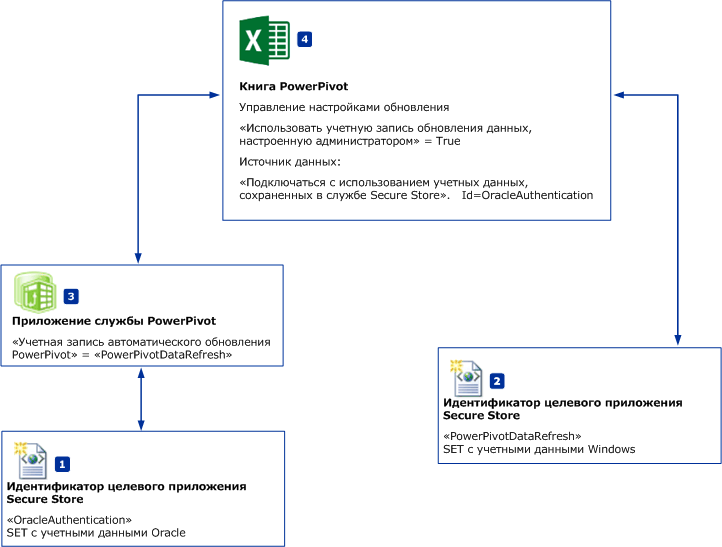
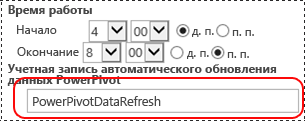

# Обновление данных расписания и источники данных - без проверки подлинности Windows
[!INCLUDE[ssas-appliesto-sqlas](../../includes/ssas-appliesto-sqlas.md)]
В этом разделе рассматривается рабочий процесс планирования обновления данных [!INCLUDE[ssGemini](../../includes/ssgemini-md.md)] для SharePoint, в котором могут использоваться источники данных, **НЕ** поддерживающие аутентификацию Windows. В качестве примера можно назвать источники данных Oracle или IDM DB2. На рисунках и в процедурах, которые приведены в этом разделе, речь идет об источниках данных Oracle, но тот же рабочий процесс применим к другим источникам данных.  
  
||  
|-|  
|**[!INCLUDE[applies](../../includes/applies-md.md)]** SharePoint 2010 &#124; SharePoint 2013.|  
  
 **Обзор** . Создание двух целевых приложений Secure Store. Настройка использования учетных данных Windows в первом целевом приложении (PowerPivotDataRefresh). Настройка во втором целевом приложении учетных данных для источника данных, который не поддерживает проверку подлинности Windows, например для базы данных Oracle. Кроме того, во втором целевом приложении используется первое целевое приложение в качестве учетной записи автоматического обновления данных.  
  
   
  
-   **(1) PowerPivotDatarefresh** : идентификатор целевого приложения Secure Store, в котором настроена аутентификация Windows.  
  
-   **(2) OracleAuthentication**: идентификатор целевого приложения Secure Store, в котором заданы учетные данные Oracle.  
  
-   **(3)[!INCLUDE[ssGemini](../../includes/ssgemini-md.md)] В приложении службы**  настраивается использование целевого приложения PowerPivotDataRefresh в качестве **учетной записи автоматического обновления данных**.  
  
-   **(4)** В книге PowerePivot используются данные Oracle. Настройки обновления книги указывают, что при соединении с источником данных следует использовать целевое приложение **(2)** в качестве учетных данных.  
  
## предварительные требования  
  
-   Имеется приложение службы [!INCLUDE[ssGemini](../../includes/ssgemini-md.md)] .  
  
-   Имеется приложение службы Secure Store.  
  
-   Имеется книга Excel с моделью данных [!INCLUDE[ssGemini](../../includes/ssgemini-md.md)] .  
  
## Создание идентификатора целевого приложения, в котором используется проверка подлинности Windows  
  
1.  В центре администрирования SharePoint нажмите кнопку **Управление приложениями служб**.  
  
2.  Щелкните имя своего приложения службы Secure Store.  
  
3.  На странице **Управление** нажмите кнопку **Создать**.   
  
4.  На странице **Создание нового целевого приложения Secure Store** задайте следующие значения.  
  
    -   **Идентификатор целевого приложения** : PowerPivotDataRefresh.  
  
    -   **Отображаемое имя** : PowerPivotDataRefresh.  
  
    -   **Адрес электронной почты для связи** : ?  
  
    -   **Тип целевого приложения** : группа.  
  
    -   **URL-адрес страницы целевого приложения** : нет.  
  
5.  Нажмите кнопку **Далее**.  
  
6.  На странице «Учетные данные» оставьте неизменными два заданных по умолчанию имени поля и типа поля: **Имя пользователя Windows** и **Пароль Windows**.  
  
7.  Нажмите кнопку **Далее**.  
  
8.  На странице **Настройки членства** добавьте по крайней мере одного **администратора целевого приложения** , затем добавьте членов, которым требуется доступ к целевому приложению.  
  
9. Нажмите кнопку **ОК**.  
  
10. Новый идентификатор целевого приложения будет добавлен к списку. Выберите идентификатор целевого приложения и нажмите кнопку **задать учетные данные**.  
  
11. Введите имя пользователя Windows и пароль Windows, затем нажмите кнопку **ОК**.  
  
## Создание идентификатора целевого приложения, в котором используются учетные данные Oracle  
  
1.  В центре администрирования SharePoint нажмите кнопку **Управление приложениями служб**.  
  
2.  Щелкните имя своего приложения службы Secure Store.  
  
3.  На **управление** щелкните **New**.  
  
4.  На странице **Создание нового целевого приложения Secure Store** задайте следующие значения.  
  
    -   **Идентификатор целевого приложения** : OracleAuthentication.  
  
    -   **Отображаемое имя** : OracleAuthentication.  
  
    -   **Адрес электронной почты для связи** : ?  
  
    -   **Тип целевого приложения** : группа.  
  
    -   **URL-адрес страницы целевого приложения** : нет.  
  
5.  Нажмите кнопку **Далее**.  
  
6.  На странице **Учетные данные** замените имя первого поля на **Oracle User ID** и **Тип поля** — на **User Name**.  
  
     Замените имя второго поля на **Oracle Password** , а **Тип поля** на **Password**.  
  
7.  Нажмите кнопку **Далее**.  
  
8.  На странице **Настройки членства** добавьте по крайней мере одного **администратора целевого приложения** , затем добавьте членов, которым требуется доступ к целевому приложению.  
  
9. Нажмите кнопку **ОК**.  
  
10. Новый идентификатор целевого приложения будет добавлен к списку. Выберите идентификатор целевого приложения и нажмите кнопку **задать учетные данные**.  
  
11. Введите идентификатор пользователя Oracle и пароль Oracle, затем нажмите кнопку **ОК**.  
  
 Дополнительные сведения см. в разделе "Создание целевого приложения для проверки подлинности SQL Server" статьи [Использование службы Secure Store с проверкой подлинности SQL Server (SharePoint Server 2013)](http://technet.microsoft.com/library/gg298949.aspx) (http://technet.microsoft.com/library/gg298949.aspx).  
  
## Настройка приложения службы Power Pivot  
  
1.  В центре администрирования SharePoint нажмите кнопку «Управление приложениями служб».  
  
2.  Щелкните имя своего приложения службы [!INCLUDE[ssGemini](../../includes/ssgemini-md.md)] , например "Приложение службы [!INCLUDE[ssGemini](../../includes/ssgemini-md.md)] по умолчанию".  
  
3.  Нажмите кнопку **Настройка параметров приложения службы** в разделе «Действия».  
  
4.  В разделе **Обновление данных** задайте для параметра **Учетная запись автоматического обновления данных [!INCLUDE[ssGemini](../../includes/ssgemini-md.md)]** значение **PowerPivotDataRefresh**, затем нажмите кнопку **ОК**.  
  
       
  
## Настройка книги  
  
1.  Перейдите к своей книге в [!INCLUDE[ssGemini](../../includes/ssgemini-md.md)] коллекции и нажмите кнопку **Управление обновлением данных**.  
  
2.  Если откроется страница **Журнал обновления данных** , нажмите кнопку **Настройка расписания**.  
  
3.  Выберите **Включить**.  
  
4.  Щелкните **Также обновлять как можно скорее**.  
  
5.  В разделе **Учетные данные** щелкните **Использовать учетную запись обновления данных, настроенную администратором**.  
  
6.  Снимите флажок **Все источники данных**.  
  
7.  Выберите **Обновить** для источника данных, в котором используются данные Oracle. В Microsoft Excel имя источника данных можно изменить в меню **Данные**, **Соединения**, **Свойства** .  
  
8.  В разделе источников данных выберите **Использовать расписание по умолчанию**.  
  
9. Выберите **Подключиться с использованием учетных данных, сохраненных в службе Secure Store (SSS) для подключения к источнику данных. Введите идентификатор, используемый для поиска учетных данных, в поле "Идентификатор SSS"**.  
  
10. В поле **Идентификатор** введите **OracleAuthentication**.  
  
11. Нажмите кнопку **ОК**.  
  
     Если появляется следующее сообщение об ошибке: `The provided Secure Store target application is either incorrectly configured or does not exist`.  
  
     Обычно применяются следующие два решения.  
  
    -   Проверка правильности идентификатора целевого приложения.  
  
    -   Проверка того, заданы ли учетные данные для целевого приложения.  
  
## Проверка обновления данных с новыми параметрами проверки подлинности  
 После нажатия кнопки **ОК**открывается страница **Журнал обновления** . Через несколько минут в журнале обновления должен появиться новый элемент, поскольку в предыдущих шагах был выбран параметр **Также обновлять как можно скорее**. Значение по умолчанию для задания таймера **Задание таймера обновления данных [!INCLUDE[ssGemini](../../includes/ssgemini-md.md)]** равно 1 минуте. Если новый элемент в журнале обновления не появляется, подождите несколько минут, затем обновите страницу в браузере. Если новый элемент так и не появился, проверьте текущее значение задания таймера.  
  
## Дополнительные сведения  
  
-   [Настройка службы Secure Store в SharePoint 2013](http://technet.microsoft.com/library/ee806866.aspx).  
  
-   См. подраздел "Плановое обновление данных" раздела [Обновление данных PowerPivot с SharePoint 2013 и SQL Server 2012 SP1 (службы Analysis Services)](http://msdn.microsoft.com/library/jj879294.aspx#bkmk_windows_auth_interactive_data_refresh).  
  
  
