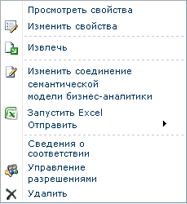

# Использование соединения семантической модели бизнес-аналитики в службах Excel или Reporting Services
[!INCLUDE[ssas-appliesto-sqlas](../../includes/ssas-appliesto-sqlas.md)]
  В этом разделе описывается использование соединений BISM, созданных по указаниям из других разделов. Если семантическая модель бизнес-аналитики еще не создана, см. разделы [Создание подключения между семантической моделью бизнес-аналитики и книгой PowerPivot](../../analysis-services/power-pivot-sharepoint/create-a-bi-semantic-model-connection-to-a-power-pivot-workbook.md) и [Создание соединения семантической модели бизнес-аналитики с табличным шаблоном базы данных](../../analysis-services/power-pivot-sharepoint/create-a-bi-semantic-model-connection-to-a-tabular-model-database.md).  
  
##   Соединение из Excel  
 Можно указать соединение BISM в качестве источника данных в Excel или другом бизнес-приложении, использующем данные табличной модели служб Analysis Services. Этот раздел объясняет два типа подключения к данным BISM с помощью Excel.  
  
 Для соединений BISM из Excel нужно, чтобы на рабочей станции были установлены Excel 2010 и поставщик MSOLAP.5 OLE DB. Дополнительные сведения о требованиях к соединению будут предоставлены далее в этом разделе.  
  
 **Запуск из SharePoint**  
  
-   Щелкните правой кнопкой мыши соединение BISM в библиотеке и выберите команду **Запустить Excel**.  
  
   
  
 Нажмите кнопку **Включить** при появлении подсказки для включения подключения к данным. Excel откроет книгу, содержащую список полей сводной таблицы, заполненный полями из базового источника данных.  
  
 **Запуск из Excel**  
  
1.  Запустите Excel и откройте книгу. На вкладке «Данные» в группе «Получение внешних данных» нажмите кнопку **Из других источников**.  
  
2.  Нажмите кнопку **Из служб Analysis Services** и импортируйте данные с помощью мастера подключения к данным.  
  
3.  Введите URL-адрес SharePoint файла соединения BISM (например, `http://mysharepoint/shared documents/myData.bism`). Для учетных данных входа в систему выберите вариант по умолчанию, **Использовать проверку подлинности Windows**. Нажмите кнопку **Далее**.  
  
4.  На следующей странице снова нажмите **Далее** . Несмотря на то что будет предложено выбрать базу данных, можно использовать только одну базу данных, которая указана в соединении BISM.  
  
5.  На последней странице можно указать понятное имя и описание. В диалоговом окне «Импорт данных» нажмите кнопку **Готово**, а затем кнопку **ОК** , чтобы импортировать данные.  
  
 Для успешного установления соединений на клиентском компьютере должен быть установлен Excel 2010 и файл MSOLAP.5.dll. Поставщик можно получить, установив версию [!INCLUDE[ssGemini](../../includes/ssgemini-md.md)] для Excel для этого выпуска либо скачав его отдельно на странице [скачивания пакета дополнительных компонентов](http://go.microsoft.com/fwlink/?linkid=214066).  
  
 Чтобы убедиться, что MSOLAP.5.dll имеет текущую версию, проверьте ключ **HKEY_CLASSES_ROOT\MSOLAP** в реестре. Параметр**CurVer** должен иметь значение MSOLAP.5.  
  
 Также требуется наличие разрешения «Чтение» для файла BISM в SharePoint. Разрешения «Чтение» включают права на загрузку. Excel загружает сведения о соединении BISM из SharePoint и открывает прямое соединение с базой данных через **HTTP Get**. После сохранения сведений о соединении BISM на локальном компьютере запросы на соединение не проходят через SharePoint.  
  
 При установке соединения с базой данных табличной модели, расположенной на сервере служб Analysis Services, разрешений SharePoint недостаточно. В этом случае требуются также разрешения на чтение базы данных на сервере. Данный шаг должен был быть выполнен во время создания соединения BISM. Дополнительные сведения см. в разделе [Создание соединения семантической модели бизнес-аналитики с табличным шаблоном базы данных](../../analysis-services/power-pivot-sharepoint/create-a-bi-semantic-model-connection-to-a-tabular-model-database.md).  
  
##   Соединение из служб Reporting Services в SharePoint  
 Соединение BISM можно использовать так же, как используется большинство источников данных, а именно указывая файл в качестве источника данных в документе или средстве, которое работает с данными. Несмотря на то что соединение BISM указывает на физическую базу данных на другом сервере, сам файл соединения используется так, как если бы он был источником данных. URL-адрес SharePoint соединения BISM — это действительное расположение источника данных для отчетов [!INCLUDE[ssCrescent](../../includes/sscrescent-md.md)] , которые используют данные BISM.  
  
 Для создания нерегламентированных отчетов в SharePoint пользователь, создающий отчет, должен иметь разрешения SharePoint для файла соединения BISM (BISM-файл) и  семантического шаблона базы данных бизнес-аналитики. Контекст безопасности соединения определяется пользователем, создающим отчет в интерактивном режиме.  
  
  
