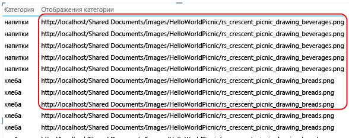
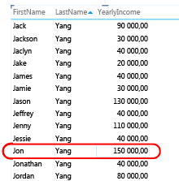
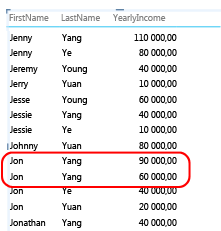
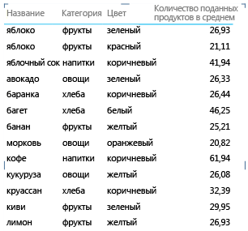
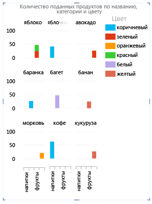
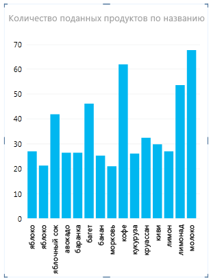

# Power View — Настройка свойств работы таблицы для отчетов
  Если для [!INCLUDE[ssCrescent](../../includes/sscrescent-md.md)]в качестве модели интеллектуального анализа данных используется табличная модель, то можно настроить свойства поведения таблицы, содержащие строки более гранулярного уровня. Задание свойств поведения таблицы изменяет групповую обработку строк и обеспечивает более эффективное размещение идентификационной информации (имен, фотографий, логотипов и т. д.) в мозаичном, карточном или диаграммном виде.  
  
 [!INCLUDE[ssCrescent](../../includes/sscrescent-md.md)] отличается от других приложений для создания отчетов тем, что автоматически группирует материалы во время разработки отчета, пытаясь определить, какие из столбцов в поле отчета соответствуют используемому формату представления. В большинстве случаев при группировании по умолчанию результат оптимальный. Однако для некоторых таблиц, в особенности для тех, которые содержат подробные данные, при группировании по умолчанию иногда будет происходить группирование строк, которые не должны группироваться. Для таких таблиц можно задать свойства, изменяющие вычисление групп.  
  
 Задание свойств таблицы рекомендуется для тех таблиц, где отдельные строки представляют основной интерес, например записи о сотрудниках и заказчиках. В отличие от них те таблицы, где эти свойства не важны, служат в качестве таблиц подстановки (например, таблицы дат, категорий продукта, отделов, которые содержат относительно небольшой набор строк и столбцов) или сводных таблиц, содержащих строки, которые представляют интерес только после их сведения (например, данные, подобранные по таким критериям, как пол, возраст или географическое положение). В случае с таблицами подстановки и сводными таблицами в режиме группирования по умолчанию получается наилучший результат.  
  
> [!NOTE]  
>  Свойства поведения таблицы влияют только на табличные модели, которые используются в качестве моделей интеллектуального анализа данных в [!INCLUDE[ssCrescent](../../includes/sscrescent-md.md)]. Свойства обработки таблицы поддерживаются в сводных отчетах Excel.  
  
 Таблицы могут обладать следующими свойствами обработки.  
  
-   **Идентификатор строки** — определяет столбец, содержащий только уникальные значения, что дает возможность использовать этот столбец в качестве внутреннего ключа группирования.  
  
-   **Поддерживать уникальность строк** — указывает, в каких столбцах содержатся значения, которые должны обрабатываться как уникальные, даже если они являются дубликатами (например, имя и фамилия сотрудника, если два и более сотрудника имеют одинаковые имена).  
  
-   **Метка по умолчанию** — указывает, в каком столбце содержится отображаемое имя для представления данных строки (например, имя сотрудника в записи о сотруднике).  
  
-   **Изображение по умолчанию** — указывает, в каком столбце содержится изображение с данными строки (например, фотография сотрудника в записи о сотруднике).  
  
> [!NOTE]  
>  Способы оптимизации макета с точки зрения определенного формата представления описаны в разделе  [Оптимизация для конкретных макетов](#bkmk_optimizeforlayout).  
  
## Открытие диалогового окна «Свойства работы таблицы».  
  
1.  В среде [!INCLUDE[ssBIDevStudioFull](../../includes/ssbidevstudiofull-md.md)]щелкните таблицу (вкладку), для которой настраивается список полей по умолчанию.  
  
2.  В окне **Свойства** в свойстве **Поведение таблицы** выберите команду **Щелкните, чтобы изменить**.  
  
3.  В диалоговом окне **Поведение таблицы** задайте **Идентификатор строки**и укажите другие свойства этого диалогового окна.  
  
## Установка свойства «Идентификатор строки».  
 Идентификатор строки в таблице указывает на единичный столбец, который содержит только уникальные значения и не содержит пустых значений. Свойство «Идентификатор строки» позволяет изменить группирование таким образом, чтобы группа формировалась не на основе набора полей строки, а на основе фиксированного столбца, который всегда служит для уникальной идентификации определенной строки, вне зависимости от полей, использующихся в конкретном макете отчета.  
  
 Задание этого свойства позволяет изменить группирование по умолчанию таким образом, чтобы динамическое группирование, основанное на столбцах таблицы, заместилось фиксированным группированием, где данные основаны на идентификаторе столбца. Изменение обработки при группировании по умолчанию имеет значение для таких макетов отчета, как матрица, где без этого свойства группирование (или отображение подытогов) будет выполняться для каждого столбца в строке.  
  
 При задании идентификатора строки в [!INCLUDE[ssCrescent](../../includes/sscrescent-md.md)]включаются следующие дополнительные свойства: **Поддерживать уникальность строк** , **Метка по умолчанию** и **Изображение по умолчанию** .  
  
 Можно также использовать **Идентификатор строки** самостоятельно, в качестве отдельного свойства, что делает возможным следующее:  
  
-   Использование двоичных изображений в отчете. Обеспечив однозначность в вопросе уникальности строки, [!INCLUDE[ssCrescent](../../includes/sscrescent-md.md)] может определить, как следует распределить изображения и метки по умолчанию для конкретной строки.  
  
-   Удаление нежелательных подытогов из отчета-матрицы. При группировании по умолчанию для каждого поля создаются подытоги. Если необходимо сформировать только один подытог, вычисляемый на уровне строки, то задание идентификатора строки позволит этого добиться.  
  
 Нельзя задать идентификатор строки для таблиц, которые являются таблицами дат. Для таблиц дат идентификатор столбца указывается только при отметке таблицы. Дополнительные сведения см. в разделе [Диалоговое окно "Пометить как таблицу дат" (SSAS)](http://msdn.microsoft.com/library/698b5ef1-b79b-4d76-9847-39669b4f5bb9).  
  
## Задание свойства «Сохранять уникальные строки».  
 Это свойство позволяет указать, какие столбцы содержат идентификаторы (например, имя сотрудника или код изделия), позволяющие отличать одну строку от другой. В том случае, когда строки выглядят идентичными (например, если у двух клиентов совпадают имя и фамилия), столбцы, помеченные этим свойством, будут повторяться в таблице отчета.  
  
 В зависимости от того, какие столбцы добавлены в отчет, можно найти идентичные строки, так как значения в каждой строке могут быть сходными (например, если двух клиентов зовут Александр Иванов). Это может произойти потому, что другие столбцы с дифференцирующими сведениями (например, отчество, адрес или дата рождения) могут не фигурировать в макете отчета. В таком случае работа таблицы по умолчанию заключается в группировании строк, похожих на идентичные, в одну строку, сводя все вычисленные значения в один результат из двух скомбинированных строк.  
  
 За счет установки свойства **Поддерживать уникальность строк** можно назначить один или несколько столбцов, которые всегда должны повторяться даже при наличии повторяющихся экземпляров, когда такой столбец добавляется на холст отчета. Вычисленные значения, связанные с этой строкой, теперь будут распределяться по отдельным строкам, а не сводиться в одну. При выборе столбцов для свойства  **Поддерживать уникальность строк** выбирайте те, которые содержат уникальные или почти уникальные значения.  
  
> [!NOTE]  
>  Поскольку столбцы, выбираемые конечным пользователем, могут отразиться на способе группирования, который в свою очередь может изменить контекст фильтрации для вычисления выражений, конструкторы моделей должны уделить особое внимание созданию мер, возвращающих правильные результаты. Дополнительные сведения см. в разделе [Power View FAQ](http://go.microsoft.com/fwlink/?LinkId=220674)(Вопросы и ответы по Power View).  
  
## Настройка метки по умолчанию  
 Это свойство позволяет задать метку, которая будет отображаться в полосе навигации мозаичного отчета. При использовании в сочетании с изображением по умолчанию эта метка по умолчанию отображается под этим изображением. Если изображения нет, то метка по умолчанию отображается сама по себе. При выборе метки по умолчанию выбирайте столбец, содержащий наиболее важную информацию о ряде (например, имя).  
  
 При использовании мозаичного макета метка по умолчанию отображается в области заголовка под изображением, которое задается свойством «Изображение по умолчанию». Например, если имеется список сотрудников, в мозаику можно поместить сведения о сотруднике, где фотография будет использоваться в качестве изображения по умолчанию, а имя сотрудника — в качестве метки по умолчанию. В мозаике метка по умолчанию отображается ниже изображения по умолчанию. Эти столбцы всегда отображаются в мозаике, даже если они явным образом не выбраны в списке полей отчета.  
  
## Настройка изображения по умолчанию  
 Это свойство позволяет задать изображение, которое будет отображаться в полосе навигации мозаичного отчета либо на передней части карточки. При выборе столбца, содержащего изображение по умолчанию, изображение по умолчанию будет отображаться в отчете на полосе навигации макета отчета либо на передней части карточки. Изображение по умолчанию должно быть графическим объектом. Например, это может быть фотография сотрудника из таблицы сотрудников, логотип заказчика в таблице заказчиков или изображение карты страны в географической таблице.  
  
> [!NOTE]  
>  Источником изображений может служить ссылка на URL-адрес изображения, хранящегося на веб-сервере, или двоичные данные, внедренные в книге. Если изображение извлекается по URL-адресу, то необходимо указать, что соответствующий столбец используется для изображений, чтобы [!INCLUDE[ssCrescent](../../includes/sscrescent-md.md)] извлекал изображение, а не отображал ссылку на изображение в отчете в виде текста.  
  
##   Оптимизация для конкретных макетов  
 Этот подраздел описывает, как задание свойств работы таблицы изменится с точки зрения формата конкретной презентации и характеристик данных. Например, если вы пытаетесь настроить макет матричного отчета, то эти сведения помогут понять, как улучшить представление матрицы при помощи свойств работы отчета в модели.  
  
### Изображения отсутствуют  
 Свойства, заданные в модели, определяют, отображаются в отчете изображения или они представлены текстовыми значениями.  
  
   
  
 По умолчанию текст в модели интерпретируется как текст в отчете. Если текстовый столбец представляет собой URL-адрес, указывающий на изображение, то необходимо задать свойство **URL-адрес изображения** , так чтобы [!INCLUDE[ssCrescent](../../includes/sscrescent-md.md)] извлекал файл изображения. При использовании двоичных изображений не забудьте установить свойство **Идентификатор строки** .  
  
### В таблицах отсутствует одна или несколько строк.  
 Иногда работа при группировании по умолчанию приводит к результату, противоположному ожидаемому, а именно: строки с подробными сведениями не отображаются в отчете. По умолчанию [!INCLUDE[ssCrescent](../../includes/sscrescent-md.md)] группирует столбцы, добавляемые на холст. Если добавить в отчет столбец **Название страны** , каждая страна будет отображаться на холсте только один раз, даже если в базовой таблице содержатся тысячи строк с ее названием. В этом случае результат группирования по умолчанию будет верным.  
  
 Рассмотрим другой пример. Например, должно отображаться множество экземпляров строки, поскольку смежные строки содержат данные о различных сущностях. Представим, что у вас есть два заказчика с именем **Александр Иванов**. По умолчанию группирование работает так, что в конечном отчете будет только один экземпляр с именем **Александр Иванов** . Более того, в этой единственной строке отчета мера **Годовой доход** будет отражать суммарный доход обоих заказчиков.  
  
   
  
 Чтобы изменить работу при группировании по умолчанию, установите свойства **Идентификатор строки** и **Поддерживать уникальность строк** . В разделе свойства **Поддерживать уникальность строк**выберите столбец "Фамилия", так чтобы это значение повторялось в строках, даже если оно уже отображается в другой строке. Когда вы измените свойства и повторно опубликуете книгу, создайте этот отчет заново. Теперь вы увидите обоих клиентов с именем **Александр Иванов**и правильные значения **годового дохода** для них.  
  
   
  
### В матричном макете отображается слишком много элементов  
 Когда таблица подробных сведений представлена в виде матрицы, при группировании по умолчанию выдается суммарное значение для каждого столбца. В зависимости от целей работы такое количество суммарных значений может и не требоваться. Чтобы изменить это, можно настроить свойство **Идентификатор строки**. Установка дополнительных свойств не требуется. Задания идентификатора столбца достаточно для изменения параметров группирования таким образом, чтобы результаты вычислялись для каждого ряда в зависимости от уникального идентификатора.  
  
 Сравните изображения до и после установки идентификатора строки в матричном макете.  
  
 **Было: группирование по умолчанию по полям матрицы**  
  
   
  
 **Стало: группирование по идентификатору строки**  
  
   
  
### На оси диаграммы размещено слишком много элементов и уровней  
 В отчетах-диаграммах, где выводятся подробные сведения, в качестве оси должен использоваться идентификатор строки. Без идентификатора строки ось не определяется, а раскладка основывается на предположении, которое может не иметь смысла. Чтобы изменить это, можно настроить свойство **Идентификатор строки**. Установка дополнительных свойств не требуется. Задания идентификатора столбца достаточно для изменения параметров группирования таким образом, чтобы результаты вычислялись для каждого ряда в зависимости от уникального идентификатора.  
  
 Сравните изображения до и после задания идентификатора строки в макете-диаграмме. Это один и тот же отчет с идентичными полями и представлением. Единственная разница заключается в том, что нижнее изображение показывает отчет после применения свойства **Идентификатор строки** к таблице объектов.  
  
 **Было: группирование по умолчанию по полям диаграммы**  
  
   
  
 **Стало: группирование по идентификатору строки (идентификатор строки становится осью диаграммы)**  
  
   
  
## Следующие шаги  
 После вычисления таблиц в модели и установки свойств работы таблицы для строк с подробными сведениями, которые должны всегда отображаться как отдельные объекты, можно и дальше оптимизировать модель при помощи дополнительных свойств или настроек.  
  
  

