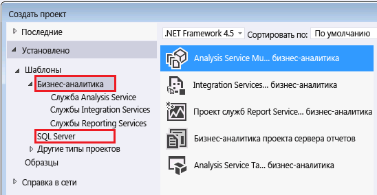

# Средства и приложения, использующиеся в службах Analysis Services
  Найдите средства и приложения, которые понадобятся вам для создания моделей Analysis Services и управления связанными базами данных в экземпляре Analysis Services.  
  
## Конструкторы моделей Analysis Services  
 Табличные и многомерные модели создаются с помощью шаблонов проектов в решении, встроенном в оболочке Visual Studio. Шаблон проекта предоставляет конструкторы для создания таблиц, связей, кубов, измерений и ролей, составляющих решение Analysis Services. Оболочка предоставляет рабочее пространство, страницы свойств и платформу команд, в рамках которой создается проект. Конструктор моделей, предоставляющий оболочку и шаблоны, доступен для бесплатной загрузки из Интернета.  
  
 У моделей имеется параметр уровня совместимости, который определяет доступность функций и версию служб Analysis Services, которые запускают модель.  Сможете ли вы указать определенный уровень совместимости или нет, в некоторой степени зависит от конструктора моделей.  
  
 Табличные модели, которые используют новые функциональные возможности SQL Server 2016, такие как BIM-файлы в табличном формате JSON и двунаправленная перекрестная фильтрация, должны создаваться с уровнем совместимости 1200. При этом должна использоваться версия SQL Server Data Tools для Visual Studio 2015, которая поставляется параллельно с SQL Server 2016 (ссылка для скачивания приведена ниже).  
  
 Если требуется понизить уровень совместимости (например, если вы хотите развернуть модель в более ранней версии служб Analysis Services), вы можете продолжать использовать конструктор моделей в SSDT для Visual Studio 2015. Более новые версии этого инструмента поддерживают создание моделей любого типа (табличные или многомерные) на любом необходимом уровне совместимости. Чтобы создать или отредактировать модель предыдущей версии, не нужно хранить старые версии инструментов.  
  
### Скачивание конструктора моделей  
 [!INCLUDE[ssBIDevStudio](../includes/ssbidevstudio-md.md)], которая ранее называлась SQL Server Data Tools for Business Intelligence (SSDT-BI), а до этого Business Intelligence Development Studio (BIDS), используется для создания моделей служб Analysis Services.  
  
||  
|-|  
|**[Скачать SSDT для Visual Studio 2015](https://msdn.microsoft.com/mt429383)**|  
  
 Рекомендуем использовать SQL Server Data Tools для Visual Studio 2015, но не предыдущие версии конструктора. Этот набор средств содержит шаблоны проектов для создания различных типов содержимого SQL Server, включая реляционные базы данных, модели Analysis Services, отчеты Reporting Services и пакеты Integration Services.  
  
 Набор SSDT работает в оболочке Visual Studio 2015. Если оболочка Visual Studio 2015 уже установлена, программа установки SSDT просто добавит шаблоны проектов. Если у вас нет Visual Studio 2015, будет установлена оболочка вместе с шаблонами.  
  
 Если на компьютере установлена прежняя версия SSDT-BI или BIDS, то новая версия устанавливается параллельно с предыдущей.  
  
 Когда вы установите SSDT, в диалоговом окне "Создание проекта" отобразятся шаблоны бизнес-аналитики.  
  
   
  
## Средства администрирования  
  
### Скачивание SQL Server Management Studio  
 Management Studio — это основное средство администрирования для всех функций SQL Server, включая Analysis Services. Это приложение скачивается отдельно.  
  
||  
|-|  
|**[Скачивание SQL Server Management Studio](https://msdn.microsoft.com/library/mt238290.aspx)**|  
  
 Среда Management Studio, которая входит в пакет SQL Server 2016, включает расширенные события (xEvents) для служб Analysis Services. Эти события являются облегченной альтернативой трассировок SQL Server Profiler, которые используются для контроля активности и диагностики проблем на сервере. Дополнительные сведения см. в статье [Monitor Analysis Services with SQL Server Extended Events](../analysis-services/instances/monitor-analysis-services-with-sql-server-extended-events.md) .  
  
### Приложение SQL Server Profiler  
 Несмотря на то, что официально приложение SQL Server Profiler признано устаревшим в пользу xEvents, это простой способ мониторинга подключений, выполнения запросов MDX и выполнения других операций на сервере. Профилировщик SQL Server устанавливается по умолчанию. Его и приложения SQL Server можно найти в разделе "Приложения" в Windows Server 2012.  
  
### PowerShell  
 Для выполнения многих административных задач можно использовать команды PowerShell. Дополнительные сведения см. в статье [Создание скриптов PowerShell в службах Analysis Services](../analysis-services/instances/powershell-scripting-in-analysis-services.md).  
  
### Средства сообщества и сторонние средства  
 Примеры кодов сообщества см. на [странице CodePlex Analysis Services](http://sqlsrvanalysissrvcs.codeplex.com/) . Рекомендации по сторонним средствам, которые поддерживают Analysis Services, см. на [Форумах](http://social.msdn.microsoft.com/Forums/sqlserver/home?forum=sqlanalysisservices).  
  
## См. также  
 [Уровень совместимости многомерной базы данных (службы Analysis Services)](../analysis-services/multidimensional-models/compatibility-level-of-a-multidimensional-database-analysis-services.md)   
 [Уровень совместимости табличных моделей в службах Analysis Services](../analysis-services/tabular-models/compatibility-level-for-tabular-models-in-analysis-services.md)  
  
  